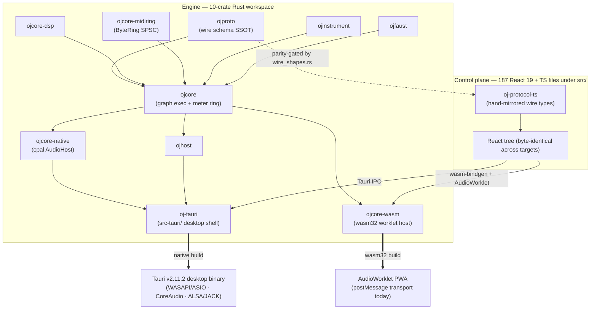
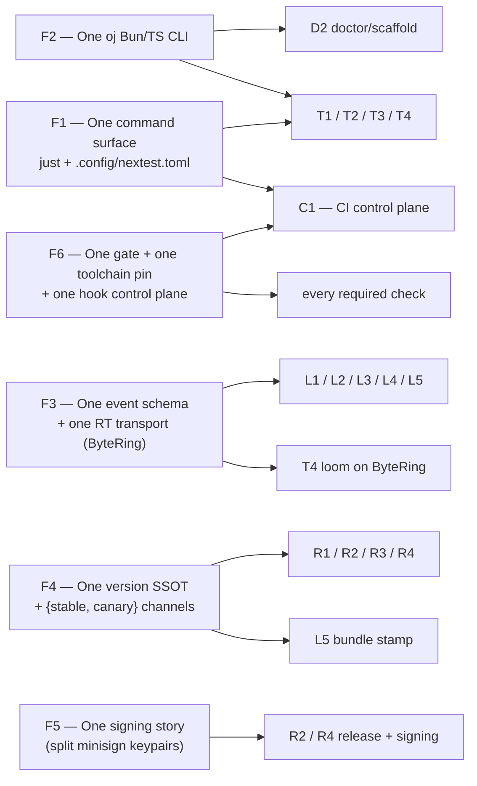
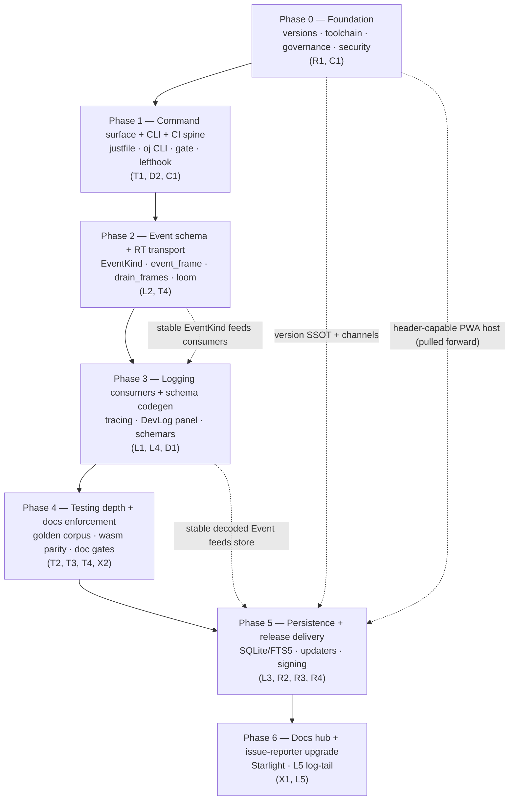
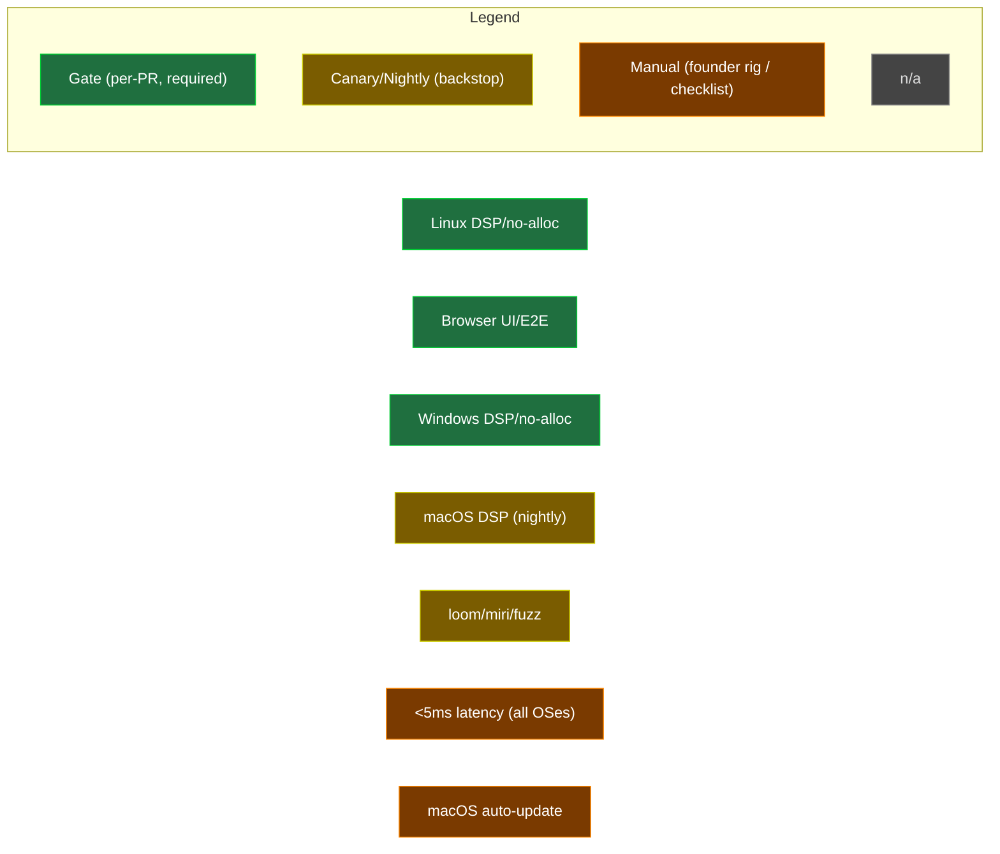

# 00 — Overview, Philosophy, Cross-Cutting Foundations & Sequencing

> This is the executive map for the entire OpenJammer foundations program. It is decision-final: every verdict referenced here is resolved in the section files below. Read this first; it tells you *what we are building, why it hangs together, and in what order*. The detail lives in the linked sections.

OpenJammer is a browser-based **and** native music/audio application (AGPL-3.0-only) whose defining constraint is **hard real-time audio**: the audio thread never allocates, locks, or blocks. The engine is a **10-crate Rust workspace** — nine crates under `crates/*` (`ojproto`, `ojcore-dsp`, `ojcore`, `ojinstrument`, `ojcore-native`, `ojcore-wasm`, `ojcore-midiring`, `ojhost`, `ojfaust`) plus `oj-tauri` under `src-tauri/` — wired together by the root `Cargo.toml` (`members = ["crates/*", "src-tauri"]`, `Cargo.toml:5`). The UI is **187 React 19 + TypeScript files** under `src/`, built with Vite, Bun-managed, shipped natively via **Tauri v2.11.2** (verified in `Cargo.lock`) and in-browser as a `wasm32` AudioWorklet PWA. Every decision below is shaped by that dual-target, hard-RT reality.

> **Verified:** The 10-crate engine workspace and the React/TypeScript control plane **already exist** and compile today. Phase 0 does not *create* this structure — it makes the structure *trustworthy*: it unifies the four drifting version files, pins the floating toolchains, and activates branch protection so the merge gate enforces something rather than merely existing.



---

## Decisions at a glance

| Decision | Winner | One-line why |
|---|---|---|
| **T1** Testing orchestrator | The `just` command surface + `cargo-nextest` + thin `oj` Bun CLI for cache/affected | One recipe set called by both CI and local kills two-sources-of-truth drift; Bun adds the cache + `cargo metadata`-accurate affected-selection `just`/nextest lack. |
| **T2** RT audio correctness (no hardware) | One shared golden corpus, three device-free tiers; keystone = `wasm-pack test --node` real `wasm32` codegen parity | The only design that verifies the *browser-compiled* float path, not just a host rlib — the dual-target gap none of the pure directions closed. |
| **T3** UI/E2E | Playwright PWA + render-smoke (blocking) + non-blocking `tauri-driver` native leg | The native and browser targets render a byte-identical React tree, so ~90% of UI coverage is reachable from Chromium with a mocked `__TAURI__` — cheaply, on every PR. |
| **T4** Reliability hardening | Rust correctness arsenal (loom/miri/fuzz) + scoped TS fast-check/Stryker + thin governance | Only the Rust arsenal produces *new* correctness about the lock-free engine; governance makes it unbypassable; TS hardens the other side of the wire. |
| **L1–L4** Logging | One `ByteRing` event channel → `tracing` sink (L1) + SQLite/FTS5 store (L3) + in-app DevLog panel (L4), schema owned by `ojproto` (L2) | Four layers of *one* pipeline on the repo's own proven wait-free primitive — never four competing channels. |
| **L5** Issue reporter | GitHub Issue Form + on-device redacted diagnostics, native bundle-file upgrade | GitHub's `upload` form element is the only free, no-auth, dual-target attachment; v1 is a redacted snapshot, not a logger. |
| **R1** Versioning + canary | `release-please` single version brain + decoupled moving-tag canary line | One bot writes all four drifting version files in lockstep; canary's build-time version never pollutes the committed SSOT. |
| **R2** Native auto-update | Tauri v2 first-party updater (minisign + GitHub Releases) + audio-safe install gate | Ships inside the pinned Tauri stack, zero new infra; channel routing and audio-safe shutdown graft on at near-zero cost. |
| **R3** PWA auto-update | Prompt-style Workbox SW, channel-aware, audio-session-safe apply-on-idle | The only model delivering "latest of your channel without a hard-refresh surprise" without yanking the `AudioContext` mid-set. |
| **R4** Artifact hosting + signing | `gh-releases-minisign` now + deferred `gh-pages-manifest`; reject Cloudflare Worker | Foundation depends only on GitHub uptime; channels/rollback graft on as a $0 JSON-deploy when actually needed. |
| **D1** Schema SSOT | Rust-canonical schemars codegen → one generated TS union, parity-gated like `wire_shapes.rs` | Kills the triple-declared `PrimitiveKind` and version drift where it is cheap and high-value; rejects a hand-authored graph Cargo already owns. |
| **D2** Dev tooling | The `oj` Bun doctor + scaffold CLI (merged with T1) + thin Rust audio-probe shim | The drift/friction is overwhelmingly in the TS control plane; `ts-morph` handles the moving React surface that Rust string-splicing cannot. |
| **C1** CI/CD | DRY reusable-workflow control plane: lean affected-aware required gate + heavy nightly/canary backstop + full free security suite | A sub-10-min required gate that loses zero coverage (it relocates, not removes), keeps GitHub Actions authoritative, adds zero audio-thread code. |
| **X1** Docs site | Starlight prose hub + linked-out rustdoc island + in-site `starlight-typedoc` for `oj-protocol-ts` | Pay unification cost only where cheap and high-value (the wire contract); keep the cfg-saturated Rust surface on canonical rustdoc. |
| **X2** Docs-as-requirement | CI-enforced coverage gates (Rust `missing_docs` + `cargo doc -D warnings`; TS `doc-check` baseline-ratchet) + AI `/docgen` | Enforcement lives in free CI (authoritative); AI assist makes compliance a 3-minute review instead of a 20-minute chore. |

---

## Philosophy — the four pillars

Every section answers to these four, in this priority order. When two pillars conflict, the earlier one wins.

### 1. Absolute reliability — `main` is always shippable, the audio thread never glitches

The merge gate must be *trustworthy*, not just present. The hard-RT rule is non-negotiable and is mechanically enforced, not documented: `assert_no_alloc` (the global `AllocDisabler` shim installed as `static A: AllocDisabler` in `crates/ojcore/tests/engine.rs`) wraps the render path, and **every new audio-thread call site we add — chiefly the event-emit sites at the `over_budget` / `auto_bypass` / `non_finite` fault paths in `crates/ojcore/src/exec.rs` — must be exercised inside that scope with the `devlog` feature ON, as a *required per-PR check*.** A passing gate that never runs the new RT code is worse than no gate.

> **Note:** Where this gate lives — it is **not** a nightly step. Phase 2 lands a dedicated `cargo nextest run -p ojcore --features devlog` recipe (driven by the `just test` / `just rust` surface) that trips the fault paths *inside* `assert_no_alloc`; it is wired as a `needs` dependency of the aggregate `gate` job and is therefore a required per-PR check.

### 2. Heavy community contribution — a stranger's PR can land green and be sound

The repo courts AGPL contributors who push to crates with `unsafe` (`ojcore-midiring`'s `copy_nonoverlapping` at `crates/ojcore-midiring/src/lib.rs:124`, the `unsafe impl Sync for RtProgram` at `crates/ojcore/src/swap.rs:41`) and decoders that eat untrusted community presets (`symphonia` WAV, `rustysynth` SF2). The gate must catch what example tests cannot — UB, data races, panics on attacker input — while staying fast enough that good PRs land green before they hit the authoritative CI. The affected-selection layer exists for this; the canary-on-merge full matrix bounds its under-selection window to a single merge.

### 3. On-device-only logging — diagnostics never leave the machine without consent

OpenJammer ships **no telemetry**. All observability is local: a wait-free `ByteRing` on the audio thread, drained off-RT into `tracing` (rolling NDJSON) and a SQLite/FTS5 store, surfaced in an in-app DevLog panel. The only path off-device is L5's one-click issue reporter, which redacts against a shared allowlist and shows the user the full payload before anything is sent.

### 4. Delightful developer UX — one command, fast feedback, honest signals

One `just` recipe set is the canonical command surface. One `oj` Bun CLI gives cached, affected-only local feedback. One `lefthook.yml` wires the hooks. The green light is *honest*: the harness prints what it skipped, and contributors are told plainly that a green PR gate is not full cross-platform/browser verification.

---

## Cross-cutting foundations — the things that must be *one*

The single largest risk in a program this size is fragmentation: each decision independently inventing its own runner, schema, version source, or required check. The harmonization collapses these to exactly one each. **These foundations are load-bearing; the per-section designs assume them.**



### F1 — One task runner / command surface

A root `justfile` + `.config/nextest.toml` is the **single source of truth for *what* runs** (both files are **absent today** — `just` and `nextest` are not yet adopted; the current gate is the three-job `.github/workflows/ci.yml`). Recipes: `fmt`, `clippy`, `test` (`cargo nextest run --workspace`), `doctest` (`cargo test --workspace --doc` — the mandatory companion, since nextest skips doctests), `nostd`, `wasm`, `render`, `clap-host`, `web`, `rust`, `preflight`, `ci`. **Both** C1's reusable CI workflows **and** the local lefthook hooks invoke these recipes — no command is encoded twice. The `audio-serial` test-group (`max-threads = 1`) binds the `ojcore` ring / hot-swap / `assert_no_alloc` tests so RT-sensitive assertions never contend.

```toml
# .config/nextest.toml
[test-groups]
audio-serial = { max-threads = 1 }

[[profile.default.overrides]]
filter = 'package(ojcore) and test(/program_swap|meter_ring|hot_swap|alloc_free/)'
test-group = 'audio-serial'

[profile.ci]
fail-fast = false
[profile.ci.junit]
path = 'junit.xml'
```

```just
# justfile (excerpt) — Windows-primary dev box needs the shell directive
set windows-shell := ['powershell.exe', '-NoLogo', '-Command']

test:
    cargo nextest run --workspace

# nextest skips doctests — MANDATORY companion
doctest:
    cargo test --workspace --doc

nostd:
    cargo build -p ojcore --no-default-features

wasm:
    cargo +nightly build -p ojcore-wasm --target wasm32-unknown-unknown -Z build-std=std,panic_abort

render:
    cargo clippy -p ojcore-native --features demo --all-targets -- -D warnings
    cargo run -p ojcore-native --bin render --features demo -- {{wav}} 2

# aggregate (dependency form; full recipe set in the canonical justfile / 07-reference-configs.md)
rust: fmt clippy test doctest test-rt nostd wasm render clap-host
```

### F2 — One `oj` Bun/TS CLI

T1's preflight harness and D2's doctor/scaffold tool **merge into one binary** at `scripts/oj/` (also **absent today**) with subcommands (`preflight`/`plan` + `doctor`/`scaffold`/`dev`) over a shared `lib/` (`git`, `cache`, `ssot`, `report`). It *decides which* `just` recipes to run (cache hits, affected-selection via `cargo metadata` + `gh pr diff --name-only`) and runs consistency checks; it **never re-encodes commands**. Version-sync here is a *consistency check* (all four version files equal), never an independent source — `release-please` (R1, the single version brain) owns the bump. This resolves the two-CLIs-both-named-`oj` collision and the dual `--fix` owner that T1 and D2 would otherwise create.

### F3 — One event schema + one RT transport primitive

The single most important harmonization. L1, L2, and L4 each independently invented a different name and home for *the same* event channel on *the same* primitive. They collapse to:

- **Schema (owned by `ojproto`):** a versioned, `Copy`, `#[repr]`-stable `EventKind` to be added to `crates/ojproto/src/lib.rs` in **Phase 2**, alongside the existing `RtCommand` / `EngineFrame`. Today no `EventKind` (or `RtEvent`) type exists; the new `EventKind` will carry its own size guard `` const _: () = assert!(core::mem::size_of::<EventKind>() <= 16); `` **mirroring the existing `RtCommand` cap** (`const _: () = assert!(core::mem::size_of::<RtCommand>() <= 16);`, verified at `crates/ojproto/src/lib.rs:200`). It is mirrored by hand in `packages/oj-protocol-ts/src/index.ts` (package `@openjammer/oj-protocol`) and gated byte-exact by the `wire_shapes.rs` parity gate (`crates/ojproto/tests/wire_shapes.rs`). The orphaned `EngineFrame::Error { code: u16, message: String }` (defined at `crates/ojproto/src/lib.rs:253`, constructed **only** in `wire_shapes.rs` test fixtures and emitted by no engine code) folds into `EventKind::Message` in the same bump — the cheapest moment.
- **Transport:** the audio thread encodes a fixed-size record to a stack buffer and does one wait-free `ByteRing::push` (`crates/ojcore-midiring/src/lib.rs`; length-prefixed SPSC, drop-and-count on full), via a **new** `event_frame` module **sibling to `return_frame` in `crates/ojcore/src/meter.rs`**. Phase 2 adds `TAG_EVENT = 3` (the existing `return_frame` defines only `TAG_METER = 1` and `TAG_BEAT = 2`, `crates/ojcore/src/meter.rs:142`). The off-RT side extends the existing `drain_meters` into **one `drain_frames`** that routes by tag — not three parallel `drain_logs` / `drain_events` / `drain_frames`.
- **Native drain cadence (decided):** native draining is **not** a thread today — it is a 50 ms JS `setInterval` → `poll_meters` IPC call. The resolution is final (see [`02-logging-and-observability.md`](02-logging-and-observability.md#l2--cross-boundary-structured-event-schema-the-spine), "Native drain thread (the resolved contradiction)"): Phase 3 adds a **dedicated default-priority (never RT-promoted) control-thread event-drain at ~1 ms cadence**, decoupled from the 50 ms meter `setInterval`; meters stay on the 50 ms lossy UI poll. The browser path remains worklet-self-drain + batched `postMessage` (no second thread until shared-memory wasm; see [Open Questions §1](#open-questions--decisions-deferred)). The EventRing capacity and the exact safe cadence are **measured, not assumed**, from the dropped-frame counter once real fault volumes flow — `ByteRing<8192>` (borrowed from `MeterRing`) and ~1 ms are the starting points, not final-tuned numbers.
- **Consumers:** L1 is the off-RT `tracing` sink, L3 the SQLite/FTS5 durable index, L4 the in-app viewer + console facade, L5 the diagnostic bundle. **Four layers of one pipeline.**

> **Must-fix (critical):** The wasm side has **no `MeterRing` to mirror** — `ojcore-wasm`'s `drain_meters` (`crates/ojcore-wasm/src/lib.rs:567`) is an allocating `Vec` *pull* between `process()` calls (`crates/ojcore-wasm/src/lib.rs:389`), not a `ByteRing`. The browser event channel is **net-new**: a dedicated `log_ring: ByteRing<N>` in the wasm `Host` (size TBD against the worst-case fault burst) exposed via a new `*_ptr` / `*_len` / `*_offset` getter tuple, **self-drained by the worklet between `process()` calls** and posted as `{ tag, offset, len }` batches via `postMessage`. A *true* cross-thread SAB drain is **impossible on today's build** (non-shared linear memory, no `+atomics` / `+bulk-memory`); every "frozen `ring_*_offset` SAB getter, cross-thread" claim is struck until a shared-memory wasm build lands as its own prerequisite workstream (see Open Questions §1). `assert_no_alloc` is **native-only**; the browser RT-emit path is verified by code review + shared-source proof + a native-rlib `assert_no_alloc` run of the codec, never claimed as gate-verified on wasm.

### F4 — One version SSOT + one channel model

- **Version SSOT:** `release-please` (R1) is the single brain. It writes all four files in lockstep — `Cargo.toml [workspace.package].version` (the canonical seed, currently `0.0.0`, `Cargo.toml:9`), `package.json` (`0.1.0-alpha`), `src-tauri/tauri.conf.json` (`0.1.0`), and `packages/oj-protocol-ts/package.json` (`0.0.0`) — resolving the **verified four-way drift**. This is a **Phase-0 hard prerequisite**: R2's updater compares the `tauri.conf.json` version, so it is unsafe to wire until versions are unified, and L5's bundle stamps the version.

  | File | Current version | Owner after Phase 0 |
  |---|---|---|
  | `Cargo.toml` `[workspace.package].version` | `0.0.0` | `release-please` (canonical seed) |
  | `package.json` | `0.1.0-alpha` | `release-please` |
  | `src-tauri/tauri.conf.json` | `0.1.0` | `release-please` |
  | `packages/oj-protocol-ts/package.json` | `0.0.0` | `release-please` |

- **Channel model:** exactly `{stable, canary}`. `stable` = `v*` tags without `-`; `canary` = a single force-moved `canary` prerelease tag. The `contains(github.ref_name, '-')` predicate sets `prerelease` everywhere. R1 (release), R2 (updater endpoints), R3 (`__OJ_CHANNEL__` Vite define), R4 (per-channel manifests), and C1 (`canary.yml`) all read these two identifiers verbatim.

> **Must-fix (high):** The Tauri updater must **never** point at the moving `canary` tag's `/latest/` — its assets are deleted-then-reuploaded on every merge, racing partial manifests. The canary *updater* feed uses an immutable per-build tag (`canary-<shortsha>`) with an atomically-swapped `canary.json`; the moving `canary` tag stays a human-download convenience only.

### F5 — One signing story

One minisign ed25519 keypair concept, but **split by channel**: a **stable keypair** touched only by the `v*`-tag-triggered release workflow, and a **separate canary keypair** for the push-on-`main` canary workflow. The app trusts both pubkeys; a leaked canary key cannot forge a stable update. `TAURI_SIGNING_PRIVATE_KEY` (stable) is scoped `if: startsWith(github.ref, 'refs/tags/v')` and **never** exposed to PR- or push-triggered jobs. `attest-build-provenance` (SLSA) *complements* minisign for auditors but is explicitly **not** a runtime update-acceptance control. OS-level signing (Windows Authenticode via SignPath Foundation, macOS Developer ID at $99/yr) is a separate, owned release-credentials decision — minisign secures the *payload*, not first-install OS trust.

### F6 — One required CI check + one toolchain pin + one hook control plane

- **One required check:** the aggregate `gate` job (`needs: [all]`, `if: always()`), to be defined inline in `ci.yml` so its name is stable. **No such `gate` job exists today** — `ci.yml` currently has three independent jobs (`engine` / *"Engine (Rust workspace)"*, `web` / *"Web (control plane)"*, `windows-native` / *"Windows native build + audio gate"*), each implicitly required. Under the new model, **every** other check — T2 render, T3 Playwright, T4 correctness, X2 docs, D1 set-equality, the `ojproto`↔`oj-protocol-ts` coupling — is a `needs` dependency feeding `gate`, never independently required. The one documented invariant: *do not rename the gate job.*
- **One toolchain pin:** a `rust-toolchain.toml` (**absent today**) pinning one known-good nightly (for the wasm `-Z build-std`, miri, sanitizer legs) + stable. **Owned by C1**, created in the **first commit of Phase 0**, consumed as an `ALWAYS_INPUT` by T1's cache hash and T2's golden reproducibility.
- **One hook control plane:** one `lefthook.yml` (**absent today**; T1-owned, co-designed with D1/D2/X2), invoked via `bunx` not `-g` (the evilmartians/lefthook#1165 Windows PATH bug). `pre-commit` = `oj doctor --fix --from-files` + version-sync consistency + credential scan + fmt/lint; `pre-push` = `oj preflight --affected`. GitHub Actions stays authoritative; hooks are local fast-feedback only.

### F-shared — RT-safety invariant + privacy allowlist

One documented audio-thread contract on X1's **Real-Time Safety** page (never alloc/lock/block; all RT telemetry rides the `ByteRing` wait-free pattern; `tracing` is forbidden on the audio thread, enforced by a clippy/grep guard over the native render path and the wasm `process()` fn). One privacy field-allowlist (no raw device labels, no LAN peer ids/IPs, no Pi AI prompts, home-dir prefixes) consumed by **both** L4's `logStore` **and** L5's redaction.

---

## Roadmap — phased sequencing with milestones

Phases gate on real prerequisites, not calendar. Earlier phases unblock the most downstream work. **Phase 0 contains the hard prerequisites named by R2, R4, L5, T1, T2, T4, and C1 — and the governance/security must-fixes below — and must complete before anything is "trusted."**



### Phase 0 — Foundation: versions, toolchain, governance, security baseline

> **Decisions:** R1, C1 (`rust-toolchain.toml` + governance + SHA-pinning only).

The cheapest, most load-bearing work.

> **Must-fix (critical/high) — these gate everything else:**
>
> 1. **Unify versions** via `release-please` writing all four files; prove the nested TOML jsonpath `$.workspace.package.version` actually writes the workspace version with a dry-run, and add a three-way equality release gate (built binary `CARGO_PKG_VERSION` == tag == `tauri.conf.json`) so a `0.0.0` binary can never ship and trigger an infinite update-prompt loop.
> 2. **Create `rust-toolchain.toml`** (one pinned nightly + stable) — the *only* browser-wasm compile path is nightly and currently floats.
> 3. **Turn governance ON.** Verified state today: **no branch protection on `main`**, the `main` ruleset is `enforcement: disabled`, the `dev` ruleset targets a malformed `refs/heads/"dev"` ref for a branch that does not exist. The "single required gate" model currently enforces *nothing*. Phase 0 must: create-or-drop `dev`, fix the broken ref, flip `main` to `enforcement: active` with `require_pull_request` + `required_status_checks` bound to the `gate` job, and add an assertion that enforcement stays on.
> 4. **SHA-pin the release path *before* any key is provisioned.** `release.yml` uses floating tags (verified: `actions/checkout@v4`, `oven-sh/setup-bun@v2`, `dtolnay/rust-toolchain@stable`, `Swatinem/rust-cache@v2`, `tauri-apps/tauri-action@v0`) — adding `TAURI_SIGNING_*` to this workflow is a direct key-exfiltration path. Pin every third-party action by SHA, add `zizmor` as a required check enforcing pinning, and add `.gitignore` key patterns (`*.key`, `openjammer.key`, `*.pem`, `*.p12`, `.tauri/`) + a **required** credential-scan CI step (the founder is Windows-only, so the local hook cannot be the only guard).
> 5. **Fence the write-capable Claude bots.** `claude-auto-review.yml` (verified `contents: write`, auto-commits to PR head) and `claude-mention-bot.yml` (verified `contents: write`, triggers on **any** `@claude` comment from **any** commenter with no `author_association` gate) are a live RCE/prompt-injection surface on a public repo. Demote to `contents: read` + suggest-only, gate the mention-bot on `author_association ∈ {OWNER, MEMBER, COLLABORATOR}`, never run untrusted-PR lifecycle scripts in a secret-holding job, remove the `[skip ci]` gate-bypass, and **fix the verified `npm`→`bun` bug** — the bots run `npm run build` / `npm run lint` / `npm run test:run`, but `package.json`'s `preinstall` hook hard-fails any non-`bun` install (`package.json:23`), so their checks are silently broken today.

> **Milestone:** one version string everywhere; `main` actually protected; release path SHA-pinned and key-safe; bots fenced; nightly pinned.

### Phase 1 — Command surface + CLI + CI spine

> **Decisions:** T1, D2, C1.

Build the one `justfile` + `.config/nextest.toml` and the merged single `oj` Bun CLI together (resolving the naming collision and dual `--fix` owner at birth). Stand up C1's reusable-workflow control plane (composite `setup-rust` / `setup-web` actions, the aggregate `gate` job, lean Lane A (per-PR) + nightly Lane B). Land the one `lefthook.yml`. **Rewrite `CONTRIBUTING.md` here, not Phase 6** — it is verified-stale (Bun-only prereqs, `localhost:3000`, Tailwind, `npm`, wrong node-routing file) and will misdirect every contributor through the entire build-out otherwise. Land `.github/CODEOWNERS` pairing `ojproto` with `oj-protocol-ts`.

> **Must-fix (high):** Add **thin per-PR Windows and macOS legs** feeding `gate` (`cargo build -p oj-tauri` + device-free `render` + `assert_no_alloc` on Windows — already present today as `windows-native`; `cargo build -p oj-tauri` + render golden on `macos-latest` aarch64 — **missing today**); do not demote the maintainer's primary box and the most-fragile-toolchain OS to nightly-only. Specify the gate predicate explicitly (fail unless every `need` ∈ {success, skipped} **and** `needs.changes.result == 'success'`) and commit an adversarial self-test that forces malformed selector JSON and a failing shard.

> **Milestone:** `just rust` / `just web` run identically in CI and local; `oj preflight --affected` works in a linked worktree (the dev environment is `.claude/worktrees/`); the gate is proven to red-wall.

### Phase 2 — Event schema + RT transport (the logging spine)

> **Decisions:** L2, T4 (loom on the `ByteRing` only).

L2 pins the one `ojproto` `EventKind` + the `event_frame` codec + `drain_frames` routing **before any consumer**, so nothing invents a competing schema. Run T4's loom verification of the `ByteRing` handoff and `swap.rs` here.

> **Must-fix (critical):** Land the `` const _: () = assert!(core::mem::size_of::<EventKind>() <= 16); `` const-assert (mirroring the existing `RtCommand` cap at `crates/ojproto/src/lib.rs:200`) and a dedicated `cargo nextest run -p ojcore --features devlog` test that trips `over_budget` + `non_finite` + `auto_bypass` (the fault paths in `crates/ojcore/src/exec.rs`) *inside* `assert_no_alloc` with **both** meter and event rings attached — and at least one sub-variant that does **not** drain inside the scope, so a full ring is proven alloc-free and drops are counted (a draining-only gate proves the wrong thing). Add a `drain_frames` round-trip test interleaving `TAG_METER` / `TAG_BEAT` / `TAG_EVENT` frames of different lengths (loom proves the SPSC ring, not the new tag-routing). Add a debug-only single-consumer tripwire to `ByteRing`.

> **Milestone:** the audio thread can emit coded fault events with a CI-proven zero-alloc guarantee; the wire schema is parity-gated.

### Phase 3 — Logging consumers + schema codegen

> **Decisions:** L1, L4, D1.

Attach the off-RT consumers: L1 (`tracing-subscriber` JSON + `EnvFilter` + `tracing-appender` rolling NDJSON, `tracing-log` bridge — all std-only, never in a no_std crate or the audio thread), L4 (the in-app DevLog React panel + `src/utils/log.ts` console facade).

> **Must-fix (high):** Implement the **decided** drain architecture (the "low-priority drain thread" framing was imaginary — native draining is a 50 ms JS `setInterval` → `poll_meters` IPC, *not* a thread). Add the dedicated default-priority (never RT-promoted) control-thread event-drain at ~1 ms cadence, decoupled from the 50 ms meter `setInterval`; meters stay on the 50 ms lossy UI poll. The ring is still sized for the worst-case inter-poll fault burst with mandatory per-`(code, node)` RT-side coalescing, and the capacity/cadence are measured from the dropped-frame counter (see [`02-logging-and-observability.md`](02-logging-and-observability.md#l2--cross-boundary-structured-event-schema-the-spine)). Land the 147-`console.*`-call sweep (147 calls across 37 files) **incrementally** (facade + `no-console` eslint rule as *warn* first, then per-module sweeps, then ratchet to error) to keep in-flight PRs unblocked. D1's schemars codegen kills the triple-declared `PrimitiveKind` union and fixes the `KIND_BY_TYPE.looper = 'Delay'` vs `PrimitiveKind::Looper` mismatch (align TS to `'Looper'`).

> **Milestone:** decoded events flow to console, rolling file, and the DevLog panel; the kind enum is single-sourced.

### Phase 4 — Testing depth + docs enforcement

> **Decisions:** T2, T3, T4 (remaining), X2.

Build the heavy correctness legs into C1's nightly Lane B with a per-PR slice feeding `gate`.

> **Must-fix (critical/high):** Demote T2's native↔wasm **bit-exact hash to a tight ULP band everywhere** (thin-LTO + nightly `-Z build-std` make byte-equality non-robust across toolchain bumps); generate/assert the native golden **per-arch** (linux-x64, macos-aarch64, macos-x64) and add an FMA-contraction guard for aarch64; add the clippy `disallowed-methods` (libm-only) guard and a `RUSTFLAGS` `target-cpu` / fast-math guard. Run a **small `wasm-pack test --node` parity subset per-PR** (or at minimum on canary-on-merge) so the first-class browser float path is not verified at 1/24th the cadence of native — concretely, the per-PR subset is the device-free `render` golden replayed through `wasm32`, with the full proptest-invariant suite reserved for nightly Lane B; ULP tolerance is asserted per-arch. T3's `crossOriginIsolated === true` assertion is necessary but blind to production — add a post-deploy synthetic header check against the real host (the COOP/COEP headers exist in `vite.config.ts` dev/preview only; a production host must re-emit them). X2's `cargo doc -D warnings` keeps a **committed permanently-failing-doc fixture** as a standing negative test (a throwaway commit is not a guarantee).

> **Milestone:** DSP correctness verified on all three native arches + wasm (banded); docs coverage ratcheted; all of it feeds the single `gate`.

### Phase 5 — Persistence + release delivery

> **Decisions:** L3, R2, R3, R4.

L3's SQLite/FTS5 store ingests the now-stable decoded `Event` (columns mirror the L2 `EventKind` taxonomy). The release/update mechanisms (R2, R4, R3) all consume the Phase-0 version SSOT, the `{stable, canary}` model, and the split keypairs.

> **Must-fix (critical/high):**
>
> - Make the FTS5-availability smoke (`CREATE VIRTUAL TABLE … USING fts5` + a `MATCH`) a **gated** check on both native and the sqlite-wasm build — FTS5-off is a silent runtime-only failure.
> - Ship L3 native-first and validate the large-history-search need before building the multi-tab/Safari-fragile browser OPFS leg.
> - macOS auto-update **does not function** without notarization — `cfg`-gate the updater OFF on macOS and point Mac users at manual `.dmg` until the Apple identity is acquired (an owned prerequisite).
> - Resolve the macOS dual-arch `latest.json` by a single serialized manifest-assembly job (two parallel legs overwrite each other).
> - Make the "all four platform keys present" assertion a **hard post-publish gate**; resolve the draft-vs-publish race (auto-publish *after* the keys assertion passes).
> - Gate the Linux updater on the `APPIMAGE` env var so `.deb` / `.rpm` users are never prompted for a swap that fights the package manager.
> - Make R2's install gate a locked-out `UpdatePending` **state** (refuses transport re-arm, treats any LAN peer as blocking, awaits full WASAPI/ASIO device release before NSIS force-exit), not a one-shot `engine_running()` check with a TOCTOU window.
> - **Pull the header-capable PWA host (Vercel/Cloudflare/Netlify, not GitHub Pages) and its committed `vercel.json` / `_headers` COOP/COEP config forward to Phase 0/1** — it gates all meaningful browser-wasm verification and R3 entirely; C1's `canary.yml` gains the deploy step once chosen.

> **Milestone:** stable + canary installers built, signed, and delivered correctly per-platform; PWA auto-updates without surprise; production COOP/COEP verified by a post-deploy synthetic check.

### Phase 6 — Docs hub + issue-reporter upgrade

> **Decisions:** X1, L5 (log-tail upgrade).

X1's Starlight site (`apps/docs/` as a **workspace-isolated** package — *not* a Bun workspace member, with its own separate `bun.lock`, to firewall the Zod-3/4 collision lycatra hit) consumes X2's enforced rustdoc/TSDoc and documents the finalized Real-Time Safety invariant, FP-reproducibility policy, channel/version model, and the per-platform update-status matrix. L5's diagnostic-bundle log-tail upgrade lands last (it depends on the full L1/L2/L3 substrate + the shared privacy allowlist).

> **Must-fix (high):** L5 v1 (the control-rate snapshot — version, COOP/COEP isolation, `StreamInfo`, OjGraph IR) ships unblocked once Phase-0 versions unify. The earlier *assumption* that `src-tauri/src/ai.rs` was stale is itself disproven — `ai.rs` is the verified secret-handling anchor (`stripped_env` at `crates`-adjacent `src-tauri/src/ai.rs:253`; `OPENJAMMER_AI_KEY_VAR` overriding the default `OPENJAMMER_PROVIDER_KEY` at `src-tauri/src/ai.rs:270-271`). Pin `redact.ts` to `OPENJAMMER_PROVIDER_KEY` / `OPENJAMMER_AI_KEY_VAR`, convert the diagnostics block to a **fail-closed allowlist**, scrub absolute paths inside the attached OjGraph IR, and gate on a maintained secret-corpus redaction test.

> **Milestone:** searchable docs site live; one-click redacted issue reports with a real log tail; the program is complete and self-documenting.

---

## Section index

### Decision sections

| File | Covers | Decisions |
|---|---|---|
| [`01-testing-and-reliability.md`](01-testing-and-reliability.md) | The two-layer gate, golden-corpus tiers, Playwright/render-smoke E2E, the Rust correctness arsenal | T1, T2, T3, T4 |
| [`02-logging-and-observability.md`](02-logging-and-observability.md) | The one `ByteRing` event channel, `ojproto` `EventKind` schema, tracing sink, SQLite/FTS5 store, DevLog panel, issue reporter | L1, L2, L3, L4, L5 |
| [`03-release-channels-and-auto-update.md`](03-release-channels-and-auto-update.md) | `release-please` version brain, canary line, Tauri + Workbox auto-update, artifact hosting + minisign signing | R1, R2, R3, R4 |
| [`04-developer-tooling.md`](04-developer-tooling.md) | The `oj` Bun CLI (doctor/scaffold/dev + preflight), Rust-canonical schema codegen, version-sync consistency | D1, D2 |
| [`05-github-actions-ci.md`](05-github-actions-ci.md) | The DRY reusable-workflow control plane, aggregate `gate` job, lean Lane A + heavy nightly/canary Lane B, security/provenance suite | C1 |
| [`06-documentation-starlight.md`](06-documentation-starlight.md) | Starlight prose hub, linked-out rustdoc + in-site `starlight-typedoc`, CI-enforced doc coverage gates, `/docgen` | X1, X2 |

### Reference & supporting documents

| File | Covers |
|---|---|
| [`07-reference-configs.md`](07-reference-configs.md) | Verbatim config artifacts — `.config/nextest.toml`, `justfile`, `rust-toolchain.toml`, `lefthook.yml`, `tauri.conf.json`, host header configs |
| [`08-reference-ci-workflows.md`](08-reference-ci-workflows.md) | Verbatim CI workflows — `ci.yml` (Lane A + the aggregate `gate` job), nightly/`canary.yml` (Lane B), `release.yml`, security suite |
| [`09-reference-schemas-and-code.md`](09-reference-schemas-and-code.md) | Verbatim schemas/code — the `ojproto` `EventKind`/`RtEvent` additions, `event_frame`/`drain_frames`, `wire_shapes.rs`, `SCHEMA_SQL`, the issue-form YAML |
| [`GLOSSARY.md`](GLOSSARY.md) | Canonical terms and their verified definitions (this overview is authoritative on any divergence) |
| [`KEY-MANAGEMENT.md`](KEY-MANAGEMENT.md) | The minisign signing runbook — generation ceremony, split `{stable, canary}` keypairs, secret storage, rotation/break-glass |
| [`CHECKLIST.md`](CHECKLIST.md) | The phase-by-phase execution checklist mirroring this roadmap |
| [`README.md`](README.md) | Reading-order entry point for the plan set |

---

## Per-platform coverage matrix (program-wide)

This is the honest cross-target picture the whole program must keep visible. **Gate** = required per-PR; **Canary/Nightly** = backstop; **Manual** = founder rig / release checklist.

> **Note:** The defining `<5ms` latency constraint is verified by **nothing automated on any platform** — the loopback test is `#[ignore]`'d and `build_input` is a no-op stub. Phase 5 wires `RecorderSink` into `build_input`, adds a per-backend manual loopback runbook as a release-gate checklist in X1, and surfaces an xrun counter through the L2 `EventKind` channel so glitches are at least observable in logs. Read the table below with that gap in mind.

| Concern | Windows (WASAPI/ASIO) | macOS (CoreAudio, aarch64+x64) | Linux (ALSA/JACK) | Browser (wasm AudioWorklet PWA) |
|---|---|---|---|---|
| Engine/DSP unit + golden corpus | Thin gate (build + render + `assert_no_alloc`); full nightly | Thin gate (aarch64 build + render); full dual-arch nightly | **Full gate** (primary CI host) | `wasm-pack --node` parity: small subset gate, full nightly |
| RT no-alloc proof | Gate (`assert_no_alloc`) | Nightly | **Gate** | By construction + native-rlib proxy (no native `assert_no_alloc` on wasm) |
| Data-race / UB (loom, miri) | Nightly (routed via Linux) | Nightly (redundant — skip) | **Nightly** (loom on `ByteRing` + `swap.rs`, miri over existing tests) | None directly — covered transitively via shared source |
| Fuzz (untrusted SF2/WAV/graph-JSON) | n/a (LLVM sanitizers Unix-only) | Nightly | **Nightly** unbounded + per-PR smoke; escalated run when parse surface changes | n/a |
| UI/E2E | Non-blocking `tauri-driver` (advisory) | **Manual** (no Apple WKWebView WebDriver) | Non-blocking `tauri-driver` + real webkit2gtk (closest WKWebView proxy) | **Gate** (Playwright + render-smoke + `crossOriginIsolated`) |
| `<5ms` latency / xrun | **Manual** loopback runbook + xrun counter via `EventKind` | **Manual** loopback runbook | **Manual** loopback runbook | n/a (honest ~15–25 ms; postMessage transport today, SAB pending) |
| Auto-update | Updater + documented SmartScreen caveat (SignPath pending) | **Manual `.dmg`** until Developer ID + notarization | AppImage only (gated on `APPIMAGE`; `.deb` / `.rpm` via pkg manager) | Workbox prompt-update; host COOP/COEP required + post-deploy verified |

Enforcement tiers at a glance (the same matrix, colored by who watches what):



---

## Open questions / decisions deferred

These are explicitly out of scope of the resolved decisions and are tracked as their own future workstreams. They are deferred deliberately, not forgotten.

1. **Shared-memory wasm build (`+atomics` / `+bulk-memory`).** Required before any true cross-thread SAB log drain (L1/L3 browser legs) or a wait-free browser command path. It is a non-trivial engine workstream: build `std` with atomics, a shared `WebAssembly.Memory`, production-enforced COOP/COEP, and **re-validation of the worklet's single-thread `static mut HOST` assumption** (which becomes unsound the moment memory is shared). Until it lands, all browser ring drains use the worklet-self-drain + `postMessage` path that exists today.

2. **GitHub merge queue + org migration.** The queue is structurally unavailable on the user-owned `PonderingBGI/openjammer` repo (org-only). C1 wires the `merge_group:` trigger now so enabling it post-migration is a one-line ruleset flip, but the migration itself (re-adding org-level bot secrets, key custody handoff, remote changes) is a separate tracked prerequisite.

3. **Release-credentials funding decision.** Whether to pay the $99/yr Apple Developer ID (the *only* path to functional macOS auto-update) and the SignPath Foundation OV application for Windows (free for verified OSS, but with lead time). This is a conscious owner-level funding/governance call, not a technical one; until resolved, macOS auto-update is descoped to manual `.dmg` and Windows ships with a documented SmartScreen caveat.

4. **Header-capable PWA host selection.** Vercel is the README's stated direction, but the concrete choice (Vercel vs Cloudflare Pages vs Netlify) and the committed `vercel.json` / `_headers` config must be made — pulled forward to Phase 0/1 because it gates all browser-wasm verification (the COOP/COEP headers currently live only in `vite.config.ts` dev/preview servers). The decision interacts with whether the same host also fronts R4's update-manifest JSON.

5. **L3 browser persistence scope.** Whether to build the sqlite-wasm/OPFS browser leg at all, given its single-connection multi-tab limitation and Safari `<17` fragility. Native-first is the committed, reversible first increment; the browser leg ships only if a real large-history-search need emerges, degrading gracefully to the in-memory ring + L1 NDJSON otherwise.

6. **Second maintainer / bus-factor on the signing root-of-trust.** minisign has no key-rotation mechanism; key loss forces a manual reinstall for all users. The CODEOWNERS bypass actor and the single-key-custody risk are documented temporary accommodations with explicit "remove on second-maintainer onboarding" TODOs. A `KEY-MANAGEMENT.md` runbook (generation ceremony, dual offline backup, pubkey-overlap rotation window, break-glass via Security Advisory + manual-reinstall notice) is a must-write-before-ship deliverable for R2/R4.
