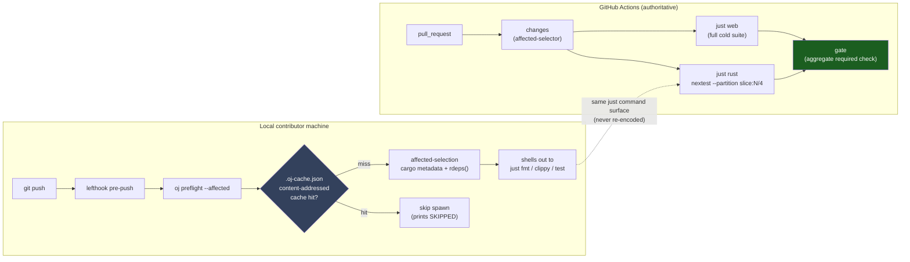
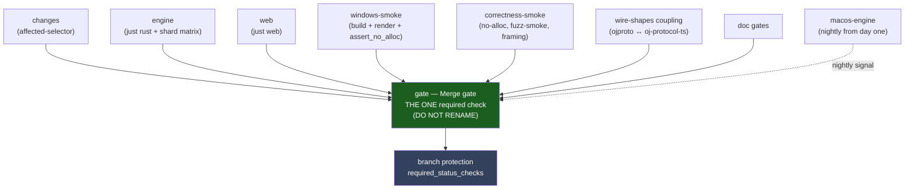
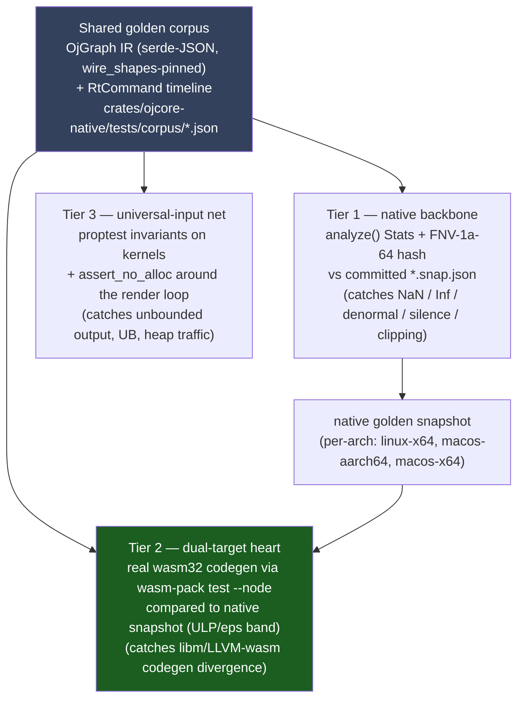
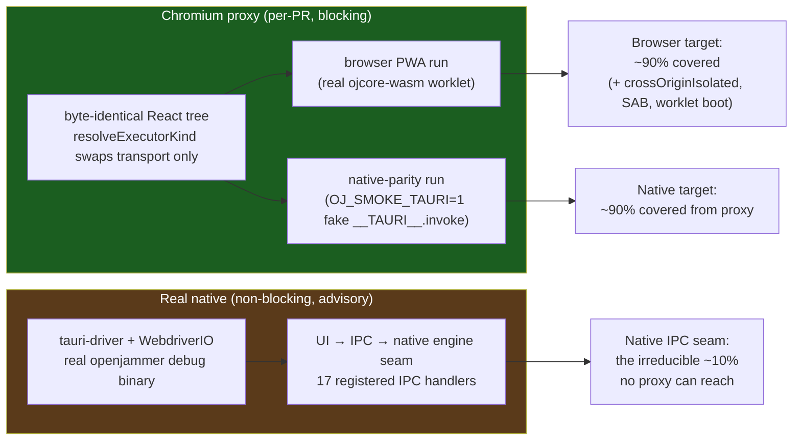
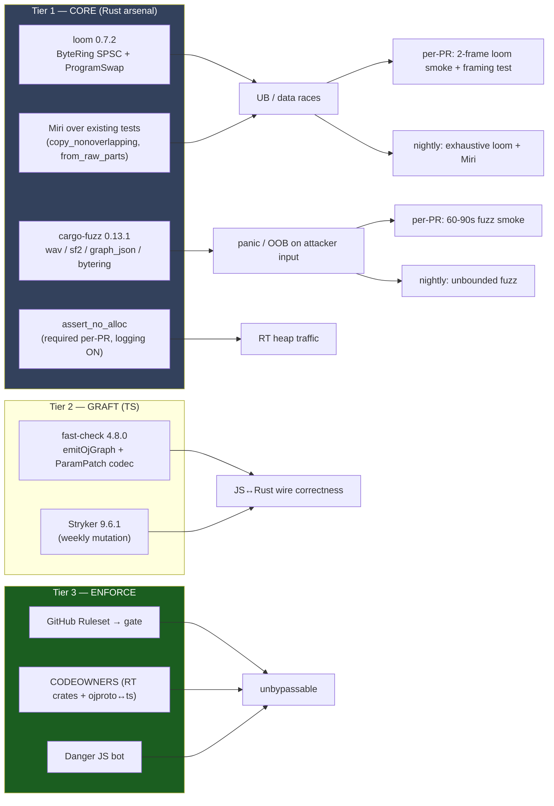

# Testing & Reliability

> **Status:** decision-final. This section governs how OpenJammer proves correctness for a hard-real-time, dual-target (native Tauri v2.11.2 + browser wasm32 AudioWorklet PWA) audio engine, and how it keeps a heavily-contributed AGPL-3.0 repo green.
>
> **Verified against the current tree:** the workspace version is `0.0.0` (`Cargo.toml:9`, `[workspace.package].version`); there is **no** `.config/nextest.toml`, **no** root `justfile`, and **no** `rust-toolchain.toml`. All three are **created in Phase 0/1** — the `rust-toolchain.toml` in Phase 0, the `justfile` + `.config/nextest.toml` in Phase 1; every configuration shown below is the **required post-Phase-1 state**, not what exists today. The current merge gate is `.github/workflows/ci.yml` with exactly three jobs: `Engine (Rust workspace)`, `Web (control plane)`, and `Windows native build + audio gate`.

This document covers four interlocking decisions: **T1** test orchestration, **T2** real-time audio correctness without hardware, **T3** cross-platform UI/E2E, and **T4** reliability hardening. It is self-complete: every cross-cutting foundation it relies on is restated here, and every section-relevant adversarial must-fix is folded in at the section level.

## Decisions at a glance

| Decision | Winner | One-line why |
|---|---|---|
| **T1** Testing orchestrator | The `just` command surface + `cargo-nextest` + thin `oj` Bun CLI for cache/affected | One recipe set called by both CI and local kills two-sources-of-truth drift; Bun adds the cache + `cargo metadata`-accurate affected-selection `just`/nextest lack. |
| **T2** RT audio correctness (no hardware) | One shared golden corpus, three device-free tiers; keystone = `wasm-pack test --node` real `wasm32` codegen parity | The only design that verifies the *browser-compiled* float path, not just a host rlib — the dual-target gap none of the pure directions closed. |
| **T3** UI/E2E | Playwright PWA + render-smoke (blocking) + non-blocking `tauri-driver` native leg | The native and browser targets render a byte-identical React tree, so ~90% of UI coverage is reachable from Chromium with a mocked `__TAURI__` — cheaply, on every PR. |
| **T4** Reliability hardening | Rust correctness arsenal (loom/miri/fuzz) + scoped TS fast-check/Stryker + thin governance | Only the Rust arsenal produces *new* correctness about the lock-free engine; governance makes it unbypassable; TS hardens the other side of the wire. |

These four rows agree verbatim with the **T1–T4** rows of the canonical "Decisions at a glance" table in [`00-overview.md`](00-overview.md#decisions-at-a-glance); [`00-overview.md`](00-overview.md) is authoritative on any divergence.

These four are intentionally interlocking. They share **one** command surface (the `just` command surface — the root `justfile` + [`.config/nextest.toml`](07-reference-configs.md)), **one** required CI status check (the aggregate `gate` job), **one** pinned toolchain (`rust-toolchain.toml`), and **one** RT transport primitive (the `ByteRing` wait-free SPSC transport in `ojcore-midiring`). The cross-cutting foundations are stated once in [§0](#0--shared-foundations-created-once-in-phase-01) and referenced throughout.

---

## §0 — Shared foundations (created once, in Phase 0/1)

These are hard prerequisites named by multiple decisions and verified absent today. They land **before** the testing legs that depend on them.

1. **`rust-toolchain.toml`** (owned by the CI decision; consumed here). Pins **one** nightly — the only path that compiles `ojcore-wasm` (`cargo +nightly … -Z build-std`, plus Miri/sanitizers) — and stable (fmt/clippy). Because it is the seed of every reproducibility claim in T2 and every cache key in T1, it is an **`ALWAYS_INPUT`** to the `oj preflight` cache and a broad invalidator.

   ```toml
   # rust-toolchain.toml — pin ONE nightly so the wasm/-Zbuild-std leg, Miri,
   # sanitizers, and T2's cross-target golden are reproducible run-to-run.
   [toolchain]
   channel = "nightly-2026-06-01"   # bump deliberately; a bump re-blesses golden snapshots
   components = ["rust-src", "rustfmt", "clippy", "miri"]
   targets = ["wasm32-unknown-unknown"]
   ```

2. **Version SSOT.** `release-please` (the single version brain) writes all four version files in lockstep: `Cargo.toml [workspace.package].version` (the canonical seed), `package.json`, `src-tauri/tauri.conf.json`, and `packages/oj-protocol-ts/package.json`. The verified four-way drift — `0.0.0` (`Cargo.toml:9`) / `0.1.0-alpha` (`package.json`) / `0.1.0` (`src-tauri/tauri.conf.json`) / `0.0.0` (`packages/oj-protocol-ts/package.json`) — is unified here. The `oj doctor` version check is a **consistency assertion** (all four equal), never an independent source.

3. **One required CI status check.** Branch protection requires exactly **one** context — the aggregate **`gate`** job. Every leg below (the device-free `render` gate, Playwright, correctness, doc gates, the `wire_shapes.rs` parity gate) is a `needs:` dependency feeding `gate`, never an independently-required check. The one documented invariant is *"do not rename the `gate` job."*

4. **The RT transport primitive is the `ByteRing` wait-free SPSC transport** (`ojcore_midiring::ByteRing`) with a fixed-byte codec.

   > **Verified:** `crates/ojcore/src/meter.rs` already defines a `return_frame` module (`TAG_METER = 1` at `meter.rs:142`, `TAG_BEAT = 2` at `meter.rs:144`) and `pub type MeterRing = ojcore_midiring::ByteRing<8192>` (`meter.rs:203`). The SPSC contract is frozen in `crates/ojcore-midiring/src/lib.rs:24` — *"Exactly one thread (the producer) may call `push` and exactly one thread (the consumer) may call `pop`."* Any new event/log channel extends this codec via an `event_frame` sibling module (`TAG_EVENT = 3`) — it does not invent a new crate.

   > **Must-fix (critical) — load-bearing for T2/T4 below:** there is **no** wasm `MeterRing` to "mirror." `crates/ojcore-wasm/src/lib.rs:567` exposes `pub fn drain_meters() -> Vec<f32>` — an *allocating pull* between `process()` calls, not a `ByteRing`. The browser side has no SPSC ring today; any browser event channel is **net-new** (a dedicated `log_ring` in the wasm `Host`, drained by the worklet itself between quanta and posted via batched `postMessage`, not a cross-thread SAB drain). Shared-memory wasm (`+atomics`/`+bulk-memory`) is a deferred prerequisite workstream. See the T4 platform notes for how the browser RT-emit path is verified, and [`02-logging-and-observability.md`](02-logging-and-observability.md) for the `ojproto` `EventKind` schema, the `event_frame` codec / `drain_frames` routing, and the native drain-thread decision this channel consumes.

---

## T1 — Test orchestration

> **At a glance:** Two-layer: `just` + `cargo-nextest` command surface + the unified `oj` Bun/TS CLI for cache + affected-selection. One recipe set called by both CI and local kills two-sources-of-truth drift; Bun adds the cache + `cargo metadata`-accurate affected-selection that `just`/`nextest` lack.

### Chosen design

A **two-layer gate**, not a monolith. Layer 1 is the canonical *what-runs* surface; Layer 2 is the local *what-to-skip* intelligence.



**Layer 1 — the canonical command surface.** A root `justfile` + `.config/nextest.toml`. Every command that gates a merge is named exactly once here, and **both** CI and local invoke the same recipes. This structurally kills the two-sources-of-truth drift that a separate `ci.yml` command list plus a standalone harness would create.

> **Note:** The following **Phase-1 configuration** is non-negotiable — it creates the one command surface shared by CI and local. It is *prescriptive* (what gets built), not a description of the current tree.

```just
# justfile — single source of truth for WHAT runs. CI and local both call these.
set windows-shell := ['powershell.exe', '-NoLogo', '-Command']  # maintainer's primary box

# OS-aware temp WAV for the device-free render gate (ci.yml windows-native runs this too)
wav := if os() == "windows" { "$env:RUNNER_TEMP\\oj-render.wav" } else { "${RUNNER_TEMP:-/tmp}/oj-render.wav" }

fmt:        cargo fmt --all -- --check
clippy:     cargo clippy --workspace --all-targets -- -D warnings
test:       cargo nextest run --workspace
doctest:    cargo test --workspace --doc          # MANDATORY companion: nextest skips doctests
nostd:      cargo build -p ojcore --no-default-features
wasm:       cargo +nightly build -p ojcore-wasm --target wasm32-unknown-unknown -Z build-std=std,panic_abort
render:     cargo clippy -p ojcore-native --features demo --all-targets -- -D warnings && cargo run -p ojcore-native --bin render --features demo -- "{{wav}}" 2
clap-host:  cargo clippy -p ojhost --features clap-host --all-targets -- -D warnings && cargo test -p ojhost --features clap-host
web:        bun install --frozen-lockfile && bunx tsc --noEmit -p tsconfig.app.json && bun run lint && bun run test:run && bun run build
rust:       just fmt && just clippy && just test && just doctest && just nostd && just wasm && just render && just clap-host
ci:         just rust && just web
preflight *ARGS: bun scripts/oj/index.ts preflight {{ARGS}}
```

```toml
# .config/nextest.toml — declarative serial RT lane + CI profile.
[test-groups]
audio-serial = { max-threads = 1 }   # RT-sensitive tests never contend

[[profile.default.overrides]]
# Bind ojcore engine ring/hot-swap/no-alloc tests to the serial lane.
filter = 'package(ojcore) and test(/program_swap|meter_ring|hot_swap|no_alloc/)'
test-group = 'audio-serial'

[profile.ci]
fail-fast = false
[profile.ci.junit]
path = "junit.xml"
```

> **Verified:** four primary `assert_no_alloc` scopes live in `crates/ojcore/tests/engine.rs` (lines 240, 271, 654, 771) inside a 789-line file that holds 19 `#[test]` functions total; the `assert_no_alloc` crate is a dev-dep (`crates/ojcore/Cargo.toml:29`) and its global `AllocDisabler` shim is installed as the process allocator (`engine.rs:27`). The four wrapped scopes are the *current* no-alloc gate; future RT-emit sites (the L1/L3/L4 logging channel) extend it with new test cases also wrapped in `assert_no_alloc`. Process-per-test isolation (nextest) is **strictly safer** than `cargo test`'s shared process for the `assert_no_alloc` global-allocator swap.

CI collapses to installing pinned `just` + `cargo-nextest` via `taiki-e/install-action@v2`, then calling `just rust` / `just web`. The engine test step becomes a shard matrix for ~4× free wall-clock:

```yaml
# ci.yml engine test step (sketch)
strategy: { matrix: { shard: [1, 2, 3, 4] } }
# ...
- run: cargo nextest run --workspace --profile ci --partition slice:${{ matrix.shard }}/4
```

**Layer 2 — the fast LOCAL gate.** A small Bun/TS CLI at `scripts/oj/`, ported almost verbatim from SetScreens' `preflight` (`scripts/lib/{preflight-cache,preflight-git,preflight-report}.mjs` → `scripts/oj/lib/{cache,git,report}.ts`; the logic is language-agnostic — it hashes git blobs, not language artifacts). It is the **local contributor gate, not a CI replacement.** It provides the three things `just`/`nextest` do not:

- **(1) Content-addressed per-task cache.** `hashInputs` over `git ls-files -s` + `git diff` + `git diff --cached` + untracked bytes (verified: `git ls-files -s crates/ojproto/src/lib.rs` returns a blob SHA), **extended** to include `rustc -Vv` + `cargo --version` + `bun --version` + node version/platform/arch. `ALWAYS_INPUTS = ['Cargo.lock','bun.lock','package.json','rust-toolchain.toml']` so any dep/toolchain bump busts every entry. Cache file `.oj-cache.json`, keyed per task name.
- **(2) Graph-accurate affected-selection.** Reads `cargo metadata --format-version 1 --no-deps` (cached on `Cargo.lock` blob hash) for the true reverse-dep set, then drives `cargo nextest run -E 'rdeps(<changed-crate>)'`. For TS, `vitest related` seeded with changed `src/*.ts`. This is **not** a hand-authored YAML graph — Cargo already owns it.
- **(3) The one cross-language coupling, encoded explicitly.** A change to `crates/ojproto/src/lib.rs` **or** `packages/oj-protocol-ts/src/index.ts` force-runs `cargo nextest run -p ojproto` (the `wire_shapes.rs` parity gate, verified at `crates/ojproto/tests/wire_shapes.rs`) **and** `bunx tsc --noEmit` in `packages/oj-protocol-ts`. This is the single contract Cargo's graph and Vitest's graph each see only half of.

**Concrete preflight scope.** The `oj preflight` invocation (used locally in pre-push via lefthook) shells out to the three `just` recipes that scale well with affected-selection: `just fmt` (a single static-analysis pass, skipped if no `.rs`/`.ts` changes), `just clippy` (per-crate, skipped for unaffected crates), and `just test` (via nextest affected-selection). It does **not** invoke `just wasm`, `just render`, or `just clap-host` locally — those are nightly/canary legs. For TS changes it decides which `vitest related` suite to run. CI's `just rust` and `just web` always run the full cold suite, never affected-selected. The Bun CLI only decides *which* recipe to run and whether a cache hit lets it skip the spawn; commands are **never re-encoded**.

**The `oj` Bun CLI is one binary.** Per cross-cutting harmonization, the T1 preflight/plan logic is the **same** binary as the D2 doctor/scaffold/dev surface (see [`04-developer-tooling.md`](04-developer-tooling.md)): one `scripts/oj/index.ts` with subcommands `preflight | plan` (T1) and `doctor | scaffold | dev` (D2), sharing one `lib/` (`git`, `cache`, `ssot`, `report`). Version-sync lives once in `lib/ssot.ts` as a **consistency check**, never competing with `release-please` (the single version brain).

**Wiring (lefthook).** A single `lefthook.yml` (this decision is the natural owner since it defines the preflight the hooks invoke), invoked via `bunx` (never `-g` — the `evilmartians/lefthook#1165` Windows PATH bug):

```yaml
# lefthook.yml — ONE file (three decisions each thought they introduced the first)
pre-commit:
  parallel: true
  commands:
    fmt:    { run: cargo fmt --all -- --check }      # staged-aware in CLI
    eslint: { run: bun run lint }
    secrets:{ run: bun scripts/oj/index.ts doctor --credential-scan }
    vsync:  { run: bun scripts/oj/index.ts doctor --version-sync }   # consistency, not SSOT
pre-push:
  commands:
    preflight: { run: bun scripts/oj/index.ts preflight --affected, timeout: 900 }
```

### Why this is the best compromise

OpenJammer explicitly **wants GitHub Actions authoritative** (its deliberate divergence from a local-webhook CI model). A standalone Bun harness would then hand-sync a second command list against `ci.yml` forever. `just` solves this structurally: one recipe set, called by both. But `just`/`nextest` provide **zero** caching and zero affected-intelligence — and ~60% of the inspiration harnesses' value *is* that cache + affected-selection. So they must be bolted on. The wrong way is a hand-authored dep graph (it duplicates what Cargo owns and rots at feature-gated edges `ojfaust`/`ojhost`/`ojcore-native demo` — a footgun for a heavily-contributed repo). The right way is `cargo metadata` + `rdeps()` (graph-accurate, self-maintaining), reserving a hand-written rule for the **one** coupling Cargo cannot see. Net: command surface = Rust/`just` (one truth, CI==local, free sharding, declarative RT lane); intelligence layer = Bun/TS (cache + accurate affected + the explicit cross-language coupling) — strictly best-of-both.

### Rejected alternatives

- **Standalone Bun preflight port** — best cache/affected engine, but as the *whole* gate it re-encodes `ci.yml`'s commands a second time (drift), proposes file-path-regex Rust reverse-deps (Cargo already owns the true graph), and its POSIX-first backgrounding (`nice -19`, `/proc` PID supersession) silently no-ops on the maintainer's Windows box. **Kept** as Layer 2's cache/git primitive; rejected as the answer.
- **Pure `rust-xtask` + `just`** — best command surface, adopted wholesale as Layer 1. Rejected as the *whole* answer because `just`+`nextest` have no cache/affected of their own, the TS leg becomes a second-class single shell-out, and the `wire_shapes.rs ↔ oj-protocol-ts` coupling is a blind spot `rdeps` cannot see. Pushing cache+affected into an xtask crate means recompiling Rust to tweak a recipe and treats the larger TS half poorly.
- **Hand-authored `oj.yaml` registry (Turbo-style)** — right host language (Bun) and correctly names the one real coupling (both adopted into Layer 2). Rejected because a hand-authored graph is a second source of truth that under-selects exactly at feature-gated/dev-dep edges and lets a break merge green — the worst outcome for a reliability gate. Dropped the registry for `cargo metadata` + `rdeps`; dropped literal Turbo (it cannot drive Cargo without a shadow `package.json` polluting every crate).

### Per-platform matrix

| Platform | Coverage under T1 |
|---|---|
| **Windows** (maintainer's primary box) | `justfile` `windows-shell` directive + OS-aware temp WAV. `just rust` runs natively (the `ci.yml` `Windows native build + audio gate` job). lefthook background warm-run degrades to best-effort no-op — **pre-push runs cold here, and that is acceptable because CI is authoritative.** `just`+`nextest` ship prebuilt Windows binaries. |
| **macOS** (CoreAudio aarch64+x86_64) | `just rust` is host-independent (just invokes cargo). **Not** in CI today — a thin macOS leg is added (see must-fixes); locally `oj preflight` on Windows/Linux cannot exercise CoreAudio, so CI owns it. |
| **Linux** (ALSA/JACK) | Fully covered: the ubuntu engine job becomes `just rust`. POSIX backgrounding/nice for the warm-run works here. |
| **Browser** (wasm32 AudioWorklet) | `just wasm` confirms it **compiles** (nightly `-Z build-std`); `just web` runs Vitest (538 cases) + `bun build`. **Not** exercised by T1: AudioWorklet instantiation, SAB ring round-trip, COOP/COEP cross-origin isolation gating — those belong to T2/T3. |

### Folding in the adversarial must-fixes

The `gate` job is the single required check; every leg is a `needs:` dependency. The dependency topology:



- **Exact aggregate-gate predicate + CI self-test.** The aggregate `gate` job is defined inline in `ci.yml` (the stable name `Merge gate` — **do not rename**) and its condition is committed verbatim (the full Lane A workflow is reproduced in [`08-reference-ci-workflows.md`](08-reference-ci-workflows.md)), plus an adversarial self-test that forces malformed affected-selector JSON **and** a failing shard and asserts the gate goes **RED** in both:

  ```yaml
  gate:
    name: Merge gate                       # DO NOT RENAME — the one required check
    needs: [changes, engine, web, windows-smoke, correctness-smoke]
    if: always()
    runs-on: ubuntu-latest
    steps:
      - name: Assert all needed jobs succeeded (skipped is OK, failed/cancelled is NOT)
        run: |
          results='${{ join(needs.*.result, ",") }}'
          echo "results=$results"
          for r in ${results//,/ }; do
            case "$r" in
              success|skipped) ;;
              *) echo "::error::gate dependency result '$r' is not success/skipped"; exit 1 ;;
            esac
          done
          # The affected-selector job MUST have succeeded (not merely skipped):
          [ "${{ needs.changes.result }}" = "success" ] || { echo "::error::changes job did not succeed"; exit 1; }
  ```

  A companion CI job named `gate-self-test` (kept in the same workflow, not gate-blocking itself) re-runs the gate predicate logic against a malformed `affected_selector='invalid'` input **and** a forced-failing shard result, asserting the predicate returns RED in both cases. This proves the gate correctly fails closed when a dependency fails or the selector is corrupt — the failure mode that would otherwise let a break merge green.
- **CI never trusts the local cache.** The authoritative gate cells run `cold: true` (uncached); the Bun cache is local fast-feedback only. A `lib/cache` unit test (in the per-PR `web` job) asserts that mutating the simulated `rustc -Vv`, `bun --version`, or `rust-toolchain.toml` bytes produces a **different** hash for the same git tree — a guard against a silent stale false-HIT leaving the nightly wasm leg unverified after a toolchain change.
- **Per-PR cross-platform floor + canary backstop.** A minimal Windows engine+render smoke stays in the per-PR lane feeding `gate`; macOS engine tests run nightly from day one with a watched signal. The **canary channel runs the FULL uncached suite on every merge** (non-negotiable, gate-visible), bounding the affected-selection under-selection window to a single merge.
- **Broad invalidators made structural.** `Cargo.lock`, root `Cargo.toml`, `crates/ojcore/**`, `crates/ojproto/**`, `justfile`, `scripts/oj/lib/**`, **plus** `build.rs`, all `crates/*/tests/corpus/**`, `*.snap.json`, `corpus.toml`, and asset dirs (data that cannot be graph-resolved) escalate to full. The unowned "periodic cold audit" is replaced by a **scheduled weekly `oj preflight --full --no-cache` divergence check** that diffs its selected set against what affected-selection *would* have picked and **opens an issue** on any divergence.
- **Doctest regression guarded.** `just doctest` (`cargo test --workspace --doc`) is wired into `rust`/`ci` from day one — without it, switching `cargo test` → `nextest` silently drops doctests.

### Risks & mitigations

| Risk | Mitigation |
|---|---|
| Affected-selection under-selects non-import couplings | Broad invalidators (incl. data dirs), explicit ojproto coupling, weekly divergence audit, **canary-on-merge full suite** as the structural backstop. |
| Cache false-HIT after toolchain bump | Toolchain identity in the hash + the cache-invalidation unit test in the per-PR gate; CI authoritative legs run `cold: true`. |
| Windows port debt (warm-run, `just` quoting) | `windows-shell` directive + OS-aware vars; honest docs that pre-push runs cold on Windows; CI authoritative. |
| Git-worktree behavior (dev happens in `.claude/worktrees/`) | **Phase-1 acceptance criterion** (not a deferred risk): validate `oj` cache + git-state probing inside a linked worktree — it is the common case here. |
| Two-layer conceptual overhead | `oj preflight` prints **SKIPPED** targets so the green light is honest; `CONTRIBUTING.md` documents "green local ≠ merge-ready; CI is authoritative." |

---

## T2 — Real-time audio correctness without hardware

> **At a glance:** One shared golden corpus, three device-free tiers; the keystone is real `wasm32` codegen run via `wasm-pack test --node`. Verifies native **and** the first-class browser float-codegen target against one snapshot; proptest invariants cover all inputs; honest about device/latency gaps.

### Chosen design

**One shared golden corpus** is the source of truth, verified through **three device-free tiers**.



**Tier 1 — backbone (promote what exists).** Extract the duplicated analysis helpers from `crates/ojinstrument/tests/golden_render.rs` (`rms`/`peak`/`upward_zero_crossings`/`estimate_freq`/`assert_all_finite`, verified at lines 92–131 of that 910-line test file) and the inline summary in `crates/ojcore-native/src/bin/render.rs` (the `rms`/`peak`/finite math at `render.rs:148-171`) into a new off-RT module `crates/ojcore-native/src/analysis.rs`:

```rust
// crates/ojcore-native/src/analysis.rs
pub struct Stats {
    pub rms: f32, pub peak: f32,
    pub nan_count: u32, pub inf_count: u32, pub denormal_count: u32,
    pub nonzero_frac: f32, pub dc_offset: f32, pub est_freq_hz: f32,
}
pub fn analyze(buf: &[f32]) -> Stats { /* reuse DENORMAL_FLOOR = 1.0e-30 from ojcore::resilience */ }
```

Reuse the `DENORMAL_FLOOR = 1.0e-30` constant from `crates/ojcore/src/resilience.rs` (verified at `resilience.rs:34`, used at line 39 in the RT flush path) so the test's denormal definition matches the RT flush. Add a data-driven corpus: OjGraph IR fixtures as serde-JSON (the exact wire form pinned by `wire_shapes.rs`) + an `RtCommand` timeline under `crates/ojcore-native/tests/corpus/*.json`, with a `corpus.toml` manifest (per-case `sample_rate`/`block_size`/schedule/blocks + assertion spec). A new `crates/ojcore-native/tests/golden_corpus.rs` loops the manifest, compiles via `register_all(&mut reg, RegisterOpts::full())` (verified at `crates/ojinstrument/src/lib.rs:147`), renders with `Engine::process_block`, and asserts each case against a committed snapshot. Snapshot **two** things: (a) the `Stats` summary as **reviewable TEXT** (`corpus/*.snap.json`), and (b) an FNV-1a-64 hash of the f32-LE buffer using the constants **already** in `crates/ojcore-wasm/src/lib.rs:71-72` (`FNV_OFFSET = 0xcbf2_9ce4_8422_2325` / `FNV_PRIME = 0x0000_0100_0000_01b3` — no new dep). `BLESS=1` regenerates snapshots. Keep the existing `render` bin as a human-listenable WAV uploaded via `actions/upload-artifact`.

> **Note:** Refactoring boundary (Phase 4). The existing `crates/ojinstrument/tests/golden_render.rs` (helpers at lines 92–131) is **superseded** by the new `analysis.rs` module but remains in-tree as a reference until all its individual test cases are ported to the corpus-driven `golden_corpus.rs`. The move is a pure refactoring with **zero behavior change** — the corpus golden must reproduce the existing per-case assertions before the legacy file is removed.

**Tier 2 — the dual-target heart (the real gap).** The corpus is rendered through the **actual `wasm32` codegen** and compared to the native snapshot. Add `wasm-bindgen-test = "0.3"` (paired with the pinned `wasm-bindgen = "=0.2.125"`, verified at `crates/ojcore-wasm/Cargo.toml:27`) as a dev-dep to `ojcore-wasm` and a `crates/ojcore-wasm/tests/golden_wasm.rs` that `include_bytes!` the same corpus fixtures, calls `compile_with_assets` + `Engine::process_block` (the exact path `process()` wraps — verified at `crates/ojcore-wasm/src/lib.rs:389-396`), and asserts the result equals the native snapshot. Run via `wasm-pack test --node` (no browser).

> **Why:** this is the one thing none of the pure directions delivers — today `ci.yml` only *builds* `wasm32` (the `just wasm` leg), and the `ojcore-wasm` `#[cfg(test)]` tests run as a **host x86 rlib** — the wasm-compiled float codegen is never executed or compared. The browser is a first-class target; this leg is the only proof its float path matches native.

> **Note:** Browser-side honesty (folds in the F3 must-fix). The wasm side **has no `ByteRing` to mirror** — `drain_meters` is an allocating pull (`crates/ojcore-wasm/src/lib.rs:567`). The browser event channel is net-new and drained by the worklet itself between quanta via batched `postMessage`, **not** a cross-thread SAB drain (shared-memory wasm is a deferred prerequisite workstream). Tier 2 proves **float-codegen parity** via the native golden comparison; the audio-thread *emit* path is verified by code review + a native-rlib `assert_no_alloc` run of the codec, never as gate-verified wasm worklet code. The 128-frame AudioWorklet quantum, COOP/COEP + SAB, and the net-new browser ring belong to the Open Questions and the non-blocking Playwright lane (T3), not here.

**Tier 3 — universal-input safety net.** Add `proptest = { version = "1.9", default-features = false, features = ["alloc"] }` as a dev-dep to `ojcore-dsp` and `ojinstrument`. The DSP kernels live in `crates/ojcore-dsp/src/lib.rs`. Assert structural invariants for **all** inputs on the kernels: no NaN/Inf, `|output|` bounded, silence-in→silence-out, linearity for linear nodes (Gain/Biquad), amount-0/identity passthrough (Waveshaper/Convolver), anti-runaway for feedback (`DelayLine` feedback in `[0, 0.99)`). Strategies use **bounded, numerically-sane** ranges (biquad freq `20..20000`, Q `0.1..10`). Wrap the corpus render loop in `assert_no_alloc(|| engine.process_block(...))` (the pattern at `crates/ojcore/tests/engine.rs:240/271`) so property-generated and corpus graphs also prove zero heap traffic. Commit `proptest-regressions` files so every counterexample replays forever.

### Why this is the best compromise

The mandate is four failure modes (NaN / denormal / silence / clipping) **on every platform** — and "every platform" includes the browser PWA as a first-class target. `native-render-loopback` alone is 80% built and green but structurally **0% browser coverage** — a libm/codegen divergence would ship as an in-browser bug with green CI. `browser-wasm-offline-render` fixes that but over-weights the flaky headless-Chrome/OfflineAudioContext layer (worklet plumbing, not math). `shared-golden-corpus-proptest` has the cleanest architecture but its cheap "parity" leg compiles the same source for x86 twice and never touches real `wasm32` codegen — a comfortable illusion. The hybrid takes the proven backbone from #1, the single-corpus/proptest spine from #3, and spends the marginal effort exactly where the risk lives: a **true `wasm32`-codegen golden comparison** all three skip or fake. The determinism precondition is verified in-tree: DSP is 100% `libm`, there is no fast-math/`target-cpu`/FMA, `lto = "thin"`, and `sanitize()` already flushes the only wasm nondeterminism (NaN bit-patterns).

### Rejected alternatives

- **native-render-loopback** — lowest-risk, 80% built; **kept** as the entire Tier-1 backbone + the founder-only loopback. Rejected as standalone: 0% browser/wasm coverage on a first-class target.
- **browser-wasm-offline-render** — correctly sees the wasm DSP can be verified headlessly under Node (**adopted** as Tier 2's `wasm-pack test --node` insight). Rejected standalone: invents a corpus unanchored to the proven native gate and over-narrates the OfflineAudioContext/Playwright layer that only *regresses* determinism.
- **shared-golden-corpus-proptest** — best architecture; its corpus-as-single-source and proptest Tier 3 are **adopted wholesale**. Rejected standalone: its "parity" gate is a host-rlib that never exercises real `wasm32` float codegen — exactly the leg it flagged as "most likely deferred." The hybrid runs it for real.

### Per-platform matrix

| Platform | Coverage under T2 |
|---|---|
| **Windows** | `golden_corpus` replaces the bare `render` bin on the windows-native job (WASAPI/ASIO device code not exercised — offline render opens no device). Validates the x86_64 native snapshot. |
| **macOS** | New `macos-latest` leg runs the same corpus (covers aarch64+x86_64 build/codegen; DSP output is host-independent so its value is build confirmation + arch-divergence detection, not new math). Can be on-merge/nightly if minutes are tight. |
| **Linux** | Ubuntu engine job hosts Tiers 1+3 and generates the host-independent golden source snapshot; adds the `wasm-pack test --node` Tier-2 leg (nightly + `-Z build-std` already present). |
| **Browser** | Tier 2 **is** the browser-correctness gate: the actual `wasm32`-compiled engine runs via `wasm-pack test --node` (no DOM) and its `Stats`/hash compare to the native golden. **Not** covered (deliberately, non-blocking Playwright instead): COOP/COEP + SAB, the 128-frame AudioWorklet quantum vs engine block, the net-new browser event ring, Web Audio resampling. `jsdom` (Vitest's env) has no real AudioContext, so this *must* be the `wasm-bindgen-test` job. |

### Folding in the adversarial must-fixes

- **Cross-target comparison defaults to a tight ULP/relative-eps BAND, not byte-equality.** Bit-exact native↔wasm hashing is a research-grade claim, not a CI invariant: `lto="thin"` + nightly `-Z build-std` mean a nightly/LLVM bump can change wasm float codegen with no code change and red-wall unrelated PRs. **Every** kernel — including the "proven-exact" Gain/Delay/Convolution-identity/Looper — is band-checked on the gate. Bit-exact hashing is reserved as a **non-required nightly signal** for kernels observed identical across Linux+Windows+macOS+wasm over a sustained green streak. **aarch64 gets an explicit FMA-contraction guard** in the FP-reproducibility policy; the native golden is generated/asserted **per-arch** (linux-x64, macos-aarch64, macos-x64).
- **Per-PR wasm parity subset (not nightly-only).** Demoting the keystone dual-target proof to once-a-day means a libm/LLVM-wasm divergence ships green for up to 24h on a first-class target. So a **small `wasm-pack test --node` parity subset** (a handful of corpus cases covering Osc/Biquad/Gain/Delay) runs **per-PR** in the lean lane feeding `gate` (seconds, not minutes). This is a separate `crates/ojcore-wasm/tests/golden_wasm_subset.rs` test, invoked as `wasm-pack test --node` in a CI step that rides the existing wasm build leg — **not** the full corpus. The full corpus + nightly bit-exact sweep escalate to nightly **and** canary-on-merge, bounding detection to one merge.
- **`rust-toolchain.toml` pinned in Phase 0** ([§0](#0--shared-foundations-created-once-in-phase-01)) before any wasm golden leg, so the nightly hash is reproducible run-to-run; a nightly bump is a deliberate re-bless.
- **FP-reproducibility guards in CI.** A clippy `disallowed-methods` guard forbids `std f32::sin/cos/...` (require `libm`); a build-flag guard fails CI if `RUSTFLAGS` contains `-Ctarget-cpu`/fast-math. `lto="thin"` is documented in `agents.md` as a **frozen FP-reassociation hazard** — changing it to `fat`/`off` requires a re-bless.
- **Re-bless cannot rubber-stamp a regression.** CODEOWNERS requires maintainer review on `crates/*/tests/corpus/**/*.snap.json` (mirroring the ojproto↔oj-protocol-ts pairing). A Danger rule WARNs loudly on any `*.snap.json` change and requires a `BLESS: <reason>` line in the PR body **and** the listenable render WAV artifact uploaded for an ear-check. A re-bless ties to a corpus version bump so churn is auditable.
- **Device path stays honest.** The real-device path (xruns, jitter, the <5ms goal) is a founder-machine-only `--ignored` measurement via `crates/ojcore-native/src/bin/loopback.rs`, wiring `RecorderSink` into the `build_input` stub (verified at `crates/ojcore-native/src/host.rs:304`; the no-op capture closure sits at ~`host.rs:336`). An xrun counter is surfaced via the `ojproto` `EventKind` channel; a per-backend (WASAPI/CoreAudio/ALSA/JACK) manual loopback runbook becomes a release-gate checklist in the docs site.

### Risks & mitigations

| Risk | Mitigation |
|---|---|
| Bit-exact hashes brittle across toolchain bumps | Bands by default on the gate; hash only as a nightly signal for proven-stable kernels; pinned nightly. |
| Re-bless rubber-stamping a real regression | Reviewable TEXT snapshots, CODEOWNERS on `*.snap.json`, Danger `BLESS:` requirement, mandatory listenable WAV artifact. |
| Determinism broken by `RUSTFLAGS` / std transcendentals | clippy `disallowed-methods` + build-flag guard + `agents.md` policy. |
| proptest strategy/eps tuning = ongoing DSP expertise | Ship bounded reference strategies; gate new-node strategies in review; document the kernel-vs-engine denormal distinction. |
| False confidence ("audio works on a device") | Frame CI status as **"engine/DSP correctness + cross-target parity"**; device latency stays founder-only `--ignored`. |

---

## T3 — Cross-platform UI/E2E testing

> **At a glance:** Layered Playwright-PWA + render-smoke base (blocking) + thin non-blocking `tauri-driver` native leg. The native and browser targets render a byte-identical React tree, so ~90% of UI is covered cheaply from a Chromium proxy; only the real Tauri IPC seam needs the flaky native leg, kept advisory.

### Chosen design

A single-toolchain **layered hybrid**: a SetScreens-style render-smoke grafted onto a real Playwright browser-PWA layer, with `tauri-driver` native E2E added **only** as a thin, opt-in, **never-blocking** leg. The decisive insight: native and browser render a **byte-identical React tree** (`resolveExecutorKind` at `src/audio/executor/index.ts:51` swaps only the transport — `ojcore-wasm` vs `window.__TAURI__`), so ~90% of UI correctness for the native target is reachable from a Chromium proxy with a mocked `__TAURI__.invoke`, for free, on every PR.



**Tier 1 — keep + grow Vitest.** The existing Vitest + jsdom + Testing Library suite (538 cases) stays the PR gate's fast bulk. No toolchain change.

**Tier 2 — render-smoke (`scripts/smoke-app.mjs`).** Boots the real app via Vite `createServer()` (reusing `vite.config.ts`, which emits COOP/COEP cross-origin isolation on **both** `server.headers` (`vite.config.ts:130-131`) and `preview.headers` (`vite.config.ts:136-137`)), drives headless Chromium via Playwright, enumerates every screen (NodeCanvas, Settings via the `openjammer:toggle-settings` CustomEvent, CommandBar/Ctrl+K, CollabControl, MIDIDeviceBrowser, HelpPanel, the audio-activation overlay), and per screen asserts: (a) `sharp` pixel-bucket blank-frame rejection (calibrate for the `#0a0a0f` dark theme), (b) a `pageerror` + `console.error` gate, (c) an **OpenJammer-specific NaN/Infinity scan over all SVG `<path d>`/transforms** — the visual twin of the device-free `render` gate's "finite, non-silent" check, catching `getPortPosition → null` connection-math regressions (`getPortPosition` is consumed in `src/components/Canvas/NodeCanvas.tsx`). This scan is implemented via a Playwright visitor that walks the DOM post-render, collects every `d=` attribute value and `transform` matrix, parses them as float arrays, and asserts `Number.isFinite()` on every component. It runs **twice from one Chromium boot**: once as the browser PWA, once as native-parity (`OJ_SMOKE_TAURI=1` injects a fake `window.__TAURI__.core.invoke` matching `OjcoreNativeExecutor.getInvoke()`).

> **Note:** Implementation detail — `scripts/smoke-app.mjs` is a new single-file harness (~200 lines) that imports `@playwright/test` and Vite's dev-server APIs, runs async per-screen checks (screenshot, NaN scan, console-gate) in parallel, and reports per-screen pass/fail. The file path and rough shape are fixed here; the detailed spec is a Phase-4 deliverable.

**Tier 2b — Playwright browser E2E (same stack).** `playwright.config.ts` at repo root, `testDir: 'e2e/'` (so it never collides with Vitest's `src/**` include), `webServer: 'bun run preview'`. The single highest-value assertion in the repo:

```ts
// e2e/isolation.spec.ts
test('production isolation enables SharedArrayBuffer', async ({ page }) => {
  await page.goto('/');
  expect(await page.evaluate(() => crossOriginIsolated)).toBe(true); // chromium + firefox only
});
```

Plus a worklet-ready smoke (`window.__ojWorkletReady`, set strictly under `import.meta.env.DEV` in `OjcoreWasmExecutor`'s `ready` handler — UI thread only, never inside `process()`). Chromium gets `--autoplay-policy=no-user-gesture-required`, `ignoreDefaultArgs:['--mute-audio']`, fake media device; Firefox `media.autoplay.default=0`. WebKit runs **DOM/fallback smoke only** (Playwright #28513: WebKit's build disables COOP, so SAB is untestable — assert the postMessage fallback renders; do **not** assert `crossOriginIsolated` on WebKit).

**Tier 3 — native (opt-in, non-blocking).** A separate `tauri-e2e` job, `matrix.platform:[ubuntu-latest, windows-latest]`, `fail-fast:false`, **not** in branch protection. `cargo install tauri-driver --locked` (v2.0.6) + WebdriverIO 9 driving the real `openjammer` debug binary. Because `withGlobalTauri:true` (verified at `src-tauri/tauri.conf.json:13`), `browser.execute(() => window.__TAURI__.core.invoke('push_graph', {graph}))` then asserting `engine_running`/`query_stream` exercises the **real UI→IPC→native-engine seam** across the **17 registered IPC handlers** (16 from `lib.rs` + `ai::ai_run`, registered in `generate_handler!` at `src-tauri/src/lib.rs:277-293`) — the one thing no Chromium proxy can do. Scoped to ~3 smoke flows + IPC-contract assertions. macOS native E2E stays **manual** (no Apple WKWebView WebDriver; third-party plugins too immature to gate a foundation on).

> **Verified:** the `tauri::generate_handler!` list at `src-tauri/src/lib.rs:277-293` registers exactly **17 commands** — 16 defined in `lib.rs` plus `ai::ai_run` from `src-tauri/src/ai.rs`. `src-tauri` defines 18 `#[tauri::command]` attributes total (17 in `lib.rs` + 1 in `ai.rs`), but only 16 of `lib.rs`'s are wired into the handler list. The seam test counts *registered* handlers, not *defined* ones. This matches [`05-github-actions-ci.md`](05-github-actions-ci.md) §10 and [`09-reference-schemas-and-code.md`](09-reference-schemas-and-code.md).

**Shared enabler.** A small reviewed `data-screen`/`data-testid` registry (verified: **zero** such markers in `src/` today), consumed identically by all three tiers, documented in `docs/node-standards.md` (verified to exist).

### Why this is the best compromise

No single direction satisfies T3's literal mandate (both native Tauri **and** browser PWA). The byte-identical-tree insight unlocks ~90% of dual-target UI coverage cheaply from the proxy + Playwright base, then spends the expensive, flaky `tauri-driver` budget **only** on the irreducible ~10% the proxy cannot see (the real IPC→engine seam). Putting that leg behind a non-blocking opt-in job neutralizes its three fatal liabilities (msedgedriver/Edge version-hang flakes, minutes-long debug builds, the macOS gap) without forfeiting its unique value. This is OpenJammer's own philosophy applied to UI: the device-free `render` gate asserts "finite, non-silent" audio; the render-smoke asserts "finite (no NaN in `d=`), non-blank, expected content" pixels.

### Rejected alternatives

- **`tauri-driver` as primary** — covers only ~50% (native; the browser SAB/Workbox runtime untouched), has **no** official macOS path, and carries the worst flake/cost surface (Edge version hangs, xvfb no-GPU, leaked driver processes, per-run debug builds). Making it the merge gate would violate "absolutely reliable." **Kept** as a scoped non-blocking advisory leg for its unique IPC value.
- **Playwright-only** — owns the best assertion (`crossOriginIsolated === true`) and the only proof the integrated wasm worklet boots; **adopted wholesale as Tier 2b**. Insufficient alone: zero native coverage, cannot touch the IPC seam, and its WebKit SAB hole needs the render-smoke's content checks as backstop.
- **Unified-component-smoke alone** — the closest single answer and the hybrid's spine (Tiers 1+2). Not chosen verbatim because its proxy never exercises real Tauri IPC/cpal/WebKit rendering (~85% honesty) and it folds Playwright in as a thin afterthought. The hybrid hardens the native leg with concrete `tauri-driver` wiring and promotes Playwright to a first-class tier so the `crossOriginIsolated` jewel isn't lost.

### Per-platform matrix

| Platform | Coverage under T3 |
|---|---|
| **Windows** | Native E2E via `tauri-driver` + msedgedriver/WebView2 (**must** version-pin msedgedriver to installed Edge or the suite hangs). Non-blocking `tauri-e2e` leg. The existing `Windows native build + audio gate` job stays the blocking native gate. |
| **macOS** | **No** automated native UI E2E (no Apple WKWebView WebDriver). Manual on the founder rig per the docs runbook. Browser PWA on macOS via the Playwright `webkit` project (DOM/fallback only; no SAB per #28513). |
| **Linux** | Native E2E via `tauri-driver` + `webkit2gtk-driver` + `xvfb` (delta over the engine job is just those two packages). Real `webkit2gtk` is the closest automated proxy for macOS WKWebView quirks. Tiers 1/2/2b run here as the blocking gate. |
| **Browser** | Best-covered. Chromium: full AudioWorklet+WASM+SAB. Firefox: AudioWorklet+SAB with the autoplay pref. WebKit: DOM + postMessage-fallback only. The `crossOriginIsolated===true` assertion runs on chromium+firefox. ~15-25ms latency is **not** measured here. |

### Folding in the adversarial must-fixes

- **The `crossOriginIsolated` assertion runs against PRODUCTION, not just preview.** The local `bun run preview` assertion proves Vite's preview headers are correct — it is **structurally blind** to a host (Vercel) dropping COOP/COEP, which is the exact failure it exists to catch. So a **post-deploy synthetic check** (in `canary.yml`'s deploy step, once the header-capable host is wired) hits the **real deployed URL** and asserts `crossOriginIsolated===true` + `typeof SharedArrayBuffer !== 'undefined'` against production headers (a 30s headless check). The header-capable PWA host (Vercel; **not** GitHub Pages) + a committed `vercel.json`/`_headers` config is pulled into **Phase 0/1 with a named owner**, with a CI assertion that built `dist/` is served with both headers. Until then, contributor docs explicitly mark the browser SAB path **UNVERIFIED-IN-PRODUCTION**.
- **Test scaffolding never leaks into product.** `window.__ojWorkletReady` is strictly under `import.meta.env.DEV` and set only on the UI thread in the executor's `ready` handler — never inside the worklet `process()`.
- **Selector registry discipline.** The `data-screen`/`data-testid` set is small, reviewed, and treated as part of UI-refactor PRs to avoid degrading into brittle text-matchers.
- **Lane discipline.** Audio-timing-sensitive Playwright specs run in a serial project (`workers:1`) to avoid CPU-contention flakes; `retries: CI ? 2 : 0`.

### Risks & mitigations

| Risk | Mitigation |
|---|---|
| No automated macOS native UI E2E | Accepted; manual runbook + founder rig, backstopped by the windows-native build gate + the offline `render` gate. |
| Chromium smoke is a proxy for WKWebView/WebKitGTK | The non-blocking Linux `tauri-e2e` leg (real `webkit2gtk`) catches a slice; reviewers must not read green Chromium as native-pixel-correct. |
| WebKit cannot validate SAB (#28513) | Documented explicitly; the SAB assertion runs only on chromium+firefox + the production post-deploy check. |
| `tauri-driver` flakiness | Kept **non-blocking/advisory**; never promoted to required before a sustained green streak. |
| Render-smoke false-greens (dark-theme threshold; empty canvas; stale `pkg`) | Seed a visible Keyboard→Instrument→Speaker graph before screenshot; depend on a wasm-build CI step preceding smoke so `src/audio/wasm/pkg` is fresh. |

---

## T4 — Reliability hardening

> **At a glance:** Rust correctness arsenal core (loom/Miri/cargo-fuzz) + scoped TS fast-check/Stryker + thin governance. The only path that produces *new* correctness about the lock-free engine + untrusted-preset parsers; TS property tests harden the other half of the JS↔Rust wire; governance makes it unbypassable.

### Chosen design

A three-tier hybrid, weighted heavily toward the Rust correctness arsenal, with surgically-scoped TS hardening and a thin governance layer that makes the gates unbypassable.



**Tier 1 — CORE (find the bugs example tests cannot), scoped to OpenJammer's verified unsafe/parse surface.**

- **loom 0.7.2** (`#[cfg(loom)]` dev-dep) on the two crown jewels only: the `ByteRing` SPSC ring (verified SPSC contract in `crates/ojcore-midiring/src/lib.rs:24` — *"Exactly one thread (the producer) … exactly one thread (the consumer)"*) and `ojcore`'s `ProgramSwap` publish/install handoff (the `unsafe impl Sync for RtProgram` at `crates/ojcore/src/swap.rs:41`). Route the `AtomicU32`/`Ordering` usage (`crates/ojcore-midiring/src/lib.rs:32`) through a `#[cfg(loom)] use loom::sync::atomic` shim, which lives in `crates/ojcore-midiring/src/lib.rs` and `crates/ojcore/src/swap.rs` as local `#[cfg(feature = "loom")] mod loom_shims` submodule blocks; models are bounded to **2–3 frames**.
- **Miri** over the **existing** `#[test]`s in `ojcore-midiring` (the `copy_nonoverlapping` frame writes at `crates/ojcore-midiring/src/lib.rs:124/126`) and `ojcore` (`from_raw_parts`/`from_raw_parts_mut` in `exec.rs:506/509`) and the native rlib of `ojcore-wasm`. **Zero new test code** — proves no UB/provenance violations on the suite verbatim. Pinned nightly ([§0](#0--shared-foundations-created-once-in-phase-01)) to avoid nightly-churn reds.
- **cargo-fuzz/libFuzzer 0.13.1** targets on the untrusted-input decoders the community-presets feed exercises: `fuzz_wav` (symphonia, `ojcore-native/src/asset.rs`), `fuzz_sf2` (rustysynth, `ojinstrument/src/sf2.rs`), `fuzz_graph_json` (serde_json → OjGraph → compile), `fuzz_bytering` (`ByteRing` push/pop via `arbitrary`). `fuzz_bytering` covers the ring **push/pop API** with random-length payloads and wraparound conditions; the frame-decoding (tag-routing) logic is covered by a deterministic `drain_frames` round-trip test (see the must-fixes below), **not** fuzz coverage. Per-PR these run as a 60–90s **smoke**; nightly runs them unbounded with `actions/cache` corpus persistence.
- **Promote `assert_no_alloc`** (`crates/ojcore/tests/engine.rs:240/271/654/771`) to a **named, required per-PR** step and extend it to `ojinstrument` RT render paths.
- **Defer ASan/TSan/`-Zsanitizer` + `ojhost` FFI** to nightly only (needs `-Zbuild-std`, nightly-fragile, only matters under `--features clap-host/juce` — the real backends behind `clack-host = "0.1.0"` and the bundled C++ JUCE, verified at `crates/ojhost/Cargo.toml:24/31`).

**Tier 2 — GRAFT (the indispensable TS pieces only).**

- **fast-check 4.8.0** via `@fast-check/vitest` on the pure correctness seams already documented pure: `emitOjGraph` invariants (`src/audio/ojgraph/emit.ts`) and — critically — the `ParamPatch` byte-codec round-trip + serde-shape invariants in `packages/oj-protocol-ts/src/index.ts`. This is the JS-side complement to `fuzz_parampatch` + the `wire_shapes.rs` parity gate, hardening **both** sides of the JS↔Rust control boundary.
- **Stryker 9.6.1** (vitest-runner) mutation testing scoped to **only** `emit.ts` + the protocol codec, on a **weekly** schedule — proving the new property tests have teeth.
- **Dropped from scope:** Playwright e2e (owned by T3), `strictTypeChecked` big-bang (a separate baseline-ratchet, not a T4 blocker), bundle/size budgets (a perf concern).

**Tier 3 — ENFORCE (thin, free, unbypassable).**

- A **GitHub Ruleset** on `main` requiring the single `gate` context ([§0](#0--shared-foundations-created-once-in-phase-01)). `.github/CODEOWNERS` forcing maintainer review on the audio-RT crates (`crates/ojcore-midiring/`, `crates/ojcore/`, `crates/ojcore-dsp/`) and **co-owning `crates/ojproto/` with `packages/oj-protocol-ts/`** so the `oj-protocol-ts` TS mirror cannot drift. A solo-maintainer bypass actor (documented as temporary; "remove on second-maintainer onboarding").
- A **Danger JS bot** (`danger/danger-js@13`) with two project-specific rules: **FAIL** if a PR touches `crates/ojproto/src/lib.rs` but not `packages/oj-protocol-ts/src/index.ts`; **WARN** if `crates/ojcore-midiring/**` or `crates/ojcore-dsp/**` changed with no matching test change.
- `.github/dependabot.yml` (cargo + bun + github-actions, grouped), PR/issue templates, and the **verified bot-bug fix** (`claude-auto-review.yml` / `claude-mention-bot.yml` call `npm run …` but `package.json:23`'s `preinstall` hard-fails non-bun → correct to `bun` + `cargo`).
- **Shelve** the GitHub merge queue (unavailable on a user-owned repo; needs an org migration — tracked as a separate prerequisite, does not block T4).

### Why this is the best compromise

The three directions target disjoint failure classes. Verified ground truth drove the weighting: the repo already has a strong example-test net (245 Rust tests + 538 Vitest cases + the device-free `render` gate + the CLAP-host gate + `wire_shapes.rs` + frozen `#[repr(C)]` offsets). What that net **structurally cannot reach** is (a) UB in the confirmed unsafe abstractions, (b) all-interleaving data races in the lock-free ring + graph swap (the current `ojcore-midiring` test samples *one* OS schedule), (c) panics/OOB on attacker-controlled SF2/WAV/graph-JSON from shared presets. Tier 1 closes exactly those and is the only direction producing *new* correctness about the hard-real-time engine — provably non-invasive (all tools run off-RT in CI). Tier 2 grafts the two TS tools that produce real correctness on the seam `fuzz_parampatch` hardens from the Rust side — symmetric coverage of one wire contract. Tier 3 is the cheap multiplier: substance that can be bypassed is not "safe for heavy contribution." Scoping (loom 2–3 frames, fuzz-smoke per-PR + unbounded nightly, sanitizers nightly, Stryker weekly) keeps the per-PR loop fast.

### Rejected alternatives

- **rust-correctness alone** — the core, adopted in full. Rejected as standalone: ~half the codebase (187 TS files) gets zero new coverage, and nothing makes the arsenal a *required* gate. The hybrid adds the matching TS property test + the Ruleset/CODEOWNERS/Danger enforcement.
- **web-hardening alone** — does nothing for native/cpal RT safety (and JS's nondeterministic GC has no `assert_no_alloc` equivalent); leading with it inverts priority for a hard-RT engine. 3 of its 5 tools are not correctness wins (Playwright → T3; `strictTypeChecked` → separate; bundle budgets → perf). The hybrid harvests only fast-check + scoped Stryker.
- **governance-process alone** — finds no bugs; its headline (merge queue) is verified **unavailable** on the user-owned repo. The hybrid takes its cheap target-agnostic pieces and shelves the merge queue.

### Per-platform matrix

| Platform | Coverage under T4 |
|---|---|
| **Windows** | Sanitizers + cargo-fuzz do **not** run (LLVM sanitizers are x86-64/aarch64 Unix only). A **minimal per-PR Windows leg** (compile `oj-tauri` + `ojcore-native`, run the device-free `render` gate + `assert_no_alloc`) feeds `gate` — do **not** move all Windows native coverage to nightly on the maintainer's primary hard-RT platform. Miri/loom are pure-Rust but routed through the Linux job for consistency. |
| **macOS** | Full arsenal works but is redundant if Linux covers it — **no** macOS correctness job. CoreAudio native built on release tag. |
| **Linux** | **Primary host** for the entire arsenal on `ubuntu-latest`: loom, Miri, cargo-fuzz, and the nightly `-Zsanitizer` ASan/TSan leg (incl. `ojhost --features clap-host`, the only path reaching the `clack` unsafe). |
| **Browser** | **Honest gap:** none of Miri/cargo-fuzz/loom/`-Zsanitizer` support `wasm32`. The AudioWorklet path is covered **transitively** (shared source: `ojcore`/`ojinstrument`/`ojcore-midiring` logic + the ring's UB/races caught on the native build). The wasm-only unsafe (`static mut HOST` at `crates/ojcore-wasm/src/lib.rs:189`) and the SAB boundary stay covered by the frozen-offset assertions + the 538 Vitest cases + the Tier-2 fast-check on the shared codec — never claimed as gate-verified wasm execution. |

### Folding in the adversarial must-fixes

- **The RT no-alloc emit proof lands BEFORE any logging consumer, as a REQUIRED per-PR check.** Per [§0](#0--shared-foundations-created-once-in-phase-01), there is no wasm `MeterRing`, and the unified logging channel adds new audio-thread emit sites. So, before L1/L3/L4 are built: land the `const _: () = assert!(size_of::<RtEvent>() <= 16)` guard (mirroring the verified `RtCommand` cap at `crates/ojproto/src/lib.rs:200`) **and** a dedicated `cargo nextest -p ojcore --features devlog` test that trips `over_budget` + `non_finite` + `auto_bypass` (the real fault sites — verified at `crates/ojcore/src/exec.rs:387/451/574`) **inside `assert_no_alloc`** with **both the meter and event rings attached**, wired as a `needs:` into `gate`. **`assert_no_alloc` runs with the logging feature ON** so a `String`/`format!` on the RT path cannot merge green. Add a variant that does **not** drain inside the `assert_no_alloc` scope so a *full* ring is proven alloc-free **and** drops are counted (a draining-only gate proves the wrong thing).
- **A single-consumer tripwire on `ByteRing`.** Meters and events share one ring with **one** `drain_frames` consumer (the harmonized choice). A **debug-only** consumer-id tripwire (an `AtomicU32` set on first `pop`, asserted unchanged in debug) panics in tests if a contributor later adds a second consumer — UB that loom-on-SPSC would not flag.
- **loom verifies the routing, not just the primitive, and escalates blockingly.** loom models live in a separate nextest test-group with `slow-timeout { period = '120s', terminate-after = 1 }` and a bounded thread/op count in the model. A **deterministic (non-loom) `drain_frames` round-trip test** interleaves `TAG_METER`/`TAG_BEAT`/`TAG_EVENT` frames of **different lengths** in one ring and asserts every frame decodes to the correct variant + payload — the framing-correctness gap loom does not cover — and runs in the **per-PR** gate (it's a fast unit test). A **thin 2-frame loom smoke** for the ring runs per-PR; the exhaustive models run nightly. A loom failure escalates a **blocking issue assignment**, not a rolling advisory note.
- **Per-PR fuzz escalates on the parse surface.** For PRs touching `asset.rs`/`sf2.rs`/the `load_graph` path/`ByteRing` framing (detected via affected-selection), the smoke escalates to a 5-min bounded run on the **affected** target (not just cached-corpus replay). **Fuzz crash artifacts are committed to git** (alongside `proptest-regressions`) so every counterexample replays forever; the corpus cache uses long retention with a size-collapse guard.
- **Governance is wired, not documented.** Verified today: the `main` ruleset is `enforcement:disabled`, there is no branch protection, no `required_status_checks`, and the `dev` ruleset targets a malformed `refs/heads/"dev"` for a branch that does not exist. **Phase-0 step:** create-or-drop the `dev` branch, fix the `dev` ruleset ref, flip `main` to `enforcement:active` with `require_pull_request` + `required_status_checks` bound to the `gate` job, and add a check asserting enforcement stays on. The ojproto↔oj-protocol-ts coupling is a **hard CI gate** (the `wire_shapes.rs` parity gate + a Danger-independent CI check failing if one file changed without the other), since the Danger bot layer is itself flagged unreliable. CODEOWNERS lands in Phase 1 even under solo maintenance (documents intent; activates on second-maintainer onboarding).
- **The write-capable Claude bots are fenced before any other automation.** `claude-auto-review.yml` (`contents: write` + auto-commit-and-push to PR branches) and `claude-mention-bot.yml` (triggers on any `@claude` comment from any commenter, including fork PRs) currently let unreviewed code reach the RT-safety crates and bypass the gate via `[skip ci]` commits. Demote both to `contents: read` + suggest-only (PR review comments, not pushed commits); if auto-fix is kept, **path-deny** `crates/ojcore-midiring/**`, `crates/ojcore/**`, `crates/ojcore-dsp/**`; gate the mention-bot on `author_association ∈ {OWNER, MEMBER, COLLABORATOR}`; remove the `[skip ci]` bypass; set repo Actions to "Require approval for all outside collaborators"; and fix the verified `npm`-vs-`bun` bug (the bots' quality checks call `npm run …` against a `preinstall` that hard-fails non-bun, so they are silently broken today).

### Risks & mitigations

| Risk | Mitigation |
|---|---|
| Nightly coupling (Miri/fuzz/`-Zbuild-std`) | Pin nightly in `rust-toolchain.toml`; bump deliberately. |
| loom state-space explosion / false-green | `slow-timeout` + bounded thread/op count in models; per-PR 2-frame ring smoke + the deterministic `drain_frames` framing test; blocking issue on failure. |
| wasm-only unsafe (`static mut HOST`, SAB boundary) uncovered | Honest declared ~10% gap; covered by frozen-offset assertions + Vitest + Tier-2 fast-check, not pretended away. |
| Fuzzing third-party decoders → upstream fixes | If fuzzing finds bugs in the third-party decoders (symphonia WAV, rustysynth SF2), the local strategy is to add input guards in `asset.rs`/`sf2.rs` **or** contribute upstream PRs. Every crash artifact is committed to the tree (alongside `proptest-regressions`) so it replays forever. |
| Solo-maintainer CODEOWNER self-block | Documented temporary bypass actor with a "remove on second maintainer" TODO. |
| Required-checks keyed on job-name strings | One required check (`gate`); "do not rename the gate job" is the single documented invariant. |
| Per-PR time creep | Heavy legs (full sanitizers, unbounded fuzz, exhaustive loom, Stryker) are nightly/weekly; only `assert_no_alloc` + fuzz-smoke + the framing test + a wasm-parity subset feed the per-PR gate. |

---

## Cross-cutting reliability invariants (the spine all four share)

> **Note:** Every canonical term below is defined once in the [`GLOSSARY.md`](GLOSSARY.md); this section restates the invariants in the testing context.

- **One command surface.** The `just` command surface — the root `justfile` + `.config/nextest.toml`; CI and local invoke the same recipes — no command is encoded twice.
- **One required CI check.** The aggregate `gate` job (named explicitly, never renamed); every testing leg (the device-free `render` gate, Playwright, loom, fuzz, docs, the `wire_shapes.rs` parity gate) is a `needs:` dependency feeding `gate`, never independently required per GitHub Actions branch protection.
- **One pinned toolchain.** `rust-toolchain.toml` — an `ALWAYS_INPUT` to the T1 `oj preflight` cache and the seed of T2's reproducibility.
- **One RT transport primitive.** The `ByteRing` wait-free SPSC transport (`ojcore_midiring::ByteRing`) + the `return_frame`/`event_frame` codec; loom (T4) verifies the SPSC handoff; `assert_no_alloc` (with the logging feature ON) guards every RT emit site. **There is no wasm `MeterRing`** — the browser channel is net-new and worklet-self-drained.
- **One protocol-mirror discipline.** Rust truth in `crates/ojproto/src/lib.rs`, the hand-written `oj-protocol-ts` TS mirror in `packages/oj-protocol-ts/src/index.ts`, byte-exact parity in the `wire_shapes.rs` parity gate, paired by CODEOWNERS + a hard CI coupling check.
- **One re-bless discipline.** Reviewable TEXT snapshots, CODEOWNERS on `*.snap.json`, a Danger `BLESS:` requirement, and a corpus version bump tying churn to the changelog.

---

## Open questions / decisions deferred

1. **Header-capable PWA host selection (COOP/COEP).** Pulled into Phase 0/1 with a named owner and a committed `vercel.json`/`_headers`, but the *specific* host (Vercel per README, vs Cloudflare/Netlify) and its post-deploy synthetic-check wiring are finalized jointly with the CI/release decisions. Until wired, the browser SAB path is **UNVERIFIED-IN-PRODUCTION**.
2. **Browser AudioWorklet/SAB transport test runtime.** T2 (`wasm-pack test --node`) proves the wasm *math*; it does **not** exercise AudioWorklet instantiation, the 128-frame quantum vs engine block, or the net-new browser event ring underruns. A dedicated Playwright + COOP/COEP-served-page + SAB-ring-roundtrip lane is its own workstream the harness shells out to once it exists (and once a shared-memory wasm build lands).
3. **`tauri-e2e` promotion to required.** Stays advisory/non-blocking until a sustained green streak is proven; the promotion criteria (e.g. N consecutive green merges) are not yet fixed.
4. **macOS native UI E2E.** No automated path exists (no Apple WKWebView WebDriver). Remains a manual founder-rig runbook item; revisit only if Apple ships first-party tooling or a third-party plugin matures.
5. **Real-device latency/xrun verification.** The <5ms goal stays a founder-machine `--ignored` measurement + a per-backend manual loopback runbook + an xrun counter on the `EventKind` channel. A CI-driven device-latency check is out of scope for free runners and explicitly deferred.
6. **GitHub merge queue.** Shelved — requires migrating the user-owned repo to an organization (a tracked prerequisite, not a T4 deliverable); add a `merge_group:` trigger at that point.
