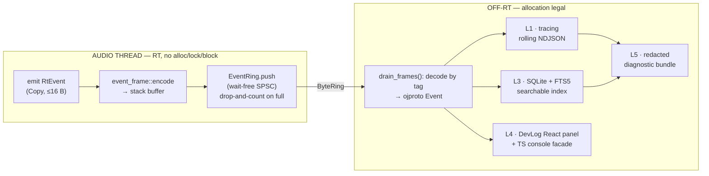
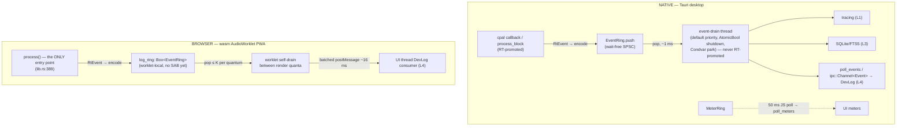
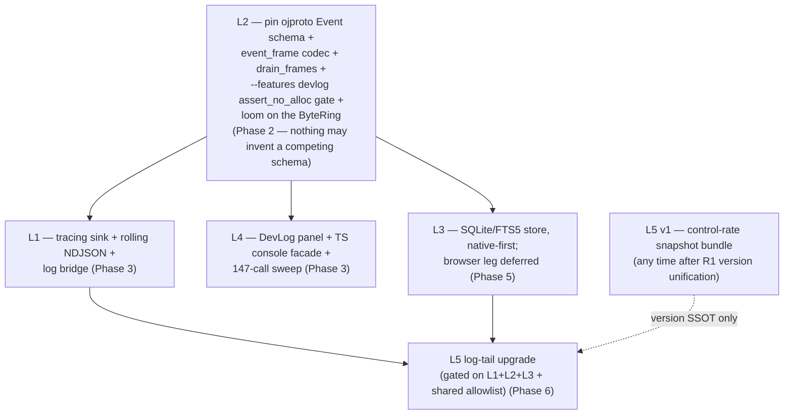

# Logging & On-Device Observability

> **Status:** Decision-final. This section governs how OpenJammer captures, transports, stores, surfaces, and reports diagnostics across both targets — the native Tauri v2.11.2 desktop app and the `wasm32` AudioWorklet PWA — without ever violating the hard real-time audio rule (the audio thread never allocates, locks, or blocks). It implements foundation **F3** ("one event schema + one RT transport primitive") and **F-shared** ("RT-safety invariant + privacy allowlist") from [`00-overview.md`](00-overview.md), and slots into Phases 2–6 of the program roadmap.

> **Note:** Canonical terms used throughout (the `ByteRing` wait-free SPSC transport, the `ojproto` `EventKind` schema, the `event_frame` codec / `drain_frames`, the `wire_shapes.rs` parity gate, the `oj-protocol-ts` TS mirror) are defined once in [`GLOSSARY.md`](GLOSSARY.md). [`00-overview.md`](00-overview.md) is authoritative on any divergence. This plan is authored to render cleanly both as GitHub-flavored markdown and inside the Astro Starlight docs site built by X1 ([`06-documentation-starlight.md`](06-documentation-starlight.md#x1--starlight-prose-hub--linked-out-rustdoc--in-site-typedoc-one-pages-deploy)).

Every decision below is ground-truthed against the current tree. **File map** (cited as `path:line` in the body wherever precision matters):

| Concern | Source of truth (verified) |
|---|---|
| Event/frame schema, `EngineFrame`, `RtCommand` cap | `crates/ojproto/src/lib.rs` (`SCHEMA_VERSION` L18, `EngineFrame` L232, `EngineFrame::Error` L253, `const _: () = assert!(size_of::<RtCommand>() <= 16)` L200) |
| RT byte codec + meter ring | `crates/ojcore/src/meter.rs` (`return_frame` mod L138, `TAG_METER=1` L142 / `TAG_BEAT=2` L144, `pub type MeterRing = ojcore_midiring::ByteRing<8192>` L203) |
| Fault-emission sites (RT) | `crates/ojcore/src/exec.rs` (`over_budget` L387, watchdog `auto_bypass` read L388 → `bypassed[node]=true` L391, master `non_finite` L451, per-node `non_finite` L574, `self.sample_pos` L459, `publish_meters()` L209) |
| RT no-alloc gate | `crates/ojcore/tests/engine.rs` (`static A: AllocDisabler` L27, `assert_no_alloc(\|\| { … })` scopes at L240/L271/L654/L771) |
| Native drain plumbing | `src-tauri/src/engine.rs` (`meter_ring: Arc<MeterRing>` L146, attach on `new()` L200, re-attach on `adopt()` L337, drain `meter_ring.pop` L403) |
| Wasm host | `crates/ojcore-wasm/src/lib.rs` (`struct Host` L158, `cmd_ring` L166 / `midi_ring` L169, init L267–268, `cmd_ring_ptr()` L470 / `cmd_ring_len()` L478, frozen `ring_*_offset()` getters L502–520, `drain_meters() -> Vec<f32>` L567, single entry point `process()` L389) |
| TS mirror | `packages/oj-protocol-ts/src/index.ts` (externally-tagged `RtCommand`/`EngineFrame`, bare-string `PrimitiveKind`) |
| TS consumers | `src/audio/executor/OjcoreNativeExecutor.ts` (`METER_POLL_MS = 50` L69, `setInterval` L171, `pollMeters()` L177, `invoke('poll_meters')` L181), `OjcoreWasmExecutor.ts`, `src/audio/worklets/ojcore-processor.ts` |
| Parity gate | `crates/ojproto/tests/wire_shapes.rs` (`primitive_kind_is_bare_variant_string` L35, `rt_command_external_tagging` L143, `engine_frame_external_tagging` L195) |
| Secret handling | `src-tauri/src/ai.rs` (`stripped_env()` L253, env-var default `OPENJAMMER_PROVIDER_KEY` / override `OPENJAMMER_AI_KEY_VAR` L270–271, test `stripped_env_forwards_only_the_allowlist_plus_key` L439) |

The five decisions form **one pipeline, not five systems**: a single `ojproto` event schema (L2) carried on one `ByteRing` (L2), drained off-RT into four *consumers* — `tracing` (L1), SQLite/FTS5 (L3), the DevLog panel (L4), the diagnostic bundle (L5).



> **Why:** One pipeline, not five. L2 owns the schema and the wire; L1/L3/L4/L5 are pure consumers of the *already-decoded* `Event`. No consumer invents a second taxonomy, a competing crate, a parallel `drain_*`, or a fourth `TAG_*`. This is foundation **F3** made concrete.

## Decisions at a glance

| Decision | Winner | One-line why |
|---|---|---|
| **L1** Real-time-safe logging core | `ByteRing`-of-coded-events → `tracing` (the **off-RT sink**, not a new crate) | Only design provably wait-free on the audio thread; `tracing` fills the structured-logging gap strictly where allocation is legal. |
| **L2** Cross-boundary event schema | `ojproto`-native versioned `Event`/`RtEvent` + `event_frame` codec (**the spine**); reject OpenTelemetry | One schema crosses both targets on the repo's single proven wire-parity seam; OTel is an export framework with no on-device payoff and is std-only on wasm. |
| **L3** On-device store + search | SQLite + FTS5 (`rusqlite` native / `sqlite-wasm` OPFS browser) | One query language and one schema on both targets; true inverted-index needle-in-a-haystack, public-domain, AGPL-clean. |
| **L4** In-app log surface | Dual-target React DevLog panel + one TS console facade | The only surface on both targets that correlates UI state to engine faults in real time via the same panel; identical on desktop and browser. |
| **L5** One-click issue reporter | GitHub Issue Form + on-device redacted diagnostics + native bundle-file | GitHub hosts form/storage/auth/dedup for free; the `upload` form element is the only no-auth cross-target attachment mechanism. |

This table is consistent with the **L1–L4** and **L5** rows of [`00-overview.md`](00-overview.md#decisions-at-a-glance).

---

## L1 — Real-time-safe logging core: `ByteRing` of coded events drained off-thread into `tracing`

### Chosen design

`tracing` is adopted **only as the off-RT structured sink**. There is **no new `ojcore-logring` crate** — the RT codec and schema are owned by L2 (below). L1's deliverable is the consumer half:

- **Dependencies (std crates only):** add to `[workspace.dependencies]`:
  - `tracing = "0.1.41"`, `tracing-subscriber = { version = "0.3.20", features = ["json", "env-filter", "fmt"] }`, `tracing-appender = "0.2.3"`, `tracing-log = "0.2.0"`.
  - These land in `crates/ojcore-native/Cargo.toml` and `src-tauri/Cargo.toml` **only**. They MUST NOT appear in `ojcore`, `ojcore-dsp`, `ojinstrument`, `ojproto`, or `ojcore-wasm` (all `no_std` or wasm-bound). The existing `no_std` build leg (`cargo build -p ojcore --no-default-features`) and the nightly wasm leg (`just wasm`) enforce this boundary for free.
- **Initialization:** a new `crates/ojcore-native/src/log.rs` exposing `init_logging(app_log_dir) -> WorkerGuard`, called once from `src-tauri/src/lib.rs::run()` and from the `loopback`/`render` bin `main()`s:

  ```rust
  // crates/ojcore-native/src/log.rs
  pub fn init_logging(app_log_dir: &std::path::Path) -> tracing_appender::non_blocking::WorkerGuard {
      let file = tracing_appender::rolling::daily(app_log_dir, "openjammer.ndjson");
      let (nb, guard) = tracing_appender::non_blocking(file);
      tracing_subscriber::registry()
          .with(tracing_subscriber::EnvFilter::try_from_env("OJ_LOG")
              .unwrap_or_else(|_| "info".into()))
          .with(tracing_subscriber::fmt::layer().with_writer(std::io::stderr))     // human stderr
          .with(tracing_subscriber::fmt::layer().json().with_writer(nb))           // NDJSON rolling file
          .init();
      tracing_log::LogTracer::init().ok(); // capture transitive `log` from cpal/tauri
      guard // held for process lifetime; dropping it flushes
  }
  ```
- **Feeding the pipeline:** the L2 `drain_frames()` decoder (control side) emits each decoded `Event` into `tracing::event!` with structured fields (`severity`, `kind`, `source`, `corr_id`, `ts`). The decoded `Event` struct and the tracing record share one shape — tracing is a *projection* of the L2 schema, never a second taxonomy.
- **`log` bridge:** `tracing-log::LogTracer` captures cpal/tauri/clack's transitive `log` records so nothing is lost.

### Where the rings live (read before L2)

The `ojcore` core publishes **two** distinct return rings, and the distinction matters for every drain decision below:

| Ring | Definition | Drained how (native) | Drained how (browser) |
|---|---|---|---|
| **Meter ring** (metering) | `pub type MeterRing = ojcore_midiring::ByteRing<8192>` — already exists at `meter.rs:203` | 50 ms JS poll → `poll_meters` IPC (lossy 20 Hz is acceptable for meters) | **No wasm `MeterRing` today** — metering is an allocating `Vec<f32>` pull (`ojcore-wasm/src/lib.rs::drain_meters`, L567) called between `process()` calls |
| **Event ring** (logging) | **new** `pub type EventRing = ojcore_midiring::ByteRing<8192>` defined alongside `MeterRing` in `meter.rs` | dedicated default-priority drain thread at ~1 ms (faults arrive at block rate; lossy polling would overrun the ring) | worklet self-drain between quanta + batched `postMessage` |

> **Note:** The browser worklet has **no shared-memory ring today** (no `+atomics`/`+bulk-memory` SAB build yet). The `EventRing` on the wasm side is a worklet-self-drained ring, **distinct from the native threaded model**. On native, both rings exist and are drained by *different* mechanisms; on browser, only the event ring exists and the meter path is an allocating pull. This asymmetry is the single most important thing to keep in mind for L2.

### Why it is the best compromise

All three explored directions converge on the identical RT mechanism — encode fixed bytes to a stack buffer → one `ByteRing::push` → drop-and-count on full — because that is the only honestly wait-free design here, and it already ships as `meter.rs::publish_meters` (`exec.rs:209`) + `MeterRing` (`meter.rs:203`). The directions only differ off-RT. The compromise keeps the proven in-repo carrier (zero new deps on the RT/`no_std`/wasm path) and grafts `tracing` as the off-RT backbone — the project's missing structured-logging standard — strictly behind the drain. This buys: (1) no new dependency can regress the `assert_no_alloc`/`no_std`/wasm CI legs; (2) the structured-logging gap is filled with the de-facto standard where allocation is fine; (3) one wire format crosses both targets (L2). A schema with no sinks is an incomplete logging story; L1 supplies the off-RT sink.

### Rejected alternatives

- **`tracing` non-blocking as the RT logger.** Refuted by its own analysis: `tracing` macros run all `Layer::on_event` callbacks synchronously on the caller, the fmt layer allocates a `String` per event, and `tracing-appender`'s `non_blocking` only offloads the byte flush — it still **formats on the caller and can block**. It brings nothing to the hard part (the audio thread) and invites the footgun of someone calling `info!` from the cpal callback. We keep only its off-RT asset.
- **Standalone `ojcore-logring` crate with its own `LogEvent` codes.** Functionally identical on the RT path to L2's `event_frame`, so owning a *separate* crate + schema would race L2 for the wire format and split the TS mirror into competing unions. Demoted: the schema lives in `ojproto` and the codec in `meter.rs` (L2); L1 is purely the sink layer.

### Per-platform matrix

| Platform | L1 coverage |
|---|---|
| **Windows** (WASAPI/ASIO) | Full. `tracing-subscriber` JSON + rolling file under `%APPDATA%\openjammer\logs`. Drain at default thread priority — **never RT-promoted**. CI already runs the engine tests on `windows-latest`. |
| **macOS** (CoreAudio, aarch64+x86_64) | Full. NDJSON under `~/Library/Application Support/openjammer`. The cpal callback is RT-promoted via `audio_thread_priority`; the drain path stays at default priority to avoid priority inversion. |
| **Linux** (ALSA/JACK) | Full. NDJSON under `$XDG_DATA_HOME`. Same SCHED_FIFO caveat as macOS. The primary CI host exercises the `no_std` + wasm legs that guard the boundary. |
| **Browser** (wasm32 AudioWorklet) | `tracing-subscriber` is **std-only and cannot run in the worklet**. Browser structured logging is the TS-side logger (L4) fed the L2-decoded records via `postMessage`. Timestamps use the engine sample counter (no worklet wall clock), mapped to wall time on the UI thread via `sampleRate` + stream-start. |

### Adversarial must-fixes folded in

> **Must-fix (critical):** **Footgun prevention.** The engine core (`ojcore`, `ojcore-dsp`) has no `tracing` dependency at all, so `tracing::info!` on the audio thread *cannot compile* there. For the native cpal callback in `ojcore-native`, a CI clippy `disallowed-methods` / grep guard forbids `tracing::*` in `host.rs` render closures and the wasm `process()` fn (`ojcore-wasm/src/lib.rs:389`), backed by the `assert_no_alloc` gate (foundation **F-shared**).

> **Must-fix (high):** **`log` records not lost.** `LogTracer::init()` is mandatory in `init_logging`, capturing cpal/tauri/clack transitive `log` records.

### Risks & mitigations

- **`tracing-subscriber` transitive tree** (sharded-slab, thread_local, regex for `EnvFilter`) adds audit surface and compile time — but only on the two control-plane crates, never the `no_std` engine. Accepted.
- **Subscriber init ordering.** `init_logging` must run before any `tracing` call site and the `WorkerGuard` must outlive the process; it is stored in Tauri managed state.

---

## L2 — Cross-boundary structured event schema (the spine)

### Chosen design

A first-class **versioned `Event` type owned by `ojproto`**, mirrored in `packages/oj-protocol-ts`, gated by `crates/ojproto/tests/wire_shapes.rs`. Two layers.

> **Note:** The wasm side has **no `MeterRing` to mirror** — `ojcore-wasm::drain_meters` (`lib.rs:567`) is an allocating `Vec<f32>` *pull* between `process()` calls, not a ring. The browser `EventRing` is therefore **net-new and independent**: worklets have no shared-memory ring until a SAB build lands, so event drain is self-contained in the worklet between quanta, **not** a separate thread. Read the meter-vs-event ring table in L1 before this section.

**Layer 1 — the contract (binding, do first).**

- In `crates/ojproto/src/lib.rs`, next to `EngineFrame` (declaration begins at `lib.rs:231`, enum body `lib.rs:232`), add:
  ```rust
  pub enum Severity { Trace, Debug, Info, Warn, Error }     // bare-string serde
  pub enum Source   { Engine, Wasm, Ui, Native }
  pub enum FaultKind { NonFinite, OverBudget, AutoBypassed }
  pub enum EventKind {
      Lifecycle, GraphSwap, Xrun { dropped: u32 },
      NodeFault { node: NodeIdx, fault: FaultKind }, RingFull,
      Asset, Plugin, Midi, Collab,
      Message { code: u16, text: String },                 // ONLY String-carrying variant
  }
  pub struct Event { pub v: u16, pub seq: u32, pub severity: Severity,
                     pub kind: EventKind, pub source: Source,
                     pub ts_us: u64, pub corr_id: u64 }
  ```
  Reuse the existing `SCHEMA_VERSION` (`lib.rs:18`, currently `1`) for `v` — no second version axis.
- **RT-safe `Copy` subset** with a compile-time heap guard mirroring the proven `RtCommand` cap at `lib.rs:200`:
  ```rust
  #[derive(Clone, Copy)]
  pub enum RtEvent { Xrun { dropped: u32 },
                     NodeFault { node: NodeIdx, fault: FaultKind }, RingFull }
  const _: () = assert!(core::mem::size_of::<RtEvent>() <= 16); // heap field ⇒ build error
  ```
- **Fold the orphaned `EngineFrame::Error`** (defined at `lib.rs:253` carrying `{ code: u16, message: String }`, and **produced nowhere** — verified: the only constructions are in `wire_shapes.rs:229` and `:253`, both tests) into `EventKind::Message { code, text }` in this same schema bump. Zero producers today = cheapest moment to deprecate.

**Layer 2 — the RT byte codec.** Add `pub mod event_frame` in `crates/ojcore/src/meter.rs`, a sibling to the existing `return_frame` module (`meter.rs:138`), reusing the tag-numbering convention past `TAG_METER=1` (`meter.rs:142`) / `TAG_BEAT=2` (`meter.rs:144`):

```rust
pub mod event_frame {
    use ojproto::{NodeIdx, RtEvent, FaultKind};
    // ONE frame tag for all events, continuing return_frame's TAG_METER=1 / TAG_BEAT=2.
    // The RtEvent variant is an internal 1-byte discriminant in the payload
    // (KIND_XRUN=0, KIND_NODE_FAULT=1, KIND_RING_FULL=2), so the transport tag space
    // stays stable as the RtEvent/EventKind taxonomy grows — the taxonomy lives in the
    // enum, not the tag space. `drain_frames` routes TAG_EVENT -> event_frame::decode.
    pub const TAG_EVENT: u8 = 3;
    pub const MAX_LEN: usize = 1 + 1 + 4 + 1; // tag + kind + node(u32) + faultkind(u8) ≤ existing 13B
    #[inline] pub fn encode(ev: RtEvent, buf: &mut [u8; MAX_LEN]) -> usize { /* tag, kind, fields… */ }
    pub fn decode(bytes: &[u8]) -> Option<RtEvent> { /* read kind, rebuild variant */ }
}
```

Define the new ring alias **alongside** the existing `MeterRing` (`meter.rs:203`):

```rust
// crates/ojcore/src/meter.rs — parallel to `pub type MeterRing = ojcore_midiring::ByteRing<8192>;` (L203)
#[cfg(feature = "std")]
pub type EventRing = ojcore_midiring::ByteRing<8192>; // capacity measured, not assumed — see Open questions
```

**RT producer.** In `crates/ojcore/src/exec.rs`, add `publish_events()` beside `publish_meters` (`exec.rs:209`), encoding the resilience flags the engine *already sets but currently drops silently*:

- `over_budget[node] = true` — `exec.rs:387`, **inside the watchdog `check()` block** (the `w.check()` call is at `exec.rs:385`; this is post-watchdog).
- `auto_bypass` — read from the watchdog at `exec.rs:388`, with the bypass effect `bypassed[node] = true` set at `exec.rs:391`.
- `non_finite` — set per-node in `sanitize_node` at `exec.rs:574`, and for the master node at `exec.rs:451`.

Each record is stamped with the cheap monotonic `self.sample_pos` (advanced at `exec.rs:459`) — no clock syscall on the RT thread.

> **Must-fix (critical):** Use a **separate, larger `EventRing`** (not the meter ring) so a fault storm cannot evict meters; a `dropped: AtomicU64` counter is bumped on a failed push, mirroring the meter publish's drop-on-full behaviour. **Per-`(code, node)` coalescing is mandatory** so a NaN storm collapses to a count rather than filling the ring. Concretely: add to the `Engine` struct in `exec.rs` a fixed-size `event_coalesce: [(u16, u32, u32); N]` (`(event code, node id, count)`), `N = 256` initially (tunable). At emit time, do an O(N) search-and-update keyed on `(code, node)`; on a full table, drop the oldest entry (ring-buffer slot reuse). This is alloc-free and bounds memory regardless of fault volume.

**Control-side decode → `drain_frames`.** Extend the **existing** drain rather than adding parallel `drain_logs`/`drain_events`:

- **Native:** in `src-tauri/src/engine.rs`, add `event_ring: Arc<EventRing>` beside `meter_ring` (`engine.rs:146`). Attach a clone on `new()` (where `attach_meter_ring` runs at `engine.rs:200`) **and on `adopt()`** (re-attach at `engine.rs:337`) via one `attach_all_return_rings(engine)` helper — the meter ring's re-attach already demonstrates this hazard (forgetting it silently drops frames after a hot-swap). Add a `poll_events` Tauri command sibling to the existing `poll_meters` handler.
- **Wasm:** see the browser note below — this is **net-new code**, not a mirror of a nonexistent ring.

**Native drain thread (the resolved contradiction).** The event ring is drained by a dedicated **default-priority** `std` thread, **never** RT-promoted:

- **Where:** spawned in `src-tauri/src/engine.rs` from `EngineBackend::new()` (or an adjacent `spawn_event_drain(event_ring, shutdown)` helper), **after** the `AudioHost` is constructed so the ring is already attached.
- **Cadence:** ~1 ms loop — `pop` a bounded batch from `event_ring`, decode via `event_frame::decode`, forward to the L1 `tracing` sink + the L3 SQLite writer + the L4 channel.
- **Shutdown story:** an `Arc<AtomicBool>` shutdown flag checked each iteration; the thread parks on a `Condvar` (or short `park_timeout`) between drains and is joined on `EngineBackend` drop. No busy-spin.



**TS mirror + parity gate.** Hand-write the `Event`/`Severity`/`EventKind`/`Source`/`FaultKind` unions in `packages/oj-protocol-ts/src/index.ts`, using the **externally-tagged** serde mapping the file already documents for `RtCommand`/`EngineFrame` (e.g. `EventKind::Xrun { dropped }` → `{ "Xrun": { "dropped": 3 } }`) and the **bare-variant string** form for `Severity`/`Source`/`FaultKind` (matching `PrimitiveKind`). Then extend `crates/ojproto/tests/wire_shapes.rs`, mirroring its existing tests:

- `event_external_tagging()` — serialize each `Event` variant, assert the externally-tagged wire shape (parallel to `engine_frame_external_tagging` at `wire_shapes.rs:195`).
- `event_kind_variants()` — assert **every** `EventKind` variant serializes to its expected form (parallel to `primitive_kind_is_bare_variant_string` at `wire_shapes.rs:35`, which already enumerates every variant).
- `event_frame_roundtrips()` — encode→decode round-trip through the `meter.rs` `event_frame` module for each `RtEvent` variant (the internal kind byte distinguishes `Xrun`/`NodeFault`/`RingFull`), plus a `drain_frames` round-trip interleaving `TAG_METER`/`TAG_BEAT`/`TAG_EVENT` frames of differing lengths.

These run inside the existing `cargo test --workspace` on the Linux + Windows jobs and feed the aggregate `gate` job via the C1 control plane (see [`05-github-actions-ci.md`](05-github-actions-ci.md#5-lane-a--the-required-merge-gate-ciyml-per-pr)) — **zero new CI**. `CODEOWNERS` pairs `crates/ojproto` with `packages/oj-protocol-ts` so the `oj-protocol-ts` TS mirror can never drift unreviewed (foundation **F6**). The exact schema source, the hand-written mirror, and the `wire_shapes.rs` parity gate are spelled out in [`09-reference-schemas-and-code.md`](09-reference-schemas-and-code.md#1--the-ojproto-eventkind-schema-rust).

### Why it is the best compromise

The three directions are not competing systems but three altitudes of one. `extend-ojproto-events` is the contract — provably RT-safe (`RtEvent` rides the same `ByteRing` the `assert_no_alloc` gate already validates with metering enabled, in `crates/ojcore/tests/engine.rs`), adds zero dependencies, and reuses the repo's single most battle-tested seam. We take it as the spine, then graft `tracing-json-bridge`'s **sink** (L1) on top. Building the ring *first* (rather than leading with tracing, which secretly depends on it anyway) is the lower-risk sequencing. The `size_of` assert + `assert_no_alloc` gate + `wire_shapes` parity test turn every invariant a community PR could break into a hard CI failure — exactly what a heavily-contributed AGPL RT audio app needs.

### Rejected alternatives

- **OpenTelemetry on-device.** Rejected outright. An *export* framework whose value evaporates on a single-device app (no collector, no Jaeger/Tempo). `opentelemetry-rust` is std-only with documented `wasm32-unknown-unknown` breakage — it cannot enter the `no_std` core or `ojcore-wasm`, making the "unified schema" native-only. `@opentelemetry/sdk-logs` is still experimental; >100 KB JS on an offline-first PWA that exports nothing is dead weight. Its one asset — standardized `trace_id` correlation — is replicated in ~20 lines as the `corr_id` field.
- **`tracing-json-bridge` as the spine.** Its headline ("one logger everywhere") is contradicted by its own finding that `tracing` is not wait-free and falls back to a hand-rolled `ByteRing` — i.e. it silently depends on this very machinery. Leading with it foregrounds the easy 90% and back-loads the load-bearing RT seam. Its sink layer is grafted (L1); its spine claim is declined.

### Per-platform matrix

| Platform | L2 coverage |
|---|---|
| **Windows / macOS / Linux** | Full and symmetric. `event_frame` codec + `publish_events` (behind the existing `std` feature) + the native drain thread + `poll_events` are platform-agnostic Rust over pure atomics; cpal sits below the seam. Both the meter ring and the event ring are hosted concurrently. |
| **Browser** | **Corrected foundation.** There is **no wasm `MeterRing` to mirror** — wasm metering is an *allocating* `Vec<f32>` pull (`ojcore-wasm/src/lib.rs::drain_meters`, L567), called between `process()` calls, never over a ring. The browser event channel is **net-new** (see the integration sketch below). The worklet `process()` (`lib.rs:389`) is the *only* RT entry point; it drains the ring itself **between render quanta** and posts a **batched** `{type:'event'}` message — there is **no second thread** until a `+atomics`/`+bulk-memory` shared-memory wasm build lands (a separately scheduled prerequisite). `assert_no_alloc` is a native-only harness; the wasm RT-emit path is verified by **code review + the native shared-source proof**, not a wasm-executed no-alloc gate. |

**Wasm `EventRing` integration sketch (net-new code):**

- `crates/ojcore-wasm/src/lib.rs`, `struct Host` (`lib.rs:158`): add `log_ring: Box<EventRing>` after `midi_ring` (declared `lib.rs:169`); initialize it `log_ring: Box::new(EventRing::new())` in the `Host { … }` constructor (alongside `cmd_ring`/`midi_ring` at `lib.rs:267–268`). `EventRing` is a `ByteRing<N>` type alias imported from `ojcore_midiring`, exactly as `CmdRing`/`MidiRing` are imported at `lib.rs:53`.
- Add getters mirroring `cmd_ring_ptr()` (`lib.rs:470`) / `cmd_ring_len()` (`lib.rs:478`): `pub fn log_ring_ptr() -> *const u8` and `pub fn log_ring_len() -> u32`. The **frozen** `ring_*_offset()` getters (`lib.rs:502–520`) already serve any `ByteRing<N>` header, so no new offset getters are needed.
- Worklet drain loop: in `crates/ojcore-wasm/src/lib.rs::process()` (`lib.rs:389`), **after** `host.engine.process_block(out, nframes)` (`lib.rs:396`), pop **at most K frames** from `log_ring` into a pre-allocated scratch buffer (never format/stringify) and stage them in a pre-allocated transfer buffer. The TS side (`src/audio/worklets/ojcore-processor.ts`) reads the staged bytes and posts a **batched** `{type:'event', events}` message once per ~16 ms — not per event.

### Adversarial must-fixes folded in

> **Must-fix (critical):** **RT no-alloc proof lands before any consumer.** A dedicated cell `cargo nextest run -p ojcore --features devlog -E 'test(alloc_free)'` attaches **both** the meter ring and the event ring, renders a graph that **deterministically trips `over_budget` + `non_finite` + `auto_bypass` inside the `assert_no_alloc` scope** (the `static A: AllocDisabler` harness in `crates/ojcore/tests/engine.rs:27`, scopes at L240/L271/L654/L771), and is wired as a `needs` into the aggregate `gate` job. A **second** variant does **not** drain inside the scope, proving a full ring is alloc-free and drops are counted (a draining-only test proves the wrong thing). The `size_of::<RtEvent>() <= 16` const-assert makes a heap field a **compile** error.

> **Must-fix (high):** **`assert_no_alloc` runs with the logging feature ON, per-PR.** The new emit sites are feature-gated; running the gate with default features would never exercise them. The `--features devlog` cell is the structural enforcement, feeding the per-PR gate (not nightly-only). This is the **F-shared** invariant from the overview, made concrete here.

> **Must-fix (high):** **Drain-architecture contradiction (meters vs events) resolved.** **Currently:** metering is a 50 ms JS `setInterval` (`OjcoreNativeExecutor.ts:171`, with `METER_POLL_MS = 50` at `OjcoreNativeExecutor.ts:69`, calling `pollMeters()` at `:177` → `invoke('poll_meters')` at `:181`). There is **no control-side drain thread today**. For *metering*, lossy 20 Hz polling is harmless; for *logging* it is not, because the engine can emit faults at block rate (~375 blocks/s @ 48k/128) and a storm overruns an 8 KiB ring between polls. **Decision:** the new event ring requires a faster drain cadence, so add a dedicated **default-priority** (never RT-promoted) control-thread drain at ~1 ms, **decoupled from** the 50 ms UI meter poll, forwarding to L1/L3/L4. Meter polling stays at 50 ms (lossy metering is acceptable); event drain is new, real-time, and feeds the consumers immediately. The cpal callback is already RT-promoted via `audio_thread_priority`, so a contending RT drain would cause priority inversion / xruns — hence default priority. The `EventRing` is sized for the worst-case inter-drain burst, and RT-side per-`(code, node)` coalescing is mandatory. Every platform note that says "drain thread" now matches actual code.

### Risks & mitigations

- **Rust↔TS wire drift / stale code table.** A renumbered table silently mislabels events (a `u16` code ships with no compile error). Mitigation: a frame version byte asserted on decode + the `wire_shapes.rs` parity gate; generate the TS mirror from one source (D1's schemars codegen, see [`04-developer-tooling.md`](04-developer-tooling.md#d1--rust-canonical-schema-codegen--a-deliberately-thin-manifest)) if the variant count grows.
- **`EngineFrame::Error` overlap.** Two failure-reporting paths. Resolved by folding `Error` into `EventKind::Message` in the same bump while it has zero producers (verified: only constructed in `wire_shapes.rs` tests).
- **SPSC-only carrier.** `ByteRing` is strictly single-producer/single-consumer. If OpenJammer ever runs multiple concurrent audio threads, one shared ring is unsound — needs one ring per audio thread merged off-RT. Flag before any multi-thread audio work; matches today's single-callback model.

---

## L3 — On-device log storage + needle-in-a-haystack search

### Chosen design

**SQLite + FTS5 on both targets, one logical schema.**

- **Native:** `rusqlite = { version = "0.40.1", features = ["bundled", "fts5"] }` (statically compiled SQLite 3.53.x). The C toolchain already present for cpal/Tauri satisfies the bundled build on all three OS runners.
- **Browser:** `@sqlite.org/sqlite-wasm` (pinned 3.53.x) in a **dedicated Log Worker** (`src/workers/logWorker.ts`, separate from the AudioWorklet) over the **OpfsSAHPool VFS** (`installOpfsSAHPoolVfs`) — which needs **no COOP/COEP**, so logging persists even on the postMessage fallback path (the same path the meters channel already uses without cross-origin isolation).
- **Single shared schema** published as `pub const SCHEMA_SQL: &str` in `ojproto` (so the Rust and TS sides reference one byte-identical string), consumed by both engines:
  ```sql
  CREATE TABLE logs(id INTEGER PRIMARY KEY, ts_unix_us INTEGER, level INTEGER,
                    target TEXT, thread TEXT, fields TEXT /*JSON*/, msg TEXT);
  CREATE INDEX idx_logs_ts ON logs(ts_unix_us);
  CREATE INDEX idx_logs_level ON logs(level);
  CREATE VIRTUAL TABLE logs_fts USING fts5(msg, target, fields, content='logs', content_rowid='id');
  -- AFTER INSERT/DELETE triggers keep logs_fts in sync (external-content pattern)
  ```
  Its `level`/`target`/`fields`/`msg` columns **mirror the L2 `EventKind` taxonomy** — L3 ingests the **already-decoded** `ojproto` `Event`, it does not define a second model.
- **Schema versioning.** `SCHEMA_SQL` is **v1, immutable**. Breaking schema changes are reserved for a v2 major bump. Within v1, `PRAGMA user_version` is set to `1` at table creation and asserted at init; a mismatch (an older DB on disk) triggers a one-shot rebuild from NDJSON rather than an in-place migration. This keeps the byte-identical-schema parity test (below) meaningful and avoids a migration framework for a diagnostics store whose history is disposable.
- **Native LogWriter:** the **same default-priority event-drain thread from L2** batches the decoded events into one transaction per ~100 ms / N rows into `app_log_dir()/openjammer.sqlite` with `PRAGMA journal_mode=WAL; synchronous=NORMAL; busy_timeout=2000; wal_autocheckpoint`. Two control-rate Tauri commands beside `poll_meters`: `query_logs(filter) -> Vec<LogRow>` and `purge_logs(before_ts)`.
- **Search:** one prepared statement — indexed `WHERE` (ts range, `level >=`, `target =`) `AND logs_fts MATCH ? ORDER BY bm25(logs_fts)`.
- **Unified UI transport:** one TS query-builder, two transports — `invoke('query_logs', filter)` on native, `worker.postMessage` on browser — mirroring the existing `OjcoreNativeExecutor` / `OjcoreWasmExecutor` split.

### Why it is the best compromise

The mandate is "one schema, structured columns + full-text, both targets, no server." Only SQLite+FTS5 satisfies all four with **one query language across both runtimes** (`rusqlite` and `sqlite-wasm` run the same `WHERE … MATCH … bm25` SQL). It is the smallest-surface, most battle-tested embedded engine in existence, public-domain, MIT bindings (AGPL-clean), with WAL crash-recovery — exactly right for diagnosing the crashes you are logging. FTS5 is a true inverted index (ingest-time, sublinear), far beyond grep/LIKE.

### Rejected alternatives

- **Tantivy (native).** Fatally asymmetric: hard-depends on rayon + crossbeam + mmap and **cannot compile** on the single-threaded `wasm32-unknown-unknown -Z build-std` leg. The browser would ship a *different* engine (minisearch/flexsearch) → two codebases, two test suites, permanently divergent ranking. Plus on-disk index-format churn across majors forcing reindex-on-upgrade.
- **NDJSON + DuckDB.** Wrong cost profile: `duckdb` bundled compiles ~50 MB of C++ (slows the Windows CI job, bloats the installer); `@duckdb/duckdb-wasm` adds a multi-MB second WASM to the PWA. `read_json_auto` rescans per query (no ingest-time index). SQLite's WAL file already subsumes NDJSON's durability appeal at a fraction of the weight.

### Per-platform matrix

| Platform | L3 coverage |
|---|---|
| **Windows** | `rusqlite` bundled compiles via MSVC (already used for cpal/Tauri). DB at `app_log_dir()`. WAL on NTFS. |
| **macOS** | Universal (aarch64+x86_64); statically linked, no Homebrew dependency — signed/notarized installers carry their own SQLite. |
| **Linux** | Static link avoids picking up a distro's old `libsqlite3`. WAL on ext4/btrfs. |
| **Browser** | `sqlite-wasm` over OpfsSAHPool in a dedicated Log Worker. **Single-connection limitation** — a second tab fails to open the VFS; elect one log-owner tab via Web Locks / BroadcastChannel or surface "logging disabled in extra tabs." Exclude from Vite `optimizeDeps`; **lazy-load only when the logs panel opens**. `navigator.storage.persist()`. |

### Adversarial must-fixes folded in

> **Must-fix (critical):** **FTS5-availability is a gated test on BOTH builds.** A `CREATE VIRTUAL TABLE … USING fts5` + a `MATCH` query smoke test runs on the native bundled build *and* the wasm/`sqlite-wasm` build, feeding the `gate` job. FTS5-off ("no such module: fts5") is a silent runtime-only failure, so this must block.

> **Must-fix (high):** **Schema-parity test.** A `wire_shapes`-style assertion that both engines accept the byte-identical `SCHEMA_SQL` (catches a missing `fts5` feature pin and divergent tokenizer config that would make native and browser rank differently).

> **Must-fix (medium):** **Log-ring overflow unit test** for drop-and-count behaviour.

> **Must-fix (medium):** **Native-first, reversible.** The browser leg (with its multi-tab OPFS complexity) is **deferred until the large-history-search need is validated**. Native-only is a cheap first increment.

### Risks & mitigations

- **Two-engine version skew** (native 3.53.x vs sqlite-wasm 3.53.x). bm25/tokenizer is stable across patches, but a divergent tokenizer config diverges ranking. Mitigation: single `SCHEMA_SQL` + the byte-identical CREATE test.
- **OPFS quota/eviction** — browser logs are less durable than the native WAL file. Mitigation: `persist()` + bounded retention.
- **Build/bundle cost** — bundled SQLite is ~250k lines of C; `sqlite-wasm` adds ~1 MB + a Worker. Mitigation: `Swatinem/rust-cache` (already in CI) + lazy-load.

---

## L4 — In-app dual-target DevLog panel + one structured TS console facade

### Chosen design

Three layers, shipped in order.

**Layer 1 — one structured TS facade (the actual L4 gap-fill, ships first).** `src/utils/log.ts` (~120 LOC, zero deps): `createLogger(scope) -> {debug,info,warn,error,group,table}`, gated on `localStorage['oj:loglevel']` + `import.meta.env.DEV`. Each call forwards to `console.*` (keeping native devtools / inspector output) **and** appends a normalized `LogEvent {ts, seq, level, scope, msg, fields, corr}` to a Zustand ring-buffer store. Sweep the **147 `console.*` calls across 37 files** (verified by `grep -rhoE 'console\.[a-zA-Z]+' src --include='*.ts' --include='*.tsx'` → 147 occurrences; `grep -rlE` → 37 files) onto it; add an eslint `no-console` rule with a `log.ts` allowlist.

**Layer 2 — the dual-target in-app panel (the spine).**

- `src/store/logStore.ts`: Zustand fixed-capacity ring (10–20k events), mirroring `src/store/uiFeedbackStore.ts` / `src/store/agentSessionStore.ts`.
- `src/components/DevLog/`: a portal overlay toggled with Ctrl/Cmd+Shift+L (copying `CommandBar.tsx`'s `createPortal` pattern), registered as a "Toggle DevLog" command in the existing cmdk palette. Virtualized via `@tanstack/react-virtual@^3.14` (`useFlushSync:false` for React 19), level/scope facet chips with live counts, debounced search, **click-to-correlate on `corr` id** — the one capability the other directions cannot match (matching a UI `noteOn` to its engine voice-allocation / xrun).
- Gated behind `import.meta.env.DEV || VITE_OJ_CANARY` so Vite tree-shakes it from the production PWA.
- A **visible "N dropped" counter** ships day one (the ring drops under load; without it the panel silently lies).

> **Note:** **Reuse principle — engine ingest reuses L2's decoded `Event` stream.** L4 introduces **no** new `TAG_*` and **no** `EngineFrame::Log` variant. It consumes the L2 `Event` stream that the native drain thread / wasm worklet already decoded (already `severity` / `kind` / `source` / `ts_us`). L2 and L4 are **vertically integrated**: L2 is the RT codec + drain (the producer), L4 is the consumer + UI. This prevents a fourth competing schema.

L2-and-L4 transport, made explicit (resolving the apparent L2↔L4 tension):

- **Native:** the L2 event-drain thread forwards each decoded `Event` to the DevLog panel. A `tauri::ipc::Channel<Event>` is **preferred over polling** to reduce latency for the high-frequency stream; a `pollEvents` sibling of the existing 50 ms meter loop is the fallback. (The 50 ms meter `setInterval` at `OjcoreNativeExecutor.ts:171` stays for *meters*; events do **not** ride it.)
- **Browser:** the worklet drains L2 event frames and posts them as a **batched** `{type:'event', events}` message at L2's ~16 ms cadence (one quantum-batched message, **not** per event).

The DevLog panel consumes **both** transports identically via the same TS facade — the native `ipc::Channel`/poll and the browser `postMessage` are normalized into one `Event` stream before they reach the store.

**Layer 3 — persistence + sharing.** A "Copy diagnostic bundle" button (shared with L5); on native, the **NDJSON rolling file is L1's `tracing-appender`** — L4 does **not** configure its own appender. `vite.config.ts build.sourcemap:'hidden'` so webview / inspector stacks resolve to TS.

### Why it is the best compromise

Takes the irreplaceable core of each direction and discards the dead weight: from `in-app-react-panel`, the only genuinely **dual-target** surface + click-to-correlate across the UI↔engine seam; from `external-tui-explorer`, the `tracing` producer + NDJSON persistence (but **not** the ratatui binary, which is native-only and duplicates the panel for 75% of targets); from `browser-devtools-overlay`, the near-free wins (console forwarding, copy-bundle, hidden source maps). Dual-target by construction, RT-safe by reuse of L2's `ByteRing`, production-safe by `import.meta.env.DEV` gating, free-CI-friendly.

### Rejected alternatives

- **External ratatui TUI explorer.** Native-only (the `AudioWorkletGlobalScope` has no `fs`), a whole second product, less discoverable than an always-available in-app panel. Its `tracing` + NDJSON parts are kept (in L1); the TUI is deferred to an optional future decision.
- **Browser DevTools overlay as primary.** Its self-stated fatal gap: native Rust logs and webview JS logs live in two places with no live correlation — exactly the cross-seam capability L4 exists for. No persistence, no structured querying. Its cheap wins are absorbed.

### Per-platform matrix

| Platform | L4 coverage |
|---|---|
| **Windows / macOS / Linux** | Identical React panel; transport is platform-agnostic Tauri IPC (`ipc::Channel<Event>` preferred, `pollEvents` fallback). Inspector fallback = Edge DevTools (WebView2) / WebKitGTK / WebKit. NDJSON via L1's appender under the per-OS app-data dir. |
| **Browser** | Identical panel. Engine-log transport: the worklet drains event frames **between** `process()` calls (`lib.rs:389`) and posts a **batched** message (NOT per-event). No COOP/COEP needed for logs (the meters postMessage channel already works without cross-origin isolation). |

### Adversarial must-fixes folded in

> **Must-fix (critical):** **Browser worklet drain is bounded.** The worklet pops **at most K event frames per `process()` call** (fixed small K), so a flooded ring is drained over several quanta and the per-quantum cost is O(K) constant — never blowing the ~2.6 ms @ 48k/128 budget. **Never format / stringify in the worklet** — only move fixed bytes to a pre-allocated transfer buffer. RT-side per-`(code, node)` coalescing (L2) is mandatory on the wasm path. Documented: the worklet drain is part of the render-thread budget and must be measured (no wasm `assert_no_alloc`).

> **Must-fix (high):** **Main-thread firehose mitigation.** ~16 ms coalescing on the React side + `react-virtual` virtualization are mandatory, not optional.

> **Must-fix (high):** **Sweep governance.** Land `log.ts` + the eslint rule as **warn** first (small PR, grace window so in-flight community PRs aren't red-walled), then sweep call sites **incrementally per-module**, then ratchet `no-console` to **error** once complete. A single 37-file diff is unreviewable for level correctness.

### Risks & mitigations

- **4-way wire-contract surface** (`ojproto`, the `oj-protocol-ts` TS mirror, wasm export, Tauri command). Mitigation: the `wire_shapes.rs` parity gate — without it, it *will* drift.
- **Drop-on-full is lossy under load** exactly when you most want events. Mitigation: the dropped-frame counter ships day one.
- **Correlation-id plumbing** pressures the `size_of::<RtCommand>() <= 16` cap (`lib.rs:200`). Mitigation: `corr_id` is **control-rate only**, never on the RT command ring.

---

## L5 — One-click issue reporter: GitHub Issue Form + redacted on-device diagnostics

### Chosen design

GitHub is the backend (zero infra, AGPL-clean). A redacted **snapshot** v1; the log-tail is a gated upgrade.

1. **`.github/ISSUE_TEMPLATE/bug_report.yml`** (a YAML issue *form*) + `config.yml` (`blank_issues_enabled: false` + a Discussions contact link for non-GitHub musicians). Elements: `input` (summary), `textarea` (repro), a `textarea id:diagnostics render: json` (renders the env block as a fenced code block), an `upload id:bundle` field (the file-attach element GA'd 2025-08-13 — the only free, no-auth, dual-target attachment mechanism), and a **required `checkboxes` consent** ("I reviewed the diagnostics and removed anything private"). Labels `[bug, needs-triage]`.
2. **One shared TS diagnostics generator** `src/utils/diagnostics/` (`bundle.ts` + `redact.ts`), siblings to the existing `src/utils/latencyDiagnostics.ts`. `buildDiagnostics()` assembles from already-published control-rate state: app/build version + git commit (via Vite `define: __OJ_VERSION__/__OJ_COMMIT__`), target/backend, audio metrics (`useAudioStore` — `src/store/audioStore.ts` — sampleRate/baseLatency/outputLatency/classification, **not** raw device labels), `crossOriginIsolated` + `typeof SharedArrayBuffer` (proves the COOP/COEP headers are live and whether the SAB ring or postMessage fallback is active), OS/arch, and on native `await invoke('query_stream') -> StreamInfo {running, sample_rate, channels, buffer_frames, latency_ms}`. The OjGraph control-rate IR (`src/audio/ojgraph/emit.ts`) goes into the attached **bundle file**, not the URL.
3. **Redaction + mandatory human-review preview.** `redact.ts` scrubs home-dir prefixes, provider keys, emails, and LAN collab peer ids/IPs. `ReportIssueModal.tsx` shows the **full redacted text in a default-expanded editable textarea** with the consent checkbox **before any URL opens** — this human review is the real safeguard.
4. **Delivery with a size fork.** After consent: build `…/issues/new?template=bug_report.yml&title=…&diagnostics=<urlencoded>`. Hard-cap the inline block at ~4 KB (well under GitHub's ~8 KB/414 wall). Over cap → clipboard + write `openjammer-diagnostics.json` (Blob on web, `write_bundle` + reveal on native via the already-present `tauri-plugin-opener = "2.5.4"`) and open the URL **without** the diagnostics param, instructing a drag into the `upload` field.
5. **Native enrichment** `src-tauri/src/diagnostics.rs` with one `collect_native_diagnostics()` command (OS/arch/os_version via `tauri-plugin-os@2.3.2` — **not currently a dependency; to be added** — plus a `write_bundle`+reveal helper), registered in the `generate_handler!` list, **gated by `isTauri()`** so the web path never depends on it. Redaction + bundle schema live in the **shared TS module** — one source of redaction truth.

### Why it is the best compromise

The brief's "attach via the GitHub API" does not exist (no REST issue-attachment endpoint). GitHub's `upload` issue-form element is the only free, no-auth, cross-platform attach mechanism, so the form is the spine. The native direction's small Rust command (OS info + on-disk bundle + reveal) is the precise data worth grafting — behind `isTauri()` so it never becomes a web dependency. Redaction lives once in TS, eliminating the two-sources-of-truth drift both rich/thin approaches carry.

### Rejected alternatives

- **Browser gist prefill.** Fatally auth-bound (anonymous gists removed 2018; device-flow CORS-blocked; "paste a PAT" is the opposite of one-click). Storing a `gist`-scoped PAT in browser storage is grotesquely wrong for an app whose highest-value secret is the user's provider key — an XSS would exfiltrate it.
- **Native-only bundle.** Solves half the dual target — the PWA gets no fs-write / OS-plugin / reveal and is first-class, not an afterthought. Its native pieces are grafted as the `isTauri()` upgrade, not the spine.

### Per-platform matrix

| Platform | L5 coverage |
|---|---|
| **Windows** | `query_stream` (WASAPI/ASIO) + `tauri-plugin-os` os_version; scrub `C:\Users\<n>\` + `USERPROFILE`; reveal in Explorer. |
| **macOS** | `query_stream` (CoreAudio, both arches); scrub `/Users/<n>/`; reveal in Finder. |
| **Linux** | `query_stream` (ALSA/JACK); scrub `/home/<n>/`; reveal in file manager. |
| **Browser** | Identical flow minus native enrichment. Capture `crossOriginIsolated` + `typeof SharedArrayBuffer` (a genuinely useful PWA diagnostic), AudioContext latency/sampleRate, `navigator.userAgentData`. Bundle delivered as a Blob download. Watch the GitHub mobile-app prefill bug (#113726) — the clipboard/upload fallback is the always-works path. |

### Adversarial must-fixes folded in

> **Verified:** **Redaction anchor — the harmonization's "ai.rs not found" note is STALE.** `src-tauri/src/ai.rs` **exists** and is the real secret handler: `stripped_env()` (`ai.rs:253`) forwards an allowlist plus a provider key whose env-var name defaults to `OPENJAMMER_PROVIDER_KEY` and is overridable via `OPENJAMMER_AI_KEY_VAR` (`ai.rs:270–271`; e.g. `ANTHROPIC_API_KEY`, `OPENAI_API_KEY`), with a `stripped_env_forwards_only_the_allowlist_plus_key` test (`ai.rs:439`). `redact.ts` pins its key-name denylist to these verified names.

> **Must-fix (critical):** **Single-source redaction module + explicit pattern set.** `src/utils/diagnostics/redact.ts` exports the canonical pattern list, consumed by **both** L5's bundle and L4's `logStore`:
> ```ts
> // src/utils/diagnostics/redact.ts
> export const REDACT_PATTERNS: RegExp[] = [
>   /C:\\Users\\[^\\]+/g,                                   // Windows home
>   /\/Users\/[^/]+/g,                                      // macOS home
>   /\/home\/[^/]+/g,                                       // Linux home
>   /sk-[A-Za-z0-9]+/g,                                     // provider API keys
>   /bearer\s+[A-Za-z0-9\-._~+/]+=*/gi,                     // bearer tokens
>   /[A-Za-z0-9._%+-]+@[A-Za-z0-9.-]+\.[A-Za-z]{2,}/g,      // emails
>   /\b(?:10|127|192\.168|172\.(?:1[6-9]|2\d|3[01]))\.\d{1,3}\.\d{1,3}\b/g, // RFC1918 LAN IPs
> ];
> ```
> A test corpus of known-bad shapes (home paths on all 3 OSes, `sk-`/bearer tokens, emails, RFC1918 LAN IPs, sample filenames embedding usernames) mirrors the `stripped_env` test discipline (`ai.rs:439`). **L5 v1 is gated on this corpus passing** in the web job + `cargo test --workspace`.

> **Must-fix (high):** **Allowlist over denylist for the structured block.** The diagnostics block serializes **only explicitly-allowed fields** (fail-closed); the OjGraph IR is treated as untrusted-for-publication and run through the **path scrub** before it enters the attached bundle (absolute sample-file paths can embed usernames).

> **Must-fix (high):** **TS↔YAML id-contract gate.** A Vitest test parses `bug_report.yml` and asserts every prefilled field id in `diagnostics.ts` exists in the YAML; a CI step validates `bug_report.yml` against the github-issue-forms JSON schema (`bunx ajv`).

> **Must-fix (high):** **Structural privacy guard.** A test asserts every field in the L2 `EventKind` taxonomy is either on the allowlist or explicitly marked redact-required, so a **new** event field cannot silently flow into the public bundle.

### Risks & mitigations

- **Redaction is best-effort** before a **public** repo. The mandatory full-text, default-expanded, editable preview + consent checkbox is the real safeguard; non-developer musicians may click through, so the allowlist (fail-closed) bounds the blast radius.
- **v1 is a snapshot, not a logger.** The log-tail upgrade is **gated on the L1/L2 `Event` schema being pinned** and scrubs the shared field-allowlist. The bundle attaches the SQLite "last 500 rows" (L3) when present, else the L1 NDJSON tail — **one documented fallback order**.
- **Version stamp depends on R1.** `__OJ_VERSION__` forces unifying the verified four-way drift (workspace `0.0.0` / `package.json` `0.1.0-alpha` / `tauri.conf.json` `0.1.0` / `oj-protocol-ts` `0.0.0`); the Vite `define` is the integration point. This is the **F4** Phase-0 prerequisite from the overview.

---

## Cross-cutting foundations honored

These map directly onto [`00-overview.md`](00-overview.md#cross-cutting-foundations--the-things-that-must-be-one) (F3, F4, F-shared).

- **One event channel, one schema.** L2's `ojproto` `Event`/`RtEvent` is the single taxonomy; L1 (`tracing` sink), L3 (SQLite columns), L4 (DevLog panel), and L5 (bundle tail) are all **consumers**. No competing crate or union.
- **One RT transport primitive.** The `ByteRing` wait-free SPSC transport (`ojcore_midiring::ByteRing`) + the `event_frame` codec (`TAG_EVENT=3` past `TAG_METER=1`/`TAG_BEAT=2`; the `RtEvent` variant is an internal payload byte). T4's `loom` model checker verifies *this* ring (see [`01-testing-and-reliability.md`](01-testing-and-reliability.md#t4--reliability-hardening)) — reuse, don't re-verify. `assert_no_alloc` (logging feature ON) guards every RT emit site.
- **One protocol-mirror discipline.** Rust source of truth → the hand-written `oj-protocol-ts` TS mirror → the `wire_shapes.rs` parity gate. `CODEOWNERS` pairs `crates/ojproto` with `packages/oj-protocol-ts`.
- **Two persistence sinks, fed from one decoded `Event`.** NDJSON (L1) is the always-on crash trail; SQLite/FTS5 (L3) is the searchable index. L4 reuses L1's appender (no separate config). L5 attaches SQLite-then-NDJSON.
- **One privacy field-allowlist** (no raw device labels, no LAN peer ids/IPs, no Pi prompts, home-dir prefixes), consumed by both L4's `logStore` and L5's `redact.ts`.

## Sequencing within this section

This is the local view of Phases 2–6 from [`00-overview.md`](00-overview.md#roadmap--phased-sequencing-with-milestones).



1. **L2 first** — pin the `ojproto` `Event` schema + `event_frame` codec + `drain_frames` routing + the `--features devlog` `assert_no_alloc` gate. Run `loom` on the `ByteRing` here. Nothing else may invent a competing schema.
2. **L1 + L4** — attach the off-RT consumers (`tracing` sink + NDJSON; DevLog panel + console facade + the 147-call sweep). Pure consumers of the decoded stream; parallelizable.
3. **L3** — SQLite/FTS5 ingesting the decoded `Event`; native-first, browser leg deferred pending validated large-history-search need.
4. **L5** — v1 snapshot ships any time after the R1 version unification; the log-tail upgrade lands last, gated on L1/L2/L3 + the shared allowlist.

## Open questions / decisions deferred

- **`EventRing` capacity** is initially borrowed from `MeterRing`'s 8192 bytes (`meter.rs:203`) but is **measured, not assumed** — tune from the `dropped` counter once real fault volumes flow, sizing for the worst-case inter-drain burst at the chosen ~1 ms drain cadence.
- **Browser second-thread SAB drain** is impossible until a `+atomics`/`+bulk-memory` shared-memory wasm build lands (a separately scheduled prerequisite that must re-validate the worklet's single-thread `static mut HOST` assumption). Until then the browser contract is **worklet-self-drain + batched postMessage** (~one quantum latency). See open question 1 in the overview.
- **`oj_rt_log!` proc-macro** (auto-assign codes + register format strings) is deferred — ship hand-written `EventKind` variants now; add codegen only if the RT log-site count grows materially.
- **L3 browser leg** is deferred until the large-history-search requirement is validated; native-only SQLite is the cheap, reversible first increment.
- **Standalone `ojlog` ratatui TUI** as a third NDJSON reader is deferred to a future decision, only if a power-user CLI/CI-grep need materializes.
