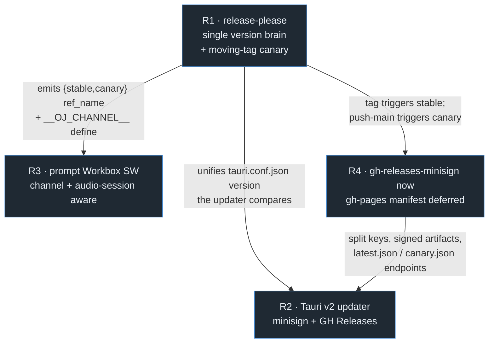
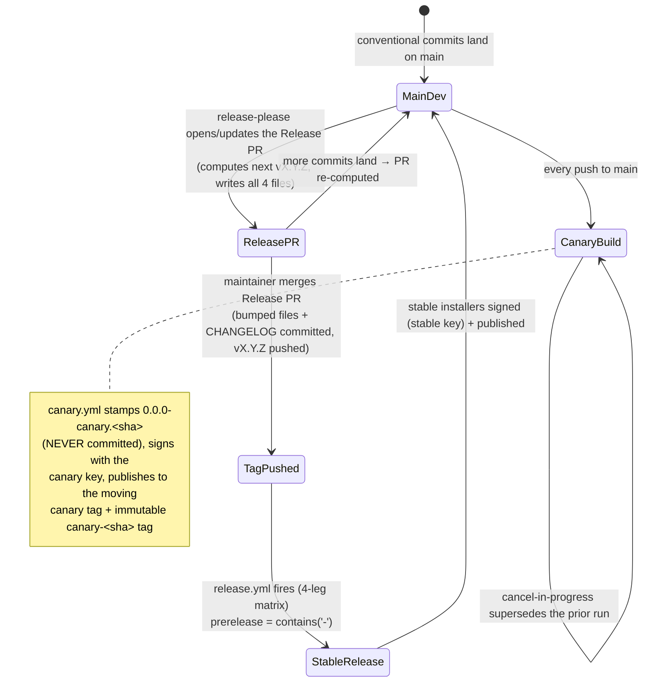
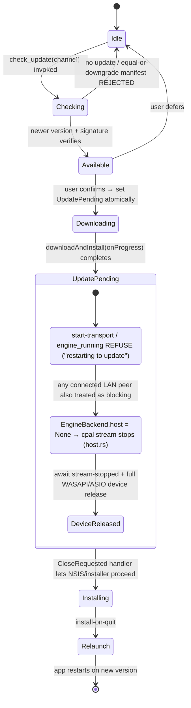
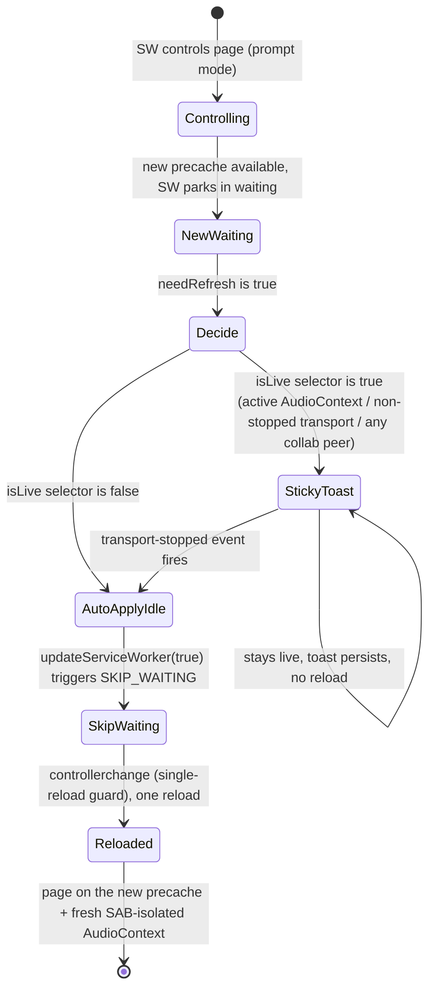
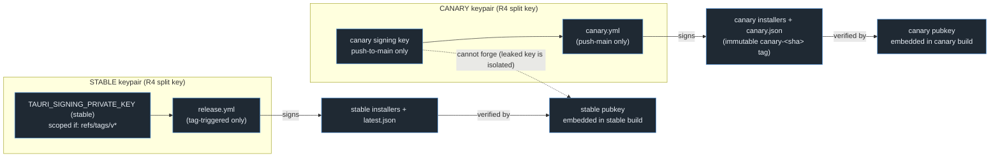
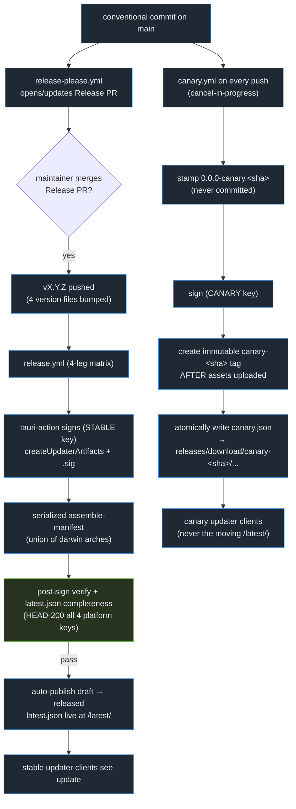

# Release Channels & Auto-Update

This section is **decision-final**. It covers how OpenJammer versions itself, cuts releases, ships a canary line, and auto-updates across native desktop (Tauri v2) and the browser PWA, plus how artifacts are hosted and signed. It resolves decisions **R1–R4** of the foundations program.

Every claim below is grounded in the verified repository state as of commit `9279984`. The current configuration is captured once here so the rest of the document can reference it without re-asserting:

> **Verified:** Current state at commit `9279984`:
> - **The four-way version drift** — `Cargo.toml:9` `version = "0.0.0"` (inherited by all 10 crates of the 10-crate workspace via `version.workspace = true`); `package.json:3` `"0.1.0-alpha"`; `src-tauri/tauri.conf.json:4` `"version": "0.1.0"`; `packages/oj-protocol-ts/package.json:3` `"0.0.0"`. A fifth, hand-hardcoded copy lives in the UI at `src/components/Settings/AboutPanel.tsx:8` (`v0.1.0-alpha`).
> - **Releases** — `.github/workflows/release.yml` fires on `push: tags: ["v*"]` (lines 12–15) and runs a 4-leg matrix (lines 27–39: two macOS arch legs + ubuntu + windows) through `tauri-apps/tauri-action@v0`, with `releaseDraft: true` / `prerelease: false` (lines 86–87). The `tauri-action` step's `env:` carries only `GITHUB_TOKEN` (lines 79–80).
> - **PWA** — `vite.config.ts:9` `registerType: 'autoUpdate'`; `vite.config.ts:39` `globPatterns: ['**/*.{js,css,html,ico,png,svg,woff2}']` (no `wasm`). `src/main.tsx` registers **no** service worker; `src/hooks/usePWA.ts:155 useServiceWorker()` is only re-exported by the `src/hooks/index.ts:8` barrel and consumed by no component.
> - **Native shell** — `src-tauri/src/lib.rs:271` registers only `tauri_plugin_opener::init()`; the `tauri::generate_handler!` list opens at `src-tauri/src/lib.rs:276` and registers **17 registered IPC handlers (16 from `lib.rs` + `ai::ai_run`, registered in `generate_handler!` at `src-tauri/src/lib.rs:277-293`)**, none of which is `check_update`. `src-tauri/tauri.conf.json` has **no** `plugins` block and `app.security.csp: null`. `src-tauri/capabilities/default.json:6` grants `["core:default","core:event:default","opener:default"]`.
> - **Missing artifacts** — no `release-please-config.json`, `.release-please-manifest.json`, `.github/workflows/canary.yml`, `.github/workflows/release-please.yml`, `rust-toolchain.toml`, `vercel.json`/`_headers`, `lefthook.yml`, or `dependabot.yml` exist. Each is a *create-in-Phase-0/1* artifact, flagged inline below.
> - **Governance** — `main` has no branch protection and no required checks today (see [`00-overview.md` Phase 0](00-overview.md#phase-0--foundation-versions-toolchain-governance-security-baseline)).

---

## Decisions at a glance

| Decision | Winner | One-line why |
|---|---|---|
| **R1 — Version brain & channels** | `release-please` (manifest mode) — the single version brain — + decoupled moving-tag canary | One bot writes all four drifting version files in lockstep; a thin `canary.yml` delivers the "builds everything for adventurous users" line without polluting the committed version. |
| **R2 — Native auto-update** | Tauri v2 first-party updater (minisign + GitHub Releases) + audio-safe install gate | Ships inside the already-pinned Tauri 2.11.2 stack, uses Releases as the CDN `release.yml` already populates; channel routing + audio-safe install graft on at near-zero cost. |
| **R3 — Browser PWA auto-update** | Prompt-style Workbox SW, channel-aware, audio-session-safe apply-on-idle | `registerType:'prompt'` keeps the live `AudioContext`/`AudioWorklet` until a deliberate, idle-gated reload; also fixes a shipping offline-audio bug and the dead-SW-registration bug. |
| **R4 — Artifact hosting & signing** | `gh-releases-minisign` now + deferred `gh-pages` per-channel manifest; reject the Cloudflare Worker | Only GitHub's uptime is in the path; per-channel manifests and config-only rollback are a one-URL Phase-2 swap. The Worker's rollout primitive cannot work without a per-machine id. |

> **Note:** These four rows agree verbatim with the **R1–R4** rows of the canonical "Decisions at a glance" table in [`00-overview.md`](00-overview.md#decisions-at-a-glance) (expanded here with the same winners and rationale); [`00-overview.md`](00-overview.md) is authoritative on any divergence.

### Cross-cutting invariants honored throughout

These come from the program's coherence layer ([`00-overview.md` §F4–F6](00-overview.md#f4--one-version-ssot--one-channel-model)) and are restated here so this section is self-complete:

- **One version SSOT** — `release-please` (the single version brain) (R1), seeded from `Cargo.toml [workspace.package].version`. The `oj` Bun CLI `doctor` version-sync is only a consistency **check** (all four files equal), never an independent source — see [`04-developer-tooling.md`](04-developer-tooling.md).
- **One channel model** — exactly the `{stable, canary}` channel model, keyed off `contains(github.ref_name, '-')`.
- **One required CI check** — the aggregate `gate` job; every publish/verify step below is a `needs` dependency feeding `gate`, never an independently-required check.
- **Two signing keypairs** — minisign signing with **split stable/canary keypairs** (R4).
- **Hard rule** — the Tauri updater must **never** point at the moving `canary` tag's `/latest/`.
- **Protocol vs. release version are decoupled** — `CARGO_PKG_VERSION` and the release semver must never enter the wire IR or any audio-thread struct. The wire protocol version is the independent `ojproto` `SCHEMA_VERSION: u16` (`crates/ojproto/src/lib.rs:18`) carried in the `ojproto` `EventKind` schema; it is gated by the `wire_shapes.rs` parity gate against the `oj-protocol-ts` TS mirror (see [`09-reference-schemas-and-code.md`](09-reference-schemas-and-code.md)).

### How the four decisions interlock



---

## R1 — `release-please` as the single version brain + decoupled moving-tag canary

### Verified problem (current state)

Four version sources disagree today, and the drift is load-bearing, not cosmetic:

| File | Line | Current value |
|---|---|---|
| `Cargo.toml` (`[workspace.package].version`, inherited by all 10 crates) | `Cargo.toml:9` | `0.0.0` |
| `package.json` | `package.json:3` | `0.1.0-alpha` |
| `src-tauri/tauri.conf.json` | `tauri.conf.json:4` | `0.1.0` |
| `packages/oj-protocol-ts/package.json` (the `oj-protocol-ts` TS mirror) | `package.json:3` | `0.0.0` |

The Tauri updater (R2) compares the running app's `tauri.conf.json` version against the published manifest, so this drift **directly breaks auto-update**: a `0.0.0` binary against a `0.1.0` manifest produces an infinite update-prompt loop, and a mismatched `tauri.conf.json` can mask a real update. A sixth copy is hand-hardcoded in `src/components/Settings/AboutPanel.tsx:8`; R3 stamps that one at build time instead.

> **Must-fix (critical):** R1 is the **Phase-0 prerequisite** that unblocks R2, R4, and L5. Nothing downstream is trustworthy until the four sources are unified. See [`00-overview.md` §F4](00-overview.md#f4--one-version-ssot--one-channel-model).

### Current state of the configuration

> **Note:** None of the files below exist in the repository at `9279984`. They are **new artifacts created in Phase 0**. `release-please` is the single version brain — but it is *not yet configured*; this subsection is the exact spec for configuring it.

### Chosen design

The single release brain is **`release-please` (the single version brain)** — `googleapis/release-please-action@v4` in manifest mode, with `release-type: simple` and `include-component-in-tag: false` so tags stay plain `vX.Y.Z` to match the existing `release.yml` `v*` trigger. One config writes all four version files in lockstep on every Release-PR merge. (The full, comment-free reference copies of every config file below are collected in [`07-reference-configs.md`](07-reference-configs.md).)

Create `release-please-config.json` (repo root):

```jsonc
// release-please-config.json — NEW FILE, repo root (Phase 0)
{
  "release-type": "simple",
  "include-component-in-tag": false,
  "bootstrap-sha": "9279984",     // current HEAD: ignore the non-conventional legacy history
  "prerelease": false,             // STABLE line; canary versions are stamped at build time, NOT here
  "packages": {
    ".": {
      "changelog-path": "CHANGELOG.md",
      "extra-files": [
        { "type": "toml", "path": "Cargo.toml", "jsonpath": "$.workspace.package.version" },
        { "type": "json", "path": "src-tauri/tauri.conf.json", "jsonpath": "$.version" },
        { "type": "json", "path": "package.json", "jsonpath": "$.version" },
        { "type": "json", "path": "packages/oj-protocol-ts/package.json", "jsonpath": "$.version" }
      ]
    }
  }
}
```

Create `.release-please-manifest.json` (repo root):

```jsonc
// .release-please-manifest.json — NEW FILE, repo root (Phase 0)
{ ".": "0.1.0-alpha.2" }   // seed from the existing tag; next stable cut is 0.1.0
```

In the **same commit**, normalize `package.json:3` from the non-SemVer `0.1.0-alpha` to `0.1.0-alpha.2` so all four sources start aligned (release-please's `extra-files` updater requires a parseable SemVer seed).

Create `.github/workflows/release-please.yml`:

```yaml
# .github/workflows/release-please.yml — NEW FILE (Phase 0)
on: { push: { branches: [main] } }
permissions: { contents: write, pull-requests: write }
jobs:
  release-please:
    runs-on: ubuntu-latest
    steps:
      - uses: googleapis/release-please-action@<pinned-sha>   # SHA-pinned — see R4
        with: { token: ${{ secrets.GITHUB_TOKEN }} }
```

#### Stable line

`main` is always-cuttable. Merging the Release PR commits the bumped files + `CHANGELOG.md` and pushes `vX.Y.Z`, firing the existing 4-leg `release.yml` matrix verbatim. The single edit to the existing `release.yml` makes `prerelease` dynamic:

```yaml
# release.yml:87 — change `prerelease: false` to:
prerelease: ${{ contains(github.ref_name, '-') }}
```

#### Canary line

Create `.github/workflows/canary.yml`:

```yaml
# .github/workflows/canary.yml — NEW FILE (Phase 1, wired alongside C1's CI control plane)
on: { push: { branches: [main] } }
concurrency: { group: canary, cancel-in-progress: true }
# clones release.yml's 4-leg matrix (macOS aarch64 + x86_64, ubuntu, windows) + a wasm/PWA leg
```

It clones the `release.yml` matrix plus a wasm/PWA leg, stamps a throwaway build-time version `0.0.0-canary.<shortsha>` into `tauri.conf.json` via a pre-build step (**never committed**), and publishes to a single force-moved `canary` prerelease tag (`tauri-action` `tagName: canary`, `prerelease: true`, `releaseDraft: false`). This is the decoupling that avoids Release-PR churn: canary's high cadence never touches `release-please`'s per-merge version computation.

> **Note:** `canary.yml` is wired in Phase 1 alongside C1's reusable-workflow CI control plane (the `{stable, canary}` channel model lives in C1's Lane B — see [`05-github-actions-ci.md`](05-github-actions-ci.md); the full workflow body is in [`08-reference-ci-workflows.md`](08-reference-ci-workflows.md)). Its deploy step for the wasm/PWA leg is added once R3's header-capable host is chosen — see [Cross-cutting prerequisites](#cross-cutting-prerequisites--sequencing-for-this-section).

#### Enforcement

Create `.github/workflows/semantic-pr-lint.yml`:

```yaml
# .github/workflows/semantic-pr-lint.yml — NEW FILE (Phase 1)
on:
  pull_request_target:
    types: [opened, edited, synchronize]   # title changes must re-lint
permissions: { pull-requests: write }       # to post the advisory sticky comment
jobs:
  lint-pr-title:
    runs-on: ubuntu-latest
    steps:
      - uses: amannn/action-semantic-pull-request@<pinned-sha>   # SHA-pinned — see R4
        env: { GITHUB_TOKEN: ${{ secrets.GITHUB_TOKEN }} }
```

This lints the **squash-merge PR title** — the only commit `release-please` reads — on every PR (not only Release PRs). `CONTRIBUTING.md:72–82` already documents conventional commits (`git commit -m "feat: add amazing feature"` and "Use conventional commit messages"), but the existing history violates them; without this gate `release-please` silently under-bumps and the Release PR stalls.

> **Note:** It starts **advisory** (a sticky comment showing the corrected title + a PR template prefilling prefixes), and is promoted to **blocking** only after `CONTRIBUTING.md` is corrected in Phase 1. See the must-fix below.

### Version/channel state model



### Why this is the best compromise

The user requirement has two halves — "a canary/prerelease line that builds everything for adventurous users" and "stable releases cut to main." Pure `release-please` nails version unification and stable-cut-from-main (its single greatest value is ending the verified four-file drift) but its prerelease mode only emits `-alpha.N` **tags**; it does not continuously build all platforms per merge. The trunk moving-tag approach delivers exactly that continuous all-platform build but leaves version drift load-bearing. The hybrid takes the right half of each: `release-please` owns committed versions + stable provenance; a thin standalone `canary.yml` owns continuous adventurous-user delivery with a build-time version that never pollutes the SSOT. Coupling the two would create constant Release-PR churn and prerelease↔stable fumbling — decoupling removes that. Both halves are 100% free GitHub Actions, reuse the proven `tauri-action` matrix, and have zero audio-thread impact.

### Rejected alternatives

- **Pure `release-please` / changesets** — the backbone of the hybrid, but insufficient alone: it gives no continuous, per-merge, all-platform build for adventurous users.
- **Pure trunk-release-branches** — its moving-tag canary build *is* adopted, but as a standalone winner it leaves the four-file drift unsolved and proposes a hand-rolled `version-sync.ts`, strictly inferior to `release-please`'s declarative `extra-files` lockstep updater.
- **Three-channel-with-updater-feeds** — `effort: high`, roughly half its work is greenfield web/updater infra belonging to R3/R4, and it over-engineers a single-maintainer project. The 2-tier hybrid grows into it later without rework.

### Per-platform matrix

> **Note:** The following is the **planned** build matrix for the existing `release.yml` (stable) and the new `canary.yml` (canary, created in Phase 1). The stable column reflects the verified `release.yml` at `9279984`; the canary column is a forward-looking projection of `canary.yml`.

| Platform | Stable (`release.yml`, verified) | Canary (`canary.yml`, planned) |
|---|---|---|
| **Windows** | `windows-latest` leg builds `.msi`/`.exe` from `tauri.conf.json` version (kept correct by release-please). | Cloned `windows-latest` leg → moving `canary` prerelease. |
| **macOS** | Dual-arch split (`release.yml:28–33`, `aarch64` + `x86_64`) reused verbatim; correctly-named `.app`/`.dmg` per arch. | Both legs → `canary`. |
| **Linux** | `ubuntu-latest` leg with webview deps (`release.yml:45–56`) → `.deb`/`.AppImage`. | Reused for `canary`. The release-please bot itself runs on `ubuntu-latest`. |
| **Browser** | release-please unifies the PWA version string (`package.json`) so Vite / `vite-plugin-pwa` / `AboutPanel` agree; `ojcore-wasm` inherits the workspace version. | `canary.yml` wasm leg **builds** `dist/` and uploads it as an artifact (proving the build); **deploy** is owned by R3's host decision. |

### Adversarial must-fixes folded in

- **Three-way version-equality release gate.** A new step (a `needs` dependency feeding the aggregate `gate`) asserts `built-binary env!("CARGO_PKG_VERSION") == github.ref_name (sans 'v') == tauri.conf.json $.version`; the release **fails** on any mismatch, so a `0.0.0` binary can never ship and cause the infinite update-prompt loop.
- **TOML jsonpath dry-run proof gate (Phase 0, before trusting CI).** Run `npx release-please release-pr --dry-run` and assert `$.workspace.package.version` writes **only** `Cargo.toml:9` and does not touch `[profile.release]` or any other field (the root `Cargo.toml` has no top-level `version`, only `[workspace.package]` at lines 7–10, so this is expected-safe but must be proven). A unit test asserts `env!("CARGO_PKG_VERSION")` (resolved from the workspace inherit) equals the `tauri.conf.json` version at build time.
- **Draft-vs-publish trap resolved** (cross-references R2/R4 — see [R4 "Publish model"](#risks--mitigations-3)). `releaseDraft: true` (`release.yml:86`) + the updater's `/latest/` endpoint means `main` produces *drafts* the updater cannot see. Resolution: keep drafts for review, but add a `release: { types: [published] }`-triggered job, **and** make the draft auto-publish (`gh release edit <tag> --draft=false`) **only after** the R4 four-platform-key + signature-verify gates pass. This makes "always-releasable main" honest and bounds the dark window.
- **PR-title lint starts advisory.** Ship the semantic-PR check as advisory-with-guidance first (sticky comment showing the corrected title + a PR template prefilling prefixes); promote to **blocking** only after `CONTRIBUTING.md` is corrected in Phase 1. A CI dry-run prints the computed next version on every PR so under-bumps are visible before merge.

### Risks & mitigations

| Risk | Mitigation |
|---|---|
| Nested TOML jsonpath writes the wrong field | Step-0 dry-run gate + three-way equality release gate. |
| Non-conventional PR title silently stalls the Release PR | `action-semantic-pull-request` (advisory → blocking) + dry-run version print on every PR. |
| Free-runner minute pressure (4-leg matrix on every main push) | `cancel-in-progress` concurrency on `canary.yml`; if it bites, gate the full matrix behind a label/schedule and keep fast checks per-push. |
| `Cargo.lock` drift between bump-merge and next build | Self-heals on the CI build on push to main; optionally `cargo update --workspace` in the Release PR for reproducible-build purists. |
| Hand-editing the manifest desyncs the next version | The Release PR is reviewable before any tag is cut. |

---

## R2 — Native desktop auto-update: Tauri v2 first-party updater

### Current state of the configuration

> **Note:** Today, `src-tauri/Cargo.toml` does **not** depend on the updater or process plugins, `src-tauri/src/lib.rs:271` registers **only** `tauri_plugin_opener::init()`, `src-tauri/capabilities/default.json:6` grants only `["core:default","core:event:default","opener:default"]`, and `src-tauri/tauri.conf.json` has **no** `plugins` block. Everything in this section's "Chosen design" is a **Phase-0/Phase-5 addition**, marked inline per file.

### Chosen design

Adopt the Tauri v2 first-party updater: **`tauri-plugin-updater` pinned `~2.10`** (the version floor that introduces the `{os}-{arch}-{installer}` `latest.json` keys the dual-arch macOS manifest depends on) + `@tauri-apps/plugin-updater` (2.10.x) + `tauri-plugin-process`. Do **not** build a custom updater; do **not** adopt Velopack. Graft in the two genuinely valuable ideas the custom direction surfaced: runtime channel routing and an audio-thread-safe install gate.

Add the desktop-gated dependencies (so the `wasm32` browser build is untouched):

```toml
# src-tauri/Cargo.toml — NEW desktop-gated dependencies (Phase 0)
[target.'cfg(any(target_os = "macos", windows, target_os = "linux"))'.dependencies]
tauri-plugin-updater = "~2.10"   # floor: the {os}-{arch}-{installer} latest.json keys land in 2.10
tauri-plugin-process = "2"
```

Register the plugins beside the existing opener plugin:

```rust
// src-tauri/src/lib.rs — beside tauri_plugin_opener::init() at src-tauri/src/lib.rs:271 (Phase 0)
tauri::Builder::default()
    .plugin(tauri_plugin_opener::init())
    .plugin(tauri_plugin_updater::Builder::new().build())  // #[cfg(desktop)]
    .plugin(tauri_plugin_process::init())                  // #[cfg(desktop)]
```

Extend the capability permissions:

```jsonc
// src-tauri/capabilities/default.json:6 — currently ["core:default","core:event:default","opener:default"]
"permissions": ["core:default","core:event:default","opener:default",
                "updater:default","process:default"]
```

Add the bundle flag and the new `plugins` block (none exists today):

```jsonc
// src-tauri/tauri.conf.json — NEW createUpdaterArtifacts flag + NEW plugins block (Phase 0)
"bundle": { "active": true, "targets": "all", "createUpdaterArtifacts": true /* …existing keys… */ },
"plugins": {
  "updater": {
    "pubkey": "<inline minisign ed25519 STABLE pubkey>",
    "endpoints": ["https://github.com/PonderingBGI/openjammer/releases/latest/download/latest.json"],
    "windows": { "installMode": "passive" }
  }
}
```

#### Channel selection — runtime, never hardcoded

Add a `#[tauri::command] check_update(channel)` to the `tauri::generate_handler!` list (the **17 registered IPC handlers (16 from `lib.rs` + `ai::ai_run`, registered in `generate_handler!` at `src-tauri/src/lib.rs:277-293`)** — opening at `src-tauri/src/lib.rs:276` and ending at `set_mic` on `src-tauri/src/lib.rs:293`, none of which is `check_update`). It builds per-channel endpoints at runtime:

```rust
// src-tauri/src/lib.rs — NEW #[tauri::command], added to the generate_handler! list at src-tauri/src/lib.rs:276
let url = match channel.as_str() {
    "canary" => "https://github.com/.../releases/download/canary-<immutable-shortsha>/canary.json", // see R4
    _        => "https://github.com/.../releases/latest/download/latest.json",
};
app.updater_builder().endpoints(vec![url])?.build()?.check()
```

Stable → `releases/latest/download/latest.json`; canary → the **fixed immutable per-build tag** asset (never the moving `canary` `/latest/` — the coherence hard rule). Channel choice persists in the existing Zustand store under `src/`.

#### Frontend

A thin TS module under `src/` (mirroring the existing `src/ai/PiAgentBackend.ts` backend-shim pattern) using `check()` / `downloadAndInstall(onProgress)` / `relaunch()`, surfacing a **sonner** toast (already a dependency, `package.json:43`): "Update vX available → Restart to update."

#### CI

Add `TAURI_SIGNING_PRIVATE_KEY` + `TAURI_SIGNING_PRIVATE_KEY_PASSWORD` to the `env:` of the existing `tauri-action@v0` step (`release.yml:79–80`, today only `GITHUB_TOKEN`). `tauri-action` then auto-signs artifacts and emits `latest.json`.

> **Must-fix (critical):** Key generation and storage are owned by **R4**, with full procedures in [`KEY-MANAGEMENT.md`](KEY-MANAGEMENT.md). The *stable* signing key (`TAURI_SIGNING_PRIVATE_KEY` + `TAURI_SIGNING_PRIVATE_KEY_PASSWORD`) is added to GitHub secrets and scoped to the tag-triggered `release.yml` **only** (`if: startsWith(github.ref, 'refs/tags/v')`); `canary.yml` uses a *separate* canary keypair (`TAURI_SIGNING_PRIVATE_KEY_CANARY` + `TAURI_SIGNING_PRIVATE_KEY_PASSWORD_CANARY`). minisign signing uses **split stable/canary keypairs** — a leaked canary key cannot forge a stable update. See [R4 must-fixes](#adversarial-must-fixes-folded-in-3).

### Native auto-update state machine



### Why this is the best compromise

For an AGPL OSS, dual-target, hard-real-time app on free infrastructure with limited maintainers, the criterion weights reliability, low maintenance surface, and zero new infrastructure above feature maximalism. The first-party updater ships inside the already-pinned Tauri 2.11.2 stack, uses GitHub Releases as the CDN `release.yml` already populates, and is the path the scaffold anticipated (the present-but-unconfigured updater is the named gap). The two real advantages the custom direction claimed — channel routing and an audio-safe shutdown — graft on at near-zero cost (`updater_builder().endpoints()` + a `check_update` command that drops the `AudioHost`). The hybrid captures those wins while shedding the catastrophic cost of re-owning a remote-code-execution-grade signature/download/per-OS-install path.

### Rejected alternatives

- **Velopack** — highest cost; it *replaces* Tauri's bundler with a Squirrel-style `%LocalAppData%/current/` + `Update.exe` layout that collides with the MSI/NSIS/DMG artifacts `release.yml` produces, hard-requires the .NET 8 SDK on every runner, and its macOS/Linux self-update legs are less battle-tested on CoreAudio / ALSA-JACK. Its delta-update advantage is neutralized more cheaply by moving large SF2/sample assets out of the bundle.
- **Custom static manifest updater** — re-owns a fetch-verify-execute path plus three hand-rolled per-OS install flows for an OSS project with limited maintainers, where a single verification bug ships an unrecallable broken updater.

### Per-platform matrix

| Platform | Native auto-update status |
|---|---|
| **Windows** | NSIS + MSI updater with `installMode: "passive"`. Installer force-exits to install → "install on quit" fires from a Tauri `CloseRequested` handler. WASAPI/ASIO audio unaffected (the updater is UI-thread only). **Without a paid Authenticode cert, SmartScreen shows "unknown publisher."** |
| **macOS** | **Auto-update is non-functional without an Apple Developer ID ($99/yr) + notarization** — minisign verifies the *payload*, but Gatekeeper quarantines the *swapped* `.app` so it will not launch. The updater is **`cfg`-gated OFF on macOS** (`cfg(target_os = "macos")`) in **Phase 5**, unless the Developer ID + notarization is acquired first; until then `.dmg` downloads with right-click-open instructions are the only update path. `release.yml` builds both arches as separate legs → `latest.json` must carry `darwin-aarch64` **and** `darwin-x86_64` (see R4 merge fix). |
| **Linux** | **AppImage is the only clean self-update path.** Gate the updater on `std::env::var("APPIMAGE").is_ok()`; for `.deb`/`.rpm` installs (which `bundle.targets: "all"` also produces) suppress the prompt and surface "update via your package manager." Ship AppImage as the only auto-updating Linux artifact. ALSA/JACK audio unaffected. |
| **Browser** | Out of scope — the updater is `cfg`-gated off the `wasm32` target. The PWA updates via R3. The only shared artifact is the version string. |

### Adversarial must-fixes folded in

- **Audio-safe install is a locked-out STATE, not a one-shot check.** The plugin's only Windows wart is force-exiting out from under a live cpal stream. A one-shot `engine_running()` check has a TOCTOU window: a user or LAN peer can re-arm transport between the check and the installer force-exit. The resolution is an `update_pending` flag on the managed state behind `tauri::State<'_, BackendState>` (used by every command in `src-tauri/src/lib.rs`). Today that managed state is the newtype `pub struct BackendState(pub Mutex<EngineBackend>)` (`src-tauri/src/engine.rs:629`); the `host: Option<AudioHost>` field already lives inside `EngineBackend` (`src-tauri/src/engine.rs:131`). This is **Phase-5 work**, adding the flag to `EngineBackend` alongside the existing `host`:

  > **Verified:** `BackendState` is a newtype wrapping `Mutex<EngineBackend>` (`src-tauri/src/engine.rs:629`); `EngineBackend.host: Option<AudioHost>` is at `src-tauri/src/engine.rs:131`. The new flag is added to `EngineBackend`, not to a record-style `BackendState`.

  ```rust
  // src-tauri/src/engine.rs — Phase-5 addition to EngineBackend (wrapped by BackendState(Mutex<EngineBackend>))
  pub struct EngineBackend {
      pub update_pending: bool,          // NEW — set atomically on confirm
      host: Option<AudioHost>,           // existing field; teardown sets this to None (engine.rs:131)
      // …existing fields…
  }
  ```

  The flag:
  1. is set atomically (under the `BackendState` `Mutex`) when the user confirms install;
  2. causes `engine_running` / start-transport commands to **refuse** with "restarting to update";
  3. treats **any** connected LAN-collab peer as blocking (mirroring R3's conservative is-live selector — relaunching one peer mid-take desyncs the whole session);
  4. **deterministically tears down the `AudioHost`** (set `EngineBackend.host = None`, stopping the cpal stream per `crates/ojcore-native/src/host.rs`) and **awaits stream-stopped confirmation** — never relying on the installer's force-exit to stop audio. On Windows specifically, await full WASAPI/ASIO device release before the `CloseRequested` handler lets NSIS proceed (a dropped-but-not-released exclusive-mode ASIO device can leave the driver in a bad state across restart). "Never relaunch with a live RT stream" is an invariant documented on X1's Real-Time Safety page (see [`06-documentation-starlight.md`](06-documentation-starlight.md)).
- **Updater correctness has real automated tests** (Linux AppImage, the friction-free target, feeding the aggregate `gate`): build vN and vN+1, point a test endpoint at the vN+1 manifest, assert vN **detects + signature-verifies + applies**, and assert a **downgrade/equal** manifest is **rejected**. A unit test for the audio-safe gate mocks `engine_running() == true` and asserts `check_update`/install **refuses/defers** and that `host` is `None` before `relaunch` is called. (Manifest-*shape* checks alone — the only thing previously specified — verify the wrong property.)
- **macOS dual-arch URL correctness** — the test asserts the published `latest.json` `darwin-aarch64` and `darwin-x86_64` URLs point at *different, arch-correct* assets, not merely that both keys exist.

### Risks & mitigations

| Risk | Mitigation |
|---|---|
| macOS Gatekeeper bricks the un-notarized in-place swap | `cfg`-gate the updater off on macOS; manual `.dmg` until the Apple Developer ID is acquired (an owned prerequisite — see [Open questions](#open-questions--decisions-deferred)). |
| Windows SmartScreen on canary throttles the feedback loop | Pursue **SignPath Foundation** (free OV for verified OSS) — the application has lead time, start immediately; document "More info → Run anyway" in canary notes meanwhile. |
| `.deb`/`.rpm` users prompted for a swap that fights `apt`/`dnf` | Runtime `APPIMAGE` env-var gate disables the updater for package-managed installs. |
| Channel `latest.json` rename overwrites the stable manifest | Fully separate canary workflow + a distinct immutable tag (R4). |
| No delta updates → full multi-tens-of-MB downloads | Move large SF2/sample assets out of the bundle, fetch + cache on first run. |

---

## R3 — Browser PWA auto-update: prompt-style Workbox SW

### Chosen design

Adopt the **prompt-style Workbox** approach as the spine, grafting in atomic-precache integrity (auto-apply-on-idle) and a build-time channel constant. The single load-bearing change is `vite.config.ts:9`:

```diff
- registerType: 'autoUpdate',
+ registerType: 'prompt',
```

`autoUpdate` forces `skipWaiting + clientsClaim`, seizing the live tab — the exact hard-refresh surprise this decision forbids. `prompt` parks the new SW in `waiting` and hands timing to the app.

> **Must-fix (high):** Moving from `autoUpdate` to `prompt` is a **breaking change** to the SW lifecycle: updates are **no longer applied silently**; the app must explicitly call `updateServiceWorker()` (or auto-apply via the idle-gated `isLive` selector below). Every consumer that previously assumed silent next-load convergence must now route through the audio-session-safe apply path. This is *why* the apply logic later in this section exists; it is load-bearing, not incidental.

Verified bug fixes shipped in the same change:

1. **Offline-audio bug** — `vite.config.ts:39` `globPatterns` lacks `wasm`, so the committed `ojcore_wasm_bg.wasm` (imported via `?url` at `src/audio/executor/OjcoreWasmExecutor.ts:54` — `import ojcoreWasmUrl from '../wasm/pkg/ojcore_wasm_bg.wasm?url';`) is **not precached**, and offline audio silently breaks. The fix:

   ```jsonc
   // vite.config.ts:39 — add `wasm` to the precache glob
   globPatterns: ['**/*.{js,css,html,ico,png,svg,woff2,wasm}'],
   ```

   Verify the built `sw` precache manifest lists the hashed wasm after `bun run build`.
2. **Dead SW registration** — `src/main.tsx` never registers a SW, and `src/hooks/usePWA.ts:155 useServiceWorker()` is dead code: it is only re-exported by the `src/hooks/index.ts:8` barrel and **consumed by no component** (verified — no component imports it), and it listens to an `onNeedRefresh` that the current `autoUpdate` config never fires. Migrate to the React variant `virtual:pwa-register/react`:

   ```ts
   // a new small component under src/, replacing the dead usePWA.ts useServiceWorker()
   import { useRegisterSW } from 'virtual:pwa-register/react'
   const { needRefresh, updateServiceWorker } = useRegisterSW({
     onRegisteredSW(_swUrl, r) { r && setInterval(() => r.update(), 3_600_000) }  // hourly update check
   })
   ```

   and consume `needRefresh` / `updateServiceWorker` in the audio-session-safe apply path below.
3. **Channel constant** — a Vite `define` `__OJ_CHANNEL__` prefixing Workbox `cacheNames`, so a canary deploy can never serve stable clients new code. It **defaults to `'stable'`** and is overridden by the `canary.yml` build job via a `--define` Vite flag (`--define:__OJ_CHANNEL__='"canary"'`) when building canary — i.e. the source is the build context (the `{stable, canary}` channel model), not a git tag read at runtime. Stamp the same constant + git SHA into `src/components/Settings/AboutPanel.tsx` (replacing the hardcoded `v0.1.0-alpha` at `AboutPanel.tsx:8`).

#### Audio-session-safe apply

A Zustand selector exposes `isLive` / `hasActiveSession` reflecting the `OjcoreWasmExecutor` transport (AudioWorkletNode + AudioContext) and LAN-collab peer state. The `updateServiceWorker(true)` / `SKIP_WAITING` call **must not** fire while live (a reload destroys the AudioContext). When `needRefresh && idle` → auto-apply (the silent-convergence graft); when `needRefresh && live` → keep a sticky **sonner** toast and auto-apply on the next transport-stopped event. Use `workbox-window`'s single-reload guard on `controllerchange` to avoid loops. Stay on `generateSW` (no hand-written `sw.ts`).

### PWA update lifecycle with audio-session awareness



### Why this is the best compromise

All three directions share the spine (`vite-plugin-pwa@^1.2.0` + `workbox-window@^7.4.0`, both already installed — `package.json:45` and `package.json:47`) and one root cause (the misconfigured `autoUpdate`). The real disagreement is UX policy. The prompt flow is the only one that directly delivers "latest of their chosen channel without a hard-refresh surprise": pure silent-next-load leaves a long-lived installed PWA / pinned tab (a performer who never closes the app) stale forever; pure `autoUpdate` breaks mid-session. The hybrid takes the prompt skeleton (controllable timing = audio-session safety) plus silent-next-load's atomic precache and a *gated* auto-apply-on-idle so convergence is guaranteed without yanking the AudioContext. The channel constant is a cheap build-time define, not channel-aware-pwa's COI-compromised GitHub Pages subpath topology.

### Rejected alternatives

- **versioned-cache-silent** — structurally fails the "always end up on latest" clause for installed PWAs / pinned tabs; its atomic-precache mechanic and apply-on-idle instinct are *grafted in* as a gated path on top of a prompt.
- **channel-aware-pwa (Pages subpaths + SW-injected COOP/COEP)** — GitHub Pages cannot emit COOP/COEP natively, so COOP/COEP cross-origin isolation would depend on the SW already controlling the page; the literal first load (and first load after any cache purge, common on iOS) is **not** isolated, `crossOriginIsolated === false`, and the engine silently drops from the `ByteRing` wait-free SPSC transport's SAB fast path to the ~15–25 ms `postMessage` path. "Sometimes low-latency, sometimes not" is exactly the unreliability a hard-real-time app must not ship. Its premise is moot anyway: `vite.config.ts:121–127` already names Vercel/Netlify/nginx as the header-capable target.

### Per-platform matrix

| Platform | PWA coverage |
|---|---|
| **Windows (browser)** | Full — SAB fast path available with COOP/COEP from the host. Native Tauri uses R2 (no SW). |
| **macOS (browser)** | Chromium/Firefox full; Safari 16.4+ installed PWA supports the SW lifecycle but is the weakest link (storage eviction, no periodic background update) — prompt-on-next-load still functions. Native Tauri uses R2. |
| **Linux (browser)** | Full, SAB fast path with host COOP/COEP. Native Tauri uses R2. |
| **Browser (the entire target)** | `registerType:'prompt'` keeps the live tab on its exact precache + SAB-isolated AudioContext until a deliberate, idle-gated reload. **`crossOriginIsolated` MUST come from the HOST on navigations**, never a SW-injected scheme. iOS PWA SW eviction is the documented soft spot. |

### Adversarial must-fixes folded in

- **Header-capable host is a Phase-1 OWNED deliverable, committed — not a deferred Phase-2 "joint" item.** The production header config (`vercel.json`, or `_headers` for other hosts) must be **committed in Phase 1** (not deferred), so it is reviewable and version-controlled, because **all meaningful browser-wasm verification depends on this being live in production**. For Vercel:

  ```jsonc
  // vercel.json — NEW FILE, committed in Phase 1
  { "headers": [
    { "source": "/(.*)", "headers": [
      { "key": "Cross-Origin-Opener-Policy",   "value": "same-origin" },
      { "key": "Cross-Origin-Embedder-Policy", "value": "require-corp" } ] },
    { "source": "/sw.js", "headers": [
      { "key": "Cache-Control", "value": "max-age=0, must-revalidate" } ] }
  ] }
  ```
- **Post-deploy synthetic check** — a scheduled job fetches the *production* (and per-PR Vercel preview) URL and asserts the response carries COOP `same-origin` + COEP `require-corp` and that a headless load reports `crossOriginIsolated === true`. The `bun run preview` assertion proves nothing about production, where the regression actually occurs. This is THE gate that catches a host-header regression (T3's Playwright leg).
- **COEP self-host fix** — `COEP: require-corp` would break the existing cross-origin Google Fonts + CDN sample `runtimeCaching` routes (`vite.config.ts:58–102`) unless each returns CORP/CORS. Self-host fonts/samples (the durable fix); the synthetic check asserts **no failed subresources under isolation**.
- **Runtime fallback banner** — surface a visible banner in the PWA when `crossOriginIsolated === false` so the slow-path fallback is never silent.
- **Anti-regression lint** (feeds `gate`) — fails if `registerType:'autoUpdate'` or a top-level `self.skipWaiting()` reappears, or if a deploy target lacks the COOP/COEP header file.
- **AGPL-3.0** — the precached app surfaces a corresponding-source link in `AboutPanel` (an aggressively-cached network-served app must offer source); the existing `AboutPanel.tsx` already links to GitHub but must point at the exact built revision.

### Risks & mitigations

| Risk | Mitigation |
|---|---|
| Wrong `isLive` selector auto-reloads mid-take | Conservative selector: any active AudioContext + non-stopped transport + any connected collab peer = live. |
| Reload loop on `controllerchange` | `workbox-window` single-reload guard idiom. |
| iOS Safari SW eviction → less predictable convergence | Document; prompt-on-next-load still works (README already marks iOS "Limited"). |
| Host silently regresses to a non-isolating config | Committed header file + post-deploy synthetic check + runtime banner. |

---

## R4 — Desktop artifact hosting & signing-key management

### Chosen design

#### Phase 1: `gh-releases-minisign` (foundation, now)

R2's plugin + keys + `createUpdaterArtifacts` + `tauri-action` signing, with the stable endpoint at `releases/latest/download/latest.json`. Only GitHub's own uptime is in the path. This is the irreducible foundation: 2 secrets + a few config lines, trivially real-time-safe.

#### Phase 2: `gh-pages` per-channel manifest (deferred until channels/rollback are actually needed)

A Bun codegen script `scripts/build-update-manifest.ts` consumes `tauri-action`'s artifact outputs + `.sig` contents and emits per-channel `stable.json` / `canary.json`, rewriting each `platforms.<os-arch>.url` to the **immutable** tagged asset URL (`releases/download/<tag>/<asset>`, never `/latest/`). Deploy **only the JSON** to GitHub Pages (no COOP/COEP needed for JSON) **after** the release is published; repoint `tauri.conf.json` endpoints to the Pages URL. Channel rollback then becomes a tiny JSON re-deploy with no rebuild.

#### Reject the Cloudflare Worker

Its headline feature — server-side percentage rollout — is structurally crippled because Tauri's updater transmits only `current_version`/`target`/`arch`, with **no stable per-machine id**, so cohorting collapses to coarse version-bucketed all-or-nothing. The only reliable Worker lever (a kill-switch) is achievable in Phase 2 by re-deploying a manifest, with channel state living in git (reviewable) instead of mutable Cloudflare KV (the out-of-repo-SSOT anti-pattern). Only front Pages with Cloudflare if/when the PWA app-shell host (R3) needs COOP/COEP anyway.

### Signing-key topology and channel isolation



### Why this is the best compromise

The three directions are not competing peers — they are three layers of the same stack at escalating cost. `gh-releases-minisign` is the irreducible foundation; `gh-pages-manifest` is a $0 decoupling layer on top; the Worker adds a permanent availability dependency and out-of-repo mutable state for a rollout primitive that does not work here. The right compromise commits to the foundation immediately (2 secrets + a few config lines, trivially real-time-safe) and stages the decoupling until there is more than one channel or a config-only rollback need — honoring the "absolutely reliable" mandate (only GitHub's uptime in the path) while keeping channels/rollback a cheap one-URL Phase-2 swap.

### Rejected alternatives

- **cloudflare-worker-feed** — maximal new surface (account, custom domain, `wrangler` drift, token rotation, KV hygiene) for a benefit that does not materialize on Tauri's id-less updater.
- **gh-pages-manifest standalone** — *adopted* as Phase 2, just not day-one: doing the decoupling before a second channel exists adds a codegen script, a Pages deploy job, and manifest/binary drift risk prematurely.

### Per-platform matrix

| Platform | Hosting & signing |
|---|---|
| **Windows** | NSIS update artifact + minisign `.sig`. Installer unsigned at the OS level → SmartScreen; pursue SignPath Foundation (separate, OS-level, complements minisign). |
| **macOS** | Both `aarch64` + `x86_64` `.app.tar.gz` + `.sig` → two manifest keys. Notarization required for the swapped app to launch (R2). |
| **Linux** | Cleanest target — AppImage + `.sig`; minisign IS the entire trust story (no OS gatekeeper). `.deb` is distro-managed, not in the auto-update channel. |
| **Browser** | Out of scope — the PWA self-updates via R3. GitHub Pages can host the *manifest JSON* (no COOP/COEP needed); it cannot host the *app shell* (which needs the headers — R3's host). |

### Adversarial must-fixes folded in

- **Split signing keys — one per channel.** A **stable** keypair touched **only** by the tag-triggered `release.yml` (`if: startsWith(github.ref, 'refs/tags/v')`), and a **separate canary** keypair for the push-on-main `canary.yml`. A single-key plan would expose the production-trust key to the high-frequency, lower-scrutiny canary push trigger — directly contradicting the "tag/release-only" scoping. The app embeds the stable pubkey; canary builds embed/trust the canary pubkey. A leaked canary key then cannot forge a stable update.
- **`.gitignore` + a required credential scan FIRST, before any key is generated.** `bun tauri signer generate -w openjammer.key` writes the private key into the working tree, where the auto-review bot's `git add .` would publicly publish it. Add `*.key`, `openjammer.key`, `*.pem`, `*.p12`, `*.pfx`, `*.minisign`, `.tauri/` to `.gitignore`, and make a credential scan a **required CI step** (not just a local hook — the maintainer is Windows-only and the local hook is deferred) that hard-fails on staged `-----BEGIN .* PRIVATE KEY-----` / minisign secret-key headers.
- **Post-sign signature-verification gate (blocking).** After signing, CI re-verifies every installer's `.sig` against the **public** key committed in `tauri.conf.json` and **fails the release on mismatch** — catching a pub/priv mismatch (e.g. after key regeneration) before publish, not in the field.
- **`zizmor` on the per-PR gate** asserting `TAURI_SIGNING_*` is never exposed on `pull_request`/`pull_request_target` triggers (a leaked signing key is the single worst outcome — check on every workflow change, not nightly).
- **Hard post-publish `latest.json` completeness gate.** A blocking job fetches the *published* `latest.json` and asserts the platforms map contains exactly `{windows-x86_64, darwin-aarch64, darwin-x86_64, linux-x86_64}`, each HEAD-200, with the two darwin URLs pointing at distinct arch-correct assets.
- **macOS dual-arch manifest assembled by union, not two racing legs.** The two `macos-latest` legs (`release.yml:28–33`) each emit their own `latest.json` and the second overwrites the first, stranding one arch. Fix: matrix legs produce **only** `.app.tar.gz` + `.sig` (no `latest.json`); a single serialized `assemble-manifest` job emits ONE `latest.json` with both darwin keys (or use `updaterJsonKeepUniversal` / a lipo universal binary). This is mandatory once Phase 2 lands anyway — pull it forward to Phase 5 alongside R2.
- **Canary updater feed off an immutable per-build tag.** The moving `canary` tag re-uploads assets on every merge; GitHub deletes old assets before uploading new ones, so a client polling mid-rebuild gets a 404 or signature mismatch. The canary workflow sets `CANARY_TAG=canary-${GITHUB_SHA:0:7}` (the first 7 chars of the runner's `GITHUB_SHA`), creates that immutable prerelease tag pointing at HEAD **after all assets are uploaded**, and **atomically** writes a tiny `canary.json` pointing at `releases/download/${CANARY_TAG}/...` URLs. The moving `canary` tag stays a human-download convenience only. A CI assertion forbids the canary updater endpoint from resolving to any moving `/latest/` URL.
- **Single authoritative manifest per channel.** Define the Phase-1 → Phase-2 cutover precisely: when Phase 2 lands, in the SAME change repoint `tauri.conf.json` endpoints to Pages AND stop treating `tauri-action`'s auto-`latest.json` as the endpoint. A CI assertion verifies exactly one manifest is authoritative per channel; never run both as live endpoints.
- **SHA-pin every third-party action in the release/signing path** (`actions/checkout`, `oven-sh/setup-bun`, `dtolnay/rust-toolchain`, `Swatinem/rust-cache`, `tauri-apps/tauri-action` — all currently floating in `release.yml`) **before** provisioning any signing key; add `dependabot.yml` (the `github-actions` ecosystem) to keep the pins reviewed. A floating-tag action in a key-holding workflow is a direct private-key exfiltration path.

### Release + canary build-to-deliver flow



### Risks & mitigations

| Risk | Mitigation |
|---|---|
| **Signing-key loss = catastrophic, irreversible** (minisign has no rotation) | A `KEY-MANAGEMENT.md` runbook documenting the generation ceremony, dual same-day encrypted offline backups, the multi-build pubkey-overlap transition (build N: `pub_old`; N+1: `pub_old + pub_new`; N+2: drop `pub_old`), and the break-glass path. |
| Key-loss strands all installs silently | Ship a "rotation notice" mechanism: the app periodically fetches a small *signed-by-current-key* notice JSON that, if present, surfaces a prominent in-app "critical update: download manually from `<URL>`" banner. |
| Draft-publish race serves stale/404 manifests | Manifest deploy/verify runs on `release: { types: [published] }`; canary (a published prerelease) has no draft race; stable auto-publishes only after all gates pass. |
| GitHub Pages fixed `Cache-Control: max-age=600` | Acceptable for non-emergency desktop updates; pin canary to jsDelivr tag-URLs if sub-10-min freshness matters. |

---

## Cross-cutting prerequisites & sequencing for this section

> **Note:** The table below is a **subset** of the program's Phase prerequisites, scoped to R1–R4. The canonical phase sequencing is the [`00-overview.md` Roadmap](00-overview.md#roadmap--phased-sequencing-with-milestones); the Phase labels here reference it directly.

| Prerequisite | Owner | Phase | Why it gates this section |
|---|---|---|---|
| **Version SSOT unified** (R1) | R1 / release-please | **Phase 0** | The updater compares `tauri.conf.json` version against the manifest; the `0.0.0` / `0.1.0-alpha` / `0.1.0` / `0.0.0` drift causes no-update or an update-loop. |
| **`rust-toolchain.toml` pinned** | C1 (consumed here) | **Phase 0** | The canary wasm/PWA leg uses nightly; cache/golden reproducibility depend on it. |
| **Header-capable PWA host chosen + committed config** | R3 + C1 deploy step | **Phase 0/1** | Gates all browser RT verification and R3 entirely. Pulled forward, not deferred. |
| **`vercel.json` / `_headers` COOP/COEP committed** | R3 | **Phase 1** | Production isolation must be version-controlled + CI-asserted; all meaningful browser-wasm verification depends on it being live in production. |
| **`CONTRIBUTING.md` corrected** | X2 | **Phase 1** | Documents the conventional-commit requirement the merge gate depends on, before promoting the PR-title gate to blocking. |
| **`.gitignore` key patterns + required credential scan** | R4 / lefthook + CI | **Phase 1** | Must land before the first `tauri signer generate`. |
| **SHA-pin release-path actions + `zizmor` + `dependabot.yml`** | R4 / C1 | **Phase 1** | Must land before storing `TAURI_SIGNING_*`. |
| **Branch protection / required `gate` enforcement ON** | C1 / governance | **Phase 0/1** | Today `main` has *no* branch protection and no required checks; the "single required gate" is currently unwired, so the publish gates above are meaningless until enforcement is `active`. |

The four decisions share **one channel model** (the `{stable, canary}` channel model, `contains(github.ref_name, '-')`), **two signing keypairs** (stable tag-only, canary push-only), **one version SSOT** (release-please), and **one required CI check** (the aggregate `gate` job). All publish/verify steps (three-way version equality, post-sign signature verify, `latest.json` completeness, manifest-merge, canary-immutable-tag, COOP/COEP synthetic check) are `needs` dependencies feeding `gate`, never independently-required checks.

---

## Open questions / decisions deferred

These are explicitly out of R1–R4's scope and must be owned by separate, named decisions:

1. **OS-level code-signing credentials** (a funding/ownership decision with a named owner + dates).
   - **macOS:** $99/yr Apple Developer ID + notarization — a **hard blocker** for macOS auto-update (without it the updater is `cfg`-gated OFF and Mac users use manual `.dmg`). Acquiring the identity is an explicit **Phase-5 prerequisite** for enabling macOS auto-update.
   - **Windows:** SignPath Foundation (free OV for verified OSS) — start the application now (it has lead time); accept the "SignPath Foundation" publisher name; until then canary on Windows carries a documented SmartScreen caveat.
2. **Cloudflare front for the Phase-2 manifest** — only stand up if/when the PWA app-shell host (R3) needs COOP/COEP anyway; not justified for the manifest alone.
3. **Phase-2 trigger threshold** — when does adding a *third* release channel (a hypothetical future `beta` tier between canary and stable, which does **not** exist today) justify migrating from `releases/latest/latest.json` to per-channel `gh-pages` manifests? Until and unless that need arises, the `{stable, canary}` channel model stands as the only channel model.
4. **Org migration + key custody handoff** — when the repo moves to an org, the embedded stable pubkey and the signing secrets must transfer; this is an explicit org-migration deliverable, not an afterthought, given the current bus-factor-of-one on the updater root of trust (see [`KEY-MANAGEMENT.md`](KEY-MANAGEMENT.md)).
5. **Delta-update strategy for large SF2/sample assets** — moving them out of the installer (to keep full, non-delta downloads small on frequent canary builds) interacts with how `ojinstrument` loads/caches samples at runtime; owned by the asset-bundling decision.

---

## Related documents

This section (R1–R4) is one of six decision files in the foundations program. Definitions for every canonical term used above live in the [`GLOSSARY.md`](GLOSSARY.md). On any divergence, [`00-overview.md`](00-overview.md) is authoritative.

| Document | Relevance to R1–R4 |
|---|---|
| [`00-overview.md`](00-overview.md) | Program philosophy, cross-cutting foundations (§F4–F6), the canonical [Decisions at a glance](00-overview.md#decisions-at-a-glance) table, and the [phased roadmap](00-overview.md#roadmap--phased-sequencing-with-milestones). **Authoritative on any divergence.** |
| [`04-developer-tooling.md`](04-developer-tooling.md) | The `oj` Bun CLI whose `doctor` version-sync is the consistency **check** over `release-please`'s bump. |
| [`05-github-actions-ci.md`](05-github-actions-ci.md) | C1's Lane A / Lane B control plane and the aggregate `gate` job into which every R1–R4 publish/verify step feeds. |
| [`06-documentation-starlight.md`](06-documentation-starlight.md) | X1's Real-Time Safety page hosting the "never relaunch with a live RT stream" invariant (R2). |
| [`07-reference-configs.md`](07-reference-configs.md) | Comment-free reference copies of `release-please-config.json`, `.release-please-manifest.json`, `tauri.conf.json`, `vercel.json`, and the rest. |
| [`08-reference-ci-workflows.md`](08-reference-ci-workflows.md) | Full workflow bodies for `release.yml`, `canary.yml`, `release-please.yml`, and `semantic-pr-lint.yml`. |
| [`09-reference-schemas-and-code.md`](09-reference-schemas-and-code.md) | The `ojproto` wire types, `SCHEMA_VERSION`, and the `wire_shapes.rs` parity gate that keeps protocol version decoupled from release version. |
| [`KEY-MANAGEMENT.md`](KEY-MANAGEMENT.md) | The minisign generation ceremony, split-keypair model, secret names, pubkey-overlap rotation, and break-glass runbook for R4. |
