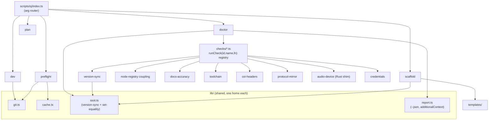
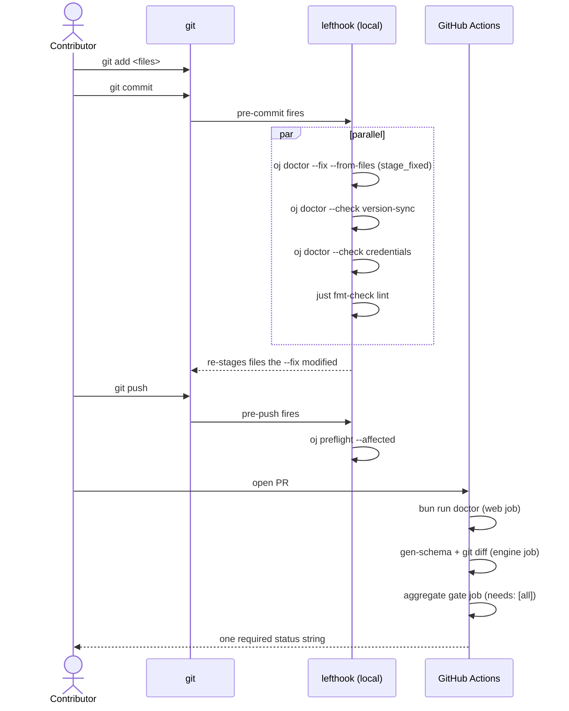
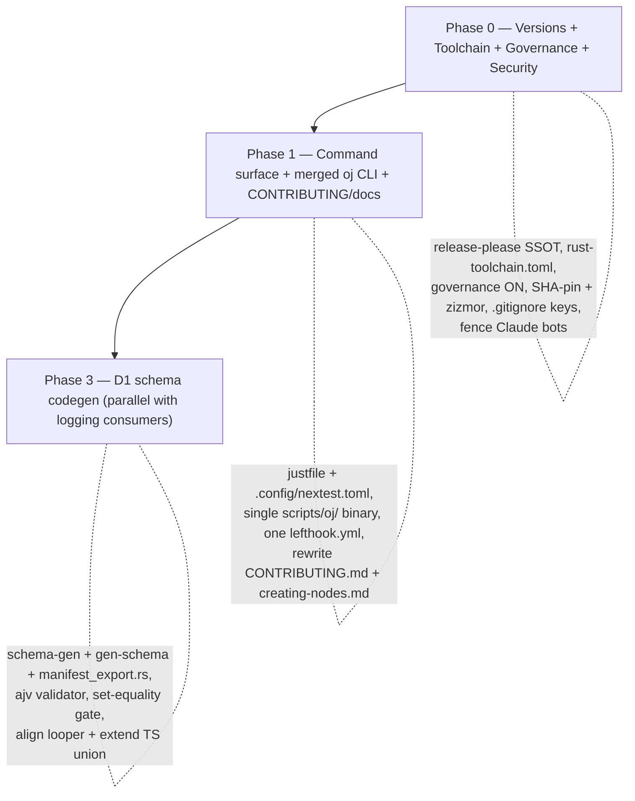

# Proactive Developer Tooling

> **Scope:** the two **Developer-Tooling** decisions — **D1** (SSOT / schema codegen) and **D2** (the `oj` developer-assistant CLI) — plus the cross-cutting foundations they depend on. This is the decision-final design for the schema-codegen layer and the `oj` Bun CLI. Release, logging, testing, and docs decisions are cross-referenced where they share a seam but are specified in [their own sections](00-overview.md#section-index).

This section is **self-complete**: every foundation D1/D2 lean on is restated here so the tooling layer is buildable without round-tripping through [`00-overview.md`](00-overview.md). Where this section and the overview both touch a foundation, they use the canonical terms verbatim: the `oj` Bun CLI, the `just` command surface, `.config/nextest.toml`, the aggregate `gate` job, the `{stable, canary}` channel model, the `ByteRing` wait-free SPSC transport, the `ojproto` `EventKind` schema, the `event_frame` codec / `drain_frames`, the device-free `render` gate, `assert_no_alloc`, `release-please` (the single version brain), affected-selection, COOP/COEP cross-origin isolation, the `wire_shapes.rs` parity gate, and the `oj-protocol-ts` TS mirror.

## Verified ground truth

All claims below were re-verified against the tree at `intelligent-easley-16d0db`.

> **Verified:** the four-way version drift is real and exactly as stated:
>
> | File | `path:line` | Value today |
> | --- | --- | --- |
> | Cargo workspace | `Cargo.toml:9` (`[workspace.package].version`) | `0.0.0` |
> | UI package | `package.json:3` | `0.1.0-alpha` |
> | Native shell | `src-tauri/tauri.conf.json:4` | `0.1.0` |
> | TS wire mirror | `packages/oj-protocol-ts/package.json:3` | `0.0.0` |

> **Verified:** `PrimitiveKind` is a closed enum of **20 variants** (`crates/ojproto/src/lib.rs:37-63`): `Osc`, `Sampler`, `Sf2`, `KarplusString`, `Gain`, `Biquad`, `Waveshaper`, `Delay`, `Convolution`, `FaustHost`, `WasmHost`, `PluginHost`, `Add`, `MicIn`, `SpeakerOut`, `GraphIn`, `GraphOut`, `Passthrough`, `Looper`, `Recorder`. The TS mirror at `src/engine/manifest.ts:27-45` declares only **18** — it is missing `Looper` and `Recorder`. This 18-vs-20 skew is the concrete drift D1 closes.

> **Verified:** the looper lowering mismatch is live: Rust lowers `builtin.looper -> PrimitiveKind::Looper` (`crates/ojcore/src/looper.rs:46,84`; asserted at `crates/ojcore/src/register.rs:156`), while TS maps `looper: 'Delay'` (`src/engine/manifest.ts:127`).

> **Verified:** wasm metering is an **allocating pull**, not a ring — `drain_meters() -> Vec<f32>` (`crates/ojcore-wasm/src/lib.rs:567`) calls `Vec::with_capacity` (`crates/ojcore-wasm/src/lib.rs:578`) off the render path. There is **no** wasm `MeterRing` to mirror.

> **Verified:** the RT fault-flag sites are `over_budget` (`crates/ojcore/src/exec.rs:387`), `auto_bypass` (the watchdog check at `crates/ojcore/src/exec.rs:388`), and `non_finite` (`crates/ojcore/src/exec.rs:451`, set inside the master `sanitize` guard at `crates/ojcore/src/exec.rs:449`).

> **Verified:** the node-routing `switch (node.type)` is in `src/components/Nodes/NodeWrapper.tsx` — at **`:383`** (schematic path) **and** **`:439`** (the `renderNodeContent` non-schematic path). A correct registry check must reconcile **both** switches, not just the first.

> **Verified:** `docs/creating-nodes.md` wrongly points contributors at `src/components/Canvas/NodeCanvas.tsx` at lines `15`, `266`, and `1012`; the real routing lives in `NodeWrapper.tsx`. This is the stale-doc lie the doctor must catch and `--fix`.

> **Verified:** `scripts/`, `lefthook.yml`, `rust-toolchain.toml`, `oj.yaml`, `justfile`, and `.config/nextest.toml` do **not** exist today. `schemas/oj-plugin-v1.json` **does** exist (D1 generates into a pre-existing schema dir).

## Decisions at a glance

| **Decision** | **Winner** | **One-line why** |
| --- | --- | --- |
| **D1** — SSOT registry & schema codegen | **Hybrid:** Rust-canonical `schemars` codegen + a *thin* (topology-only) manifest, parity-gated like `wire_shapes.rs` | Kills the triple-declared `PrimitiveKind` union and the 18-vs-20 kind skew, pins the manifest contract with the one gate the repo already trusts, and adds **zero** runtime code to any audio path. |
| **D2** — the `oj` developer CLI | **Hybrid:** a Bun/TS `oj` doctor + scaffold owns ~90%, with a thin Rust cpal audio-probe shim and a lefthook/Claude surfacing layer | The drift and friction live in the **TS control plane** (4-way version skew, 5-file node ceremony, a half-built `validate-nodes`); the `oj` Bun CLI owns it natively, Rust answers only the one question (can cpal open a stream) it must. |

> **Note:** these rows match [`00-overview.md`](00-overview.md) rows **D1** and **D2** verbatim in intent. D1's generated TS union (`src/engine/manifest.gen.ts`) is the canonical mirror source; D2 is the merged `oj` CLI built with T1 (see [Foundations](#cross-cutting-foundations-this-section-depends-on)).

### Two foundational corrections that override the source decisions

1. **The version SSOT is `release-please` (R1) — not `oj.yaml`, not `tauri.conf.json`.** D1's `oj.yaml` `version:` key is **rejected** (it would be a third drift source — its own risk note concedes this). D2's "`tauri.conf.json` is SSOT" is **demoted**: `oj doctor` version-sync is a *consistency check* (all four files equal the release-please-seeded value), never an independent source.
   - **Source vs. checker:** `release-please` is the **source** — R1 owns the bump and writes all four files in lockstep, seeded from the Cargo `[workspace.package].version` (`Cargo.toml:9`). `oj doctor` is the **checker** — it asserts the four files equal that already-set canonical value and `--fix` only *aligns* them; it never mints a new version.
2. **There is ONE `oj` binary.** T1's preflight CLI (`preflight`/`plan`/cache/affected) and D2's doctor/scaffold/dev are **merged** at `scripts/oj/` over one shared `lib/` (`git`, `cache`, `ssot`, `report`). Version-sync logic lives **once** in `lib/ssot.ts`. There is ONE `lefthook.yml` (T1-owned, co-designed with D1/D2/X2). This merge resolves the naming collision and the dual-`--fix`-owner footgun **at birth**, in Phase 1 (see [Sequencing](#sequencing-for-this-section)).

---

## D1 — Rust-canonical schema codegen + a deliberately thin manifest

### The chosen design

Two layers, each canonical for exactly one fact-class, every mirror policed by the repo's proven byte-exact serde-snapshot pattern (`crates/ojproto/tests/wire_shapes.rs`).

#### Layer 1 — Rust is canonical for the engine/wire contract

The `PluginManifest`/`ParamDecl`/`PortDecl`/`DspKind`/`UiKind` structs in `crates/ojcore/src/manifest.rs` and the closed `PrimitiveKind` enum in `crates/ojproto/src/lib.rs:37` **are** the source of truth — they carry the exact param ids and the closed kind-set the realtime loop addresses. Everything else mirrors them.

- **`schema-gen` feature gate.** Add `schemars = { version = "1.1.0", optional = true }` to `crates/ojcore/Cargo.toml` (and an optional dep in `ojproto`). Gate the derives so they **never** compile into the shipping native/wasm engine:

  ```rust
  // crates/ojproto/src/lib.rs
  #[cfg_attr(feature = "schema-gen", derive(schemars::JsonSchema))]
  #[derive(Debug, Clone, Copy, PartialEq, Eq, Serialize, Deserialize)]
  pub enum PrimitiveKind { /* Osc..Recorder, 20 variants */ }
  ```

- **`gen-schema` bin.** `crates/ojcore/src/bin/gen-schema.rs` emits `schemas/oj-plugin-v1.json` (via `schema_for!(PluginManifest)`, accepting `schemars`' `$defs`/`$ref` output as the new canonical shape) **and** a flat `schemas/primitive-kinds.json` string list for the set-equality gate.
- **TS type codegen.** `json-schema-to-typescript@15.0.4` (Bun devDep) generates `src/engine/manifest.gen.ts` (`PluginManifest`/`ParamDecl`/`PortDecl`/`DspKind`/`UiKind` + the `PrimitiveKind` union). `src/engine/manifest.ts` and `packages/oj-protocol-ts/src/index.ts` **re-export** the union — collapsing the verified triple-declaration to one generated source.
- **Rust parity gate.** `crates/ojcore/tests/manifest_export.rs`, modeled verbatim on `wire_shapes.rs`: build a registry via `ojinstrument::register_all(&mut reg, RegisterOpts::full())` (`crates/ojinstrument/src/lib.rs:147`; `RegisterOpts::full()` at `:118`), iterate `reg.ids()` (deterministic `BTreeMap` order — `crates/ojcore/src/registry.rs:19,58`), `serde_json::to_string` each `loader.manifest()` (the `PluginLoader::manifest(&self) -> &PluginManifest` method at `crates/ojcore/src/loader.rs:15`), and assert byte-for-byte against an inline expected. This pins the Rust manifest JSON as the fixed contract.
- **TS schema gate.** Replace the bespoke flat validator in `src/engine/__tests__/manifest.test.ts` with **ajv** (2020-12, understands `$defs`/`$ref`), validating every `manifestFromDefinition` output (`src/engine/manifest.ts:219`) against the generated schema.

#### Layer 2 — a thin manifest owns ONLY crate/package topology

Create `oj.yaml` at repo root as **documentation + validation only**. **The `version:` key is rejected** (release-please / R1 owns version). The minimal shape:

```yaml
# oj.yaml — topology SSOT. NO version key (release-please owns versions).
crates:
  - name: ojproto
    targets: [native, wasm, nostd]   # no_std-safe; compiled everywhere
    ci_job: engine
  - name: ojcore
    targets: [native, wasm]
    ci_job: engine
  - name: ojcore-wasm
    targets: [wasm]
    ci_job: web
  - name: oj-tauri
    targets: [native]
    ci_job: tauri
packages:
  - name: oj-protocol-ts
    targets: [wasm, native]          # TS wire mirror, target-agnostic
    ci_job: web
```

`scripts/oj/lib/ssot.ts` (zod `4.4.3` + `eemeli/yaml` under Bun) validates bidirectionally: every `oj.yaml` `crates[].name` is a real Cargo workspace member (`Cargo.toml:5` — `members = ["crates/*", "src-tauri"]`) **and** every workspace member appears in `oj.yaml`. Keep the topology block minimal until a concrete consumer earns its keep.

#### The cross-cutting set-equality gate

`scripts/oj/lib/ssot.ts` asserts **set-equality** of three sources: the schema `kind` enum (`schemas/oj-plugin-v1.json`) == the generated TS union (`manifest.gen.ts`) == the Rust flat list (`schemas/primitive-kinds.json`). This is the un-driftable contract for the kind taxonomy across all three languages.

#### SSOT codegen + parity flow

```mermaid
flowchart LR
  subgraph rust["Rust — canonical"]
    PK["PrimitiveKind enum<br/>ojproto/src/lib.rs:37<br/>(20 variants)"]
    PM["PluginManifest structs<br/>ojcore/src/manifest.rs"]
    GS["gen-schema bin<br/>(feature schema-gen)"]
    PK --> GS
    PM --> GS
  end
  GS -->|schema_for!| S1["schemas/oj-plugin-v1.json"]
  GS -->|flat list| S2["schemas/primitive-kinds.json"]
  S1 -->|json-schema-to-typescript@15.0.4| TS["src/engine/manifest.gen.ts<br/>(generated union + types)"]
  TS -->|re-export| MTS["manifest.ts<br/>oj-protocol-ts/index.ts"]

  subgraph gate["Set-equality gate (oj doctor --check ssot)"]
    EQ{{"schema.kind ==<br/>manifest.gen.ts ==<br/>primitive-kinds.json ?"}}
  end
  S1 --> EQ
  S2 --> EQ
  TS --> EQ

  subgraph parity["Byte-exact parity (the proven pattern)"]
    WS["wire_shapes.rs<br/>(command-ring backstop, stays)"]
    ME["manifest_export.rs<br/>(NEW — manifest JSON)"]
  end
  PM --> ME
  PK --> WS

  EQ -->|needs:| GATEJOB["aggregate gate job (C1)"]
  ME -->|needs:| GATEJOB
  WS -->|needs:| GATEJOB
```

> **Why:** Rust is canonical because it carries the closed kind-set the realtime loop matches on; the gate is necessary because three languages mirror that set and any one can silently drift (today: TS is missing two variants). `manifest_export.rs` and `wire_shapes.rs` are siblings, not substitutes — the latter remains the command-ring backstop.

#### Fix the latent bug the gate surfaces (Step 0, before the gate lands)

The gate will correctly fail on `builtin.looper` lowering to `PrimitiveKind::Looper` in Rust while `KIND_BY_TYPE.looper = 'Delay'` in TS (`src/engine/manifest.ts:127`). Two coordinated TS edits resolve it without weakening the gate:

1. **Extend the TS union.** `src/engine/manifest.ts:45` ends the 18-variant union at `| 'Passthrough';`. Add `| 'Looper'` and `| 'Recorder'` so the TS `PrimitiveKind` mirrors all 20 Rust variants. (Once codegen lands, this union is *replaced* by the re-exported `manifest.gen.ts` union and stops being hand-edited — but Step 0 lands before codegen, so the manual extension is what unblocks the gate.)
2. **Fix the mapping.** Change `looper: 'Delay'` to `looper: 'Looper'` at `src/engine/manifest.ts:127`, now that the engine has a real `Looper` primitive.

Run `cargo test -p ojcore` to confirm Rust is unchanged — `crates/ojcore/src/register.rs:156` already asserts `reg.lower(LOOPER_ID) == Some(PrimitiveKind::Looper)`.

### CI / hook wiring

```yaml
# .github/workflows/ci.yml — engine job (feeds the aggregate `gate`, never independently required)
- run: cargo run -p ojcore --features schema-gen --bin gen-schema
- run: git diff --exit-code schemas/        # drift fails the build

# web job
- run: bun run gen:manifest-types
- run: bun run oj doctor --check ssot        # set-equality + bidirectional topology
- run: git diff --exit-code
```

The three failure modes that make the gate effective:

| Step | Fails when | Mechanism |
| --- | --- | --- |
| `gen-schema` | `schemars` emits malformed/non-deterministic JSON | the bin exits non-zero |
| `git diff --exit-code schemas/` | the generated schemas drift from the committed ones | the **gen-then-diff** gate |
| `oj doctor --check ssot` | the three-way set-equality finds a kind mismatch, **or** bidirectional topology finds an `oj.yaml` ↔ Cargo-members divergence | `lib/ssot.ts` throws with the diffed kind set |

The `wire_shapes.rs` wire backstop **stays** (belt-and-suspenders for the command ring); `manifest_export.rs` does not subsume it. Per the harmonization, the set-equality gate is a `needs:` dependency of C1's single aggregate `gate` job — **not** an independently-required status check (preserving the "one required status string" invariant).

### Why this is the best compromise

The two strong directions cover **different** fact-classes and each contains one proven half and one overreaching half. `extend-existing-manifest` is right that Rust must be the schema authority and `wire_shapes.rs` is the right gate — but its node-DATA unification ambition would force UI-only fields (port `x`/`y`, dimensions, `canEnter`, React components) into the RT wire contract, and its premise (one registry to extend) is false (there are two disjoint registries). `new-oj-yaml-codegen` correctly identifies the version drift and the `PrimitiveKind` set-equality gap as real present-day bugs — but oversells a broad registry the repo doesn't need (the node catalog is already a TS-side SSOT via `manifestFromDefinition` at `src/engine/manifest.ts:219`; ring offsets are runtime-exported by `ojcore-wasm`). The hybrid keeps exactly the proven halves, closing 100% of the type/schema drift *actually in tree today* (18-vs-20 kind skew, triple-declared union, the looper mismatch) while spending zero effort on cross-language node-DATA unification.

### Rejected alternatives

- **`extend-existing-manifest` (standalone).** Backbone of Layer 1, rejected as the whole answer: its scope drifts toward per-node DATA unification (the expensive, low-payoff part that pollutes the RT wire contract), and it leaves the version-drift gap — the highest-value, lowest-risk win — entirely unaddressed.
- **`new-oj-yaml-codegen` (standalone).** Adopted as Layer 2's topology slice, rejected as the whole answer: most anti-drift is already solved by *better* mechanisms (`wire_shapes.rs`, the TS node catalog, runtime-exported ring offsets). Its genuinely new value is narrow (topology validation + the set-equality gate); the overreach (CI-matrix generation, node-catalog generation, generating Rust source that would fight `cargo fmt --check`) is discarded. A standalone `oj.yaml` also risks becoming a third topology SSOT unless rigorously reconciled — hence the bidirectional validation and the rejected `version:` key.
- **`derive-from-code` (`inventory`/`linkme` + `#[oj_node]` + `ts-rs`).** Rejected outright. Two disqualifiers for a dual-target hard-RT app: (1) auto-collection via `inventory`/`linkme` registers **nothing** on `wasm32-unknown-unknown` (life-before-main ctors don't fire; `wasm-bindgen` #1216) — the browser worklet would silently register **zero** nodes and produce silence with **no compile error**, the single worst dual-target failure mode for this project; (2) bolting std-only derive machinery + a duplicated frozen-enum-set parser onto `ojproto` (the most safety-critical `no_std` crate) plus an 11th proc-macro crate, where `ts-rs`/`specta` may not reproduce serde's hand-verified externally-tagged wire shapes byte-for-byte. Keep `register_builtins`/`register_all` as the explicit ONE path.

### Platform matrix

| Platform | Coverage |
| --- | --- |
| **Windows** (WASAPI/ASIO) | Fully covered, zero runtime change: manifests live in the Rust registry consumed at `compile()` across the cpal host. `gen-schema`, `manifest_export.rs`, and the SSOT check run in the existing windows-native job and on the founder's rig. `oj doctor` paths use `node:path`, never POSIX literals. |
| **macOS** (CoreAudio, aarch64+x86_64) | Fully covered; build/test-time-only codegen, no platform-specific deps. |
| **Linux** (ALSA/JACK) | Codegen + both parity tests run in the existing ubuntu engine job. `schemars` / `json-schema-to-typescript` / `ajv` / `zod` / `eemeli/yaml` are pure dev/CI tooling, no native deps. |
| **Browser** (wasm32 AudioWorklet) | **Type/schema/version parity fully covered:** the generated union feeds `oj-protocol-ts` and `src/engine/manifest.ts` (consumed by the AudioWorklet path and Pi / Ctrl+K authoring); the set-equality gate guarantees the worklet's `compile()` can never reject a kind the UI emits. **Per-node DATA parity is explicitly out of scope** (see below). **Provably RT-safe:** `schemars` derives are feature-gated out of the shipping wasm bundle; nothing touches `process()` or the `ojcore-midiring` `ByteRing`; `assert_no_alloc` is unaffected. |

> **Why browser DATA parity is safe to defer.** `ojcore-wasm` exports only `init`/`load_graph`/`process` + rings and never surfaces the Rust manifest registry to JS, so the browser palette stays TS-authored. The documented two-registry seam is `remapForBackend` at `src/audio/ojgraph/backendMap.ts:122`. If it cannot resolve a node type, the engine **falls back to the `GAIN` (unity passthrough) instance** (`src/audio/ojgraph/backendMap.ts:20-21,53-54`), which degrades silently — audible — rather than erroring. This silent fallback is intentional and documented on X1's Real-Time Safety page; contributors are warned via the docs-accuracy meta-check that a TS node addition requires a coordinating `backendMap.ts` entry. Type/schema parity therefore guarantees no kind the UI emits is *rejected*; DATA parity (a node sounding bit-identical across targets) is the separately-scoped, deferred effort below.

> **Note:** deferred as an optional, separate effort — a `wasm_bindgen` `manifests_json()` export on `crates/ojcore-wasm/src/lib.rs` for browser node-DATA parity, so the type/schema win is not mistaken for full browser DATA unification.

### Adversarial must-fixes folded in

- **Set-equality + gen-then-diff feed C1's single aggregate `gate`** as `needs:` dependencies, never independently-required checks (preserves the one-required-status-string invariant). The looper-kind mismatch is fixed by aligning TS to `'Looper'` **and** extending the union with `Looper`/`Recorder`, not by relaxing the gate.
- **Supply-chain / AGPL vetting:** `schemars` (MIT), `json-schema-to-typescript` (MIT), `ajv` (MIT), `zod` (MIT), `eemeli/yaml` (ISC) are all permissive and AGPL-compatible. They land alongside the **required** `deny.toml` audit (see [Foundations](#cross-cutting-foundations-this-section-depends-on)) with **no advisory allowlist** — advisory IDs are allowlisted individually, never whole-crate, especially for the untrusted-input parsers `symphonia` (WAV) and `rustysynth` (SF2).

### Risks & mitigations

| Risk | Mitigation |
| --- | --- |
| `schemars 1.1.0` output isn't byte-identical to the hand-tuned schema (`$defs`/`title`/`format`, `additionalProperties` placement). | Accept the generated shape as canonical; rewrite the bespoke validator to **ajv** (TS schema gate). Bounded one-time friction. |
| The cross-language param parity gate fails broadly where TS `rangeFor()` heuristic min/max disagrees with Rust explicit min/max. | Author those params **explicitly** in `src/engine/registry.ts` — do not relax the gate. Largest single chunk of edit work; intentional. |
| Reconciling the two disjoint id namespaces touches the `OjGraph` `manifest_id` contract; a botched rename makes `compile()` silently fail to an unknown id (`ojcore-wasm` returns `false`) which can **silence** audio rather than erroring loudly. | Layer-1 byte-exact tests + the `backendMap.ts` GAIN fallback mitigate; do renames carefully. |
| `oj.yaml` becomes a third topology drift source. | Bidirectional reconciliation (`oj.yaml` ↔ Cargo members ↔ real dirs); keep the topology block minimal; reject the `version:` key. |
| Checked-in generated artifacts + `git diff --exit-code` without lefthook means drift is caught only in CI for one round-trip. | The single `lefthook.yml` (Foundations) closes this; it must land in Phase 1. |

---

## D2 — The `oj` developer CLI

> *(Bun/TS doctor + scaffold, thin Rust audio-probe, thin surfacing layer)*

### The chosen design

A single Bun/TypeScript CLI at `scripts/oj/` (greenfield — no `scripts/` exists today), executed via `Bun.$` (native cross-platform shell — **decisive** because the founder's rig is Windows 11 / PowerShell and bash+tmux scripts cannot run there). **Merged with T1's preflight CLI into one binary** per the harmonization.

```text
scripts/oj/
  index.ts            # arg router: doctor | scaffold | dev | preflight | plan
  doctor.ts  scaffold.ts  dev.ts  preflight.ts
  lib/{git,cache,ssot,report}.ts     # shared — version-sync lives ONCE in ssot.ts
  checks/*.ts                         # one file per check, runCheck(id,name,fn) registry
  templates/                          # node + dsp-kernel scaffold templates
  __tests__/                          # golden round-trip + scaffold self-test (bun test)
```

```jsonc
// package.json
"scripts": {
  "oj": "bun run scripts/oj/index.ts",
  "doctor": "bun run scripts/oj/index.ts doctor",
  "gen:manifest-types": "bun run scripts/oj/index.ts gen:manifest-types"
}
```

New devDeps: `smol-toml@^1` (Cargo.toml version *consistency check*), `ts-morph@^24` (AST-parse the `NodeType` union / registry `Record` / `NodeWrapper` switches — **NOT regex**), `lefthook@^1.11`.

#### CLI command surface



> **Note:** "one binary, six entry points." `preflight`/`plan` are T1's contributions; `doctor`/`scaffold`/`dev` are D2's. All five subcommands share `lib/`, so `version-sync` exists **once** (in `ssot.ts`) and can never become a dual-`--fix` owner.

#### `oj doctor [--fix] [--from-files <staged>]` checks

Each is tied to a verified gap/file:

1. **version-sync (consistency check, NOT SSOT).** Reads all four versions (`Cargo.toml [workspace.package]`, `package.json`, `src-tauri/tauri.conf.json`, `packages/oj-protocol-ts/package.json`) and asserts they are equal to the release-please-written value. `--fix` does **line-surgical** edits (never a full re-serialize) to preserve the hand-written comments at `Cargo.toml` lines 3–4 and 12; gated on a clean git tree; covered by a golden round-trip test.
2. **node-registry coupling (the keystone — this IS the `validate-nodes` tool `docs/node-standards.md:449-471` promises but never built).** Uses `ts-morph` to cross-reference `src/engine/types.ts` `NodeType` union ↔ `src/engine/registry.ts` `nodeDefinitions` ↔ **both** real `switch (node.type)` blocks at `src/components/Nodes/NodeWrapper.tsx:383` **and** `:439` ↔ component file on disk ↔ CSS. Reuses the validators already in `src/engine/nodeStandards.ts` (`isValidNodeType` / `isValidPortId` / `isValidComponentName` / `NAMING`).
3. **docs-accuracy meta-check.** Asserts `docs/creating-nodes.md` references the **real** routing file. It currently lies (lines 15, 266, 1012 point at `src/components/Canvas/NodeCanvas.tsx`; the switches are in `NodeWrapper.tsx:383` and `:439`). The doctor must fail on this exact lie and `--fix` correct it. Also asserts `.agent/workflows/agents.md` (loaded via `.claude/CLAUDE.md`'s `@agents.md`) isn't stale.
4. **toolchain.** `Bun.$` verifies `rustc`/`cargo`, the **pinned** nightly + `wasm32-unknown-unknown` + `rust-src` the wasm leg needs, and `bun`; prints copy-paste fix hints (`rustup target add wasm32-unknown-unknown`).
5. **coi-headers.** Parses `vite.config.ts` COOP/COEP (`Cross-Origin-Opener-Policy: same-origin` + `Cross-Origin-Embedder-Policy: require-corp`, already set for dev **and** preview at `vite.config.ts:130-131,136-137`) AND built `dist/` AND any committed hosting config — **WARN loudly** since a misconfigured host silently degrades `OjcoreWasmExecutor` to the slow postMessage path (no SharedArrayBuffer). Note: **no `vercel.json` / `_headers` exists today** — see the host-decision must-fix below.
6. **protocol-mirror.** Shells `cargo test -p ojproto --test wire_shapes` and translates a raw assert into "the TS mirror in `oj-protocol-ts` drifted."
7. **audio-device (the grafted Rust shim).** Shells to a tiny `cargo run -p ojcore-native --bin doctor-probe` that calls the exact cpal `0.18.1` path `crates/ojcore-native/src/host.rs` uses (`default_host` → `default_output_device` → `default_output_config`, per `crates/ojcore-native/src/host.rs:214-221`) and emits JSON `{device, config, error}`. **WARN (not fail)** on no device, matching the existing `HostError::NoOutputDevice` contract (`crates/ojcore-native/src/host.rs:120`).
8. **credentials.** Scans staged files for any secret-bearing pattern — `*.key`, `openjammer.key`, `*.pem`, `*.p12`, `*.pfx`, `*.minisign`, and anything under `.tauri/` — and **fails** the pre-commit if found. This hardens the Phase-0 `.gitignore` addition and is a **required CI step**, not merely a local hook (the founder is Windows-only; the auto-review bot literally runs `git add .`).

##### `--from-files` affected-selection routing

`--from-files` maps each staged path to a check subset for **<2s** pre-commit feedback. The routing table:

| Staged path glob | Checks run |
| --- | --- |
| `src/engine/**/*.ts`, `src/components/Nodes/**/*.tsx` | node-registry coupling, docs-accuracy |
| `src/engine/manifest.ts`, `schemas/**`, `src/engine/manifest.gen.ts` | SSOT set-equality |
| `Cargo.toml`, `package.json`, `src-tauri/tauri.conf.json`, `packages/oj-protocol-ts/package.json` | version-sync |
| `vite.config.ts`, `dist/**`, `vercel.json`, `_headers` | coi-headers |
| `crates/ojproto/**`, `packages/oj-protocol-ts/**` | protocol-mirror |
| `.github/workflows/*.yml` | CI-integrity (zizmor pinning assertion, `gate` name invariant) |
| `*` (always) | credentials |

Anything not matched runs **no** doctor check (kept under the <2s budget); the full check set runs only on `oj doctor` (no `--from-files`) and in CI.

#### `oj scaffold node|dsp-kernel`

Writes the coupled files from `templates/`, AST-inserts (via `ts-morph`, anchored on stable marker comments) the registry entry + union member + `NodeWrapper` case, then runs `oj doctor --from-files <written>` to prove coupling. The scaffold anchors are fixed marker comments the AST splice targets — **never** positional or regex:

| Anchor comment | File / location |
| --- | --- |
| `// @@oj-scaffold:node-types-insert-here@@` | `src/engine/types.ts`, immediately before the closing of the `NodeType` union |
| `// @@oj-scaffold:registry-insert-here@@` | `src/engine/registry.ts`, inside the `nodeDefinitions` `Record` literal |
| `// @@oj-scaffold:nodewrapper-case-insert-here@@` | `src/components/Nodes/NodeWrapper.tsx`, inside **both** `switch (node.type)` blocks (`:383`, `:439`) |

`dsp-kernel` scaffolds a `no_std` alloc-free module under `crates/ojcore-dsp/src/` with a `#[cfg(test)]` block. The CI scaffold-self-test scaffolds a throwaway node, then runs `bun test:run` + `cargo test`, so anchor drift fails the build rather than rotting silently.

#### Surfacing layer (thin, built LAST)

One `lefthook.yml` (T1-owned), invoked via `bunx` not `-g` (the evilmartians/lefthook#1165 Windows PATH bug):

```yaml
# lefthook.yml — the repo's first hook control plane
pre-commit:
  parallel: true
  commands:
    doctor:     { run: bunx oj doctor --fix --from-files {staged_files}, stage_fixed: true }
    versions:   { run: bunx oj doctor --check version-sync }
    creds:      { run: bunx oj doctor --check credentials }   # required local AND CI
    fmt-lint:   { run: just fmt-check lint }
pre-push:
  commands:
    preflight:  { run: bunx oj preflight --affected }
```

#### Local → CI feedback loop



Plus a `.claude` `SessionStart` hook injecting `oj doctor --json` as `additionalContext`, and one `bun run doctor` step in `ci.yml`'s web job feeding the aggregate `gate`. **GitHub Actions stays the authoritative gate** (per the brief's explicit divergence from a purely-local CI model); lefthook is local fast-feedback only.

### Why this is the best compromise

This decision places the work where the drift and friction live: the **TS control plane**. That is overwhelmingly where the pain is — a four-way version skew across TS + JSON + TOML, a node-registration ceremony spanning `types.ts` / `registry.ts` / `NodeWrapper.tsx` / component / CSS (all TS), and a `validate-nodes` tool already half-built in `nodeStandards.ts`. A Bun/TS CLI owns all of that natively in the enforced language with zero new runtime. A pure-Rust xtask would string-splice React/TS *from Rust* into a moving target — and the codebase already proves that is the wrong tool: it contradicts its own docs (routing is in `NodeWrapper.tsx`; docs say `NodeCanvas.tsx`) and already violates its own kebab-case `NAMING` rule (`electricCello`, `minilab3-visual`). `ts-morph` from TS handles this idiomatically with the TS compiler's own AST. But the xtask is right about the **one** thing the TS CLI cannot honestly do — prove cpal can open a stream — so that ~50-line Rust probe is grafted in. The claude-integrated direction is right that "one deterministic core, three surfaces" is the correct topology, so it is adopted as a thin top layer built last.

### Rejected alternatives

- **`rust-xtask-doctor`.** Right instinct (one cross-platform binary, reuse real cpal APIs), wrong center of gravity. The two highest-value tasks (node-registry coupling, scaffolding) are TS-side AST manipulation across 187 React files in an active engine rewrite; the fragility is already real (the `NodeCanvas`/`NodeWrapper` doc lie, the kebab-case violations). It is also "high" effort with a cold-compile penalty on a contributor's first command. Its one irreplaceable contribution — the cpal device probe — survives as a thin shelled-to bin.
- **`claude-integrated`.** Its own honest self-assessment is decisive: it does NOT replace a CLI, is "strictly additive surfacing," and the hard work is "the SAME work a CLI-only direction would do." The editor-coupled `PreToolUse` alloc-deny is a heuristic that cannot be the authoritative gate (`assert_no_alloc` + clippy already are) and only fires inside Claude Code, leaving plain-git contributors uncovered. Its good idea — one core invoked from `SessionStart` + lefthook + CI — is adopted as a thin top layer, not the substance.

### Platform matrix

| Platform | Coverage |
| --- | --- |
| **Windows** | Primary dev rig (Win11/PowerShell). Decisive reason for `Bun.$` over bash+tmux. `lefthook` is one cross-platform Go binary. The audio-probe checks the WASAPI default device via cpal `default_host`; ASIO is feature-gated so doctor only **WARNs** about ASIO availability. **A minimal per-PR Windows leg stays in the `gate`** (compile `oj-tauri` + `ojcore-native`, run the device-free `render` gate + `assert_no_alloc`) — see must-fixes. |
| **macOS** | `Bun.$` + `cargo run` identically. Audio-probe checks CoreAudio via cpal; doctor can assert both aarch64+x86_64 Rust targets are installed for the universal release matrix. **Thin per-PR macOS build leg** (`cargo build -p oj-tauri` + render golden) added to the `gate`. |
| **Linux** | Audio-probe checks ALSA (`libasound2-dev`) and optionally JACK; doctor surfaces the GTK/WebKit apt deps `ci.yml` installs as copy-paste hints (cannot `sudo` for the user). |
| **Browser** | `oj doctor` covers the wasm/PWA leg as **static facts only**: COOP/COEP presence in `vite.config.ts` + `dist/` + hosting config (WARN), the wasm32 + nightly + `rust-src` toolchain, and the wasm build command. It **cannot** prove `crossOriginIsolated === true` or that the AudioWorklet/SAB ring is live — that is T3's Playwright lane against a **deployed** URL, not part of this decision. |

### Adversarial must-fixes folded in

- **Version SSOT thrash eliminated:** `oj doctor` version-sync is a **consistency check** against release-please's value, not an independent SSOT. There is exactly one version-bump owner (`release-please` via R1); `oj doctor --fix` only aligns the four files to the *already-set* canonical version (in `Cargo.toml`), never generates a new version — it can never compete with the bump.
- **`smol-toml` corruption guard:** line-surgical edits + golden round-trip test + clean-tree gate, so the comment-heavy `Cargo.toml` is never full-serialized.
- **Noisy-doctor cardinal sin:** AST (not regex) for the node-registry check, stable marker comments as scaffold anchors, and a CI scaffold-self-test that scaffolds a throwaway node then runs `bun test:run` + `cargo test` to catch anchor drift.
- **CONTRIBUTING / docs fixed in Phase 1, not Phase 6** (see Sequencing). The verified-stale `CONTRIBUTING.md` (Bun-only prerequisites, `localhost:3000`, Tailwind, npm flows) and `docs/creating-nodes.md` (the `NodeCanvas` lie) are corrected **before** inviting contributors into the new tooling surface; the docs-accuracy meta-check then keeps them honest.
- **Credential scan is a REQUIRED CI step**, not merely a deferred local hook, because the founder is Windows-only and the local hook may lag. `.gitignore` gains `*.key`, `openjammer.key`, `*.pem`, `*.p12`, `*.pfx`, `*.minisign`, `.tauri/` **before** any minisign key is generated (the auto-review bot literally runs `git add .`).
- **`oj dev` kept thin:** `Bun.$` concurrent child-process + Ctrl+C/signal forwarding on Windows is the riskiest runtime surface, so `doctor`/`scaffold` (no long-running children) are the load-bearing commands; `dev` is hardened but secondary.

### Risks & mitigations

| Risk | Mitigation |
| --- | --- |
| `ts-morph` check must track 3 large, refactor-prone TS files (and **both** `NodeWrapper` switches); a wrong doctor gets ignored. | AST not regex; stable marker comments; CI scaffold-self-test. |
| `smol-toml --fix` could corrupt the comment-heavy `Cargo.toml`. | Line-surgical edits + golden round-trip test + clean-tree gate. |
| `Bun.$` concurrent child-process + Windows signal handling in `oj dev`. | Keep `dev` thin; harden Ctrl+C; `doctor`/`scaffold` are the load-bearing commands. |
| The Rust audio-probe adds a cross-language seam; if `host.rs` shifts, the probe must follow. | Keep it a thin re-use of the existing `default_host`→`default_output_device`→`default_output_config` path; clippy-gate it in CI so it can't rot. |
| Scope creep toward SHA256-caching/affected-selection bloating the CLI into a second CI. | Keep `--from-files` as the only affected mechanism for the doctor; `preflight --affected` is T1's bounded cache layer. |

---

## Cross-cutting foundations this section depends on

> *(decision-final; owned by other sections, restated here so the tooling layer is buildable on its own)*

- **VERSION SSOT — `release-please` (R1).** Writes all four files in lockstep (Cargo `[workspace.package].version` seed → `package.json`, `tauri.conf.json`, `oj-protocol-ts/package.json`). Resolves the verified `0.0.0` / `0.1.0-alpha` / `0.1.0` / `0.0.0` drift. `oj doctor` version-sync is the consistency check, never the source. **Add a three-way release gate** (built-binary `CARGO_PKG_VERSION` == tag == `tauri.conf.json`) + a release-please dry-run proving the nested `$.workspace.package.version` TOML updater actually writes the workspace version, so a `0.0.0` binary never ships into an infinite update-prompt loop.
- **TASK RUNNER — one root `justfile` + `.config/nextest.toml`.** The single source of truth for *what* runs (`fmt`, `clippy`, `test`, `doctest`, `nostd`, `wasm`, `render`, `clap-host`, `web`). C1 and lefthook both invoke the same recipes; the `oj` CLI only *decides* which recipes to run, never re-encodes commands.
- **TOOLCHAIN PIN — one `rust-toolchain.toml` (C1-owned), in the FIRST Phase-0 commit.** One nightly (wasm `-Zbuild-std`, miri, sanitizers) + stable (fmt/clippy). Consumed by `oj doctor`'s toolchain check, T1's cache hash (ALWAYS_INPUT), and T2's golden reproducibility. **Absent today; the only browser-wasm compile path requires nightly and currently floats.**
- **GOVERNANCE — wire it in Phase 0 (currently OFF).** Verified: the `main` ruleset is `enforcement:disabled`, there is **no** branch protection on `main`, **no** `required_status_checks` anywhere, the `dev` ruleset targets a malformed ref `refs/heads/"dev"` for a branch that doesn't exist. The C1 "single required gate job" model — the spine of this whole plan — **enforces nothing today**. Phase 0 must: create-or-drop the `dev` branch, fix the `dev` ruleset ref, flip `main` to `enforcement:active` with `require_pull_request` + `required_status_checks` bound to the aggregate `gate` job, and add a check asserting enforcement stays on. This is not a footnote.
- **SECURITY POSTURE — SHA-pin the release path BEFORE any signing key exists.** Verified: `release.yml` uses unpinned `actions/checkout@v4`, `oven-sh/setup-bun@v2`, `dtolnay/rust-toolchain@stable`, `Swatinem/rust-cache@v2`, `tauri-apps/tauri-action@v0` — a floating-tag action in a key-holding workflow is a direct private-key exfiltration path. SHA-pin every third-party action across `ci.yml`/`release.yml`/`build-installers.yml`, add `zizmor` as a **required** check enforcing pinning and asserting `TAURI_SIGNING_*` is never exposed on `pull_request` triggers, add the absent `dependabot.yml` (github-actions ecosystem), and scope signing secrets + `id-token:write` to tag/release jobs only — all before R2/R4 generate the **minisign signing (split stable/canary keypairs)**.
- **FIX/FENCE THE WRITE-CAPABLE CLAUDE BOTS (live exposure, public repo).** `claude-auto-review.yml` and `claude-mention-bot.yml` have `contents:write` and auto-commit to PR branches; the mention-bot triggers on any `@claude` from any commenter (including external fork PRs), can reach the RT-safety crates, bypasses the gate via `[skip ci]` commits, and is a prompt-injection surface. Demote bots to `contents:read`+suggest-only (or path-deny the RT crates + gate the mention-bot on `author_association` ∈ {OWNER, MEMBER, COLLABORATOR}), remove the `[skip ci]` bypass, set Actions to "Require approval for all outside collaborators", and **fix the verified npm-vs-bun bug** (the bots run `npm run build/lint/test:run` but `package.json`'s `preinstall` hard-fails any non-bun invocation, so the bots' quality checks are silently broken today).
- **CI REQUIRED-CHECK SURFACE — one aggregate `gate` job.** `needs: [all]; if: always()` with the exact predicate: **fail unless every need result ∈ {success, skipped}**. Commit an adversarial CI self-test forcing (a) malformed affected-selector JSON and (b) a failing shard, asserting the gate goes RED in both. Every D1/D2 check (set-equality, gen-then-diff, `oj doctor`, the per-PR cross-platform floor) is a `needs:` dependency feeding `gate`, never independently required. "Do not rename the gate job" is the one documented invariant.

> **Must-fix (critical):** (the F3 wasm correction) there is **no** wasm `MeterRing` to "mirror" — wasm metering is the allocating `drain_meters() -> Vec<f32>` pull at `crates/ojcore-wasm/src/lib.rs:567`. Any browser event/log channel is a **net-new `ByteRing` + new `*_offset` getters + a worklet-self-drain** (SharedArrayBuffer threading does not exist today). `oj doctor`'s coi-headers check verifies the *static* COOP/COEP inputs; it does not and cannot assert a live SAB ring. This is owned by the logging section but stated here so the tooling layer never assumes a live SAB capability it can verify.

---

## Sequencing for this section



| Phase | What lands | Why here |
| --- | --- | --- |
| **0 — Version + Toolchain + Governance** | `release-please` SSOT (all four files); one `rust-toolchain.toml`; flip `main` ruleset to `enforcement:active` + bind `required_status_checks` to the `gate`; SHA-pin release path + `zizmor` + `dependabot.yml`; `.gitignore` key patterns; fix/fence the Claude bots. | Every downstream piece (the version consistency check, the wasm/nightly toolchain check, the merge gate the doctor feeds) is unverifiable or unenforced until these land. Governance currently enforces nothing. |
| **1 — Command surface + the merged `oj` CLI + CONTRIBUTING/docs** | `justfile` + `.config/nextest.toml`; **the single `scripts/oj/` binary, built as the merged result of T1 (preflight/plan) and D2 (doctor/scaffold/dev) over one shared `lib/`** — resolving the naming collision and the dual-`--fix` ownership at birth; the one `lefthook.yml`; rewrite `CONTRIBUTING.md` and `docs/creating-nodes.md` to the real toolchain/routing. | Resolve the naming collision and dual-`--fix` owner at birth. Fix the front-door docs **before** contributors enter the new system. |
| **3 — D1 schema codegen** (parallel with logging consumers) | `schema-gen` feature + `gen-schema` bin + `manifest_export.rs`; `gen:manifest-types`; ajv validator; the set-equality gate; **extend the TS `PrimitiveKind` union with `Looper`/`Recorder` and align `KIND_BY_TYPE.looper` → `'Looper'`**. | Orthogonal to logging but shares the `wire_shapes` parity discipline and feeds the `gate`; fixes the verified looper mismatch and the 18-vs-20 kind skew. |

---

## Open questions / decisions deferred

1. **Browser node-DATA parity (D1, deferred export).** Whether/when to add a `wasm_bindgen` `manifests_json()` export so the browser palette consumes Rust manifest data directly. Deferred — the type/schema/version win does not require it, and it adds a JS↔wasm serialization seam.
2. **`oj.yaml` topology block growth.** Kept to the minimum (crate name, targets, ci_job) until a concrete consumer (e.g. generated CI matrix or docs topology) earns the expansion. Generating the CI matrix from it is **explicitly rejected for now**.
3. **Header-capable PWA host (COOP/COEP) — needs an owner and a Phase-0/1 deadline, not deferred "joint Phase-2 ownership."** `oj doctor` can only check the *static* inputs; the committed `vercel.json`/`_headers` config and the post-deploy synthetic check (`crossOriginIsolated === true` against the **production** URL) are owned by R3/C1. This is the regression that silently drops the engine to the slow postMessage path; the tooling layer surfaces it but cannot fix the host choice.
4. **`oj scaffold` CSS coupling.** The node-registry check reconciles a component's CSS, but whether `scaffold` should generate a CSS stub vs. require hand-authoring is left to the node-standards convention owner (shared with D1's `nodeStandards.ts`).
5. **Pin the L5 redaction anchor to the verified secret handler.** The earlier *assumption* that `src-tauri/src/ai.rs` was stale is itself disproven — `ai.rs` is the verified anchor (`stripped_env` at `src-tauri/src/ai.rs:253`; the `OPENJAMMER_AI_KEY_VAR` override defaulting to `OPENJAMMER_PROVIDER_KEY` at `src-tauri/src/ai.rs:269-272`). Out of scope for D1/D2, but the docs-accuracy meta-check should be extended to assert the diagnostics redaction module pins `redact.ts` to `OPENJAMMER_PROVIDER_KEY` / `OPENJAMMER_AI_KEY_VAR` (a **fail-closed allowlist**, not a denylist). See [`02-logging-and-observability.md`](02-logging-and-observability.md) (L5) and [`09-reference-schemas-and-code.md`](09-reference-schemas-and-code.md) for the verified anchor.

---

> **See also:** [`00-overview.md`](00-overview.md) (canonical foundations + section index) · [`01-testing-and-reliability.md`](01-testing-and-reliability.md) (T1 preflight, the `gate`, `wire_shapes` discipline) · [`02-logging-and-observability.md`](02-logging-and-observability.md) (the `ByteRing` event channel, `EventKind`, `event_frame`/`drain_frames`) · [`03-release-channels-and-auto-update.md`](03-release-channels-and-auto-update.md) (`release-please`, the `{stable, canary}` model, minisign) · [`05-github-actions-ci.md`](05-github-actions-ci.md) (the aggregate `gate`, Lane A / Lane B) · [`06-documentation-starlight.md`](06-documentation-starlight.md) (Real-Time Safety page, docs coverage gates) · [`07-reference-configs.md`](07-reference-configs.md) (the verbatim `justfile` / `.config/nextest.toml` / `oj.yaml` / `lefthook.yml` configs) · [`09-reference-schemas-and-code.md`](09-reference-schemas-and-code.md) (the `oj-plugin-v1.json` schema, `manifest_export.rs`, the `ai.rs` secret-handler anchor) · [`GLOSSARY.md`](GLOSSARY.md) (canonical term definitions).
