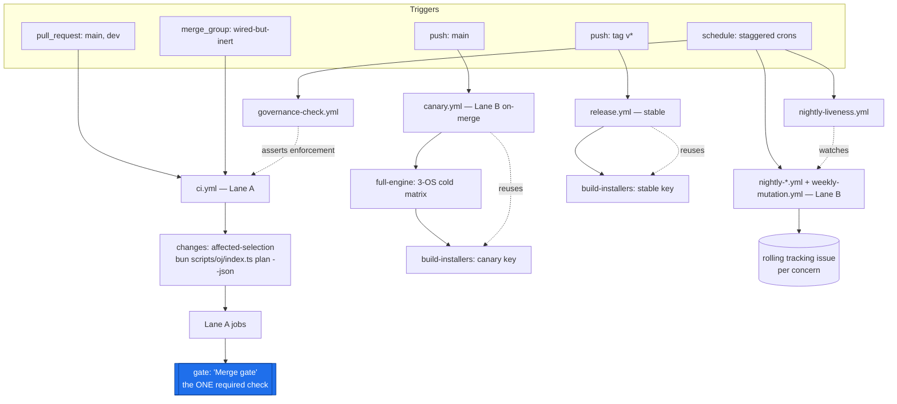
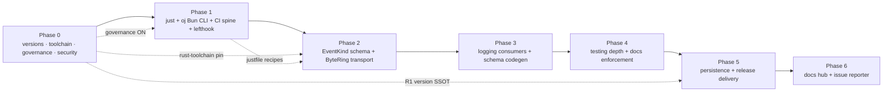
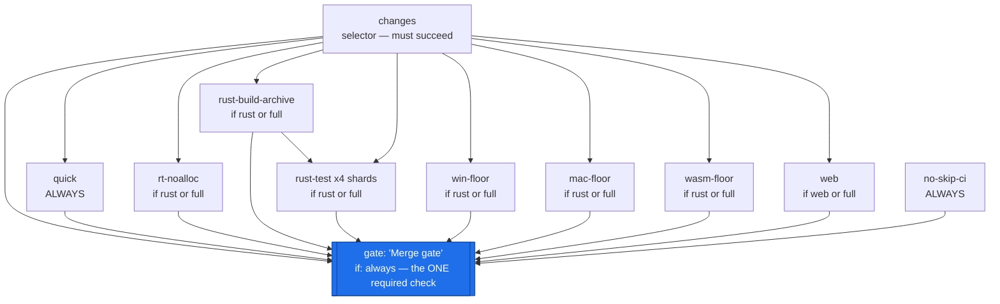
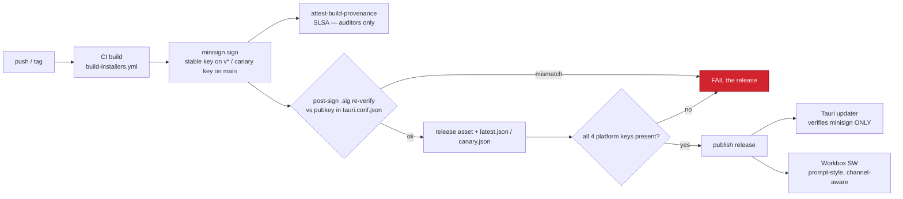

# GitHub Actions CI/CD (maximal free-for-OSS)

> **Scope.** This section specifies OpenJammer's complete CI/CD topology on GitHub Actions, exploiting the free-for-OSS tier to the fullest. It replaces today's monolithic `ci.yml` + `release.yml` + `build-installers.yml` with a DRY reusable-workflow control plane, and it consumes — never re-encodes — the `just` command surface and the merged `oj` Bun CLI defined by T1/D2 ([`01-testing-and-reliability.md`](01-testing-and-reliability.md), [`04-developer-tooling.md`](04-developer-tooling.md)). GitHub Actions is **authoritative** here; the `lefthook` hook plane is local fast-feedback only (per [`00-overview.md`](00-overview.md) §F6). Terms in `inline code` are defined in [`GLOSSARY.md`](GLOSSARY.md).

This document is the home of decision **C1**. It is self-complete: every must-fix that touches CI/CD is folded in at the section level, not delegated to the overview.

---

## Decisions at a glance

| Decision | Winner | One-line why |
|---|---|---|
| **C1 — CI/CD control plane** | **Hybrid** (DRY reusable spine + lean gate + heavy nightly/canary + full security suite) | A sub-10-min required gate that loses **zero** coverage (relocates heavy legs, never removes), closes the macOS-on-`main` gap for free, and keeps one stable required check. |
| Merge queue | **Wired-but-disabled** | Structurally impossible on the verified user-owned `PonderingBGI/openjammer` (queue is org-only); the `merge_group` trigger is wired so a future org migration is a one-line ruleset flip. |
| Required-check surface | **Single aggregate `gate` job** | Absorbs all matrix/skip churn behind one stable name ("Merge gate") — the documented fix for the job-name-string footgun (§F6). |
| Toolchain / version foundation | **`rust-toolchain.toml` + `release-please` SSOT** (Phase 0) | Both are absent/drifting today and are hard prerequisites for reproducible caches, golden hashes, and the updater. |

> **Verified:** This table agrees verbatim with the C1 row of [`00-overview.md`](00-overview.md) §"Decisions at a glance" and §F6 (one required check + one toolchain pin + one hook control plane).

The three studied directions (`maximalist-reusable`, `lean-gate-heavy-nightly`, `matrix-merge-queue`) are not competing peers — they are **layers of one correct system**, and exactly one (`matrix-merge-queue`) is blocked at its core. The hybrid takes the DRY topology + free security suite from #1, the lane split + nextest archive/shard + async rolling-issue triage from #2, and harvests only the deployable pieces of #3 (matrix-first reusable engine, aggregate-gate single required check, `merge_group` wired-but-deferred). See §11–§12 for the full comparison.

---

## 0. Verified starting state (ground truth)

> **Verified:** Every claim below was checked by reading the live files in the repo at the paths cited. Where a previous draft asserted something false, the correction is called out inline.

- **Three drifting toolchain copies.** `ci.yml` (engine + web + `windows-native` jobs), `release.yml` (4-cell tauri matrix), and `build-installers.yml` (3-cell `workflow_dispatch`) each re-declare checkout + Bun + rust-toolchain + rust-cache + the Linux apt block.
  - **The apt blocks are NOT identical** — a previous draft claimed they were duplicated verbatim; they are not.
    - `ci.yml:29-35` installs **6** packages: `libasound2-dev`, `libwebkit2gtk-4.1-dev`, `libgtk-3-dev`, `libsoup-3.0-dev`, `libjavascriptcoregtk-4.1-dev`, `librsvg2-dev`. It **omits `pkg-config`**.
    - `release.yml:49-56` and `build-installers.yml:30-37` install **7** packages — the same six **plus `pkg-config`**.
  - The single `setup-rust` composite (§3) collapses all three into one apt list (the superset, **with** `pkg-config`), eliminating the drift.
- **Four-way version drift.** `Cargo.toml [workspace.package].version = "0.0.0"` (`Cargo.toml:9`), `package.json = "0.1.0-alpha"` (`package.json:3`), `src-tauri/tauri.conf.json = "0.1.0"` (`tauri.conf.json:4`), `packages/oj-protocol-ts/package.json = "0.0.0"` (line 3). All four verified.
- **No `rust-toolchain.toml`, no `deny.toml`, no root `justfile`, no `.config/nextest.toml`, no `dependabot.yml`.** All confirmed absent.
- **Floating-tag actions in the release/signing path.** `release.yml` uses `actions/checkout@v4` (`:43`), `oven-sh/setup-bun@v2` (`:59`), `dtolnay/rust-toolchain@stable` (`:62`), `Swatinem/rust-cache@v2` (`:70`), `tauri-apps/tauri-action@v0` (`:78`) — all unpinned. Only the claude bots SHA-pin (`actions/checkout@34e1148…`, `claude-code-action@0d19335…`). **`claude-security-review.yml:31` pins `claude-code-security-review` to a raw-main commit (`@25e460eb…`), not a tagged release.** The earlier claim that "a SHA-pin convention exists" is **false for the release path**.
- **The `npm`-vs-`bun` bot bug is real.** `package.json:23` has a `preinstall` guard that hard-`exit(1)`s on any non-bun `npm_execpath`. Yet `claude-auto-review.yml:57-61` and `claude-mention-bot.yml:71` instruct the agent to run `npm run build && npm run lint && npm run test:run`. **The bots commit `[skip ci]` messages (`claude-auto-review.yml:65`, `claude-mention-bot.yml:72`), but the quality checks they attempt never actually run — the `npm run` commands fail on the preinstall guard. This is a silent quality-gate bypass: the commit lands, the checks did not.**
- **`[skip ci]` gate-bypass.** Both bots commit `git commit -m "[skip ci] fix: …"`. GitHub honors `[skip ci]` by **not** running workflows on that push, so a bot-modified PR carries a stale-green gate against an untested head SHA.
- **Write-capable, PR-triggered bots.** `claude-auto-review.yml` runs on `pull_request:[opened,synchronize]` (`:4-5`) with `permissions:{contents: write, pull-requests: write}` (`:7-9`) + `ANTHROPIC_API_KEY`, checks out PR head, and pushes back. `claude-mention-bot.yml` fires on **any** `@claude` comment (`if: …contains(github.event.comment.body, '@claude')` — **no `author_association` gate**, `:17`) and drives an autonomous agent with a write token (`permissions:{contents: write, …}`, `:9-12`).
- **`release.yml:86` sets `releaseDraft: true`** — the updater feed is dark on every release until a manual publish click.
- **Governance is OFF.** Per the harmonization's verified findings: no classic branch protection on `main` (404), the `main` ruleset is `enforcement:disabled`, the `dev` ruleset targets a malformed `refs/heads/"dev"` (literal quotes) for a branch that **does not exist**, and there are no `required_status_checks` anywhere. The single-required-gate model currently enforces **nothing**.
- **`ci.yml` triggers on `push` AND `pull_request` for `[main, dev]`** (`ci.yml:7-11`) and its concurrency group is `ci-${{ github.workflow }}-${{ github.ref }}` (`ci.yml:14`). Lane A (§5) **drops the `push` trigger** (canary.yml covers `main`) and references the same `[main, dev]` branch set — which is why §2c's `dev`-branch decision is a hard prerequisite.

Every design choice below is anchored to closing exactly these gaps.

---

## 1. Topology — what we are building

> **Note:** This entire topology is **NEW**. It **replaces** the current monolithic three-workflow structure (`ci.yml` + `release.yml` + `build-installers.yml`). Every file and restructured workflow below is a file to **create or rewrite** — none of this structure exists in the repo today. The "Verified starting state" above is the *only* description of what currently exists.

```text
.github/
  actions/
    setup-rust/action.yml        # NEW composite: nightly+stable+cache+Linux apt (superset, with pkg-config)
    setup-web/action.yml         # NEW composite: setup-bun + frozen install
  workflows/
    engine.yml                   # NEW reusable (workflow_call): os/shard/cold/profile
    web.yml                      # NEW reusable (workflow_call)
    build-installers.yml         # REWRITTEN reusable (workflow_call + workflow_dispatch): 4-cell tauri matrix
    ci.yml                       # REWRITTEN — LANE A required merge gate (PR + merge_group)
    nightly-engine.yml           # NEW — LANE B heavy backstop (schedule)
    nightly-wasm.yml             # NEW — LANE B
    nightly-fuzz.yml             # NEW — LANE B
    nightly-unsafe.yml           # NEW — LANE B (miri + loom + sanitizers)
    nightly-e2e.yml              # NEW — LANE B (Playwright PWA)
    weekly-mutation.yml          # NEW — LANE B (Stryker + fast-check)
    nightly-liveness.yml         # NEW — opens a HIGH issue if any heavy leg is >48h stale
    canary.yml                   # NEW — push:main full-matrix + canary release
    release.yml                  # REWRITTEN — v* tags -> stable release
    codeql.yml                   # NEW security: rust + js/ts + actions
    governance-check.yml         # NEW — asserts ruleset enforcement stays ON
    claude-*.yml                 # KEPT, but hardened — see §9
rust-toolchain.toml              # NEW (Phase 0, C1-owned)
deny.toml                        # NEW (cargo-deny, no advisory allowlist)
.config/nextest.toml             # NEW (audio-serial group, CI profile)
.github/dependabot.yml           # NEW (cargo + npm/bun + github-actions, grouped)
```

> **Note:** The full literal contents of every workflow above live in [`08-reference-ci-workflows.md`](08-reference-ci-workflows.md); the `rust-toolchain.toml`, `deny.toml`, `.config/nextest.toml`, and `.github/dependabot.yml` bodies are in [`07-reference-configs.md`](07-reference-configs.md); the schemas and Rust code those workflows exercise (the `ojproto` `EventKind` schema, the `wire_shapes.rs` parity gate, `latest.json`) are in [`09-reference-schemas-and-code.md`](09-reference-schemas-and-code.md).

### CI topology at a glance



> **Note:** `release.yml` **and** `canary.yml` both `uses: ./.github/workflows/build-installers.yml`, eliminating the canary-vs-release drift class **by construction** (§4). The only difference is which signing key each passes (§10).

---

## 2. Phase 0 — hard prerequisites (must complete before Phase 0 is "trusted")

> **Why:** Per [`00-overview.md`](00-overview.md) §"Phase 0", these are the cheapest, most load-bearing items, and they gate **everything** downstream. They land **first**, in this order, before any gate is trusted. They are prerequisites, not features — a beautiful gate job that runs against unprotected `main` and drifting versions protects nothing.



### 2a. `rust-toolchain.toml` (C1 owns the single copy)

One pinned **nightly** (for the `wasm32 -Z build-std` leg, miri, `-Zsanitizer`) + **stable** as the default toolchain (fmt/clippy). Consumed by T1's cache hash (as an `ALWAYS_INPUT` broad invalidator) and T2's golden-hash reproducibility. Absent today; a hard prerequisite for the **only** browser-wasm compile path — `ci.yml:58` runs `cargo +nightly build -p ojcore-wasm … -Z build-std=std,panic_abort`.

```toml
# rust-toolchain.toml — the single toolchain pin (C1-owned)
[toolchain]
channel = "nightly-2026-06-01"     # one known-good nightly; bumped deliberately, busts caches/goldens
components = ["rust-src", "rustfmt", "clippy", "miri"]
targets = ["wasm32-unknown-unknown"]
profile = "minimal"
```

> **Note:** Because this file pins **nightly** as the default channel, the `setup-rust` composite (§3) still explicitly installs **stable** for fmt/clippy (nightly carries no rustfmt-availability guarantee), preserving the verified nightly-first/stable-last ordering from `ci.yml:39-47`. fmt/clippy therefore run via `cargo +stable`. A previous draft listed `rust-src` twice in `components`; the correct, de-duplicated list is exactly the four above.

### 2b. `release-please` becomes the single version SSOT (R1)

It writes all four version files in lockstep, seeded from `Cargo.toml [workspace.package].version` (the canonical `0.0.0` seed). This unblocks R2 (updater compares `tauri.conf.json` version), R4 (manifest version), and L5 (bundle stamps version). Ship a `release-please` **dry-run proof** that the nested `$.workspace.package.version` TOML updater actually writes the workspace key — a `0.0.0` binary shipping would cause an infinite update-prompt loop. The `oj doctor` version-sync becomes a **consistency check** (all four equal), never an independent source. Add a **three-way equality release gate** (built-binary `CARGO_PKG_VERSION` == tag == `tauri.conf.json` version) so a `0.0.0` binary can never ship.

### 2c. Governance enablement (the spine the whole plan rests on)

> **Must-fix (critical):** Until 2c lands, the "always-green `main`" guarantee is **fictional** regardless of how good the `gate` job is. This is a Phase-0 blocker, not a footnote.

1. **Create the `dev` branch, OR drop all `[main, dev]` references and target only `main` until `dev` exists.** Lane A's trigger (§5) references both `main` and `dev` (mirroring today's `ci.yml:9, 11`); a `pull_request` filter naming a non-existent branch silently never matches. This decision must be made before §5 is wired — it appears in the must-fix table (§14).
2. **Fix the `dev` ruleset's broken `refs/heads/"dev"` condition** (strip the literal quotes).
3. **Flip the `main` ruleset to `enforcement: active`** with `require_pull_request` **and** `required_status_checks` bound to the `gate` job ("Merge gate").
4. **Commit `governance-check.yml`:** a scheduled job that runs `gh api repos/.../rulesets` and **fails + opens an issue** if `enforcement != active` or the gate check is missing from the required set — so a future ruleset edit that silently disables enforcement is itself a detected failure.

```yaml
# .github/workflows/governance-check.yml (sketch)
on: { schedule: [{ cron: '0 6 * * *' }], workflow_dispatch: {} }
permissions: { issues: write, contents: read }
jobs:
  assert-enforced:
    runs-on: ubuntu-latest
    steps:
      - run: |
          R=$(gh api repos/${{ github.repository }}/rulesets --jq '.[] | select(.name=="main")')
          test "$(jq -r .enforcement <<<"$R")" = "active" || { echo "::error::main ruleset not enforced"; exit 1; }
          gh api repos/${{ github.repository }}/rulesets/$(jq -r .id <<<"$R") \
            --jq '.rules[] | select(.type=="required_status_checks") | .parameters.required_status_checks[].context' \
            | grep -qx "Merge gate" || { echo "::error::gate not in required set"; exit 1; }
        env: { GH_TOKEN: '${{ github.token }}' }
```

### 2d. `justfile` recipes are a Phase-0/Phase-1 prerequisite for the reusable workflows

> **Must-fix (high):** §4–§5 invoke `just fmt`, `just clippy`, `just clippy-changed`, `just doctest`, `just test`, `just nostd`, `just wasm`, `just render`, `just clap-host`, `just web`, and `just wasm-parity-smoke`. **No root `justfile` exists today.** It is created in Phase 1 by **T1** ([`01-testing-and-reliability.md`](01-testing-and-reliability.md), [`00-overview.md`](00-overview.md) §F1), and C1 **consumes** it — it never re-encodes commands.

The recipes C1's workflows depend on, and their canonical bodies (verbatim from §F1 of the overview where defined):

| Recipe | Body (canonical) | Used by |
|---|---|---|
| `fmt` | `cargo fmt --all -- --check` | `engine.yml`, `quick`, floors |
| `clippy` | `cargo clippy --workspace --all-targets -- -D warnings` | `engine.yml` |
| `clippy-changed` | clippy over affected packages only (resolved by the `oj` CLI) | `quick` |
| `test` | `cargo nextest run --workspace` | `engine.yml` (whole-suite / nightly) |
| `doctest` | `cargo test --workspace --doc` (nextest **skips** doctests — mandatory companion) | `engine.yml`, `rust-test` shard 1 |
| `nostd` | `cargo build -p ojcore --no-default-features` | `engine.yml` |
| `wasm` | `cargo +nightly build -p ojcore-wasm --target wasm32-unknown-unknown -Z build-std=std,panic_abort` | `engine.yml`, `wasm-floor` |
| `render` | `cargo run -p ojcore-native --bin render --features demo -- {{wav}} 2` | `engine.yml`, `quick`, floors |
| `clap-host` | `cargo clippy -p ojhost --features clap-host …` + `cargo test -p ojhost --features clap-host` | `engine.yml` |
| `web` | `tsc --noEmit -p tsconfig.app.json` + lint + vitest + build | `web.yml` |
| `wasm-parity-smoke` | `wasm-pack test --node` over a small kernel subset, ULP-band compare | `wasm-floor` |

> **Verified:** The `clap-host` feature exists (`crates/ojhost/Cargo.toml:24`, `clap-host = ["dep:clack-host"]`). The `render` bin, `nostd`, and `wasm` legs all mirror the verified commands in `ci.yml:55-65`. `set windows-shell` is required in the `justfile` for the Windows-primary dev box (§F1).

> **Note:** Until the `justfile` lands in Phase 1, a Phase-0 interim `ci.yml` may invoke the raw `cargo` commands above directly; the moment the `justfile` exists, every workflow switches to `just <recipe>` so CI and local cannot drift on *what* runs.

---

## 3. Composite actions (kill the triple-duplicated boilerplate)

```yaml
# .github/actions/setup-rust/action.yml
name: setup-rust
runs:
  using: composite
  steps:
    # Toolchain comes from rust-toolchain.toml (pinned). Install nightly FIRST,
    # stable LAST so `cargo fmt`/`clippy` default to stable (ci.yml:39-47 invariant).
    - uses: dtolnay/rust-toolchain@<SHA_PLACEHOLDER>   # @nightly — see pinning note below
      with: { toolchain: nightly, components: rust-src, targets: wasm32-unknown-unknown }
    - uses: dtolnay/rust-toolchain@<SHA_PLACEHOLDER>   # @stable
      with: { toolchain: stable, components: "rustfmt, clippy" }
    - uses: Swatinem/rust-cache@<SHA_PLACEHOLDER>      # @v2
      with: { workspaces: ". -> target" }
    - if: runner.os == 'Linux'
      shell: bash
      run: |
        sudo apt-get update
        # SUPERSET apt list (the verified union of ci.yml's 6 + the pkg-config in
        # release.yml/build-installers.yml). One list, no drift.
        sudo apt-get install -y libasound2-dev libwebkit2gtk-4.1-dev libgtk-3-dev \
          libsoup-3.0-dev libjavascriptcoregtk-4.1-dev librsvg2-dev pkg-config
    - uses: taiki-e/install-action@<SHA_PLACEHOLDER>   # just + cargo-nextest prebuilt binaries (Windows-safe)
      with: { tool: "just,cargo-nextest" }
```

```yaml
# .github/actions/setup-web/action.yml
name: setup-web
runs:
  using: composite
  steps:
    - uses: oven-sh/setup-bun@<SHA_PLACEHOLDER>        # @v2
    - shell: bash
      run: bun install --frozen-lockfile
```

> **Note:** Every `<SHA_PLACEHOLDER>` above is an **illustrative placeholder**. The implementation pins each action to the exact commit SHA of its current release tag (the comment names the human-readable tag for review), and `dependabot.yml` (github-actions ecosystem) keeps them reviewed. `zizmor` enforces that no floating tag survives (§8c). This convention is applied uniformly — there are no mixed `<sha>` / literal-SHA forms.

---

## 4. Reusable workflows — the single source of truth for *what* runs

Both lanes call the **same `just` recipes** inside these, so CI and local can never drift on *what* runs.

```yaml
# .github/workflows/engine.yml (reusable)
on:
  workflow_call:
    inputs:
      os:      { type: string,  default: ubuntu-latest }
      shard:   { type: string,  default: "" }       # "N/4" or "" for whole suite
      cold:    { type: boolean, default: false }     # nightly: ignore cache
      profile: { type: string,  default: ci }
permissions: { contents: read }
jobs:
  engine:
    runs-on: ${{ inputs.os }}
    steps:
      - uses: actions/checkout@<SHA_PLACEHOLDER>
      - uses: ./.github/actions/setup-rust
      - run: just fmt
      - run: just clippy
      - run: just doctest        # MANDATORY companion: nextest SKIPS doctests (the T1 risk)
      - if: inputs.shard == ''
        run: just test           # whole suite (nightly)
      - if: inputs.shard != ''
        run: cargo nextest run --archive-file oj.tar.zst --partition hashed:${{ inputs.shard }}
      - run: just nostd          # cargo build -p ojcore --no-default-features
      - run: just wasm           # cargo +nightly build -p ojcore-wasm ... -Z build-std
      - run: just render         # device-free golden-render gate (ojcore-native --bin render)
      - run: just clap-host      # ojhost --features clap-host clippy + test
```

```yaml
# .github/workflows/web.yml (reusable)
on: { workflow_call: {} }
permissions: { contents: read }
jobs:
  web:
    runs-on: ubuntu-latest
    steps:
      - uses: actions/checkout@<SHA_PLACEHOLDER>
      - uses: ./.github/actions/setup-web
      - run: just web   # tsc --noEmit -p tsconfig.app.json / lint / vitest / build
```

`build-installers.yml` is rewritten to `on: {workflow_call, workflow_dispatch}` wrapping the **proven** `release.yml` 4-cell matrix (`macos-latest` aarch64 + `macos-latest` x86_64 + `ubuntu-latest` + `windows-latest`, verified at `release.yml:27-39`). `release.yml` **and** `canary.yml` both `uses: ./.github/workflows/build-installers.yml` — eliminating the canary-vs-release drift class **by construction**.

---

## 5. Lane A — the required merge gate (`ci.yml`, per-PR)

```yaml
name: CI
on:
  pull_request: { branches: [main, dev] }   # [main, dev] only valid after §2c creates `dev`
  merge_group: {}                            # wired-but-inert until org migration (queue is org-only)
  # NO `push:` — canary.yml covers main; NO path filters (they strand a required check as "pending")
concurrency: { group: ci-${{ github.ref }}, cancel-in-progress: true }
permissions: { contents: read }   # default-deny; elevate per-job only where proven

jobs:
  changes:                   # affected-selector — gh pr diff, NEVER tj-actions/changed-files (CVE-2025-30066)
    runs-on: ubuntu-latest
    outputs:
      rust: ${{ steps.p.outputs.rust }}
      web:  ${{ steps.p.outputs.web }}
      full: ${{ steps.p.outputs.full }}
    steps:
      - uses: actions/checkout@<SHA_PLACEHOLDER>
      - uses: ./.github/actions/setup-web
      - id: p
        # `oj plan --json` = cargo metadata (cached on Cargo.lock) + `gh pr diff --name-only`.
        # Emits the JSON shape documented below; this step maps it to step outputs.
        run: bun scripts/oj/index.ts plan --json

  quick:                     # ALWAYS runs (ubuntu)
    needs: changes
    runs-on: ubuntu-latest
    steps:
      - uses: actions/checkout@<SHA_PLACEHOLDER>
      - uses: ./.github/actions/setup-rust
      - run: just fmt
      - run: just clippy-changed
      - run: just render                                 # device-free golden gate
      - run: cargo test -p ojproto --test wire_shapes    # the ONE cross-language coupling

  rt-noalloc:                # REQUIRED RT proof — see §7. Always runs when rust changed.
    needs: changes
    if: needs.changes.outputs.rust == 'true' || needs.changes.outputs.full == 'true'
    runs-on: ubuntu-latest
    steps:
      - uses: actions/checkout@<SHA_PLACEHOLDER>
      - uses: ./.github/actions/setup-rust
      # NOTE: `devlog` is a NEW ojcore feature added by L1/L2 in Phase 2/3 — it does
      # NOT exist in crates/ojcore/Cargo.toml today (current features: default, std).
      - run: cargo nextest run -p ojcore --features devlog -E 'test(/alloc_free|rt_emit/)'

  rust-build-archive:        # ONE compile in Lane A
    needs: changes
    if: needs.changes.outputs.rust == 'true' || needs.changes.outputs.full == 'true'
    runs-on: ubuntu-latest
    steps:
      - uses: actions/checkout@<SHA_PLACEHOLDER>
      - uses: ./.github/actions/setup-rust
      - run: cargo nextest archive --workspace --features demo --archive-file oj.tar.zst
      - uses: actions/upload-artifact@<SHA_PLACEHOLDER>
        with: { name: oj-archive, path: oj.tar.zst, retention-days: 1 }

  rust-test:                 # fan-out shards off the ONE archive
    needs: [changes, rust-build-archive]
    if: needs.changes.outputs.rust == 'true' || needs.changes.outputs.full == 'true'
    strategy: { fail-fast: false, matrix: { shard: [1, 2, 3, 4] } }
    runs-on: ubuntu-latest
    steps:
      - uses: actions/download-artifact@<SHA_PLACEHOLDER>
        with: { name: oj-archive }
      - uses: dtolnay/rust-toolchain@<SHA_PLACEHOLDER> # nextest needs the toolchain to run the archive
      - run: cargo nextest run --archive-file oj.tar.zst --partition hashed:${{ matrix.shard }}/4
      # Doctests run once on shard 1 (nextest archives skip doctests):
      - if: matrix.shard == 1
        run: just doctest

  win-floor:                 # THIN per-PR Windows floor (must-fix) — NOT the full matrix
    needs: changes
    if: needs.changes.outputs.rust == 'true' || needs.changes.outputs.full == 'true'
    runs-on: windows-latest
    steps:
      - uses: actions/checkout@<SHA_PLACEHOLDER>
      - uses: ./.github/actions/setup-rust
      - run: cargo check -p oj-tauri                    # cfg(windows)/MSVC/manifest tripwire (fast, no link)
      - run: cargo nextest run -p ojcore -p ojcore-native --features demo
      - run: just render                                # device-free WASAPI-path-adjacent render gate
      - run: cargo nextest run -p ojcore --features devlog -E 'test(/alloc_free/)'  # RT proof on the RT-primary OS

  mac-floor:                 # THIN per-PR macOS floor (must-fix)
    needs: changes
    if: needs.changes.outputs.rust == 'true' || needs.changes.outputs.full == 'true'
    runs-on: macos-latest    # macos-latest = Apple Silicon (aarch64)
    steps:
      - uses: actions/checkout@<SHA_PLACEHOLDER>
      - uses: ./.github/actions/setup-rust
      - run: cargo check -p oj-tauri
      - run: just render

  wasm-floor:                # THIN per-PR wasm32 float-codegen parity subset (must-fix)
    needs: changes
    if: needs.changes.outputs.rust == 'true' || needs.changes.outputs.full == 'true'
    runs-on: ubuntu-latest
    steps:
      - uses: actions/checkout@<SHA_PLACEHOLDER>
      - uses: ./.github/actions/setup-rust
      - run: just wasm-parity-smoke   # wasm-pack test --node over a SMALL kernel subset, ULP-band compare

  web:
    needs: changes
    if: needs.changes.outputs.web == 'true' || needs.changes.outputs.full == 'true'
    uses: ./.github/workflows/web.yml

  no-skip-ci:                # guard: forbid [skip ci] reaching a protected branch (must-fix)
    runs-on: ubuntu-latest
    steps:
      - run: |
          if gh pr view ${{ github.event.number }} --json commits \
               --jq '.commits[-1].messageHeadline' | grep -qiE '\[skip ci\]'; then
            echo "::error::head commit carries [skip ci]; gate would be stale"; exit 1
          fi
        env: { GH_TOKEN: '${{ github.token }}' }

  gate:                      # THE single required check — inline in ci.yml so its NAME is stable
    name: Merge gate
    needs: [changes, quick, rt-noalloc, rust-build-archive, rust-test, win-floor, mac-floor, wasm-floor, web, no-skip-ci]
    if: always()
    runs-on: ubuntu-latest
    steps:
      - name: Evaluate aggregate result
        run: |
          # FAIL unless the selector itself succeeded — a malformed selector that
          # skips all downstream jobs must go RED, not green-with-zero-tests.
          if [ "${{ needs.changes.result }}" != "success" ]; then
            echo "::error::changes (affected selector) did not succeed: ${{ needs.changes.result }}"; exit 1
          fi
          # FAIL on any need that failed or was cancelled. Skipped is OK (conditional jobs).
          results='${{ join(needs.*.result, ',') }}'
          echo "needs results: $results"
          case ",$results," in
            *",failure,"* )   echo "::error::a required job failed";    exit 1 ;;
            *",cancelled,"* ) echo "::error::a required job cancelled"; exit 1 ;;
          esac
          echo "All required jobs passed (success or legitimately skipped)."
```

### The `oj plan --json` contract

> **Must-fix (high):** The downstream `if:` conditions only work if the `changes` job's JSON shape is pinned. The `plan` subcommand of the `oj` Bun CLI (defined in [`04-developer-tooling.md`](04-developer-tooling.md) §F2) emits a stable, documented shape. C1 **consumes** it; F2 **owns** it.

```jsonc
// `bun scripts/oj/index.ts plan --json` stdout (one line; mapped to step outputs by the `changes` job)
{
  "rust": true,            // any crates/** , Cargo.toml, Cargo.lock, rust-toolchain.toml touched
  "web":  false,           // any src/** , package.json, bun.lock, vite/ts config touched
  "full": false,           // a BROAD INVALIDATOR touched -> run everything (see §15 risk row)
  "affected": ["ojcore", "ojproto"],   // cargo-metadata-accurate package set for clippy-changed
  "reason": "diff matched crates/ojcore/**"
}
```

The job maps `rust`/`web`/`full` to step outputs; `affected` feeds `just clippy-changed`. A **broad invalidator** (`Cargo.lock`, `crates/ojcore/**`, `crates/ojproto/**`, `justfile`, `rust-toolchain.toml`, corpus/snapshot/asset dirs) forces `full: true` so a non-import coupling cannot slip a green PR (§15).

### Lane A dependency graph (everything feeds one `gate`)



> **Must-fix (high) — the exact gate predicate is specified, not implicit.** The `gate` fails unless **every** `need` is in `{success, skipped}` **and** `needs.changes.result == 'success'` specifically. A committed **adversarial CI self-test** (a throwaway PR fixture, re-run on any `ci.yml` change) must prove the gate goes **RED** when (a) the `changes` job emits malformed JSON and (b) one shard is forced to fail.

> **Single-required-check invariant (§F6).** There is exactly **one** required status check: the `gate` job ("Merge gate"). T4's correctness legs, X2's `cargo doc -D warnings` + doc-check, D1's set-equality gen-then-diff, T2's render gate, the `wire_shapes` coupling — all are **`needs` dependencies feeding `gate`**, never independently-required checks. The one documented invariant: *do not rename the gate job.*

---

## 6. Lane B — heavy backstop (split per concern to survive the concurrency ceiling)

> **Note:** The following independent nightly workflows are **NEW** and **replace** the unified wide-matrix design. Each fires on its **own** cron, manages its **own** concurrency, and reports **independently**. They are not architectural sub-decisions — they are new files to create in Phase 1+.

The free plan's true budget is **20 concurrent jobs / 5 concurrent macOS** (not "unlimited minutes"). A single wide nightly (4 shards × 3 OS + fuzz + miri + loom + sanitizers + Playwright + Stryker) queues for hours and, if it times out, silently runs none of the deepest coverage. So Lane B is **split into independent scheduled workflows**, each opening its **own** deduplicated tracking issue, staggered across cron times to respect the 5-macOS cap.

```yaml
# nightly-engine.yml    schedule '0 7 * * *' — 3-OS engine matrix (closes the macOS-on-main gap)
#   uses engine.yml with os:[ubuntu-latest, windows-latest, macos-latest], cold:true. macOS = a SINGLE leg.
# nightly-wasm.yml       schedule '0 8 * * *' — T2 wasm-pack test --node FULL golden parity (ULP-band)
# nightly-fuzz.yml       schedule '0 9 * * *' — cargo-fuzz on symphonia(WAV)/rustysynth(SF2) decoders, cached corpus
# nightly-unsafe.yml     schedule '0 10 * * *' — miri + loom (ojcore-midiring ByteRing + swap.rs) + -Zsanitizer (ojhost --features clap-host)
# nightly-e2e.yml        schedule '0 11 * * *' — T3 Playwright PWA + crossOriginIsolated===true + SAB round-trip
# weekly-mutation.yml    schedule '0 12 * * 1' — Stryker + fast-check
```

Each ends with a `report` job (`if: failure()`) that creates/edits **one** deduplicated rolling `gh issue` carrying the failing leg + the exact `just <recipe>` repro line — async maintainer triage, never a contributor blocker.

```yaml
# nightly-liveness.yml — silent nightly death is itself a detected failure (must-fix)
on: { schedule: [{ cron: '0 13 * * *' }] }
permissions: { issues: write, actions: read, contents: read }
jobs:
  liveness:
    runs-on: ubuntu-latest
    steps:
      - run: |
          for wf in nightly-engine nightly-wasm nightly-fuzz nightly-unsafe nightly-e2e; do
            ts=$(gh run list -w "$wf.yml" -s success -L1 --json updatedAt --jq '.[0].updatedAt')
            age=$(( ($(date +%s) - $(date -d "$ts" +%s)) / 3600 ))
            [ "$age" -gt 48 ] && echo "::error::$wf has not succeeded in ${age}h"
          done
        env: { GH_TOKEN: '${{ github.token }}' }
```

```yaml
# canary.yml — push:main full-matrix-on-merge (bounds affected-under-selection to ONE merge)
on: { push: { branches: [main] } }
concurrency: { group: canary, cancel-in-progress: true }
permissions: { contents: read }
jobs:
  full-engine:          # the FULL uncached suite on every merge — non-negotiable backstop
    strategy: { matrix: { os: [ubuntu-latest, windows-latest, macos-latest] } }
    uses: ./.github/workflows/engine.yml
    with: { os: '${{ matrix.os }}', cold: true }
  installers:
    needs: full-engine
    permissions: { contents: write, id-token: write, attestations: write }  # scoped to THIS job only
    uses: ./.github/workflows/build-installers.yml
    with: { profile: canary }
    secrets:            # map ONLY the canary keypair — `inherit` would leak the stable key
      SIGNING_KEY: ${{ secrets.TAURI_SIGNING_PRIVATE_KEY_CANARY }}
      SIGNING_KEY_PASSWORD: ${{ secrets.TAURI_SIGNING_PRIVATE_KEY_PASSWORD_CANARY }}
  notify-on-break:      # canary failure pings the merging author, not just a rolling issue (must-fix)
    needs: [full-engine, installers]
    if: failure()
    runs-on: ubuntu-latest
    steps:
      - run: gh issue create --title "canary broke on ${{ github.sha }}" --assignee "${{ github.actor }}" ...
        env: { GH_TOKEN: '${{ github.token }}' }
```

A scheduled `--full --no-cache` **divergence check** (replacing the unowned "periodic cold audit") opens an issue if the affected-selector's choice diverges from a full run — making affected-selection drift a detected failure.

---

## 7. RT no-alloc proof — a REQUIRED per-PR check (the most important must-fix)

The single most important RT guarantee in the repo must **not** be nightly-only.

> **Verified:** Today's `assert_no_alloc` is a dev-dependency (`crates/ojcore/Cargo.toml:29`, `assert_no_alloc = "1.1.2"`) used by `crates/ojcore/tests/engine.rs`. The global `AllocDisabler` shim is installed there (`engine.rs:27`) and the existing gate `process_block_alloc_free_with_metering_enabled` (`engine.rs:634`) stays honest only because it *drains the ring inside the `assert_no_alloc` scope* (`engine.rs:654`). New event-emit sites must be exercised under the allocator guard **on the contributor loop**, with the feature **ON by default in the test build**.

> **Verified:** The RT fault sites that L1/L2/L4 will instrument are real: `crates/ojcore/src/exec.rs` `over_budget` at line 387, `auto_bypass` at line 388, `non_finite` at lines 451 and 574. The `RtCommand` size cap the new `RtEvent` mirrors is `const _: () = assert!(core::mem::size_of::<RtCommand>() <= 16);` at `crates/ojproto/src/lib.rs:200`.

> **Note:** The `devlog` feature referenced by the `rt-noalloc` job and `win-floor` (§5) is **NEW** — `crates/ojcore/Cargo.toml:8-14` currently declares only `default = ["std"]` and `std`. L2/L1 add `devlog` in Phase 2/3 ([`00-overview.md`](00-overview.md) §Phase 2). The job is wired in Phase 1's `ci.yml` but only becomes meaningful once `devlog` and the `rt_emit`/`alloc_free` tests land — a deliberate forward reference, not an existing capability.

Concretely, before any logging consumer (L1/L3/L4) is built:

1. Land the `const _: () = assert!(size_of::<RtEvent>() <= 16)` guard mirroring the `RtCommand` cap at `ojproto/src/lib.rs:200`.
2. Add `cargo nextest run -p ojcore --features devlog -E 'test(/alloc_free|rt_emit/)'` as the `rt-noalloc` job (and a slice in `win-floor`) — both `needs` of `gate`.
3. The test attaches **both** the meter ring **and** the new event ring, emits at every RT fault site inside `assert_no_alloc`, and includes a variant that **does NOT drain inside the scope** for at least one sub-test — so a *full* ring is proven alloc-free **and** drops are counted (a draining-only gate proves the wrong thing: push-on-full eventually returns `false` and passes while masking silent drops under load).
4. A meta-check asserts the no-alloc test is actually present in the per-PR nextest partition (sharding could otherwise land it on a skipped shard).

> **Must-fix (critical) — browser correction (real-time-audio-safety).** There is **no wasm `MeterRing` to "mirror."**
>
> **Verified:** `ojcore-wasm`'s metering today is an allocating `Vec<f32>` *pull* — `pub fn drain_meters() -> Vec<f32>` at `crates/ojcore-wasm/src/lib.rs:567`, explicitly documented as "the `Vec` allocation here is fine" because it runs off the render path between `process` calls (`lib.rs:564-565`). The only `*_offset` getters that exist (`ring_write_offset`/`ring_read_offset` at `lib.rs:502-509`, `cmd_ring_ptr`/`midi_ring_ptr` at `lib.rs:470-492`) are for the **command/MIDI** rings (`CmdRing`/`MidiRing` from `ojcore-midiring`), not a meter or log ring.
>
> The browser event channel therefore needs a **net-new `ByteRing` in the wasm `Host`** + new `ring_*_offset()` getters + a **worklet-self-drain** (not a second thread, until a `+atomics,+bulk-memory` shared-memory wasm build exists). The earlier "frozen `ring_*_offset` SAB getter, cross-thread" claim is **rewritten**: until that shared-memory build lands, L1/L3 browser logging uses the `postMessage`-on-worklet transport that actually exists. The shared-memory wasm build is **tracked as Open question #2** below; the browser no-alloc proof is **explicitly NOT gated** until that decision is made — the deficiency is accepted and documented, not silently assumed away. **The cross-platform-coverage must-fix is honored: SAB is not treated as a free live capability.** (`assert_no_alloc` is native-only; the browser RT-emit path is verified by code review + shared-source proof + a native-rlib `assert_no_alloc` run of the codec, never claimed as gate-verified.)

---

## 8. Security & supply-chain suite (free for this public repo)

> **Note:** Mostly advisory-until-green to protect the contributor loop; license/sources/bans and the action-pinning checks are strict from day one. Split into focused subsections below.

### 8a. SAST — CodeQL (`codeql.yml`)

`on: {pull_request, schedule: weekly}`, `permissions:{security-events: write}`, `language: [rust, javascript-typescript, actions]` (Rust CodeQL is GA, Oct 2025). Advisory until a green streak, then promote to a `needs` of `gate`. Adds free SAST over the **187-file** React control plane and the workflow YAML.

### 8b. Dependency scanning (`deny.toml`, osv-scanner, audit-check)

- **`deny.toml` with NO advisory allowlist initially.** Run once to establish the real baseline, then allowlist **individual advisory IDs** with documented expiry/justification — **never whole-crate exemptions**, especially for `symphonia` (decodes attacker WAV) and `rustysynth` (parses attacker SF2), which are exactly the fuzz targets (§6 `nightly-fuzz.yml`). License + sources + bans stay strict from day one. A pre-tuned blanket allowlist is **rejected** — it would silence real RUSTSEC advisories in the most attack-exposed crates.
- **`google/osv-scanner-action`** over **both** `Cargo.lock` and `bun.lock`; fails PRs on **CRITICAL** for the untrusted-input crates (advisory-only otherwise). **`rustsec/audit-check`** + **`actions/dependency-review-action@v4`** (PR-only).

### 8c. Action pinning (`zizmor`, `dependabot.yml`)

- **`zizmor` runs as its own required PR job** (`zizmor.yml`, `permissions:{contents: read}`) and **fails the merge gate on any unpinned action** — it is added to the `gate` job's `needs` list (§5). Invocation: `pipx run zizmor .github/workflows/ .github/actions/` (or the pinned `zizmorcore/zizmor-action`), with findings surfaced as SARIF. So SHA-pinning is enforced by tooling, not "extended by hand." It also asserts `TAURI_SIGNING_*` is never exposed on `pull_request` triggers (the `template-injection`/`secrets-on-pr` audits). It is **not** a local-only hook — the founder is Windows-only and the local hook plane is deferred, so this must be a CI gate.
- **SHA-pin every third-party action** across `ci.yml` / `release.yml` / `build-installers.yml` / the reusable + composite workflows — **before** any signing key is provisioned (a floating-tag action in a key-holding workflow is a direct private-key exfiltration path). **Replace the raw-main-commit pin of `claude-code-security-review`** (`claude-security-review.yml:31`, currently `@25e460eb…` on `main`) with a tagged-release SHA.
- **`.github/dependabot.yml`** (cargo + npm/bun + github-actions, grouped) keeps every pin reviewed.

### 8d. Secret hygiene (`.gitignore` + required credential scan)

Add `*.key`, `openjammer.key`, `*.pem`, `*.p12`, `*.pfx`, `*.minisign`, `.tauri/` to `.gitignore` and a **required** credential-scan CI step (a `needs` of `gate`, **not** just a local hook — the founder is Windows-only and the local hook is deferred) **before** any minisign key is generated. The auto-review bot literally runs `git add .` (`claude-auto-review.yml:65`); an un-gitignored key would be force-published.

### 8e. Build provenance (attestation) — honest framing

- **`actions/attest-build-provenance@v2`** on every canary/release installer (`permissions:{id-token: write, attestations: write}` scoped to the **build job only**, never PR-triggered) → verifiable via `gh attestation verify <file> --repo PonderingBGI/openjammer`.
- **Must-fix (medium) — honest framing.** Attestation is **CI-side provenance for auditors/redistributors**, *not* a runtime update-acceptance control. The Tauri updater verifies **only** the minisign signature at install time and has zero knowledge of SLSA attestations. It does **not** harden the auto-update path and is removed from any "signing/key story" framing that implies otherwise. It is kept because it is free and valuable for the AGPL redistribution story (§F5).
- **First-install OS trust is unsolved on free infra and is stated loudly:** every Windows installer trips SmartScreen "unknown publisher"; every macOS `.app` is Gatekeeper-quarantined. Track **SignPath Foundation** (free OV Authenticode for verified OSS — has lead time, apply **now**) and make a deliberate, costed decision on the **$99/yr Apple Developer ID** (there is **no** free macOS notarization path). Ship documented `xattr -d com.apple.quarantine` / right-click-open instructions until then. Tracked as Open question #4.

---

## 9. Hardening the existing claude bots (live exposure on a PUBLIC user-owned repo)

> **Must-fix (critical):** Before relying on CODEOWNERS/required-review, close the **live** holes. These run on a public repo today with write tokens.

- **Strip `contents: write` from PR-triggered jobs.** `claude-auto-review.yml` gets `contents: read` only (suggest-only, no auto-commit-and-push). This also removes its ability to reach the RT-safety crates unreviewed. (Currently `contents: write` at `claude-auto-review.yml:8`.)
- **Gate the mention bot on `author_association`.** Add `github.event.comment.author_association in ('OWNER', 'MEMBER', 'COLLABORATOR')` so arbitrary fork users cannot drive an agent with a write token. The current `@claude`-from-anyone trigger (`claude-mention-bot.yml:17`, no association gate) is a prompt-injection → code-exec surface.
- **Never run `bun install` lifecycle scripts on untrusted PR head in a secret-holding job.** Split into a no-secret build job and a secret-holding comment-only job, or use `bun install --ignore-scripts`.
- **Remove `[skip ci]`** from both bots (`claude-auto-review.yml:65, 82`; `claude-mention-bot.yml:72, 97`). The `github.actor != 'claude[bot]'` guard (`claude-auto-review.yml:17`) already prevents loops without it. Combined with the `no-skip-ci` gate job (§5) and branch-protection strict mode, a bot commit can never carry a stale-green gate.
- **Fix the verified `npm`-vs-`bun` bug.** The `package.json:23` preinstall guard hard-fails non-bun today, so the bots' quality checks cannot even execute. Replace the `npm run` commands with `bun run`:

  ```bash
  # claude-auto-review.yml:57-61 and claude-mention-bot.yml:71 — corrected commands
  bun run build      # TypeScript compilation (was: npm run build)
  bun run lint       # ESLint checks         (was: npm run lint)
  bun run test:run   # Run test suite        (was: npm run test:run)
  ```

- **Repo setting:** Actions → "Fork pull request workflows from outside collaborators" → "Require approval for all outside collaborators."
- **Default-deny perms:** set `permissions: {contents: read}` as the **top-level default** of every workflow; elevate per-job only where proven necessary.

---

## 10. Release path: signing, channels, and the draft-vs-publish model

> **Note:** This section is the CI-side view of the release pipeline. The `{stable, canary}` channel model, the Tauri updater feed, and minisign signing (split stable/canary keypairs) are owned by [`03-release-channels-and-auto-update.md`](03-release-channels-and-auto-update.md); the literal workflow YAML lives in [`08-reference-ci-workflows.md`](08-reference-ci-workflows.md), and the minisign key custody runbook in [`KEY-MANAGEMENT.md`](KEY-MANAGEMENT.md).

### Provenance chain of custody



- **Split minisign keys (must-fix).** A **stable** keypair touched **only** by the `v*`-tag-triggered `release.yml`, and a **separate canary** keypair for the push-on-`main` `canary.yml`. A single-key plan would expose the production-trust key to the high-frequency, lower-scrutiny canary push. `TAURI_SIGNING_PRIVATE_KEY` (stable) is scoped `if: startsWith(github.ref, 'refs/tags/v')`; the canary secret is a distinct secret name available only to `canary.yml` (§F5).
- **Post-sign verification gate (must-fix).** A CI step re-verifies every installer's `.sig` against the **public** key committed in `tauri.conf.json` and **fails the release on mismatch** — a pub/priv mismatch or a leaked key is the worst, most irreversible failure in the whole path.
- **Resolve `releaseDraft`.** `release.yml:86` is `releaseDraft: true` today → the updater feed is dark until a manual click. Either flip to `releaseDraft: false`, or add an auto-publish job **gated on the all-platform-keys assertion** below. Account for the publish race: `/latest/download/` and tagged-asset manifests only resolve against a **published** release.
- **All-four-platform-keys is a HARD post-publish gate (must-fix).** Verify `{windows-x86_64, darwin-aarch64, darwin-x86_64, linux-x86_64}` all present in `latest.json`. The macOS dual-arch matrix (`release.yml:29-33` builds both `aarch64-apple-darwin` and `x86_64-apple-darwin` on `macos-latest`) must be merged into one manifest by **explicit union** (one serialized manifest-assembly job, or `updaterJsonKeepUniversal`/universal binary) — the two-matrix-leg design otherwise overwrites the manifest and **strands one Mac arch**.

  ```jsonc
  // latest.json — generated by tauri-action's updater, then UNIONED by the serialized
  // manifest-assembly job (the two macOS legs must not overwrite each other). Tauri v2 shape:
  {
    "version": "1.2.3",                  // == tag == built-binary CARGO_PKG_VERSION (the §2b 3-way gate)
    "notes": "…",
    "pub_date": "2026-06-16T00:00:00Z",
    "platforms": {
      "windows-x86_64": { "signature": "<minisign>", "url": "https://github.com/.../OpenJammer_1.2.3_x64-setup.nsis.zip" },
      "darwin-aarch64":  { "signature": "<minisign>", "url": "https://github.com/.../OpenJammer_aarch64.app.tar.gz" },
      "darwin-x86_64":   { "signature": "<minisign>", "url": "https://github.com/.../OpenJammer_x64.app.tar.gz" },
      "linux-x86_64":    { "signature": "<minisign>", "url": "https://github.com/.../OpenJammer_1.2.3_amd64.AppImage.tar.gz" }
    }
  }
  ```

- **Channel model (shared foundation, §F4).** `{stable, canary}`: stable = `v*` tags **without** `-`; canary = the single force-moved `canary` prerelease tag. `prerelease: ${{ contains(github.ref_name, '-') }}`. **Critical:** the Tauri updater **never** points at the moving `canary` `/latest/` — the canary **updater feed** uses an immutable per-build tag (`canary-<shortsha>`) + an atomically-swapped `canary.json`; the moving tag is a human-download convenience only.
- **Per-platform updater honesty.** Linux **AppImage** is the only complete auto-update path (gate on the `APPIMAGE` env var; **never** prompt `.deb`/`.rpm` users for a swap that fights the package manager). macOS auto-update is **`cfg`-gated OFF** until the Apple Developer ID + notarization land in `build-installers.yml`. Windows ships with a documented SmartScreen caveat pending SignPath.
- **Key-rotation runbook before first signed release (must-fix).** Document the generation ceremony, dual offline backup, the multi-build pubkey-**overlap** rotation window Tauri supports, and the loss break-glass (new-key build + Security Advisory + "manual reinstall required" notice). Name key custody as an explicit org-migration deliverable (Open question #3). This is the [`KEY-MANAGEMENT.md`](KEY-MANAGEMENT.md) deliverable named in [`00-overview.md`](00-overview.md) Open question #6.
- **CSP + capabilities hardening** (feeds `gate` once AI/collab surfaces land). **Verified:** `tauri.conf.json:25` is `"csp": null` today, and there are **17 registered IPC handlers** (16 from `src-tauri/src/lib.rs` + `ai::ai_run`, registered in `generate_handler!` at `src-tauri/src/lib.rs:277-293`; `ai::ai_run` is defined at `src-tauri/src/ai.rs:103`). Define `default-src 'self'`, an explicit `connect-src` for LAN-collab origins, `script-src 'self'` (+ narrowly-scoped `wasm-unsafe-eval` if `WebAssembly.instantiate` needs it), no `unsafe-eval`. Replace the broad `core:default` capability with per-command least-privilege over those 17 handlers + the new updater/process permissions.

---

## 11. Why this is the best compromise

The user wants a fast/reliable contributor gate that catches **maximum** defects on **free** OSS infra and cleanly serves the already-chosen T1–T4/L/R/D/X decisions. The hybrid is **strictly best-of-all-three**: a sub-10-min required gate that **loses zero coverage** (it relocates, not removes), closes the verified macOS-on-`main` gap for free, gives every chosen workstream the exact heavy-pipeline home it assumed exists, keeps GitHub Actions authoritative, and adds **zero audio-thread code** by construction (the only RT touch is the §7 no-alloc *proof*, which guards rather than adds). Both lanes call the same `just` recipes, so CI and local can never drift on *what* runs — the single-source-of-truth principle the whole T1–X program is built on (§F1).

---

## 12. Why not the alternatives

- **`matrix-merge-queue` (rejected as centerpiece).** Its named centerpiece — the GitHub merge queue — is **structurally unavailable** on the verified user-owned `PonderingBGI/openjammer` (queue is org-only / GHE-Cloud-private only). Choosing it would be a false deliverable requiring an out-of-scope org migration. Its deployable pieces (matrix-first reusable engine, the aggregate `gate` job as the single stable required check, `merge_group` wired-but-disabled) are **harvested** so a future migration is a one-line ruleset flip. It also forbids path filters on the required workflow (adopted) and re-runs the full matrix per batch (rejected — multiplies minutes against the 5-macOS cap).
- **`maximalist-reusable` (partially adopted).** Right on the DRY topology and the free security/provenance suite (both fully adopted), but its full-OS **per-PR** matrix fights the 20-job/5-macOS cap and slows the contributor loop. It lacks an explicit fast-gate-vs-heavy-backstop split, so fuzz/miri/loom/Playwright/full-3-OS would burden every PR. The hybrid keeps its topology + security but relocates the heavy legs to nightly/canary.
- **`lean-gate-heavy-nightly` (closest single direction).** Source of the lane split + nextest archive/shard + async rolling-issue triage — all adopted. But standalone it under-invests in the DRY composite-action/reusable-workflow topology and the free security suite, and it drops Windows-native to canary/nightly without the reusable-engine structure that makes re-adding OS legs trivial. The hybrid keeps its split **and** grafts on #1's DRY spine + security suite + the thin per-PR Windows/macOS/wasm floor (§5), so it is a superset.

---

## 13. Per-platform matrix

> **Verified:** This table is the C1-scoped view of the program-wide matrix in [`00-overview.md`](00-overview.md) §"Per-platform coverage matrix." `macos-latest` defaults to **Apple Silicon (aarch64)**; the dual-arch installer matrix in `build-installers.yml`/`release.yml` (`release.yml:29-33`) explicitly targets **both** `aarch64-apple-darwin` and `x86_64-apple-darwin`.

### Windows (WASAPI/ASIO; founder's primary box — RT-primary OS)

| Lane | Coverage |
|---|---|
| **Lane A (gate)** | `win-floor`: `cargo check -p oj-tauri` + `nextest -p ojcore -p ojcore-native --features demo` + device-free `render` + the `alloc_free` RT proof |
| **Lane B** | canary full engine (cold) on merge + `nightly-engine` 3-OS matrix |

> **Note:** Per-PR Windows is **kept thin** (must-fix), not moved entirely to canary, since this is the RT-primary OS. The `justfile` needs `set windows-shell` + an OS-aware temp WAV path; lefthook via `bunx` not `-g`; `just` + `cargo-nextest` ship prebuilt Windows binaries via `taiki-e/install-action`.

### macOS (CoreAudio, aarch64 + x86_64)

| Lane | Coverage |
|---|---|
| **Lane A (gate)** | `mac-floor`: `cargo check -p oj-tauri` + `render` (aarch64) |
| **Lane B** | **NET-NEW** `nightly-engine` (a single macOS leg, respecting the 5-cap) + canary full-engine + the 4-cell installer matrix (both arches) |

> **Note:** No macOS engine job exists today; `release.yml` builds macOS only on `v*`, so `main` never reflected macOS engine health. Closed for free on the public-repo macOS runners. Attestation needs `id-token` scope on the build job only.

### Linux (ALSA/JACK — primary CI host)

| Lane | Coverage |
|---|---|
| **Lane A (gate)** | `engine` workhorse: fmt/clippy/doctest/nextest-shards/nostd/wasm/render/clap-host + web |
| **Lane B** | host of all nightly heavy legs (wasm golden, fuzz, miri, loom, `-Zsanitizer`, Playwright) + the security suite |

> **Note:** `ubuntu-latest` is free/unlimited. The apt deps move into the `setup-rust` composite (the superset list, §3). Device-level audio (xruns, `<5ms` loopback) stays founder-rig `--ignored` (no CI device).

### Browser (wasm32 AudioWorklet PWA)

| Lane | Coverage |
|---|---|
| **Lane A (gate)** | `wasm-floor`: `wasm-pack test --node` over a **small** kernel subset, **ULP-band** compare (not bit-exact); `just web` vitest+build; `just wasm` compile-check |
| **Lane B** | T2 full `wasm-pack test --node` golden parity (the **only** leg that executes wasm32-compiled float codegen); T3 Playwright asserts `crossOriginIsolated === true` + the `ByteRing` SAB round-trip; CodeQL js/ts SAST |

> **Must-fix (critical/high):** Bit-exact native↔wasm hashing is **demoted to a tight-ULP band everywhere**: `lto = "thin"` (`Cargo.toml:20`) + nightly `-Z build-std` make byte-equality non-robust across toolchain bumps. Add `clippy disallowed-methods` (libm-only) + a CI guard forbidding `RUSTFLAGS` `target-cpu`/fast-math + an FMA-contraction guard for aarch64. canary builds + uploads the PWA `dist/` but **does not deploy** — see Open question #1.

---

## 14. How the adversarial must-fixes are folded in

| Must-fix | Where addressed |
|---|---|
| Exact aggregate-gate predicate + committed adversarial self-test | §5 (`gate` job: `changes.result == 'success'` AND no `failure`/`cancelled`) |
| RT no-alloc proof as a **required per-PR** check, feature ON by default, non-draining variant, present-in-partition meta-check | §7 + `rt-noalloc`/`win-floor` jobs |
| Per-PR cross-platform floor (thin Windows + macOS + wasm), macOS engine in nightly from day one with watched signal | §5 floors, §6 `nightly-engine`, §13 |
| Affected-selection backstop made structural (canary full uncached on every merge; broad invalidators; scheduled `--full --no-cache` divergence check) | §5 `oj plan` contract + §6 `canary.yml` + divergence check |
| Signing-key verification gate (post-sign `.sig` re-verify) + zizmor asserts `TAURI_SIGNING_*` never on PR triggers | §10 + §8c |
| Phase-0: version SSOT (R1) + `rust-toolchain.toml` land FIRST; release-please dry-run proof; three-way version-equality release gate | §2a, §2b |
| `justfile` recipes are a Phase-0/1 prerequisite for the reusable workflows (C1 consumes, never re-encodes) | §2d |
| Create `dev` branch **or** drop `[main, dev]` references (`ci.yml:9, 11`) before Lane A is wired | §2c (governance enablement) + §5 |
| Split stable/canary minisign keys; key-rotation runbook before first signed release | §10 |
| SHA-pin the entire release path **before** key provisioning; `dependabot.yml`; replace raw-main pin of `claude-code-security-review` | §8c |
| Fix `npm run`→`bun run` bot bug (concrete corrected commands); remove `[skip ci]` gate-bypass; gate mention-bot on `author_association`; strip PR-trigger write perms; `--ignore-scripts` | §9 + §5 `no-skip-ci` |
| `zizmor` integration specified (own required CI job, fails the gate, SARIF; not local-only) | §8c |
| Governance enablement (branch protection is OFF; `dev` ruleset malformed; assert enforcement stays on) | §2c + `governance-check.yml` |
| `deny.toml` with **no** advisory allowlist (baseline-then-allowlist by ID); fuzz the untrusted parsers as Phase-2 | §8b, §6 `nightly-fuzz` |
| Browser: SAB is **not** a free capability — rewrite L1/L3 transport; net-new wasm `ByteRing` + worklet-self-drain; cross-link to Open question #2 | §7 browser correction + Open question #2 |
| Demote native↔wasm bit-exact hash to ULP band; per-arch goldens; libm-only + no-fast-math guards | §13 browser row |
| Draft-vs-publish resolution; macOS dual-arch `latest.json` union + schema; AppImage-only Linux updater; `cfg`-gate macOS updater off until notarization | §10 |
| Attestation framing corrected (CI provenance, not runtime update control); first-install OS trust stated loudly (SignPath / $99 Apple ID) | §8e |
| CSP non-null + least-privilege capabilities over the 17 registered IPC handlers (16 from `lib.rs` + `ai::ai_run`, `generate_handler!` at `src-tauri/src/lib.rs:277-293`) feed `gate` once AI/collab land | §10 |
| Re-verify L5 redaction anchor (`ai.rs` stale); allowlist (fail-closed); scrub OjGraph IR paths; secret-corpus test | deferred to L5 (Phase 6); CI runs its redaction unit tests as a `needs` of `gate` |

---

## 15. Risks & mitigations

| Risk | Severity | Mitigation |
|---|---|---|
| Affected-selection under-selects a non-import coupling (`build.rs`, assets, wire contract) and merges a regression green | High (headline trade) | Broad-invalidator escalation in `oj plan` → `full: true` (`Cargo.lock`, `crates/ojcore/**`, `crates/ojproto/**`, `justfile`, `rust-toolchain.toml`, corpus/snapshot/asset dirs) + the explicit `ojproto` `wire_shapes` coupling + **canary full-matrix-on-merge** (bounds detection to ~one merge, not a nightly day) + scheduled `--full --no-cache` divergence check. |
| Merge queue impossible on the user repo; always-green-`main` only as strong as branch-protection + canary | Medium | `merge_group` wired-but-inert; §2c makes enforcement real and self-auditing; org migration tracked separately (Open question #3). |
| Free-plan 20-job / 5-macOS ceiling; wide nightly queues or silently dies | Medium | Lane B split per concern, staggered crons, macOS = single leg; `nightly-liveness.yml` makes silent death a detected failure. |
| Two-control-plane overhead: contributors think green PR == full verification | Medium | Documented loudly in `CONTRIBUTING.md` (Phase 1, not Phase 6): "green PR != fully verified; canary/nightly may surface platform-specific breaks." canary failures @-mention the merging author. |
| nextest-archive must round-trip at the exact SHA + pinned nextest version; the Linux archive only covers the Linux target on the gate | Medium | Pin nextest via `taiki-e/install-action`; per-PR `win-floor`/`mac-floor` run native tests directly (not from the Linux archive); Windows/macOS test divergence covered by canary/nightly. |
| Security suite over-fires on transitive advisories (`rustysynth`/`symphonia`/`clack`) | Medium | `deny.toml` allowlists **individual advisory IDs** with expiry (never whole-crate); `dependency-review` fail-on-severity; deep scans on schedule. |
| Nightly-toolchain fragility (miri/`-Zsanitizer`/wasm-pack/fuzz) reds the nightly independent of code | Low–Medium | Pinned `rust-toolchain.toml`; deliberate, reviewed nightly bumps (which bust caches/goldens by design). |
| Reusable-workflow indirection raises debugging difficulty; a broken composite breaks all callers | Low | SHA-self-versioning discipline; `zizmor` + the committed gate self-test catch the common footguns. |
| Attestation gives a false sense of runtime security | Low | §8e reframes it explicitly as CI-side provenance; first-install OS trust stated as unsolved on free infra. |

---

## Open questions / decisions deferred

> **Note:** These align with [`00-overview.md`](00-overview.md) §"Open questions / decisions deferred." They are deferred deliberately, not forgotten.

1. **Header-capable PWA host (COOP/COEP cross-origin isolation).** This gates **all** meaningful browser-wasm verification (SharedArrayBuffer → the `ojcore-midiring` SAB ring). It must be pulled into **Phase 0/1** (not deferred Phase 2) with an **owner and deadline**, the committed header config (`vercel.json` or `_headers`), and a **post-deploy synthetic check** asserting production response headers + `crossOriginIsolated === true` (the T3 preview-server assertion proves nothing about production). README already names Vercel; **NOT** GitHub Pages (cannot emit COOP/COEP). `canary.yml` gains the deploy step once chosen. Owner: R3 + C1 jointly.
2. **Shared-memory wasm build (`+atomics,+bulk-memory`).** A separately-scheduled prerequisite decision before L1/L3 browser SAB drains; until it lands **and** the worklet's `static-mut HOST` single-thread assumption is re-validated, browser logging uses the `postMessage`-on-worklet transport (§7 browser correction). The browser no-alloc proof is explicitly **not** gated until this is resolved.
3. **Org migration of `PonderingBGI/openjammer`.** Unlocks the merge queue (`merge_group` is wired-but-inert today), org-level bot secrets, and clean key custody (§10 key-rotation runbook). Tracked separately; the gate is designed so enabling the queue post-migration is a one-line ruleset change.
4. **OS-level code signing budget.** SignPath Foundation (free OV Authenticode — apply now, has lead time) for Windows; a deliberate, costed call on the **$99/yr Apple Developer ID** for macOS notarization (no free path). Until resolved, first-install trips SmartScreen / Gatekeeper with documented workarounds (§8e).
5. **Cross-platform real-device latency/xrun verification.** The `<5ms` MIDI→audio defining constraint cannot be measured in CI (no device). Wire `RecorderSink` into `build_input` (`host.rs`), add a per-backend (WASAPI/CoreAudio/ALSA/JACK) manual loopback runbook as a release-gate checklist on X1's Starlight docs site ([`06-documentation-starlight.md`](06-documentation-starlight.md)), and surface an xrun counter via the L2 `ojproto` `EventKind` schema channel. Owner: T3/X1, founder-rig gated.
