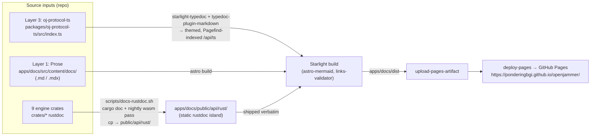
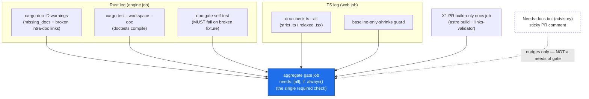
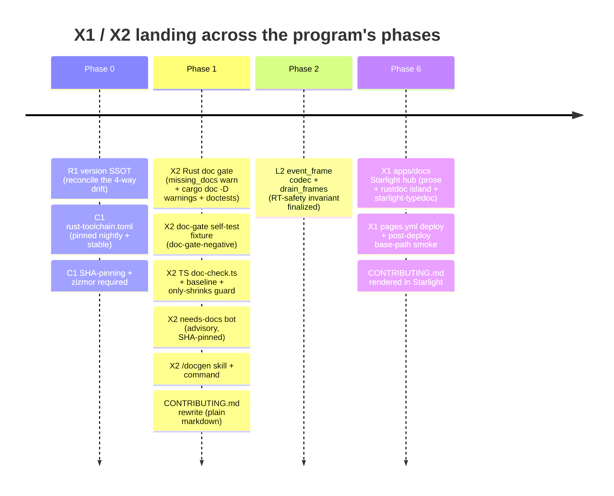

# Documentation: Starlight + Enforcement

This section finalizes two intertwined decisions: **X1** — *what the docs site is and how it ships* — and **X2** — *how documentation becomes a CI-enforced requirement, not a hope*. They are upstream/downstream: X2 produces the enforced rustdoc + TSDoc that X1 renders. Both are now decided in full. Build them in the order the repo-wide sequencing dictates: X2's near-free Rust gate and the `CONTRIBUTING.md` rewrite land early (Phase 1, alongside the `just` command surface and the `oj` Bun CLI), and the Starlight hub (X1) lands in Phase 6 once it has enforced API surfaces and a finalized Real-Time Safety invariant to render.

> **Note:** This section is self-complete. Every must-fix from [`00-overview.md`](00-overview.md) that touches docs is restated and scoped here; you should not need the overview open to implement X1 or X2 correctly. Canonical terms are defined once in [`GLOSSARY.md`](GLOSSARY.md); [`00-overview.md`](00-overview.md) is authoritative on any divergence. Cross-references are given as relative links into [`docs/plans/`](.).

## Decisions at a glance

| Decision | Winner | One-line why |
|---|---|---|
| **X1** — Docs site shape | **Hybrid**: Starlight prose hub + co-hosted rustdoc island + in-site `starlight-typedoc` for the `oj-protocol-ts` TS mirror, one Pages deploy | Maximum unification effort spent only where it is cheap and high-value (the tiny, exhaustively-documented wire contract); the cfg-saturated 9-crate engine surface stays on the canonical rustdoc experience no converter reproduces faithfully. |
| **X2** — Docs-as-a-requirement | **Hybrid**: CI-enforced coverage gates (Rust `missing_docs` + `cargo doc -D warnings`; TS `doc-check` baseline ratchet) + advisory needs-docs bot + author-side `/docgen` | Deterministic + CI-enforced is the load-bearing spine (free OSS Actions, zero audio-path footprint); the AI assist is structurally kept out of the merge decision, making compliance a 3-minute review instead of a 20-minute chore. |

> **Note:** These two decisions are tightly coupled — X2 (CI enforcement) is *upstream* of X1 (site rendering). The table shows the final verdict for each; dependencies and phase ordering are detailed below. Both rows agree verbatim with the X1/X2 rows of [`00-overview.md`'s "Decisions at a glance"](00-overview.md#decisions-at-a-glance).

> **Verified:** "9-crate engine surface" = the nine members of `crates/` (`ojproto`, `ojcore-dsp`, `ojcore`, `ojinstrument`, `ojcore-native`, `ojcore-wasm`, `ojcore-midiring`, `ojhost`, `ojfaust`). The full workspace is **10 members** — those nine plus `src-tauri` (the Tauri shell, package name `oj-tauri`) — per `Cargo.toml:5` (`members = ["crates/*", "src-tauri"]`). X1 deliberately documents the **engine** API, so the rustdoc island covers the 9 engine crates; `ARCHITECTURE.md` migrates as the full 10-member crate map.

---

## X1 — Starlight prose hub + linked-out rustdoc + in-site TypeDoc, one Pages deploy

### The chosen design

Build **one** Astro 5 + Starlight site, shipped as a **single GitHub Pages artifact**, structured as a hybrid of "prose-plus-linked" and "typedoc-plus-rustdoc". Three content layers, one deploy.

#### Layer 1 — Prose hub (the spine; ship first)

A **new, dependency-isolated package** `apps/docs/`. This is *not* a Bun workspace member.

> **Verified:** the root `package.json` has **no `workspaces` field** — it declares `name: "openjammer"`, `version: "0.1.0-alpha"`, `private: true`, `type: "module"`, `scripts`, `dependencies`, and `devDependencies`, with no `workspaces` key (`package.json:1-69`). The isolation is therefore **free**, not a workaround.

The isolation is the firewall against the exact failure that has *disabled* lycatra's embedded docs build today.

> **Note:** lycatra is a sister project in the OpenJammer ecosystem with an established Starlight build pattern. Internal reference, verified in `C:\dev\projects\lycatra\apps\docs\astro.config.mjs`: `@astrojs/sitemap@3.7.0` calls `z.function(...).args()`, which was **removed in Zod 4**, and Bun hoists the monorepo's single Zod 4 copy into sitemap → the build is broken. The collision is documented in that project's issue history; the dependency-isolation pattern here prevents the same lock-in.

`apps/docs/README.md` opens with a **loud warning**:

> **Must-fix (build-integrity):** DO NOT add `apps/docs` to a root `workspaces` field. This package keeps its own `bun.lock` precisely to firewall the Zod 3/4 sitemap collision that disabled lycatra's docs build. Adding it to a root workspace reproduces that failure.

Dependencies (pinned, treated as deliberate upgrades), installed in `apps/docs` only:

```jsonc
// apps/docs/package.json (devDependencies, pinned)
"astro": "^5.17",
"@astrojs/starlight": "^0.37",
"starlight-typedoc": "^0.21",
"typedoc": "^0.28",
"typedoc-plugin-markdown": "^4.9",
"starlight-links-validator": "^0.19",
"astro-mermaid": "^1.3"
```

> **Note (Phase 6 deliverable):** apply the lycatra template directly. Use `C:\dev\projects\lycatra\apps\docs\astro.config.mjs` as the exact reference, then scaffold OpenJammer's package by: (1) create `apps/docs/package.json` with **only** the pinned devDeps above and a `"build": "astro build"` script; (2) create `apps/docs/tsconfig.json` extending `astro/tsconfigs/strict`; (3) create `apps/docs/astro.config.mjs` per the [Layer 3 excerpt below](#layer-3--ts-api--in-site-starlight-typedoc-the-one-upgrade-over-pure-linked-out); (4) commit an islanded `apps/docs/bun.lock` from `bun install` run *inside* `apps/docs`.

Content migrated into `apps/docs/src/content/docs/` from the verified `docs/` inventory:

| Source (`docs/`) | Destination group | Notes |
|---|---|---|
| `ARCHITECTURE.md` (crate map) | `architecture/` | The full 10-member workspace overview (9 engine crates + `oj-tauri`). |
| `TESTING.md` | `testing/` | Folds in the FP-reproducibility policy (see below). |
| `creating-nodes.md`, `node-standards.md`, `creating-resizable-nodes.md` | `guides/` | Fix the verified `NodeCanvas.tsx`-vs-`NodeWrapper.tsx` inaccuracy here (the routing keystone is `src/components/Nodes/NodeWrapper.tsx`, not `src/components/Canvas/NodeCanvas.tsx`). |
| `GPU_LATENCY_STRATEGY.md`, `PIPELINE_PRERENDERING_STRATEGY.md`, `UNIFIED_PIPELINE_OPTIMIZATION_PLAN.md` | `strategy/` | Diagram-heavy → `astro-mermaid`. |

> **Verified:** `docs/` contains exactly **8** markdown files (`ARCHITECTURE.md`, `TESTING.md`, `creating-nodes.md`, `node-standards.md`, `creating-resizable-nodes.md`, `GPU_LATENCY_STRATEGY.md`, `PIPELINE_PRERENDERING_STRATEGY.md`, `UNIFIED_PIPELINE_OPTIMIZATION_PLAN.md`). The stale `CONTRIBUTING.md` lives at the **repo root**, not under `docs/`, and is surfaced here as a 9th rendered page after its Phase-1 rewrite.

Plus **two new first-class pages** that are cross-cutting publication surfaces for other decisions:

- **`real-time-safety.mdx`** — the canonical audio-thread invariant page. Documents: never alloc/lock/block on the audio thread; `assert_no_alloc` as the CI enforcement (native-only — see the cross-cut below); the `ByteRing` wait-free SPSC transport in `ojcore-midiring`; and that **all RT logging/telemetry rides the `ByteRing` + a fixed-byte `event_frame` codec drained off-RT via `drain_frames`** (this is where the L1/L2/L4 logging substrate's invariants are published). Also documents the **FP-reproducibility policy** (libm-only, no `fast-math`/`target-cpu`, `lto = "thin"`) that the device-free `render` gate and cross-target test legs depend on.
- **`dual-target.mdx`** — native `<5ms` (WASAPI/ASIO, CoreAudio, ALSA/JACK via `cpal` in `ojcore-native`) vs browser honest `~15–25ms` (wasm32 AudioWorklet host `ojcore-wasm`). Documents COOP/COEP cross-origin isolation + `SharedArrayBuffer` requirement, the Workbox PWA, and — critically — the **actual JS surface** web consumers call (`init`/`process`/`load_graph` plus the `*_ptr`/`*_len`/`*_offset` `#[wasm_bindgen]` exports verified in `crates/ojcore-wasm/src/lib.rs`), since rustdoc documents the Rust fns, not the generated JS bindings.

The **stale `CONTRIBUTING.md`** content is rewritten and surfaced here.

> **Must-fix (high):** the *plain* `CONTRIBUTING.md` is fixed in **Phase 1** (see [the X2 must-fixes](#adversarial-must-fixes-folded-in-x2)); only its Starlight *rendering* lands with the hub in Phase 6. Do not defer the rewrite to Phase 6.

`astro-mermaid` for the diagram pages; `starlight-links-validator` for prose with `exclude: ['/api/rust/**']` (rustdoc's intra-doc links are out of Starlight's reach).

#### Layer 2 — Rust API = co-hosted rustdoc (linked-out, honest)

Generate rustdoc with the **same feature flags the `ci.yml` engine job uses** — verified in `.github/workflows/ci.yml`: `ojhost --features clap-host` (lines 74-75) and `ojcore-native --features demo` (lines 64-65) — plus a separate nightly wasm pass for the AudioWorklet host:

```bash
# scripts/docs-rustdoc.sh — single source of the doc feature flags (mirrors ci.yml)
set -euo pipefail
cargo doc --workspace --no-deps \
  --features "clap-host,demo"           # host-target crates: ojhost, ojcore-native
cargo +nightly doc -p ojcore-wasm \
  --target wasm32-unknown-unknown -Z build-std=std,panic_abort   # browser host

DEST=apps/docs/public/api/rust
rm -rf "$DEST"; mkdir -p "$DEST"     # clean first → no stale paths on crate rename
cp -r target/doc/* "$DEST"/
# cargo #8229 workaround: hand-written landing + Jekyll opt-out
cat > "$DEST/index.html" <<'EOF'
<!doctype html><meta http-equiv="refresh" content="0; url=ojcore/index.html">
<a href="ojcore/index.html">OpenJammer Rust API</a>
EOF
touch "$DEST/.nojekyll"
```

> **Phase 6 deliverable:** create `scripts/docs-rustdoc.sh` as a committed shell script, co-owned by C1 (CI/toolchain) and X2 (doc gate). It is the **single source** of the doc feature flags (`clap-host`, `demo`) consumed by **both** `pages.yml` (X1) and the X2 Rust doc-gate CI step, so the two can never silently diverge on which backends are documented. See the [feature-flag-drift must-fix](#adversarial-must-fixes-folded-in-x1).

Astro ships `apps/docs/public/api/rust/` verbatim to `/api/rust/<crate>/`. rustdoc remains its **own themed island** — the honest choice, because no converter reproduces rustdoc's intra-doc links, source view, trait-impl rollups, and feature pages faithfully.

> **Note:** Do not iframe rustdoc — it breaks search, deep-linking, dark-mode, and mobile. Plain-hyperlink out from the Starlight sidebar instead.

#### Layer 3 — TS API = in-site `starlight-typedoc` (the one upgrade over pure linked-out)

Document **exactly one** entry point: `packages/oj-protocol-ts/src/index.ts`.

> **Verified:** package name `@openjammer/oj-protocol` (`packages/oj-protocol-ts/package.json:2`), the hand-maintained `oj-protocol-ts` TS mirror of the `ojproto` wire contract, kept honest by `crates/ojproto/tests/wire_shapes.rs` (the `wire_shapes.rs` parity gate), with `src/index.ts` declared as both `main` and `types` (`package.json:7-8`). The file header itself states it is "HAND-WRITTEN … deliberately NOT codegen and NOT ts-rs … kept honest by the Rust guard test `crates/ojproto/tests/wire_shapes.rs`" (`packages/oj-protocol-ts/src/index.ts:1-9`).

This is the single most important and most-deserving artifact in the repo. Render it via `starlight-typedoc` + `typedoc-plugin-markdown` as **themed, searchable, Pagefind-indexed** pages under `/api/ts`.

Configure in `apps/docs/astro.config.mjs`, applying lycatra's **proven** block (the same options shipped at `C:\dev\projects\lycatra\apps\docs\astro.config.mjs`, a peer project, just scoped to one package):

```js
// apps/docs/astro.config.mjs (excerpt)
import starlightTypeDoc, { typeDocSidebarGroup } from "starlight-typedoc";
import starlightLinksValidator from "starlight-links-validator";
import mermaid from "astro-mermaid";

export default defineConfig({
  site: "https://ponderingbgi.github.io/openjammer",
  base: "/openjammer/",
  output: "static",
  integrations: [
    mermaid({ autoTheme: true }),
    starlight({
      title: "OpenJammer",
      plugins: [
        starlightTypeDoc({
          entryPoints: ["../../packages/oj-protocol-ts/src/index.ts"],
          tsconfig: "../../packages/oj-protocol-ts/tsconfig.json",
          output: "api/ts",
          sidebar: { label: "@openjammer/oj-protocol", collapsed: true },
          typeDoc: {
            excludePrivate: true, excludeInternal: true, readme: "none",
            skipErrorChecking: true, parametersFormat: "htmlTable",
            useCodeBlocks: true, hideBreadcrumbs: true, hidePageHeader: true,
            useHTMLEncodedBrackets: true, sanitizeComments: true,
          },
        }),
        starlightLinksValidator({ exclude: ["/api/rust/**"] }),
      ],
      sidebar: [
        // ...prose groups...
        {
          label: "API Reference",
          items: [
            typeDocSidebarGroup, // in-site TS protocol pages
            { label: "Rust crates (rustdoc)", link: "/api/rust/ojcore/index.html" },
          ],
        },
      ],
    }),
  ],
});
```

> **Note:** the `entryPoints` config references `../../packages/oj-protocol-ts/tsconfig.json`. That tsconfig must exist; if `oj-protocol-ts` does not yet ship one, add a minimal `tsconfig.json` (extending the repo's `tsconfig.app.json` compiler options, `noEmit: true`) as part of the Phase 6 scaffold.

> **Note:** Do **not** TypeDoc the React `src/` tree (verified **66 `.tsx`** files plus **121 `.ts`** files = **187 TS files** total under `src/`) — no barrel, low value, noisy. The graft is deliberate and bounded: pay the small `starlight-typedoc` coupling cost for exactly one tiny, stable entry point where unified search/theme matters most.

> **Note — X1↔X2 scope split:** X1's `starlight-typedoc` *renders* only the one strict entry point (`packages/oj-protocol-ts/src/index.ts`) for unified in-site search/theme. X2's `doc-check --all` gate *covers* all TS files (strict for protocol/engine/logic, relaxed for React `.tsx`). They are **complementary**: X2 enforces coverage everywhere; X1 showcases the single most important API. See [the X2 TS leg](#ts-leg-the-real-work--baseline--ratchet-phase-1).

#### The three content layers into one deploy



> **Note:** the rustdoc island is the only layer that is *not* re-themed — it is copied byte-for-byte into `public/api/rust/` and linked out. Layers 1 and 3 share Starlight's theme and Pagefind search; Rust items deliberately stay out of Pagefind (see [must-fixes](#adversarial-must-fixes-folded-in-x1)).

#### Deploy: a new `pages.yml` workflow

A **new** workflow, separate from `ci.yml`, **ubuntu-only** (free for OSS):

> **Note — SHA pinning:** every `<SHA>` placeholder below is pinned to a specific commit hash **at commit time**, per C1 governance ("SHA-pin every third-party action by SHA"). The placeholders are replaced during implementation; the canonical pinned-SHA list lives in [the C1 GitHub Actions CI section](05-github-actions-ci.md). SHA pinning is the implementer's responsibility at merge time, and `zizmor` (a required check per C1) enforces that no floating tags remain.

```yaml
# .github/workflows/pages.yml
name: Docs (GitHub Pages)
on:
  push: { branches: [main] }
permissions: { contents: read, pages: write, id-token: write }
concurrency: { group: pages, cancel-in-progress: false }
jobs:
  build-deploy:
    runs-on: ubuntu-latest
    steps:
      - uses: actions/checkout@<SHA>           # SHA-pinned (see note above)
      - run: |                                  # reuse ci.yml's apt deps
          sudo apt-get update
          sudo apt-get install -y libasound2-dev libwebkit2gtk-4.1-dev \
            libgtk-3-dev libsoup-3.0-dev libjavascriptcoregtk-4.1-dev librsvg2-dev
      - uses: dtolnay/rust-toolchain@<SHA-nightly>   # rust-toolchain.toml pins exact nightly (C1)
        with: { components: rust-src, targets: wasm32-unknown-unknown }
      - uses: dtolnay/rust-toolchain@<SHA-stable>
      - uses: Swatinem/rust-cache@<SHA>
      - uses: oven-sh/setup-bun@<SHA>
      - run: bash scripts/docs-rustdoc.sh        # rustdoc passes + copy into public/
      - run: bun install --frozen-lockfile       # apps/docs OWN islanded lockfile
        working-directory: apps/docs
      - run: bunx astro build                    # runs starlight-typedoc + links-validator
        working-directory: apps/docs
      - name: Post-deploy smoke — rustdoc base path resolves (Astro #16276)
        run: curl -fsSL "https://ponderingbgi.github.io/openjammer/api/rust/ojcore/index.html" > /dev/null
      - uses: actions/upload-pages-artifact@<SHA>
        with: { path: apps/docs/dist }
      - uses: actions/deploy-pages@<SHA>
```

> **Note:** the apt dependency list mirrors `ci.yml`'s `engine` job verbatim (`.github/workflows/ci.yml:28-35`), and `Swatinem/rust-cache` matches the version C1 standardizes on (`@v2` floating today at `ci.yml:48`, SHA-pinned in the C1 foundation).

A **build-only (no-deploy) PR gate** runs `astro build` + `starlight-links-validator` so a broken internal link or a TypeDoc error fails CI on PRs. Per the cross-cutting CI rule, this PR gate is a **`needs` dependency feeding C1's single aggregate `gate` job** — not an independently-required check.

### Why this is the best compromise

The three researched directions disagree on exactly one axis: how unified the API rendering should be, traded against fragility.

- **`prose-plus-linked`** is the most robust backbone — we take its prose hub, one-Pages-artifact aggregation, meta-refresh + `.nojekyll` rustdoc index, links-validator exclude, and its rejection of the JSON extractor — but it would render `oj-protocol-ts` via TypeDoc's *default standalone HTML theme*, a third look and a third search box for the **highest-stakes artifact in the repo**.
- **`typedoc-plus-rustdoc`** gets the TS leg right (we adopt its in-site `starlight-typedoc` + co-hosted rustdoc almost verbatim) but under-weights the near-term need: migrating 8 `docs/*.md` + the stale `CONTRIBUTING.md`, codifying the RT-safety invariant, fixing stale CONTRIBUTING.

The compromise applies **maximum unification effort only where it is both cheap and high-value** (one tiny, stable TS entry point via off-the-shelf `starlight-typedoc`) and accepts the **honest co-hosted island only where unification is expensive and low-fidelity** (the 9 engine crates — all `crates/` members, excluding the `oj-tauri` UI shell — with their `no_std`/`std`, `clap-host`, `demo`, and `wasm32` cfg matrix). The dependency-isolation of `apps/docs` firewalls lycatra's exact failure mode, so we get the upside without the disabled build.

### Rejected alternatives

| Approach | Why rejected |
|---|---|
| **`custom-rust-extraction`** (rustdoc-JSON → MDX) | **Reliability-fatal.** rustdoc JSON is nightly-only and explicitly unstable: `FORMAT_VERSION` went 54→55→56→57 in ~5 months, each a breaking schema change — a nightly bump can brick the docs build at any time. It also forces a from-scratch renderer for generics/where-clauses/lifetimes/trait-impls (the easiest place to ship authoritative-looking *wrong* docs) plus mandatory multi-pass feature-merging. Open-ended maintenance treadmill, the opposite of "absolutely reliable while absorbing heavy community contributions." **Deferred to a future non-gating experiment at most**, pinned to a fixed nightly with a `format_version` assertion, never on the merge path. |
| **`prose-plus-linked` (as-stated)** | Closest baseline and the chosen backbone — only the TS-API rendering differs. Its TypeDoc-default-theme choice for `oj-protocol-ts` sacrifices unified in-site search/theme on precisely the artifact that most deserves it; the `starlight-typedoc` coupling, scoped to one tiny entry point and firewalled by an isolated lockfile, is cheap enough to justify the upgrade. |
| **`typedoc-plus-rustdoc` (as-stated)** | Its API design *is* the chosen hybrid's API layer (adopted). Not picked as-stated only because it leads with the API surface rather than the prose spine; the hybrid keeps its API design but ships the rustdoc copy step incrementally behind the prose hub. |

### Per-platform matrix

| Platform | How docs handle it |
|---|---|
| **Windows** | **No Windows doc runner.** The rustdoc, typedoc, and Astro builds are platform-independent and run on `ubuntu-latest` only, in `pages.yml`. Windows maintainers are served by the thin per-PR `windows-native` gate (engine build + device-free `render` + `assert_no_alloc`, verified at `.github/workflows/ci.yml:94-111`; see [`01-testing-and-reliability.md`](01-testing-and-reliability.md)); docs skip the Windows matrix for cost/simplicity. WASAPI/ASIO `cpal` backends are documented from source on the ubuntu host target; cfg-gated platform code is documented per the doc host's target (an accepted rustdoc limitation). This is a deliberate design decision: ubuntu simplicity over a per-platform doc matrix, because docs are build-time and platform-independent. |
| **macOS** | No macOS runner for docs. CoreAudio (aarch64 + x86_64) and the AU path in `ojhost` are documented from source on the ubuntu triple; platform-cfg specifics are noted in prose on `dual-target.mdx` rather than relying on per-OS doc builds. Unlike the Tauri installer release job, docs need no macOS matrix. |
| **Linux** | The docs pipeline **is** the Linux job: `ubuntu-latest` runs `cargo doc` (ALSA/JACK from source), the nightly wasm32 pass, `astro build`, and Pages deploy. Reuses the engine job's apt deps (`libasound2-dev` etc.) and `Swatinem/rust-cache`. |
| **Browser** | Two dimensions: (a) the published site is static HTML in any browser; (b) the wasm compile target is documented honestly — `cargo +nightly doc -p ojcore-wasm --target wasm32-unknown-unknown` documents the `#[wasm_bindgen]` AudioWorklet host, and `oj-protocol-ts` (the target-neutral JS↔wasm control-rate JSON contract) gets first-class in-site TypeDoc. Known gap: rustdoc documents Rust fns, not generated JS bindings, so `dual-target.mdx` describes the actual JS surface web consumers call. |

### Adversarial must-fixes folded in (X1)

Each must-fix is tagged with the **phase that owns its verification** and who is responsible.

- **Base-path 404 risk — Astro #16276 (Phase 6 deploy + post-deploy validation; X1).** Astro's `base` does not always prefix `public/` assets, so the deployed `/openjammer/api/rust/<crate>/` path **must be validated on the real deployed URL, not localhost**. The `pages.yml` workflow above includes a post-deploy smoke step (`curl -fsSL https://ponderingbgi.github.io/openjammer/api/rust/ojcore/index.html`) that treats a 404 as a deploy failure. If the base prefix proves disruptive, use absolute-with-`base` links or fall back to a custom domain (which drops the base prefix entirely — see [open questions](#open-questions--decisions-deferred)).
- **rustdoc not in Pagefind (Phase 6; X1).** Rust structs are absent from Starlight's global search. Document this explicitly on the `/api/` landing page ("use rustdoc's own search for Rust items") — the accepted cost of the co-hosted island.
- **Feature-flag drift vs `ci.yml` (Phase 1 gate authored / Phase 6 site build; shared C1↔X2 ownership of `scripts/docs-rustdoc.sh`).** `cargo doc` flags (`clap-host`, `demo`) live in **one shared script** `scripts/docs-rustdoc.sh`, consumed by both `pages.yml` (X1) and the X2 doc gate, so backends are never silently omitted. The script is the source-of-truth; neither CI step hard-codes the flags independently.
- **Single version string — cross-cutting with R1 (Phase 0 prerequisite / Phase 6 surface; X1 reads R1's SSOT).** The site title/footer reads **one** canonical version sourced from R1's `release-please` SSOT. Versioned per-tag `/vX.Y/` subtrees are deferred until the verified `0.0.0` (`Cargo.toml:9`) / `0.1.0-alpha` (`package.json:3`) / `0.1.0` (`src-tauri/tauri.conf.json:4`) / `0.0.0` (`packages/oj-protocol-ts/package.json:3`) four-way drift is reconciled by R1.
- **`CONTRIBUTING.md` fix not deferred to Phase 6 (Phase 1; X2-owned, surfaced by X1 in Phase 6).** Per the high-severity governance weakness, the *plain* `CONTRIBUTING.md` rewrite moves to **Phase 1**; only its Starlight rendering waits for the hub.

### Risks + mitigations — residual trade-offs accepted by design

| Risk | Mitigation |
|---|---|
| `starlight-typedoc` breakage on Astro/Starlight pre-1.0 major bumps | Touches **one** tiny entry point; pin versions; PR build-only gate catches breakage before merge. |
| Future maintainer adds `apps/docs` to a root `workspaces` field → reproduces lycatra's Zod 3/4 break | Loud `README.md` warning + islanded `bun.lock`. |
| Cross-tree links from prose into `/api/rust/**` are unvalidated (excluded) | Optional `lychee` post-build pass over `dist/` if renamed-item 404s become a problem. |
| Base-path 404 under project Pages (#16276) | Post-deploy `curl` smoke against the real deployed URL (in `pages.yml` above). |

---

## X2 — CI-enforced doc coverage gates + deterministic doc-check + `/docgen` authoring assist

### The chosen design

A **three-layer docs-as-a-requirement system** with a strict trust split: **enforcement is CI-only and merge-blocking** (OpenJammer's explicit want — the opposite of lycatra's local-CI choice we were told *not* to copy); the **deterministic checker** is the contract both CI and an optional local hook run; an **AI `/docgen` skill** makes passing the gate cheap and produces real prose.

#### Rust leg (near-free; turn on now — Phase 1)

Add a workspace lint and a cargo-doc gate.

```toml
# Cargo.toml [workspace] — start at warn, ratchet to deny per crate
[workspace.lints.rust]
missing_docs = "warn"
```

> **Verified:** research confirmed **0 `missing_docs` across all 9 engine crates today**, and `crates/ojproto/src/lib.rs` (crate-level `//!` at lines 1-8, item-level `///` throughout) + `crates/ojcore-midiring/src/lib.rs` confirm an already-excellent doc-comment culture. The root `Cargo.toml` has no `[workspace.lints]` section yet (`Cargo.toml:1-22`), so this is a clean addition.

Ratchet `ojproto`, `ojcore-midiring`, `ojcore-dsp` to `deny` first (already exemplary).

Add **one step to the existing `engine` job in `ci.yml`**, immediately after the `Clippy (-D warnings)` step (verified at `.github/workflows/ci.yml:51-52`, `cargo clippy --workspace --all-targets -- -D warnings`):

```yaml
      - name: Doc gate (missing_docs + broken intra-doc links)
        run: RUSTDOCFLAGS="-D warnings" cargo doc --workspace --no-deps --features "clap-host,demo"
      - name: Doctests compile
        run: cargo test --workspace --doc
```

This catches `missing_docs` **and** broken intra-doc links (e.g. `` [`OjGraph`] ``, `` [`RtCommand`] ``) in one device-free pass, reusing `Swatinem/rust-cache@v2` (`.github/workflows/ci.yml:48`). **Stay on stable for the gate**; do *not* depend on nightly rustdoc-JSON (`--output-format json` is unstable). The wasm leg's nightly stays scoped to wasm only.

> **Note:** the `--features "clap-host,demo"` here is the same flag set sourced from `scripts/docs-rustdoc.sh` — the X2 gate and X1's `pages.yml` both read it, so the documented feature surface never drifts.

#### TS leg (the real work — baseline + ratchet; Phase 1)

Port lycatra's `scripts/hooks/doc-check.ts` → `scripts/doc-check.ts` (Bun, TS Compiler API single-file parse) plus `scripts/generate-baseline.ts`, `.doc-check.json`, `.doc-check-baseline.json` at repo root.

> **Verified:** OpenJammer has **no `workspaces` array** (`package.json:1-69`), so adapt `collectAllFiles` to **explicit globs** rather than reading workspace members.

```jsonc
// .doc-check.json
{
  "severity": { "missingJsdoc": "error", "missingParam": "error", "missingReturns": "error" },
  "symbolPatterns": { "exempt": ["^_", "Props$", "Schema$"] },
  "ignoreComment": "@doc-ignore",
  "exclude": ["**/*.test.ts", "**/*.spec.ts"],
  "strict":  ["packages/oj-protocol-ts/src/index.ts", "src/**/!(*.tsx)"],
  "relaxed": ["src/**/*.tsx"]
}
```

> **Note:** TSX policy (honesty about strength) — do **not** pretend to enforce `@param`/`@returns` on React components. Scope the **strict param-level gate** to `packages/oj-protocol-ts/src/index.ts` and non-component `src/*.ts` (protocol, stores, engine-adapter, hooks logic — the bulk of the 121 `.ts` files). Apply a **relaxed rule** to `*.tsx` (require a one-line component-level JSDoc only, no `@param`/`@returns`), detecting `*.tsx` component exports as functions returning JSX. The gate is **honest**: strong for protocol/engine/logic, light for the 66 `.tsx` UI files.

Generate the **day-one baseline** (`bun run scripts/generate-baseline.ts`) to grandfather the existing gaps so adoption blocks nobody; the ratchet tightens only on touched files. Add to the **`web` job in `ci.yml`**, after the `Lint` step (verified at `.github/workflows/ci.yml:87-88`, `bun run lint`):

```yaml
      - name: Doc coverage (TS)
        run: bun run scripts/doc-check.ts --all
```

`package.json` scripts: `"docs:check": "bun run scripts/doc-check.ts --all"`, `"docs:check:fix": "bun run scripts/doc-check.ts --fix"`.

**Baseline-only-shrinks guard:** a small CI step asserts `.doc-check-baseline.json` entry count is `<=` the count on the PR base branch — prevents contributors appending to the baseline to dodge the gate.

#### Diff-aware needs-docs bot (advisory, supply-chain-safe)

```yaml
# .github/workflows/docs-bot.yml
name: Needs-docs
on: { pull_request: { types: [opened, synchronize] } }   # NOT pull_request_target
permissions: { contents: read, pull-requests: write }
jobs:
  needs-docs:
    runs-on: ubuntu-latest
    steps:
      - uses: actions/checkout@<SHA>           # every action SHA-pinned (C1)
      - uses: oven-sh/setup-bun@<SHA>
      - run: bun install --frozen-lockfile
      - name: Changed set (native gh — NEVER tj-actions/changed-files, CVE-2025-30066)
        run: gh pr diff "${{ github.event.number }}" --name-only > changed.txt
        env: { GH_TOKEN: "${{ github.token }}" }
      - run: bun run scripts/docs-needed.ts changed.txt > report.md
      - name: Sticky comment
        run: gh pr comment "${{ github.event.number }}" --edit-last --body-file report.md
        env: { GH_TOKEN: "${{ github.token }}" }
```

`scripts/docs-needed.ts` reuses the `doc-check.ts` AST half for TS + a regex pass for added Rust `pub` items in `ojproto`/`ojcore`, and posts **one** sticky comment listing undocumented public-surface deltas with copy-paste fix hints. The bot **nudges**; only the Rust cargo-doc gate and the TS `doc-check --all` are merge-blocking.

#### AI authoring layer (humane, optional, author-side only)

Add `.claude/skills/docgen/SKILL.md` (frontmatter `name`/`description`/`allowed-tools: Bash, Read, Edit, Grep, Glob`, mirroring the format of the existing `.claude/skills/resize-image/SKILL.md`, which ships `allowed-tools: Bash, Read` per `:4`) and optionally `.claude/commands/docgen.md` (headless `claude --print` pattern from the existing `.claude/commands/research.md`). Procedure:

1. run `git diff --name-only main...HEAD` + `bun run scripts/doc-check.ts --json` for the exact undocumented-symbol list;
2. Read each symbol + its call sites;
3. ground prose in `agents.md`/`CLAUDE.md` invariants (`no_std`, control-rate-only, the `ByteRing` wait-free SPSC contract in `ojcore-midiring`);
4. write real `///` and `/** */` via Edit;
5. re-run the deterministic gate to self-verify;
6. **STOP and hand back an UNSTAGED diff** the author must read and `git add`.

AI stays strictly author-side — **never `claude -p` in CI for authoring** (non-deterministic, metered, flaky). Doctest safety: `/docgen` marks any audio-thread rustdoc example `no_run`/`ignore`.

#### Intentionally defer: the lefthook pre-commit hook

> **Verified:** the repo has **no hooks today** (no `lefthook.yml`, no `.husky/`) and a Windows-only founder.

Introduce the optional `bun run docs:check` script and document the hook as opt-in. Per the cross-cutting hook decision, the single `lefthook.yml` is **T1-owned** and lands later; when adopted it uses lefthook's native `run:` with `bun` (never bash `.sh` wrappers, for Windows). CI is the gate; the hook is later convenience.

#### Doc-coverage enforcement flow



> **Note:** the merge-blocking gates (`cargo doc -D warnings`, doctests, the doc-gate self-test, `doc-check --all`, the baseline-shrinks guard, and X1's build-only docs job) are all **`needs` dependencies of C1's single aggregate `gate` job** — none is an independently-required check. The needs-docs bot is advisory and feeds nothing.

### Why this is the best compromise

The three directions are not competitors — they are the three layers of one correct system, each fixing the others' gaps:

- **`ci-linkcheck-diffbot`** correctly puts enforcement in free GitHub Actions and notes the Rust gate is near-free (adopted: Gate 2 `cargo doc -D warnings` + Gate 3 the advisory bot, now). But its Gate 1 (Starlight build + links-validator) **presumes a docs site that does not yet exist** — that belongs to X1, and lycatra's own Starlight build is *disabled* by the Zod 4 collision, so making a fragile transitive-dep build merge-blocking would relocate false-positive fatigue, not remove it. Deferred to X1.
- **`doccheck-baseline-denymissing`** supplies the missing piece — param-level TS granularity, a battle-tested file:symbol:rule baseline that blocks nobody day one, the only-grows guard, the `#![deny(missing_docs)]` ratchet — but its native habitat is a **pre-commit hook**, premature for a hooks-free Windows-founder repo. We relocate its **checker into CI** and keep the hook optional.
- **`ai-proactive-doc`** is self-admittedly the easy layer that enforces nothing (coverage ≠ correctness) — so it cannot stand alone — but it solves the single failure mode that kills every docs mandate (the friction of writing prose) and produces real, invariant-grounded docs instead of lycatra's `'The result.'`-grade auto-stubs.

The result: **deterministic + CI-enforced is the load-bearing spine** (reliability, reproducibility, zero audio-path footprint by construction); **AI is the unblocking assist structurally kept out of the merge decision** (writes an unstaged diff a human reviews). This maximizes what OpenJammer optimizes for — absolute reliability while absorbing heavy community contributions — by making the gate strict and free while making compliance a 3-minute review.

### Rejected alternatives

| Approach | Why rejected (and what we kept) |
|---|---|
| **`doccheck-baseline-denymissing` (as-stated)** | Strong checker, wrong primary delivery vehicle (pre-commit hook on a hooks-free Windows repo); leaves the TSX/React surface essentially unguarded and offers no diff-aware nudge. **Kept wholesale:** the `doc-check.ts` checker, file:symbol:rule baseline, only-shrinks guard, the Rust `#![deny(missing_docs)]` ratchet — run in CI, hook opt-in. |
| **`ci-linkcheck-diffbot` (as-stated)** | Correct enforcement philosophy (adopted in full). But Gate 1 presumes a non-existent Starlight site, and its TS half is thinner than direction 1's full checker. **Kept:** Gate 2 (`cargo doc -D warnings`) + Gate 3 (advisory diff bot) now; **deferred:** the Starlight link-check to X1; **substituted in:** direction 1's full TS checker. |
| **`ai-proactive-doc` (as-the-gate)** | Cannot be the gate — non-deterministic, metered, flaky in CI; coverage ≠ correctness. **Kept exactly as scoped:** a `/docgen` skill writing an unstaged diff a human reviews, structurally out of the merge decision.<br><br>The AI assist is **not** a gate; it is the unblocking layer that runs *after* the deterministic CI spine validates coverage. |

### Per-platform matrix

| Platform | How enforcement handles it |
|---|---|
| **Windows** | All gates run host-side on the existing ubuntu `engine`/`web` jobs; `cargo doc` + `doc-check` inspect **source**, so the `windows-native` job (`.github/workflows/ci.yml:94-111`) is untouched. Founder on Windows 11: lefthook deferred/optional; when adopted, native `run:` invoking `bun` directly — never bash `.sh` (lycatra's `ensure-bun-version.sh` etc. depend on Git-Bash). `gh` CLI is preinstalled on runners; the bot needs no local Windows tooling. |
| **macOS** | No macOS-specific docs work. `cargo doc` and `bun doc-check` are OS-agnostic on ubuntu CI. macOS-native (CoreAudio, aarch64 + x86_64) audio code is doc-checked identically since the gate is source-level. |
| **Linux** | Primary CI host already runs `engine` + `web`; add the `cargo doc -D warnings` + doctest steps to `engine` and `doc-check --all` + baseline-shrinks to `web`. No new runner OS. `starlight-links-validator` intentionally deferred to X1. |
| **Browser** | Fully symmetric: the gate inspects source independent of whether TS compiles to the wasm32 AudioWorklet host (`ojcore-wasm`, already 0 `missing_docs`) or React DOM, and whether Rust targets wasm32 or native. The `ByteRing` wait-free SPSC transport in `ojcore-midiring` is already richly documented; `/docgen` is instructed to **mirror, not modify** its `# Safety` notes. No COOP/COEP interaction — docs are build-time text. |

### Adversarial must-fixes folded in (X2)

Each tagged with the owning phase.

- **Standing negative-test for `RUSTDOCFLAGS=-D warnings` — replaces the throwaway commit (Phase 1; X2).** `RUSTDOCFLAGS -D warnings` has historical exit-0 edge cases. A one-time "seed a broken link and revert" check does not survive toolchain bumps. **Commit a permanently-broken-doc fixture behind a cfg/feature** (e.g. `crates/ojproto/src/doc_gate_fixture.rs` with a deliberately broken `` [`Nonexistent`] `` intra-doc link, behind `#[cfg(feature = "doc-gate-negative")]` — note `crates/ojproto/Cargo.toml` has no `[features]` section today, so this adds one) and add a dedicated CI cell that builds it and **asserts a non-zero exit**:

  ```yaml
      - name: Doc gate self-test (MUST fail — proves -D warnings red-walls)
        run: |
          if RUSTDOCFLAGS="-D warnings" cargo doc -p ojproto --no-deps \
               --features doc-gate-negative 2>/dev/null; then
            echo "::error::doc gate did NOT fail on a broken intra-doc link"; exit 1
          fi
  ```

  This turns "does `-D warnings` actually fail" into a standing per-PR assertion that survives toolchain bumps, feeding C1's aggregate `gate`.

- **`CONTRIBUTING.md` correct in Phase 1, not Phase 6 — high severity (Phase 1; X2-owned).**

  > **Verified:** the root `CONTRIBUTING.md` is stale — prerequisites list **Bun only**, no Rust toolchain (`:7-8`); the app is claimed "available at `http://localhost:3000`" (`:23`) but the Vite dev server runs on **5173** (confirmed: `src-tauri/tauri.conf.json:7` `"devUrl": "http://localhost:5173"`); it documents a `src/lib` directory (`:38`) and **Tailwind CSS** utility classes (`:109-111`); and points node-authoring at `src/engine/registry.ts` (`:127`) rather than the verified routing keystone `src/components/Nodes/NodeWrapper.tsx`. A contributor following it **literally cannot build the Rust engine** and will hit the `bun`-only `preinstall` guard (verified: `package.json:23` aborts with "Use bun to install dependencies" if `npm_execpath` is not Bun).

  **Rewrite in Phase 1** — alongside the `just` command surface + the `oj` Bun CLI — to document: the full toolchain (Rust stable + pinned nightly, `wasm32` target, `just`, `cargo-nextest`, `bun`), the `just` recipe surface as the canonical commands, the RT-safety contract (never alloc/lock/block on the audio thread), the conventional-commit requirement (`release-please` depends on it from day one), and the **two-control-plane model** (a green PR gate ≠ full verification). The D2 docs-accuracy meta-check (the `NodeCanvas`-vs-`NodeWrapper` inaccuracy) runs from Phase 1 so the doc cannot re-rot.

- **Supply-chain-safe bot (Phase 1; X2).** `pull_request` (not `pull_request_target`), `permissions: {contents: read, pull-requests: write}`, every third-party action **SHA-pinned** per C1, changed set via native `gh pr diff --name-only` — **never `tj-actions/changed-files` (CVE-2025-30066)**.

- **All gates feed the single aggregate `gate` (Phase 1 wiring / per-PR thereafter; C1-owned invariant honored by X2).** Per the CI required-check foundation, `cargo doc -D warnings`, `doc-check --all`, the baseline-shrinks guard, the doc-gate self-test, and the X1 PR build-only docs job are all **`needs` dependencies of C1's one `gate` job** — never independently-required checks. "Do not rename the gate job" is the one documented invariant.

- **`assert_no_alloc` covers the doc-tagged RT path — cross-cut with L1/L2/L4 (Phase 2/3; X2 honors the logging cross-cut).** Doctests on audio-thread examples are marked `no_run`/`ignore` by `/docgen`; `ojcore`'s `assert_no_alloc` + `clippy -D warnings` backstop them, and (per the logging cross-cut) `assert_no_alloc` runs **with the logging feature ON** so the doc examples never imply an alloc-free guarantee the runtime doesn't hold.

### Risks + mitigations — residual trade-offs accepted by design

| Risk | Mitigation |
|---|---|
| Owning the ~1580-line `doc-check.ts` is a standing maintenance tax (TS Compiler API, `typescript ~5.9.x` — verified `package.json:64`) | Fallback is `eslint-plugin-jsdoc` (63.x, flat/recommended-typescript) in the existing eslint 9 flat config (verified `eslint ^9.39.1`, `package.json:59`) — loses `--fix` auto-stub UX and baseline granularity but is off-the-shelf and TS-aware. |
| Rust `missing_docs` is item-level only — a content-free one-line `///` satisfies it; no stable lint for `@param`/`@example` parity | Accept the asymmetry; `cargo test --doc` proves examples *compile*, not that they exist. Do not build a bespoke `syn` scanner now. |
| AI `/docgen` prose can be confidently **wrong** about RT / wait-free semantics yet pass coverage | Reviewer discipline on tagged generated blocks is the single point of failure; the existing `claude-auto-review.yml` bot can flag un-edited generated prose. (Note: the bot's `npm`-vs-`bun` bug is a governance must-fix in [the C1 section](05-github-actions-ci.md) — fix before relying on it.) |
| `docs-needed.ts` Rust regex mis-handles `pub use` re-exports, macro-generated items, trait-impl methods | Keep it **advisory only**; never promote to a gate without rustdoc-JSON (nightly, brittle). |
| Baseline rot on large refactors that churn file paths | Only-shrinks guard mitigates dodging; baseline diffs get review scrutiny. |

---

## Cross-cutting dependencies (both decisions)

- **Version SSOT (R1):** the site (X1) displays **one** version string; the `doc-check` baseline may carry a version stamp consistent with R1's [`release-please` (the single version brain)](03-release-channels-and-auto-update.md). The verified four-way version drift — `Cargo.toml:9` = `0.0.0`, `package.json:3` = `0.1.0-alpha`, `src-tauri/tauri.conf.json:4` = `0.1.0`, `packages/oj-protocol-ts/package.json:3` = `0.0.0` — is reconciled there, not here.
- **Real-Time Safety page (L1/L2/L4):** the RT-safe logging design — the `ByteRing` wait-free SPSC transport, the [`ojproto` `EventKind` schema](09-reference-schemas-and-code.md), and off-RT consumption ([L1 tracing sink / L2 schema / L4 DevLog rendering](02-logging-and-observability.md)) — is **published on X1's `real-time-safety.mdx`**; the docs site is the publication surface for that decision's invariants. L3 (SQLite/FTS5 persistence) is documented separately on the persistence pages, not on the RT-safety page (it is off the hot path).
- **CI/toolchain (C1):** `pages.yml` and the doc gate reuse C1's toolchain setup (pinned nightly + `wasm32` + `rust-src`, `Swatinem/rust-cache`, `setup-bun`) and the **shared `scripts/docs-rustdoc.sh` feature flags** (`clap-host`, `demo`) as the single source of doc feature flags. The single `rust-toolchain.toml` (C1-owned, Phase 0, absent today) is the prerequisite for the nightly wasm doc pass and golden reproducibility.
- **Hooks (lefthook):** the optional `docs:check --fix` stage plugs into T1's single `lefthook.yml` if/when adopted — this decision deliberately introduces no hook.
- **X2 → X1 data flow:** X2 produces the enforced rustdoc + TSDoc that X1's `starlight-typedoc` + co-hosted rustdoc render. Upstream data source, not a competing effort.

### Phase sequencing for X1 + X2



> **Note:** X2 lands first (Phase 1) and X1 last (Phase 6). X1 cannot ship a faithful site until X2 has enforced the rustdoc/TSDoc surfaces and Phase 2 has finalized the Real-Time Safety invariant that `real-time-safety.mdx` documents.

## Open questions / decisions deferred

1. **Versioned docs (`/vX.Y/` subtrees).** Deferred until R1's `release-please` unifies the four-way version drift. Until then the site shows one canonical version and a single latest tree.
2. **Custom domain vs project-Pages base.** `base: "/openjammer/"` is assumed; if the Astro #16276 `public/` base-prefix issue proves disruptive for `/api/rust/**`, a custom domain (which drops the base prefix entirely) is the fallback — decide after the first real deploy validates the asset paths via the `pages.yml` post-deploy smoke.
3. **`lychee` post-build cross-tree link validation.** Whether to add a `lychee` pass over `dist/` to catch prose→`/api/rust/**` 404s (currently excluded from `starlight-links-validator`). Deferred until renamed-Rust-item 404s are observed in practice.
4. **rustdoc `missing_docs` content quality.** Item-level coverage is enforced; there is no stable lint for `@example`/prose-quality parity on the Rust side. Accepted asymmetry — revisit only if a content-free-`///` problem actually emerges.
5. **Rust API in unified search.** rustdoc items stay out of Pagefind (accepted island cost). A future non-gating rustdoc-JSON → MDX experiment (pinned nightly, `format_version` assertion) could close this, but is explicitly **not** on the roadmap and never on the merge path.
