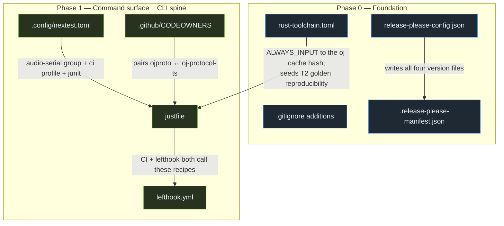
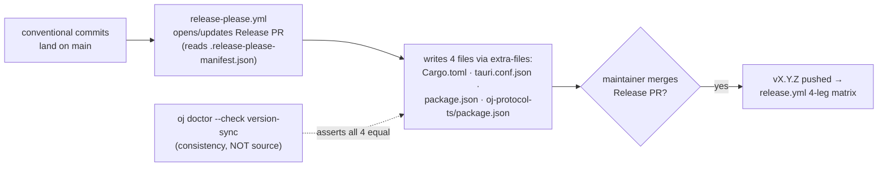
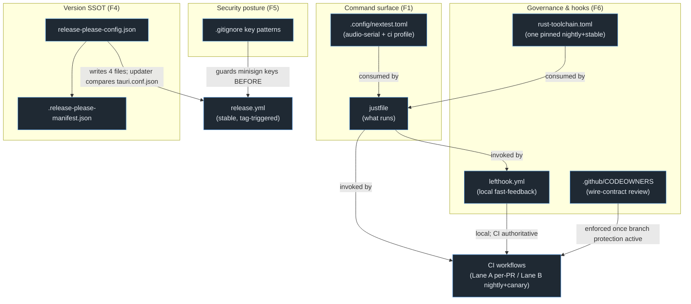

# Reference Configs — Ready-to-Use Configuration Appendix

> **Status:** decision-final reference appendix. This file is the **single collected home** for every copy-pasteable configuration file the foundations program introduces. Each block below is a **reference copy** — it reproduces, verbatim and commented, the exact config the owning section specifies, preceded by its **target repo path** and a one-line purpose. Place each at the indicated path during the phase its owning section names.
>
> **This appendix invents nothing.** Every file here is specified in [`01-testing-and-reliability.md`](01-testing-and-reliability.md), [`03-release-channels-and-auto-update.md`](03-release-channels-and-auto-update.md), [`04-developer-tooling.md`](04-developer-tooling.md), or [`05-github-actions-ci.md`](05-github-actions-ci.md). Where this appendix and a section disagree, **the owning section wins** and this file is the bug. Cross-references use relative links that resolve inside `docs/plans/`.

This appendix uses the canonical terms verbatim: the `oj` Bun CLI, the `just` command surface, `.config/nextest.toml`, the aggregate `gate` job, the `{stable, canary}` channel model, the `ByteRing` wait-free SPSC transport, the `ojproto` `EventKind` schema, the `event_frame` codec / `drain_frames`, the golden corpus, the device-free `render` gate, `assert_no_alloc`, `release-please` (the single version brain), affected-selection, COOP/COEP cross-origin isolation, minisign signing (split stable/canary keypairs), the `wire_shapes.rs` parity gate, Lane A (per-PR) / Lane B (nightly+canary), and the `oj-protocol-ts` TS mirror.

---

## Verified ground truth (re-checked against this tree)

All "absent today" claims below were verified directly against the checkout, not assumed.

> **Verified:** none of the files in this appendix exist in the tree today. A directory listing of the repo root shows only `.gitignore`, `eslint.config.js`, `vite.config.ts`, `vitest.config.ts` (plus the standard `Cargo.toml` / `package.json` / `tsconfig*.json`); there is **no** `justfile`, **no** `.config/` directory, **no** `lefthook.yml`, **no** `rust-toolchain.toml`, **no** `release-please-config.json` / `.release-please-manifest.json`, and **no** `.github/CODEOWNERS`. Every block below is a *create-in-Phase-N* artifact.

> **Verified:** the four-way version drift is exactly as the plan states.
>
> | File | `path:line` | Value today |
> |---|---|---|
> | Cargo workspace | `Cargo.toml:9` (`[workspace.package].version`) | `0.0.0` |
> | UI package | `package.json:3` | `0.1.0-alpha` |
> | Native shell | `src-tauri/tauri.conf.json:4` | `0.1.0` |
> | TS wire mirror | `packages/oj-protocol-ts/package.json:3` | `0.0.0` |

> **Verified:** the 10-crate workspace is `members = ["crates/*", "src-tauri"]` (`Cargo.toml:5`) — nine crates under `crates/` (`ojcore`, `ojcore-dsp`, `ojcore-midiring`, `ojcore-native`, `ojcore-wasm`, `ojfaust`, `ojhost`, `ojinstrument`, `ojproto`) plus `oj-tauri` (the `[package].name` in `src-tauri/Cargo.toml`).

> **Verified:** `.github/workflows/ci.yml` has exactly three jobs today — `engine` / *"Engine (Rust workspace)"*, `web` / *"Web (control plane)"*, `windows-native` / *"Windows native build + audio gate"* — with **no** aggregate `gate` job. `release.yml` fires on `push: tags: ["v*"]`, runs a 4-leg matrix through `tauri-apps/tauri-action@v0`, sets `releaseDraft: true` / `prerelease: false` (`release.yml:86-87`), and its `tauri-action` `env:` carries only `GITHUB_TOKEN` (`release.yml:79-80`).

> **Verified:** every third-party action in `ci.yml`, `release.yml`, and `build-installers.yml` floats on a major tag today — `actions/checkout@v4`, `oven-sh/setup-bun@v2`, `dtolnay/rust-toolchain@stable` / `@nightly`, `Swatinem/rust-cache@v2`, `tauri-apps/tauri-action@v0`, `actions/upload-artifact@v4`. SHA-pinning these is the Phase-0 must-fix that gates key provisioning. **The pins shown below are placeholders** (`# pin: <40-char-sha>`); resolve each against the action's release the moment you commit.

> **Verified:** the `ByteRing` SPSC contract is frozen at `crates/ojcore-midiring/src/lib.rs:24` (*"Exactly one thread (the producer) may call `push` and exactly one thread (the consumer) may call `pop`."*); `crates/ojcore/src/meter.rs` already defines `return_frame` with `TAG_METER = 1` (`meter.rs:142`) and `TAG_BEAT = 2` (`meter.rs:144`) and `pub type MeterRing = ojcore_midiring::ByteRing<8192>` (`meter.rs:203`). The `event_frame` codec adds `TAG_EVENT = 3` in Phase 2 — it is **not** present today.

> **Verified:** the `ojcore` crate today has only `default = ["std"]` and `std` features (`crates/ojcore/Cargo.toml:13-14`). The `devlog` feature referenced by the `just test-rt` recipe below is a **Phase-2 addition** (the RT-emit fault-path gate), not a current feature — it is shown as the post-Phase-2 target state, consistent with [`00-overview.md` Phase 2](00-overview.md#phase-2--event-schema--rt-transport-the-logging-spine).

> **Verified:** the `render` bin lives at `crates/ojcore-native/src/bin/render.rs`, is gated `required-features = ["demo"]` (`crates/ojcore-native/Cargo.toml:17`, `demo = ["dep:ojinstrument"]` at `:20`), and takes `<wav-path> <seconds>` positional args (`render.rs:51-56`). The `ojhost` `clap-host` feature exists (`crates/ojhost/Cargo.toml:24`, `clap-host = ["dep:clack-host"]`). `ojcore`'s `no_std` build is `cargo build -p ojcore --no-default-features` (`crates/ojcore/Cargo.toml:12-13`).

> **Verified:** COOP/COEP cross-origin isolation headers live **only** in `vite.config.ts` dev (`:130-131`) and preview (`:136-137`) servers today — `'Cross-Origin-Opener-Policy': 'same-origin'` + `'Cross-Origin-Embedder-Policy': 'require-corp'`. A production host must re-emit them; the committed `vercel.json` is specified in [`03-release-channels-and-auto-update.md` R3](03-release-channels-and-auto-update.md#r3--browser-pwa-auto-update-prompt-style-workbox-sw) and is **out of scope of this config appendix** (it is a hosting decision, not a developer-tooling file).

---

## File map — what goes where, and when



| # | Target path | Purpose | Phase | Owning section |
|---|---|---|---|---|
| 1 | `rust-toolchain.toml` | Pin one nightly (wasm `-Z build-std`, miri, sanitizers) + stable (fmt/clippy) | **0** | C1 ([05](05-github-actions-ci.md)) |
| 2 | `.gitignore` (additions) | Key/secret patterns committed **before** any minisign key is generated | **0** | R4 ([03](03-release-channels-and-auto-update.md)) |
| 3 | `release-please-config.json` | The single version brain: write all four version files in lockstep | **0** | R1 ([03](03-release-channels-and-auto-update.md)) |
| 4 | `.release-please-manifest.json` | release-please's current-version seed | **0** | R1 ([03](03-release-channels-and-auto-update.md)) |
| 5 | `justfile` | The one `just` command surface — *what* runs, called by CI **and** lefthook | **1** | T1 ([01](01-testing-and-reliability.md)) |
| 6 | `.config/nextest.toml` | `audio-serial` test-group + `ci` profile + JUnit | **1** | T1 ([01](01-testing-and-reliability.md)) |
| 7 | `lefthook.yml` | The one hook control plane: pre-commit + pre-push via `bunx` | **1** | T1/D2 ([01](01-testing-and-reliability.md)/[04](04-developer-tooling.md)) |
| 8 | `.github/CODEOWNERS` | Pair `ojproto` with the `oj-protocol-ts` mirror (and corpus snapshots) | **1** | C1/T2 ([05](05-github-actions-ci.md)/[01](01-testing-and-reliability.md)) |

---

## 1 — `rust-toolchain.toml`

> **Target path:** `rust-toolchain.toml` (repo root)
> **Purpose:** pin exactly one nightly — the only path that compiles `ojcore-wasm` (`cargo +nightly … -Z build-std`), plus miri and the sanitizer legs — alongside stable for fmt/clippy. It is created in the **first commit of Phase 0** (it is an `ALWAYS_INPUT` to the `oj` preflight cache hash and the seed of every T2 golden-reproducibility claim).

> **Why it must be first:** the browser-wasm compile path is nightly-only and **floats today** — `ci.yml` pulls `dtolnay/rust-toolchain@nightly` with no date pin (`ci.yml:40`). A floating nightly makes the T2 cross-target golden non-reproducible run-to-run; pinning it turns a nightly bump into a *deliberate re-bless* event.

```toml
# rust-toolchain.toml — ONE pinned nightly so the wasm/-Z build-std leg, miri,
# the sanitizer legs, and T2's cross-target golden are reproducible run-to-run.
# Created in the FIRST commit of Phase 0. Consumed by:
#   • the `just wasm` recipe (cargo +nightly … -Z build-std=std,panic_abort)
#   • `oj doctor`'s toolchain check (asserts this exact nightly is installed)
#   • the `oj preflight` cache hash (ALWAYS_INPUT — a bump busts every cache entry)
#   • T2's per-arch golden snapshots (a bump re-blesses them deliberately)
[toolchain]
# Bump deliberately; a bump re-blesses golden snapshots and busts the preflight cache.
channel = "nightly-2026-06-01"
# rust-src      → required for `-Z build-std` (the ONLY ojcore-wasm compile path)
# rustfmt/clippy → the `just fmt` / `just clippy` recipes
# miri          → T4's miri run over existing tests (Lane B / nightly)
components = ["rust-src", "rustfmt", "clippy", "miri"]
# The wasm32 AudioWorklet target. cpal hosts (WASAPI/CoreAudio/ALSA/JACK) build
# on the host target and need no extra entry here.
targets = ["wasm32-unknown-unknown"]
```

> **Note:** rustfmt and clippy ship on the **nightly** named here, so `just fmt` / `just clippy` resolve against this toolchain. This is intentional and matches the pinned-nightly-is-default model. The verified `ci.yml` workaround — installing nightly *first* then stable *last* so stable becomes the default for fmt (`ci.yml:36-47`) — is **superseded** by this single pin once the file exists: with a pinned nightly carrying the `rustfmt`/`clippy` components, the ordering dance is no longer needed.

---

## 2 — `.gitignore` additions

> **Target path:** `.gitignore` (repo root — **append** these patterns; do not replace the file)
> **Purpose:** ensure no signing key, certificate, or `.tauri/` artifact can ever be staged — committed **before** the first `bun tauri signer generate`, because the write-capable Claude auto-review bot literally runs `git add .` (both `claude-auto-review.yml` and `claude-mention-bot.yml` carry `contents: write`, verified).

> **Must-fix (critical):** `bun tauri signer generate -w openjammer.key` writes a **private key into the working tree**. With a `contents: write` bot doing `git add .`, an un-ignored key is one bot run away from public exposure. These patterns plus a **required** credential-scan CI step (owned by D2's `oj doctor --check credentials`, a `needs:` of the aggregate `gate`) are the two-layer guard — the founder is Windows-only, so the local hook cannot be the sole defense.

> **Verified:** the current `.gitignore` already ignores `/target` (`.gitignore:33`), `node_modules`, `dist`, the bun-only lock-file set, and `.claude/worktrees/` — but has **zero** key/secret patterns. The block below is purely additive.

```gitignore
# === Signing keys & secrets (R4 — commit BEFORE any `tauri signer generate`) ===
# minisign / Tauri updater private keys (split stable + canary keypairs).
# A leaked signing key is the single worst outcome for the updater root-of-trust.
*.key
openjammer.key
*.minisign

# OS code-signing material (Authenticode / Apple Developer ID workflows).
*.pem
*.p12
*.pfx

# Tauri's signer scratch / updater key cache.
.tauri/

# Belt-and-suspenders: never commit a raw PEM private key block under any name.
# (The required `oj doctor --check credentials` CI step also greps staged blobs
#  for `-----BEGIN .* PRIVATE KEY-----` / minisign secret-key headers.)
```

---

## 3 — `release-please-config.json`

> **Target path:** `release-please-config.json` (repo root)
> **Purpose:** make `release-please` (the single version brain) write **all four** drifting version files in lockstep on every Release-PR merge, ending the verified four-way drift. Manifest mode, `release-type: simple`, plain `vX.Y.Z` tags to match the existing `release.yml` `v*` trigger.

> **Must-fix (critical):** the nested-TOML updater for `Cargo.toml` uses `jsonpath: "$.workspace.package.version"`. The root `Cargo.toml` has **no** top-level `version` key — only `[workspace.package].version` at `Cargo.toml:9` — so this path is expected-safe, but it **must be proven** with `npx release-please release-pr --dry-run` asserting it writes *only* `Cargo.toml:9` and never touches `[profile.release]` (`Cargo.toml:18-21`) or `[workspace.dependencies]`. A three-way release gate (built-binary `CARGO_PKG_VERSION` == tag == `tauri.conf.json $.version`) is a `needs:` of the aggregate `gate` so a `0.0.0` binary can never ship into an infinite update-prompt loop.

```jsonc
// release-please-config.json — NEW FILE, repo root (Phase 0).
// The single version brain. One config writes all FOUR version files in lockstep
// on every Release-PR merge, ending the verified 0.0.0 / 0.1.0-alpha / 0.1.0 / 0.0.0
// drift. Consumed by googleapis/release-please-action@v4 (manifest mode).
{
  // `simple` = a plain versioned project (not a language-specific releaser).
  "release-type": "simple",
  // Keep tags plain `vX.Y.Z` so the existing release.yml `push: tags: ["v*"]`
  // trigger fires unchanged. NEVER turn this on — it would tag `<component>-vX.Y.Z`.
  "include-component-in-tag": false,
  // Current HEAD at authoring time: ignore the non-conventional legacy history so
  // release-please does not try to changelog pre-foundation commits. Re-pin to the
  // actual Phase-0 commit SHA when you commit this file.
  "bootstrap-sha": "9279984",
  // STABLE line. Canary versions are stamped at BUILD TIME by canary.yml
  // (0.0.0-canary.<sha>, never committed) — NOT computed here.
  "prerelease": false,
  "packages": {
    ".": {
      "changelog-path": "CHANGELOG.md",
      // The four-file lockstep. Order is cosmetic; each entry is one updater.
      "extra-files": [
        // 1) Cargo workspace version (the canonical SEED, Cargo.toml:9).
        //    NESTED TOML path — dry-run-proven to write ONLY $.workspace.package.version.
        { "type": "toml", "path": "Cargo.toml", "jsonpath": "$.workspace.package.version" },
        // 2) Native shell version the Tauri updater (R2) compares against the manifest.
        { "type": "json", "path": "src-tauri/tauri.conf.json", "jsonpath": "$.version" },
        // 3) UI package version (Vite / vite-plugin-pwa / AboutPanel all read this).
        { "type": "json", "path": "package.json", "jsonpath": "$.version" },
        // 4) The oj-protocol-ts TS wire mirror package version.
        { "type": "json", "path": "packages/oj-protocol-ts/package.json", "jsonpath": "$.version" }
      ]
    }
  }
}
```

> **Note:** in the **same commit** that lands this config, normalize `package.json:3` from the non-SemVer `0.1.0-alpha` to `0.1.0-alpha.2` so all four sources start parseable and aligned — release-please's `extra-files` updater requires a SemVer-parseable seed. This is specified in [`03-release-channels-and-auto-update.md` R1](03-release-channels-and-auto-update.md#chosen-design).

---

## 4 — `.release-please-manifest.json`

> **Target path:** `.release-please-manifest.json` (repo root)
> **Purpose:** the current-version seed release-please reads to compute the next bump. Reviewable in the Release PR before any tag is cut.

```jsonc
// .release-please-manifest.json — NEW FILE, repo root (Phase 0).
// release-please's record of the CURRENT released version. Seeded from the
// existing pre-release line; the next STABLE cut is 0.1.0. Hand-editing this
// desyncs the next computed version, but the Release PR is reviewable before
// any `vX.Y.Z` tag is pushed, so a mistake is caught pre-release.
{ ".": "0.1.0-alpha.2" }
```

> **How the version flow closes (for context):** the manifest seed + the four `extra-files` updaters are the two halves of the SSOT. The `oj doctor` version-sync check is a *consistency assertion* (all four files equal the release-please-written value), **never** an independent source — see [`04-developer-tooling.md` §D2 check 1](04-developer-tooling.md#oj-doctor---fix---from-files-staged-checks).



---

## 5 — `justfile`

> **Target path:** `justfile` (repo root)
> **Purpose:** the **single source of truth for *what* runs**. Every merge-gating command is named here exactly once; **both** the CI workflows and the local `lefthook.yml` invoke these recipes — no command is ever encoded twice. The `set windows-shell` directive is mandatory: the maintainer's primary box is Windows 11 / PowerShell.

> **Must-fix (high) — `doctest` is not optional.** `cargo-nextest` **skips doctests**. Switching the test step from `cargo test` to `cargo nextest run` silently drops every doctest unless `just doctest` (`cargo test --workspace --doc`) is wired into `rust`/`ci` from day one. It is included below and is part of the `rust` aggregate.

> **Must-fix (critical) — the RT no-alloc gate is a per-PR recipe.** `just test-rt` trips the `over_budget` / `auto_bypass` / `non_finite` fault paths (`crates/ojcore/src/exec.rs:387`, `:388`, `:451`) *inside* `assert_no_alloc` with the **Phase-2** `devlog` feature ON. It is wired as a `needs:` of the aggregate `gate` (a **required per-PR check**), never a nightly step — a passing gate that never runs the new RT code is worse than no gate. See [`00-overview.md` Pillar 1](00-overview.md#1-absolute-reliability--main-is-always-shippable-the-audio-thread-never-glitches).

```just
# justfile — the ONE command surface. CI workflows AND lefthook both call these
# recipes; no merge-gating command is ever encoded twice. Created in Phase 1.

# The maintainer's primary box is Windows 11 / PowerShell. Without this, `just`
# defaults to `sh` (absent on a fresh Windows dev box) and every recipe fails.
set windows-shell := ['powershell.exe', '-NoLogo', '-Command']

# OS-aware temp WAV for the device-free `render` gate. CI's windows-native job and
# the ubuntu engine job both render here; locals get an OS-correct scratch path.
wav := if os() == "windows" { "$env:RUNNER_TEMP\\oj-render.wav" } else { "${RUNNER_TEMP:-/tmp}/oj-render.wav" }

# ── Static analysis ────────────────────────────────────────────────────────────
fmt:        cargo fmt --all -- --check
clippy:     cargo clippy --workspace --all-targets -- -D warnings

# ── Tests ────────────────────────────────────────────────────────────────────
# nextest gives process-per-test isolation — STRICTLY safer than `cargo test`'s
# shared process for the global-allocator swap `assert_no_alloc` installs.
test:       cargo nextest run --workspace
# MANDATORY companion: nextest skips doctests, so run them explicitly.
doctest:    cargo test --workspace --doc

# RT no-alloc gate (Phase 2: the `devlog` feature is added to ojcore in Phase 2).
# Trips over_budget / auto_bypass / non_finite (crates/ojcore/src/exec.rs) INSIDE
# assert_no_alloc with both the meter ring and the event ring attached. Wired as a
# `needs:` of the aggregate `gate` — a REQUIRED per-PR check, never nightly-only.
test-rt:    cargo nextest run -p ojcore --features devlog

# ── Build legs ─────────────────────────────────────────────────────────────────
# `ojcore` defaults to ["std"]; --no-default-features compiles the no_std core
# the wasm32 AudioWorklet shares (Cargo.toml:12-13).
nostd:      cargo build -p ojcore --no-default-features
# The ONLY ojcore-wasm compile path: nightly + -Z build-std (rust-toolchain.toml).
wasm:       cargo +nightly build -p ojcore-wasm --target wasm32-unknown-unknown -Z build-std=std,panic_abort

# Device-free `render` gate: render an Osc->Biquad->Delay->Speaker arpeggio to a
# WAV and assert finite, non-silent, sane-RMS output — no audio device needed.
# `render` is required-features=["demo"] and takes <wav-path> <seconds>.
render:     cargo clippy -p ojcore-native --features demo --all-targets -- -D warnings && cargo run -p ojcore-native --bin render --features demo -- "{{wav}}" 2

# Real pure-Rust CLAP backend (clack, MIT). The default ojhost build is a
# dependency-free scaffold, so this leg is the only one that exercises real hosting.
clap-host:  cargo clippy -p ojhost --features clap-host --all-targets -- -D warnings && cargo test -p ojhost --features clap-host

# ── Web control plane ────────────────────────────────────────────────────────
# Mirrors the verified ci.yml `web` job: frozen install, typecheck, lint, test, build.
web:        bun install --frozen-lockfile && bunx tsc --noEmit -p tsconfig.app.json && bun run lint && bun run test:run && bun run build

# ── Aggregates the CI lanes call ───────────────────────────────────────────────
rust:       just fmt && just clippy && just test && just doctest && just test-rt && just nostd && just wasm && just render && just clap-host
ci:         just rust && just web

# ── Local fast-feedback entry point (Layer 2) ──────────────────────────────────
# Shells to the merged `oj` Bun CLI, which DECIDES which recipes to run
# (cache hits + affected-selection) — it never re-encodes a command.
preflight *ARGS: bun scripts/oj/index.ts preflight {{ARGS}}
```

> **Note:** CI collapses to installing pinned `just` + `cargo-nextest` via `taiki-e/install-action@v2` (both ship prebuilt Windows binaries), then calling `just rust` / `just web`. The engine test step becomes a 4-shard nextest matrix (`--profile ci --partition slice:N/4`) for ~4× free wall-clock — see [`01-testing-and-reliability.md` §T1](01-testing-and-reliability.md#t1--test-orchestration). The recipe set above is the *what*; the CI workflow is the *how*, owned by [`05-github-actions-ci.md`](05-github-actions-ci.md).

---

## 6 — `.config/nextest.toml`

> **Target path:** `.config/nextest.toml` (repo root — note the `.config/` directory, **absent today**)
> **Purpose:** declare the `audio-serial` test-group that pins RT-sensitive `ojcore` ring / hot-swap / `assert_no_alloc` tests to a single thread so they never contend, plus the `ci` profile (`fail-fast = false`) and JUnit emission for CI reporting.

> **Why the serial group matters:** the `assert_no_alloc` global allocator shim is process-wide. Even with nextest's process-per-test isolation, RT-timing-sensitive assertions (hot-swap, meter-ring drain ordering) must not race a parallel CPU-bound test on the same runner. `max-threads = 1` on the bound set removes that contention class deterministically.

```toml
# .config/nextest.toml — the declarative serial RT lane + CI profile. Created in
# Phase 1 alongside the justfile. `cargo nextest run` reads this automatically.

[test-groups]
# RT-sensitive tests run one-at-a-time so timing/allocator assertions never contend.
audio-serial = { max-threads = 1 }

[[profile.default.overrides]]
# Bind the ojcore ring / hot-swap / no-alloc tests to the serial lane by name.
# The substring set matches the engine's RT tests; widen the alternation as new
# RT-sensitive tests land (e.g. the Phase-2 event_frame / drain_frames round-trips).
filter = 'package(ojcore) and test(/program_swap|meter_ring|hot_swap|alloc_free|drain_frames/)'
test-group = 'audio-serial'

[profile.ci]
# Never stop at the first failure in CI — surface every failing test in one run.
fail-fast = false

[profile.ci.junit]
# Emit a JUnit report so the CI run can publish a structured test summary.
path = 'junit.xml'
```

> **Note:** the `filter` predicate is a nextest filter expression (`package(...)`, `test(/regex/)`), not a glob. The `program_swap` / `meter_ring` / `hot_swap` / `alloc_free` substrings target the existing RT tests; `drain_frames` is included forward-looking for the Phase-2 `event_frame` round-trip test. Keep the set aligned with the actual `#[test]` names as they are added — the predicate silently matches *nothing* if a name drifts, which would un-serialize that test without erroring. This mirrors the `.config/nextest.toml` shown in [`01-testing-and-reliability.md` §T1](01-testing-and-reliability.md#t1--test-orchestration) and [`00-overview.md` §F1](00-overview.md#f1--one-task-runner--command-surface).

---

## 7 — `lefthook.yml`

> **Target path:** `lefthook.yml` (repo root)
> **Purpose:** the repo's **one** hook control plane — pre-commit fast checks + pre-push affected preflight. Three sections each believed they were introducing the first hook file; they collapse to this single T1-owned file, co-designed with D1/D2/X2.

> **Must-fix (high) — invoke via `bunx`, never `-g`.** A globally-installed `oj` (`lefthook -g` / a global shim) hits the `evilmartians/lefthook#1165` Windows PATH bug on the maintainer's primary box. Every hook command below shells through `bunx` (or `bun run`) so resolution happens against the repo, cross-platform.

> **Must-fix (high) — hooks are local fast-feedback only; GitHub Actions stays authoritative.** Nothing here is a substitute for the aggregate `gate`. The credential scan in particular is *also* a **required CI step** (the founder is Windows-only and a local hook may lag); the pre-commit copy is the early-warning, the CI copy is the guarantee.

```yaml
# lefthook.yml — the ONE hook control plane (T1-owned, co-designed with D1/D2/X2).
# Created in Phase 1. Invoked via `bunx` NOT `-g` (evilmartians/lefthook#1165
# Windows PATH bug on the maintainer's primary box). Local fast-feedback ONLY —
# GitHub Actions' aggregate `gate` stays authoritative.

pre-commit:
  parallel: true
  commands:
    # Affected-selection doctor: maps each staged path to a <2s check subset and
    # auto-fixes drift (line-surgical version-sync, stale-doc routing, etc).
    # `stage_fixed: true` re-stages whatever --fix modified so the commit is clean.
    doctor:
      run: bunx oj doctor --fix --from-files {staged_files}
      stage_fixed: true
    # Version-sync consistency check (all four files == the release-please value).
    # A CONSISTENCY check, never an independent SSOT — release-please owns the bump.
    versions:
      run: bunx oj doctor --check version-sync
    # Credential scan. ALSO a required CI step (this local copy is early-warning).
    # Fails the commit on staged *.key / *.pem / *.p12 / minisign secret headers /
    # anything under .tauri/ — hardening the Phase-0 .gitignore additions.
    creds:
      run: bunx oj doctor --check credentials
    # Format + lint via the ONE command surface — never re-encoded here.
    fmt-lint:
      run: just fmt && just clippy

pre-push:
  commands:
    # The affected-only preflight (Layer 2): content-addressed cache + cargo-metadata
    # affected-selection. Decides WHICH `just` recipes to run; never re-encodes them.
    # On Windows this runs cold (best-effort warm-run no-ops) — acceptable, CI is authoritative.
    preflight:
      run: bunx oj preflight --affected
```

> **Note on the canonical form:** [`04-developer-tooling.md` §D2](04-developer-tooling.md#surfacing-layer-thin-built-last) shows this file with the same five hooks; [`01-testing-and-reliability.md` §T1](01-testing-and-reliability.md#t1--test-orchestration) shows an equivalent set with `fmt`/`eslint`/`secrets`/`vsync` split out and the preflight under pre-push. Both reduce to: **pre-commit** = doctor `--fix --from-files` + version-sync + credential scan + fmt/lint; **pre-push** = `oj preflight --affected`. The block above is the merged, deduplicated form. The `oj` subcommand surface (`doctor | scaffold | dev | preflight | plan`) is one binary at `scripts/oj/` over one shared `lib/`, so `version-sync` lives **once** in `lib/ssot.ts` and can never become a dual-`--fix` owner.

---

## 8 — `.github/CODEOWNERS`

> **Target path:** `.github/CODEOWNERS`
> **Purpose:** require maintainer review on the cross-language wire contract so the `ojproto` Rust schema and its `oj-protocol-ts` TS mirror can never drift through a single unreviewed PR, plus the byte-exact golden corpus snapshots (a re-bless must not be rubber-stamped).

> **Why this pairing specifically:** the `wire_shapes.rs` parity gate (`crates/ojproto/tests/wire_shapes.rs`, verified present) mechanically catches byte drift *in CI*, but a contributor editing only the Rust side leaves the TS mirror stale until the gate fails. Pairing the two paths under one owner means **a PR touching one is reviewed by someone who knows the other** — the human half of the parity discipline. The same logic guards the T2 golden snapshots: a `*.snap.json` change is a DSP re-bless and must be ear-checked, not waved through (see [`01-testing-and-reliability.md` §T2 must-fixes](01-testing-and-reliability.md#folding-in-the-adversarial-must-fixes-1)).

```gitignore
# .github/CODEOWNERS — review pairing for the cross-language wire contract and the
# byte-exact golden corpus. Created in Phase 1. The handle below is the current
# single maintainer; replace/extend on second-maintainer onboarding (the documented
# bus-factor accommodation — see 00-overview.md Open Question 6).

# The ojproto wire schema (Rust SSOT) and the oj-protocol-ts TS mirror are ONE
# contract. A PR touching either must be reviewed by someone who knows both, so
# the schema and its hand-mirrored types never drift through an unreviewed PR.
# (The wire_shapes.rs parity gate catches byte drift in CI; this catches it in review.)
/crates/ojproto/                 @PonderingBGI
/packages/oj-protocol-ts/        @PonderingBGI

# The byte-exact wire-parity gate itself.
/crates/ojproto/tests/wire_shapes.rs   @PonderingBGI

# T2 golden corpus snapshots: a change here is a DSP re-bless and must be
# maintainer-reviewed + ear-checked (Danger requires a `BLESS:` line + the
# listenable render WAV artifact). Mirrors the ojproto↔oj-protocol-ts pairing.
/crates/*/tests/corpus/**/*.snap.json   @PonderingBGI
```

> **Note:** CODEOWNERS only *enforces* required review once branch protection is `active` with "require review from code owners" enabled — itself a **Phase-0 governance must-fix** (today `main` has no branch protection; the `main` ruleset is `enforcement: disabled`, per [`00-overview.md` Phase 0](00-overview.md#phase-0--foundation-versions-toolchain-governance-security-baseline)). Landing CODEOWNERS in Phase 1 without that governance flip is inert. The `@PonderingBGI` handle reflects the current `PonderingBGI/openjammer` repo owner; on org migration / second-maintainer onboarding, broaden the owners and drop the bus-factor TODO.

---

## How these eight files interlock



| Foundation | Files in this appendix | Cross-cutting invariant they uphold |
|---|---|---|
| **F1** — one command surface | `justfile`, `.config/nextest.toml` | CI **and** lefthook call the same recipes; no command encoded twice |
| **F4** — one version SSOT + `{stable, canary}` channels | `release-please-config.json`, `.release-please-manifest.json` | `release-please` writes all four version files in lockstep |
| **F5** — one signing story (split stable/canary keypairs) | `.gitignore` key patterns | minisign keys can never be staged before they are generated |
| **F6** — one gate + one toolchain pin + one hook control plane | `rust-toolchain.toml`, `lefthook.yml`, `.github/CODEOWNERS` | one pinned nightly; one `bunx`-invoked hook file; code-owner review on the wire contract |

> **The one durable invariant across all of this:** *do not rename the aggregate `gate` job.* Every recipe and hook above ultimately feeds that single required status check; branch protection binds to its name. See [`00-overview.md` §F6](00-overview.md#f6--one-required-ci-check--one-toolchain-pin--one-hook-control-plane) and [`05-github-actions-ci.md`](05-github-actions-ci.md).

---

> **See also:** [`00-overview.md`](00-overview.md) (canonical foundations, phase roadmap, the file map these configs implement) · [`01-testing-and-reliability.md`](01-testing-and-reliability.md) (the `justfile` / `.config/nextest.toml` / `lefthook.yml` originals + the `audio-serial` rationale) · [`03-release-channels-and-auto-update.md`](03-release-channels-and-auto-update.md) (the `release-please` config, the `.gitignore` key patterns, the split-keypair signing story) · [`04-developer-tooling.md`](04-developer-tooling.md) (the `oj` Bun CLI the `justfile` and `lefthook.yml` invoke, version-sync as a consistency check) · [`05-github-actions-ci.md`](05-github-actions-ci.md) (the aggregate `gate`, `rust-toolchain.toml` ownership, the CODEOWNERS enforcement seam) · [`08-reference-ci-workflows.md`](08-reference-ci-workflows.md) (the workflow YAML — `ci.yml` / Lane A + Lane B — that calls the `just` recipes assembled here) · [`09-reference-schemas-and-code.md`](09-reference-schemas-and-code.md) (the `ojproto` `EventKind` schema, the `event_frame` codec / `drain_frames`, and the `wire_shapes.rs` parity gate these configs gate) · [`GLOSSARY.md`](GLOSSARY.md) (canonical-term definitions; `00-overview.md` is authoritative on any divergence).
