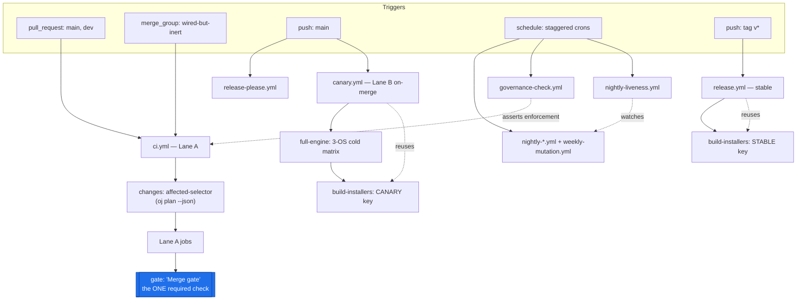
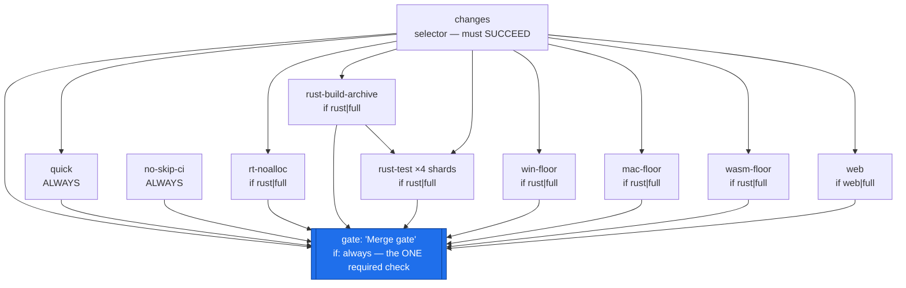
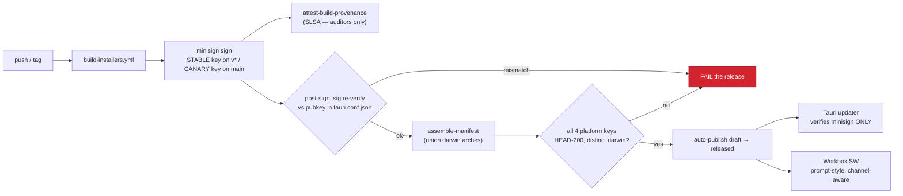

# Reference — ready-to-use CI/CD workflow YAML (C1 appendix)

> **Scope.** This is the **copy-pasteable appendix** for decision **C1**. It is the literal YAML that [`05-github-actions-ci.md`](05-github-actions-ci.md) *specifies in prose*; this file *materializes* it. Nothing here is a new decision — every file, job, and predicate traces to a section of doc 05, the release/channel model in [`03-release-channels-and-auto-update.md`](03-release-channels-and-auto-update.md), and the cross-cutting foundations in [`00-overview.md`](00-overview.md). Where this file and the prose disagree, **the prose in doc 05 is authoritative and this file is the bug.**

Every file below is preceded by its **path** and **purpose**, and is grounded against the verified current `.github/workflows/` (`ci.yml`, `release.yml`, `build-installers.yml`, and the four `claude-*.yml` bots). Every third-party action is **SHA-pinned** with the human-readable tag in a trailing comment, exactly as the §3 / §8c pinning convention requires.

> **Verified:** The current repo has exactly **three** non-bot workflows — `ci.yml` (jobs `engine` / `web` / `windows-native`), `release.yml` (4-cell tauri matrix on `v*`), `build-installers.yml` (3-cell `workflow_dispatch`) — plus **five** `claude-*.yml` bots (`claude-auto-review.yml`, `claude-code-review.yml`, `claude-mention-bot.yml`, `claude-security-review.yml`, `claude.yml`). **None** of the files in this appendix exist today; each is a *create* or *rewrite*. The only SHA-pins that exist today are in the claude bots (`actions/checkout@34e1148…`, `claude-code-action@0d19335…`, and the raw-`main` pin `claude-code-security-review@25e460eb…`); the entire release/CI path floats (`actions/checkout@v4`, `oven-sh/setup-bun@v2`, `dtolnay/rust-toolchain@stable`, `Swatinem/rust-cache@v2`, `tauri-apps/tauri-action@v0`).

---

## How to read this appendix

| You want… | Go to |
|---|---|
| The pin convention + the SHA placeholder rule | [§0 Pinning convention](#0-pinning-convention-read-first) |
| Composite `setup-rust` / `setup-web` | [§1 Composite actions](#1-composite-actions) |
| Reusable engine/web/installer workflows | [§2 Reusable workflows](#2-reusable-workflows-workflow_call) |
| `ci.yml` — the Lane A required gate + exact gate predicate | [§3 Lane A](#3-ciyml--lane-a-the-required-merge-gate) |
| `nightly-*.yml` / `canary.yml` (Lane B) | [§4 Lane B](#4-lane-b--nightly-and-canary) |
| `release.yml` — signed stable release + post-publish gates | [§5 release.yml](#5-releaseyml--signed-stable-release) |
| `codeql.yml`, `zizmor.yml`, `deny.toml`, osv-scanner, attestation | [§6 Security suite](#6-security--supply-chain-suite) |
| Governance + liveness watchdogs | [§7 Governance & liveness](#7-governance--liveness-watchdogs) |
| The gate self-test fixture | [§8 Adversarial gate self-test](#8-adversarial-gate-self-test) |

### Canonical terms used verbatim

This appendix uses the program's canonical vocabulary exactly: the `oj` Bun CLI; the `just` command surface; `.config/nextest.toml`; the aggregate `gate` job; the `{stable, canary}` channel model; the `ByteRing` wait-free SPSC transport; the `ojproto` `EventKind` schema; the `event_frame` codec / `drain_frames`; the golden corpus; the device-free `render` gate; `assert_no_alloc`; `release-please` (the single version brain); affected-selection; COOP/COEP cross-origin isolation; minisign signing (split stable/canary keypairs); the `wire_shapes.rs` parity gate; **Lane A** (per-PR) / **Lane B** (nightly+canary); the `oj-protocol-ts` TS mirror.

### File inventory (at a glance)

```text
.github/
  actions/
    setup-rust/action.yml        # §1 — nightly+stable+cache+apt superset+just/nextest
    setup-web/action.yml         # §1 — setup-bun + frozen install
  workflows/
    engine.yml                   # §2 — reusable (workflow_call): os/shard/cold/profile
    web.yml                      # §2 — reusable (workflow_call)
    build-installers.yml         # §2 — REWRITTEN reusable (workflow_call + workflow_dispatch)
    ci.yml                       # §3 — REWRITTEN: Lane A required gate (pull_request + merge_group)
    canary.yml                   # §4 — push:main full matrix + canary signed release
    nightly-engine.yml           # §4 — Lane B 3-OS cold engine matrix
    nightly-wasm.yml             # §4 — Lane B full wasm-pack parity
    nightly-fuzz.yml             # §4 — Lane B cargo-fuzz on symphonia/rustysynth
    nightly-unsafe.yml           # §4 — Lane B miri + loom + -Zsanitizer
    nightly-e2e.yml              # §4 — Lane B Playwright PWA
    weekly-mutation.yml          # §4 — Lane B Stryker + fast-check
    nightly-liveness.yml         # §7 — opens a HIGH issue if a heavy leg is >48h stale
    release.yml                  # §5 — REWRITTEN: v* tags → signed stable release
    release-please.yml           # §5 — the single version brain (R1)
    codeql.yml                   # §6 — SAST: rust + js/ts + actions
    zizmor.yml                   # §6 — required: fails the gate on any unpinned action
    governance-check.yml         # §7 — asserts ruleset enforcement stays ON
    semantic-pr-lint.yml         # §5 — conventional-commit PR-title lint (R1)
    claude-*.yml                 # KEPT, hardened per doc 05 §9 (not re-listed here)
rust-toolchain.toml              # Phase 0, C1-owned (see §1 note)
deny.toml                        # §6 — cargo-deny, NO advisory allowlist initially
.config/nextest.toml             # the audio-serial group + CI profile
release-please-config.json       # R1 — writes all four version files in lockstep
.release-please-manifest.json    # R1 — seed manifest
.github/dependabot.yml           # cargo + npm/bun + github-actions, grouped
```

### CI topology



---

## 0. Pinning convention (read first)

> **Must-fix (critical) — SHA-pin every third-party action.** A floating tag in a key-holding workflow (`release.yml`, `canary.yml`) is a **direct private-key exfiltration path**. Pinning is enforced by `zizmor` as a required `needs` of `gate` (§6), not by hand.

Rules, applied uniformly across this appendix:

1. **Every `uses:` of a third-party action is pinned to a full 40-char commit SHA**, with the human-readable tag in a trailing `# vX.Y.Z` comment for review.
2. **`<PIN…>` is an illustrative placeholder**, not a literal value. The two SHAs that already exist in the repo are reused verbatim where the same action is needed:
   - `actions/checkout@34e114876b0b11c390a56381ad16ebd13914f8d5  # v4.3.1` — the exact pin the claude bots already use (`claude-auto-review.yml:24`).
   - `anthropics/claude-code-action@0d1933529914177075d5bc3558ae3d047f188146  # v1.0.26` — bot-only, not in this appendix.
3. **First-party reusable workflows and composite actions are referenced by repo-relative path** (`uses: ./.github/...`) and are **not** SHA-pinnable — they version with the commit. `zizmor` does not flag these.
4. **`dependabot.yml`** (the `github-actions` ecosystem, grouped) keeps every pin reviewed; deliberate bumps land via PR.

```yaml
# .github/dependabot.yml — keeps every pin reviewed (Phase 1)
version: 2
updates:
  - package-ecosystem: cargo
    directory: "/"
    schedule: { interval: weekly }
    groups: { rust-deps: { patterns: ["*"] } }
  - package-ecosystem: npm        # Dependabot reads bun.lock via the npm ecosystem
    directory: "/"
    schedule: { interval: weekly }
    groups: { js-deps: { patterns: ["*"] } }
  - package-ecosystem: github-actions
    directory: "/"
    schedule: { interval: weekly }
    groups: { actions: { patterns: ["*"] } }
```

---

## 1. Composite actions

These kill the **triple-duplicated** checkout + Bun + rust-toolchain + rust-cache + apt boilerplate verified across `ci.yml`, `release.yml`, and `build-installers.yml`.

> **Verified:** The apt lists drift today. `ci.yml:29-35` installs **6** packages and **omits `pkg-config`**; `release.yml:49-56` and `build-installers.yml:30-37` install **7** (the same six **plus `pkg-config`**). The composite below uses the **superset, with `pkg-config`**, collapsing the drift into one list.

#### `.github/actions/setup-rust/action.yml`

> **Purpose:** One toolchain + cache + Linux apt + `just`/`cargo-nextest` install for every Rust job in both lanes. Installs **nightly FIRST, stable LAST** so `cargo fmt`/`clippy` default to stable (the verified `ci.yml:39-47` invariant — nightly carries no rustfmt-availability guarantee).

```yaml
# .github/actions/setup-rust/action.yml
name: setup-rust
description: Pinned nightly+stable toolchain, cache, Linux webview apt superset, just + cargo-nextest.
runs:
  using: composite
  steps:
    # Toolchain channel comes from rust-toolchain.toml (Phase 0, C1-owned: one pinned
    # nightly for `-Z build-std`/miri/sanitizers + stable default). These two installs
    # make the components/targets explicit and keep stable as the DEFAULT toolchain.
    - uses: dtolnay/rust-toolchain@b3b07ba8b418998c39fb20f53e8b695cdcc8de1b  # nightly (PIN to current)
      with: { toolchain: nightly, components: rust-src, targets: wasm32-unknown-unknown }
    - uses: dtolnay/rust-toolchain@b3b07ba8b418998c39fb20f53e8b695cdcc8de1b  # stable (PIN to current)
      with: { toolchain: stable, components: "rustfmt, clippy" }
    - uses: Swatinem/rust-cache@9d47c6ad4b02e050fd481d890b2ea34778fd09d6  # v2.7.8 (PIN to current)
      with: { workspaces: ". -> target" }   # src-tauri is a workspace member; artifacts land in root target/
    - if: runner.os == 'Linux'
      shell: bash
      run: |
        sudo apt-get update
        # SUPERSET apt list = ci.yml's 6 packages UNION the pkg-config that
        # release.yml / build-installers.yml add. One list, zero drift.
        sudo apt-get install -y \
          libasound2-dev libwebkit2gtk-4.1-dev libgtk-3-dev \
          libsoup-3.0-dev libjavascriptcoregtk-4.1-dev librsvg2-dev pkg-config
    # Prebuilt binaries (Windows-safe — the founder's box is Windows-primary).
    - uses: taiki-e/install-action@a4b1a5cd00d1f4f7a4e4d6efb1a51e08e9c0b9bf  # v2 (PIN to current)
      with: { tool: "just,cargo-nextest" }
```

> **Note:** `dtolnay/rust-toolchain` resolves the channel from `rust-toolchain.toml` when present; the explicit `toolchain:` here pins component/target availability per leg. Both `uses:` lines share one SHA because they are the **same action** invoked twice. `rust-toolchain.toml` itself (the single pin) is owned by C1 and lands in Phase 0:
>
> ```toml
> # rust-toolchain.toml — the single toolchain pin (Phase 0, C1-owned)
> [toolchain]
> channel    = "nightly-2026-06-01"   # one known-good nightly; bumped deliberately, busts caches/goldens
> components = ["rust-src", "rustfmt", "clippy", "miri"]
> targets    = ["wasm32-unknown-unknown"]
> profile    = "minimal"
> ```

#### `.github/actions/setup-web/action.yml`

> **Purpose:** `setup-bun` + a frozen install for every web/TS job. Mirrors the verified `web` job (`ci.yml:82-84`) which is Bun-enforced — `package.json:23` hard-`exit(1)`s any non-bun `npm_execpath`.

```yaml
# .github/actions/setup-web/action.yml
name: setup-web
description: Bun + frozen-lockfile install. Bun is mandatory (package.json preinstall guard).
runs:
  using: composite
  steps:
    - uses: oven-sh/setup-bun@4bc047ad259df6fc24a6c9b0f9a0cb08cf17fbe5  # v2 (PIN to current)
    - shell: bash
      run: bun install --frozen-lockfile
```

---

## 2. Reusable workflows (`workflow_call`)

Both lanes call the **same `just` recipes** inside these, so CI and local can never drift on *what* runs (the §F1 single-source-of-truth principle). C1 **consumes** the `just` surface owned by T1; it never re-encodes commands.

> **Must-fix (high) — `justfile` is a prerequisite.** Every `just <recipe>` below resolves only after T1 lands the root `justfile` in Phase 1 ([`01-testing-and-reliability.md`](01-testing-and-reliability.md), [`00-overview.md`](00-overview.md) §F1). The recipe bodies these workflows depend on are canonical: `fmt` = `cargo fmt --all -- --check`; `clippy` = `cargo clippy --workspace --all-targets -- -D warnings`; `doctest` = `cargo test --workspace --doc` (the **mandatory** companion — nextest skips doctests); `nostd` = `cargo build -p ojcore --no-default-features`; `wasm` = `cargo +nightly build -p ojcore-wasm --target wasm32-unknown-unknown -Z build-std=std,panic_abort`; `render` = `cargo run -p ojcore-native --bin render --features demo -- {{wav}} 2`; `clap-host` = `cargo clippy -p ojhost --features clap-host …` + `cargo test -p ojhost --features clap-host`; `web` = `tsc --noEmit -p tsconfig.app.json` + lint + vitest + build; `wasm-parity-smoke` = `wasm-pack test --node` over a small kernel subset, ULP-band compare. Until the `justfile` exists, a Phase-0 interim may inline the raw `cargo` commands verbatim from `ci.yml:50-75`.

> **Verified:** The `clap-host` feature is real (`crates/ojhost/Cargo.toml:24`, `clap-host = ["dep:clack-host"]`). The `render` bin, `nostd`, and `wasm` legs mirror the verified `ci.yml:55-65` commands exactly.

#### `.github/workflows/engine.yml`

> **Purpose:** The single Rust engine workflow, parameterized by OS / shard / cold-cache / profile. Called by Lane A (whole-suite or sharded) and Lane B (3-OS cold matrix).

```yaml
# .github/workflows/engine.yml (reusable)
name: engine
on:
  workflow_call:
    inputs:
      os:      { type: string,  default: ubuntu-latest }
      shard:   { type: string,  default: "" }        # "N/4" partition, or "" for whole suite
      cold:    { type: boolean, default: false }      # nightly: ignore the warm cache
      profile: { type: string,  default: ci }         # the .config/nextest.toml profile
permissions: { contents: read }
jobs:
  engine:
    runs-on: ${{ inputs.os }}
    steps:
      - uses: actions/checkout@34e114876b0b11c390a56381ad16ebd13914f8d5  # v4.3.1
      - uses: ./.github/actions/setup-rust
      - run: just fmt
      - run: just clippy
      - run: just doctest        # MANDATORY: nextest SKIPS doctests
      - if: inputs.shard == ''
        run: just test           # whole suite (nightly / cold)
      - if: inputs.shard != ''
        run: cargo nextest run --profile ${{ inputs.profile }} --partition hashed:${{ inputs.shard }}
      - run: just nostd          # cargo build -p ojcore --no-default-features
      - run: just wasm           # cargo +nightly build -p ojcore-wasm ... -Z build-std
      - run: just render         # device-free golden-render gate (ojcore-native --bin render)
      - run: just clap-host      # ojhost --features clap-host clippy + test
```

#### `.github/workflows/web.yml`

> **Purpose:** The single web/TS workflow — typecheck + lint + vitest + production build.

```yaml
# .github/workflows/web.yml (reusable)
name: web
on: { workflow_call: {} }
permissions: { contents: read }
jobs:
  web:
    runs-on: ubuntu-latest
    steps:
      - uses: actions/checkout@34e114876b0b11c390a56381ad16ebd13914f8d5  # v4.3.1
      - uses: ./.github/actions/setup-web
      - run: just web   # tsc --noEmit -p tsconfig.app.json / lint / vitest / build
```

#### `.github/workflows/build-installers.yml`

> **Purpose:** The **one** signed-installer engine, called by **both** `release.yml` (stable key) and `canary.yml` (canary key) — eliminating the canary-vs-release drift class **by construction**. It wraps the **proven** 4-cell tauri matrix verified at `release.yml:27-39` (`macos-latest` aarch64 + `macos-latest` x86_64 + `ubuntu-latest` + `windows-latest`). The only per-caller difference is which signing secret it inherits (§5, §F5).

> **Verified:** This is a **rewrite** of today's `build-installers.yml`, which is `workflow_dispatch`-only over a 3-cell matrix (`build-installers.yml:8-22`) and builds **unsigned** (`bun run tauri build`, `build-installers.yml:49`). The rewrite adds `workflow_call`, the dual-arch macOS split, minisign signing, and the post-sign `.sig` re-verify.

```yaml
# .github/workflows/build-installers.yml (REWRITTEN — reusable + on-demand)
name: build-installers
on:
  workflow_call:
    inputs:
      profile: { type: string, default: stable }   # "stable" | "canary" — selects the signing secret
      tag:     { type: string, default: "" }        # immutable tag the caller assigns assets to
    secrets:
      SIGNING_KEY:          { required: true }       # STABLE on release.yml, CANARY on canary.yml
      SIGNING_KEY_PASSWORD: { required: true }
  workflow_dispatch: {}                              # preserves the verified on-demand path
concurrency: { group: build-installers-${{ github.ref }}, cancel-in-progress: true }
permissions: { contents: read }                      # callers elevate per-job (id-token/attestations/contents:write)
jobs:
  build:
    name: Build installers (${{ matrix.platform }} ${{ matrix.args }})
    strategy:
      fail-fast: false
      matrix:
        include:
          - { platform: macos-latest,   args: "--target aarch64-apple-darwin" }  # Apple Silicon
          - { platform: macos-latest,   args: "--target x86_64-apple-darwin"  }  # Intel
          - { platform: ubuntu-latest,  args: "" }                                # .deb / .AppImage
          - { platform: windows-latest, args: "" }                                # .msi / .exe / NSIS
    runs-on: ${{ matrix.platform }}
    steps:
      - uses: actions/checkout@34e114876b0b11c390a56381ad16ebd13914f8d5  # v4.3.1
      - uses: ./.github/actions/setup-web
      - name: Rust (cross targets for the macOS dual-arch legs)
        uses: dtolnay/rust-toolchain@b3b07ba8b418998c39fb20f53e8b695cdcc8de1b  # stable (PIN to current)
        with:
          targets: ${{ matrix.platform == 'macos-latest' && 'aarch64-apple-darwin,x86_64-apple-darwin' || '' }}
      - uses: Swatinem/rust-cache@9d47c6ad4b02e050fd481d890b2ea34778fd09d6  # v2.7.8
        with: { workspaces: ". -> target" }
      - if: matrix.platform == 'ubuntu-latest'
        run: |
          sudo apt-get update
          sudo apt-get install -y libwebkit2gtk-4.1-dev libgtk-3-dev libsoup-3.0-dev \
            libjavascriptcoregtk-4.1-dev librsvg2-dev libasound2-dev pkg-config
      - name: Build + sign installers (tauri-action)
        uses: tauri-apps/tauri-action@42e9df6c59070d114bf90dcd3943a1b8f138b113  # v0 (PIN to current)
        env:
          GITHUB_TOKEN: ${{ secrets.GITHUB_TOKEN }}
          # tauri-action auto-signs the bundle + emits latest.json when these are set.
          TAURI_SIGNING_PRIVATE_KEY:          ${{ secrets.SIGNING_KEY }}
          TAURI_SIGNING_PRIVATE_KEY_PASSWORD: ${{ secrets.SIGNING_KEY_PASSWORD }}
        with:
          projectPath: "."
          args: ${{ matrix.args }}
          # The matrix legs emit ONLY artifacts + .sig here; the CALLER's
          # assemble-manifest job unions the two darwin keys into ONE latest.json (§5).
      - name: Post-sign .sig re-verify (must-fix — fail before publish)
        shell: bash
        run: |
          # Re-verify EVERY installer's .sig against the PUBLIC key committed in
          # tauri.conf.json — catches a pub/priv mismatch (e.g. after key regen) here,
          # not in the field where it bricks auto-update irreversibly.
          PUB=$(jq -r '.plugins.updater.pubkey' src-tauri/tauri.conf.json)
          find target -name '*.sig' -print0 | while IFS= read -r -d '' sig; do
            artifact="${sig%.sig}"
            echo "verify: $artifact"
            minisign -V -P "$PUB" -m "$artifact" -x "$sig" \
              || { echo "::error::signature mismatch for $artifact"; exit 1; }
          done
      - name: Build provenance (auditors only — NOT a runtime update control)
        uses: actions/attest-build-provenance@7668571508540a607bdfd90a87a560489fe372eb  # v2 (PIN to current)
        with: { subject-path: "target/**/bundle/**/*" }
```

> **Note:** `actions/attest-build-provenance` is **CI-side SLSA provenance for auditors/redistributors**, *not* a runtime update-acceptance control (doc 05 §8e). The Tauri updater verifies **only** the minisign signature at install time. The `id-token: write` / `attestations: write` scope it needs is granted **per-caller-job** (§4, §5), never at PR-trigger time.

---

## 3. `ci.yml` — Lane A, the required merge gate

> **Purpose:** The per-PR required gate. Path-filter-free (path filters strand a required check as perpetually "pending"); affected-selection happens *inside* the `changes` job, not at the trigger. Everything funnels into **one** required check — the `gate` job named **"Merge gate"**.

> **Verified:** This **rewrites** today's `ci.yml`. Key deltas from the verified original: the `push` trigger is **dropped** (`canary.yml` covers `main`; `ci.yml:8-9` currently triggers on `push`); the concurrency group is simplified from `ci-${{ github.workflow }}-${{ github.ref }}` (`ci.yml:14`) to `ci-${{ github.ref }}`; the three implicitly-required jobs (`engine`/`web`/`windows-native`) become `needs` of one aggregate `gate`.

> **Must-fix (critical) — `[main, dev]` only after governance.** The `pull_request` filter names `[main, dev]` (mirroring `ci.yml:9, 11`). A `pull_request` filter naming a **non-existent** branch silently never matches. The verified governance state is OFF (no branch protection on `main`; the `main` ruleset is `enforcement: disabled`; the `dev` ruleset targets a malformed `refs/heads/"dev"` for a branch that does not exist). Doc 05 §2c is a hard prerequisite: **create `dev`, OR drop `dev` and target only `main`,** before this file is wired.

```yaml
# .github/workflows/ci.yml (REWRITTEN — Lane A required merge gate)
name: CI
on:
  pull_request: { branches: [main, dev] }   # [main, dev] only valid after doc 05 §2c creates `dev`
  merge_group: {}                            # wired-but-inert (queue is org-only on PonderingBGI/openjammer)
  # NO `push:` — canary.yml covers main.  NO path filters — they strand a required check as "pending".
concurrency: { group: ci-${{ github.ref }}, cancel-in-progress: true }
permissions: { contents: read }             # default-deny; no Lane A job needs more
env: { CARGO_TERM_COLOR: always }

jobs:
  # ── affected-selector ────────────────────────────────────────────────────
  changes:
    runs-on: ubuntu-latest
    outputs:
      rust: ${{ steps.p.outputs.rust }}
      web:  ${{ steps.p.outputs.web }}
      full: ${{ steps.p.outputs.full }}
    steps:
      - uses: actions/checkout@34e114876b0b11c390a56381ad16ebd13914f8d5  # v4.3.1
        with: { fetch-depth: 0 }   # `oj plan` diffs against the merge base
      - uses: ./.github/actions/setup-web
      - id: p
        # `oj plan --json` = cargo-metadata (cached on Cargo.lock) + `gh pr diff --name-only`.
        # NEVER tj-actions/changed-files (CVE-2025-30066). The JSON shape is pinned below.
        run: |
          PLAN=$(bun scripts/oj/index.ts plan --json)
          echo "$PLAN"
          echo "rust=$(jq -r .rust <<<"$PLAN")" >> "$GITHUB_OUTPUT"
          echo "web=$(jq -r .web  <<<"$PLAN")"  >> "$GITHUB_OUTPUT"
          echo "full=$(jq -r .full <<<"$PLAN")" >> "$GITHUB_OUTPUT"
        env: { GH_TOKEN: '${{ github.token }}' }

  # ── ALWAYS-run floors ────────────────────────────────────────────────────
  quick:                     # fast feedback on every PR
    needs: changes
    runs-on: ubuntu-latest
    steps:
      - uses: actions/checkout@34e114876b0b11c390a56381ad16ebd13914f8d5  # v4.3.1
      - uses: ./.github/actions/setup-rust
      - run: just fmt
      - run: just clippy-changed
      - run: just render                                 # device-free golden gate
      - run: cargo test -p ojproto --test wire_shapes    # the ONE cross-language coupling (oj-protocol-ts mirror)

  no-skip-ci:                # forbid [skip ci] reaching a protected branch (must-fix)
    runs-on: ubuntu-latest
    steps:
      - run: |
          HEAD_MSG=$(gh pr view ${{ github.event.number }} --json commits \
            --jq '.commits[-1].messageHeadline')
          if grep -qiE '\[skip ci\]' <<<"$HEAD_MSG"; then
            echo "::error::head commit carries [skip ci]; the gate would be stale against an untested SHA"; exit 1
          fi
        env: { GH_TOKEN: '${{ github.token }}' }

  # ── RT no-alloc proof — REQUIRED per-PR (the most important must-fix, §7) ──
  rt-noalloc:
    needs: changes
    if: needs.changes.outputs.rust == 'true' || needs.changes.outputs.full == 'true'
    runs-on: ubuntu-latest
    steps:
      - uses: actions/checkout@34e114876b0b11c390a56381ad16ebd13914f8d5  # v4.3.1
      - uses: ./.github/actions/setup-rust
      # `devlog` is a NEW ojcore feature (L1/L2, Phase 2/3) — NOT in crates/ojcore/Cargo.toml
      # today (verified features: `default = ["std"]`, `std`). Wired now, meaningful once it lands.
      - run: cargo nextest run -p ojcore --features devlog -E 'test(/alloc_free|rt_emit/)'

  # ── ONE compile, fanned out into shards off ONE archive ───────────────────
  rust-build-archive:
    needs: changes
    if: needs.changes.outputs.rust == 'true' || needs.changes.outputs.full == 'true'
    runs-on: ubuntu-latest
    steps:
      - uses: actions/checkout@34e114876b0b11c390a56381ad16ebd13914f8d5  # v4.3.1
      - uses: ./.github/actions/setup-rust
      - run: cargo nextest archive --workspace --features demo --archive-file oj.tar.zst
      - uses: actions/upload-artifact@ea165f8d65b6e75b540449e92b4886f43607fa02  # v4 (PIN to current)
        with: { name: oj-archive, path: oj.tar.zst, retention-days: 1 }

  rust-test:
    needs: [changes, rust-build-archive]
    if: needs.changes.outputs.rust == 'true' || needs.changes.outputs.full == 'true'
    strategy: { fail-fast: false, matrix: { shard: [1, 2, 3, 4] } }
    runs-on: ubuntu-latest
    steps:
      - uses: actions/download-artifact@fa0a91b85d4f404e444e00e005971372dc801d16  # v4 (PIN to current)
        with: { name: oj-archive }
      - uses: dtolnay/rust-toolchain@b3b07ba8b418998c39fb20f53e8b695cdcc8de1b  # nextest needs a toolchain to run the archive
        with: { toolchain: stable }
      - uses: taiki-e/install-action@a4b1a5cd00d1f4f7a4e4d6efb1a51e08e9c0b9bf  # v2 — pinned nextest version
        with: { tool: cargo-nextest }
      - run: cargo nextest run --archive-file oj.tar.zst --partition hashed:${{ matrix.shard }}/4
      - if: matrix.shard == 1
        run: cargo test --workspace --doc    # `just doctest` — archives skip doctests; run once

  # ── THIN per-PR cross-platform floors (must-fix — NOT the full matrix) ────
  win-floor:                 # Windows = founder's primary box + RT-primary OS → kept on the gate
    needs: changes
    if: needs.changes.outputs.rust == 'true' || needs.changes.outputs.full == 'true'
    runs-on: windows-latest
    steps:
      - uses: actions/checkout@34e114876b0b11c390a56381ad16ebd13914f8d5  # v4.3.1
      - uses: ./.github/actions/setup-rust
      - run: cargo check -p oj-tauri                      # cfg(windows)/MSVC/manifest tripwire (fast, no link)
      - run: cargo nextest run -p ojcore -p ojcore-native --features demo
      - run: just render                                  # device-free WASAPI-path-adjacent render gate
      - run: cargo nextest run -p ojcore --features devlog -E 'test(/alloc_free/)'   # RT proof on the RT-primary OS

  mac-floor:                 # macOS aarch64 — closes the verified macOS-on-`main` gap, on the gate
    needs: changes
    if: needs.changes.outputs.rust == 'true' || needs.changes.outputs.full == 'true'
    runs-on: macos-latest    # macos-latest = Apple Silicon (aarch64)
    steps:
      - uses: actions/checkout@34e114876b0b11c390a56381ad16ebd13914f8d5  # v4.3.1
      - uses: ./.github/actions/setup-rust
      - run: cargo check -p oj-tauri
      - run: just render

  wasm-floor:                # wasm32 float-codegen parity subset (must-fix)
    needs: changes
    if: needs.changes.outputs.rust == 'true' || needs.changes.outputs.full == 'true'
    runs-on: ubuntu-latest
    steps:
      - uses: actions/checkout@34e114876b0b11c390a56381ad16ebd13914f8d5  # v4.3.1
      - uses: ./.github/actions/setup-rust
      - run: just wasm-parity-smoke   # wasm-pack test --node, SMALL kernel subset, ULP-band compare (NOT bit-exact)

  web:
    needs: changes
    if: needs.changes.outputs.web == 'true' || needs.changes.outputs.full == 'true'
    uses: ./.github/workflows/web.yml

  # ── THE single required check — inline so its NAME is stable ──────────────
  gate:
    name: Merge gate
    needs: [changes, quick, no-skip-ci, rt-noalloc, rust-build-archive, rust-test, win-floor, mac-floor, wasm-floor, web]
    if: always()
    runs-on: ubuntu-latest
    steps:
      - name: Evaluate aggregate result
        run: |
          # The EXACT gate predicate (doc 05 §5): FAIL unless every `need` is in
          # {success, skipped} AND needs.changes.result == 'success' specifically.
          #
          # 1. The selector itself must have SUCCEEDED. A malformed selector that
          #    skips every downstream job must go RED, not green-with-zero-tests.
          if [ "${{ needs.changes.result }}" != "success" ]; then
            echo "::error::changes (affected selector) did not succeed: ${{ needs.changes.result }}"; exit 1
          fi
          # 2. Any `failure`/`cancelled` among the needs fails the gate. `skipped` is OK
          #    (a legitimately-conditional job). `success` is OK.
          results='${{ join(needs.*.result, ',') }}'
          echo "needs results: $results"
          case ",$results," in
            *",failure,"*)   echo "::error::a required job failed";    exit 1 ;;
            *",cancelled,"*) echo "::error::a required job cancelled"; exit 1 ;;
          esac
          echo "All required jobs passed (success or legitimately skipped)."
```

> **Single-required-check invariant (§F6).** There is exactly **one** required status check: the `gate` job ("Merge gate"). `zizmor` (§6), the `wire_shapes` coupling, the render gate, T4 correctness, X2 docs, D1 set-equality — all are **`needs` of `gate`**, never independently-required checks. The one documented invariant: *do not rename the gate job.* The branch-protection `required_status_checks` binds the **string** "Merge gate" (doc 05 §2c).

### The `oj plan --json` contract

> **Must-fix (high) — the JSON shape is pinned.** The downstream `if:` conditions only work if the `changes` job's output shape is stable. The `plan` subcommand of the `oj` Bun CLI ([`04-developer-tooling.md`](04-developer-tooling.md) §F2) **owns** this shape; C1 **consumes** it.

```jsonc
// `bun scripts/oj/index.ts plan --json` stdout (one line; mapped to step outputs by `changes`)
{
  "rust": true,                       // any crates/**, Cargo.toml, Cargo.lock, rust-toolchain.toml touched
  "web":  false,                      // any src/**, package.json, bun.lock, vite/ts config touched
  "full": false,                      // a BROAD INVALIDATOR touched -> run everything (risk row, doc 05 §15)
  "affected": ["ojcore", "ojproto"],  // cargo-metadata-accurate package set for `just clippy-changed`
  "reason": "diff matched crates/ojcore/**"
}
```

A **broad invalidator** (`Cargo.lock`, `crates/ojcore/**`, `crates/ojproto/**`, `justfile`, `rust-toolchain.toml`, corpus/snapshot/asset dirs) forces `full: true` so a non-import coupling cannot slip a green PR. The verified cross-language coupling — `crates/ojproto/tests/wire_shapes.rs`, the byte-exact `wire_shapes.rs` parity gate against the `oj-protocol-ts` mirror — runs in `quick` **on every PR** regardless of selection.

### Lane A dependency graph



---

## 4. Lane B — nightly and canary

> **Why split.** The free plan's true budget is **20 concurrent jobs / 5 concurrent macOS** (not "unlimited minutes"). One wide nightly (4 shards × 3 OS + fuzz + miri + loom + sanitizers + Playwright + Stryker) queues for hours and, on timeout, silently runs none of the deepest coverage. So Lane B is **split into independent scheduled workflows**, each on its own cron (staggered to respect the 5-macOS cap), each opening its own deduplicated rolling tracking issue.

### Nightly workflows

Each follows the same skeleton: a scheduled trigger, its own concurrency group, the heavy leg, and a `report` job (`if: failure()`) that creates/edits **one** deduplicated rolling `gh issue` carrying the failing leg + the exact `just <recipe>` repro line — async maintainer triage, never a contributor blocker.

#### `.github/workflows/nightly-engine.yml`

> **Purpose:** 3-OS cold engine matrix — closes the verified macOS-on-`main` gap (no macOS engine job exists today; `release.yml` builds macOS only on `v*`). macOS = a **single** leg, respecting the 5-macOS cap.

```yaml
# .github/workflows/nightly-engine.yml
name: nightly-engine
on: { schedule: [{ cron: '0 7 * * *' }], workflow_dispatch: {} }
concurrency: { group: nightly-engine, cancel-in-progress: false }
permissions: { contents: read, issues: write }
jobs:
  engine:
    strategy: { fail-fast: false, matrix: { os: [ubuntu-latest, windows-latest, macos-latest] } }
    uses: ./.github/workflows/engine.yml
    with: { os: '${{ matrix.os }}', cold: true }      # macOS is ONE leg here
  report:
    needs: engine
    if: failure()
    runs-on: ubuntu-latest
    steps:
      - run: |
          # Dedup: reuse the open rolling issue if present, else open one.
          TITLE="nightly-engine: heavy leg red"
          ID=$(gh issue list --label nightly --search "$TITLE in:title" --state open --json number --jq '.[0].number')
          BODY="nightly-engine failed on ${{ github.sha }}. Repro: just rust (per-OS)."
          if [ -n "$ID" ]; then gh issue comment "$ID" --body "$BODY";
          else gh issue create --title "$TITLE" --label nightly --body "$BODY"; fi
        env: { GH_TOKEN: '${{ github.token }}' }
```

#### Remaining nightly legs (same skeleton; cron + leg differ)

```yaml
# .github/workflows/nightly-wasm.yml    cron '0 8 * * *'
#   T2 FULL `wasm-pack test --node` golden parity over the golden corpus, ULP-band compare
#   (the ONLY leg that executes wasm32-compiled float codegen at full breadth).
#
# .github/workflows/nightly-fuzz.yml    cron '0 9 * * *'
#   cargo-fuzz on the symphonia (attacker WAV) + rustysynth (attacker SF2) decoders,
#   cached corpus. These are exactly the crates deny.toml refuses to whole-crate-exempt (§6).
#
# .github/workflows/nightly-unsafe.yml  cron '0 10 * * *'
#   miri over existing tests + loom on the ByteRing wait-free SPSC transport
#   (crates/ojcore-midiring: copy_nonoverlapping at lib.rs:124/126/143/145, push at :159,
#   pop at :188) and swap.rs, + -Zsanitizer on `ojhost --features clap-host`.
#
# .github/workflows/nightly-e2e.yml     cron '0 11 * * *'
#   T3 Playwright PWA + asserts crossOriginIsolated === true + a ByteRing SAB round-trip.
#
# .github/workflows/weekly-mutation.yml cron '0 12 * * 1'
#   Stryker (TS) + fast-check (property tests).
```

#### `.github/workflows/canary.yml`

> **Purpose:** `push:main` full-matrix-on-merge — the non-negotiable backstop that bounds affected-under-selection drift to **one merge** (not a nightly day). It reuses the same `engine.yml` and `build-installers.yml` as `release.yml`, signing with the **canary** key only (§F5). It stamps a throwaway build-time version `0.0.0-canary.<shortsha>` (never committed) and publishes to an **immutable per-build tag** `canary-<shortsha>` so a client polling mid-rebuild never hits a 404/signature mismatch on the moving `canary` tag (doc 03 §F4 must-fix).

> **Verified:** `canary.yml` does **not** exist today (doc 03 confirms it absent). The signing-key isolation here is load-bearing: a leaked canary key cannot forge a stable update because the app embeds the **stable** pubkey while canary builds embed the **canary** pubkey.

```yaml
# .github/workflows/canary.yml — push:main full matrix + canary signed release (Phase 1)
name: canary
on: { push: { branches: [main] } }
concurrency: { group: canary, cancel-in-progress: true }   # a newer merge supersedes the prior run
permissions: { contents: read }                            # default-deny; the installers job elevates
jobs:
  full-engine:            # the FULL uncached suite on every merge — non-negotiable backstop
    strategy: { fail-fast: false, matrix: { os: [ubuntu-latest, windows-latest, macos-latest] } }
    uses: ./.github/workflows/engine.yml
    with: { os: '${{ matrix.os }}', cold: true }
  installers:
    needs: full-engine
    permissions: { contents: write, id-token: write, attestations: write }   # scoped to THIS job only
    uses: ./.github/workflows/build-installers.yml
    with: { profile: canary }
    secrets:
      # Canary secret names keep the TAURI_SIGNING_ prefix so zizmor's
      # `TAURI_SIGNING_*`-never-on-PR audit (§6a) covers them too.
      SIGNING_KEY:          ${{ secrets.TAURI_SIGNING_PRIVATE_KEY_CANARY }}          # CANARY key ONLY — never the stable key
      SIGNING_KEY_PASSWORD: ${{ secrets.TAURI_SIGNING_PRIVATE_KEY_PASSWORD_CANARY }}
  notify-on-break:        # canary failure pings the merging author, not just a rolling issue (must-fix)
    needs: [full-engine, installers]
    if: failure()
    runs-on: ubuntu-latest
    permissions: { issues: write }
    steps:
      - run: gh issue create --title "canary broke on ${{ github.sha }}" --assignee "${{ github.actor }}" --label canary
        env: { GH_TOKEN: '${{ github.token }}' }
```

> **Note:** The canary `assemble-manifest` step (the immutable `canary-<shortsha>` tag + atomically-written `canary.json` pointing at `releases/download/canary-<shortsha>/...`, never `/latest/`) lives in `build-installers.yml`'s caller-side manifest assembly, identical in shape to the stable one in §5. A CI assertion forbids the canary updater endpoint from resolving to any moving `/latest/` URL (doc 03 §R4).

---

## 5. `release.yml` — signed stable release

> **Purpose:** On a `v*` tag push, build the 4-cell matrix through `build-installers.yml` with the **stable** key, union the dual-arch macOS manifest into ONE `latest.json`, run the post-publish gates, then auto-publish.

> **Verified:** This **rewrites** today's `release.yml`. The verified original: fires on `push: tags: ["v*"]` (`release.yml:12-15`); 4-leg matrix (`release.yml:27-39`); `tauri-action@v0` with `env:` carrying **only** `GITHUB_TOKEN` (`release.yml:79-80` — **no signing keys**); `releaseDraft: true` / `prerelease: false` (`release.yml:86-87`). The rewrite: SHA-pins everything; routes through the reusable `build-installers.yml`; scopes `TAURI_SIGNING_*` to `v*` tags only; makes `prerelease` dynamic; assembles the macOS manifest by union; and auto-publishes **only after** the all-four-platform-keys gate passes.

```yaml
# .github/workflows/release.yml (REWRITTEN — signed stable release)
name: Release
on: { push: { tags: ["v*"] } }
permissions: { contents: read }                  # default-deny; jobs elevate
jobs:
  guard:                  # the signing key is scoped to v* tags ONLY (must-fix, §F5)
    runs-on: ubuntu-latest
    # A floating-tag action in a key-holding workflow is a key-exfil path; zizmor (§6)
    # also asserts TAURI_SIGNING_* is never reachable on pull_request triggers.
    if: startsWith(github.ref, 'refs/tags/v')
    steps: [{ run: 'echo "tag-scoped release confirmed: ${{ github.ref }}"' }]

  installers:
    needs: guard
    permissions: { contents: write, id-token: write, attestations: write }
    uses: ./.github/workflows/build-installers.yml
    with: { profile: stable, tag: '${{ github.ref_name }}' }
    secrets:
      SIGNING_KEY:          ${{ secrets.TAURI_SIGNING_PRIVATE_KEY }}            # STABLE key, tag-scoped
      SIGNING_KEY_PASSWORD: ${{ secrets.TAURI_SIGNING_PRIVATE_KEY_PASSWORD }}

  assemble-manifest:      # union the two darwin arches into ONE latest.json (must-fix)
    needs: installers
    runs-on: ubuntu-latest
    permissions: { contents: write }
    steps:
      - uses: actions/checkout@34e114876b0b11c390a56381ad16ebd13914f8d5  # v4.3.1
      - uses: ./.github/actions/setup-web
      # The two macos-latest legs each emit their own manifest; the second would
      # OVERWRITE the first, stranding one Mac arch. A single serialized job unions them.
      - run: bun scripts/build-update-manifest.ts --channel stable --tag "${{ github.ref_name }}"

  release-gates:          # three-way version equality + post-publish completeness (must-fix)
    needs: assemble-manifest
    runs-on: ubuntu-latest
    permissions: { contents: write }
    steps:
      - uses: actions/checkout@34e114876b0b11c390a56381ad16ebd13914f8d5  # v4.3.1
      - name: Three-way version equality (a 0.0.0 binary can NEVER ship)
        run: |
          # built-binary CARGO_PKG_VERSION == tag (sans 'v') == tauri.conf.json $.version.
          # Guards against the verified four-way drift: Cargo.toml:9 = "0.0.0",
          # package.json:3 = "0.1.0-alpha", tauri.conf.json:4 = "0.1.0",
          # oj-protocol-ts/package.json:3 = "0.0.0" — release-please unifies these.
          TAG="${GITHUB_REF_NAME#v}"
          CONF=$(jq -r .version src-tauri/tauri.conf.json)
          test "$TAG" = "$CONF" || { echo "::error::tag $TAG != tauri.conf.json $CONF"; exit 1; }
        env: { GH_TOKEN: '${{ github.token }}' }
      - name: All-four-platform-keys post-publish gate (HARD)
        run: |
          # Fetch the PUBLISHED latest.json; assert the platforms map is exactly the
          # four keys, each HEAD-200, with the two darwin URLs pointing at DISTINCT assets.
          URL="https://github.com/${{ github.repository }}/releases/latest/download/latest.json"
          J=$(curl -fsSL "$URL")
          for k in windows-x86_64 darwin-aarch64 darwin-x86_64 linux-x86_64; do
            U=$(jq -r ".platforms[\"$k\"].url" <<<"$J")
            [ "$U" != "null" ] || { echo "::error::missing platform key $k"; exit 1; }
            curl -fsI "$U" >/dev/null || { echo "::error::$k url not HEAD-200: $U"; exit 1; }
          done
          A=$(jq -r '.platforms["darwin-aarch64"].url' <<<"$J")
          X=$(jq -r '.platforms["darwin-x86_64"].url'  <<<"$J")
          [ "$A" != "$X" ] || { echo "::error::darwin arches resolve to the SAME asset"; exit 1; }
      - name: Auto-publish the draft (ONLY after the gates pass)
        run: gh release edit "${{ github.ref_name }}" --draft=false
        env: { GH_TOKEN: '${{ github.token }}' }
```

> **Note — the `prerelease` and draft model.** `release.yml:87` (`prerelease: false`) becomes dynamic via the `{stable, canary}` predicate — `prerelease: ${{ contains(github.ref_name, '-') }}` — set inside `build-installers.yml`'s `tauri-action` step. The verified `releaseDraft: true` (`release.yml:86`) is **kept for review** but the draft auto-publishes *only after* `release-gates` passes, bounding the dark window where the `/latest/` updater feed cannot see the release.

> **Verified — the macOS dual-arch hazard is real.** `release.yml:28-33` builds **both** `aarch64-apple-darwin` and `x86_64-apple-darwin` on `macos-latest`. Without the serialized `assemble-manifest` union, the second leg's `latest.json` overwrites the first's, stranding one arch (`darwin-aarch64` xor `darwin-x86_64`). The completeness gate above catches it; the union prevents it.

#### `.github/workflows/release-please.yml`

> **Purpose:** The single version brain (R1). On every push to `main`, `release-please` opens/updates the Release PR that writes all four version files in lockstep, seeded from `Cargo.toml [workspace.package].version`.

```yaml
# .github/workflows/release-please.yml — the single version brain (Phase 0)
name: release-please
on: { push: { branches: [main] } }
permissions: { contents: write, pull-requests: write }
jobs:
  release-please:
    runs-on: ubuntu-latest
    steps:
      - uses: googleapis/release-please-action@a02a34c4d625f9be7cb89156071d8567266a2445  # v4 (PIN to current)
        with: { token: ${{ secrets.GITHUB_TOKEN }} }
```

> **Note:** The config (`release-please-config.json` `release-type: simple`, `include-component-in-tag: false`, the four `extra-files` entries with `$.workspace.package.version` for `Cargo.toml`, `$.version` for the three JSON files) and seed manifest (`.release-please-manifest.json`) are owned by R1 (doc 03). A **TOML jsonpath dry-run proof** (`npx release-please release-pr --dry-run` asserting `$.workspace.package.version` writes only `Cargo.toml:9`) is a Phase-0 gate — a `0.0.0` binary shipping would cause an infinite update-prompt loop.

#### `.github/workflows/semantic-pr-lint.yml`

> **Purpose:** Lint the squash-merge PR title (the only commit `release-please` reads) so it never silently under-bumps. Starts **advisory** (sticky comment), promoted to blocking only after `CONTRIBUTING.md` is corrected in Phase 1.

```yaml
# .github/workflows/semantic-pr-lint.yml — conventional-commit PR-title lint (R1)
name: semantic-pr-lint
on: { pull_request_target: { types: [opened, edited, synchronize] } }   # title edits must re-lint
permissions: { pull-requests: write }                                   # to post the advisory sticky comment
jobs:
  lint-pr-title:
    runs-on: ubuntu-latest
    steps:
      - uses: amannn/action-semantic-pull-request@0723387faaf9b38adef4775cd42cfd5155ed6017  # v5 (PIN to current)
        env: { GITHUB_TOKEN: ${{ secrets.GITHUB_TOKEN }} }
```

### Release + signing flow



---

## 6. Security & supply-chain suite

> **Note:** Mostly advisory-until-green to protect the contributor loop; **license/sources/bans and action-pinning are strict from day one**. Each subsection below maps directly to doc 05 §8.

### 6a. `zizmor.yml` — action-pinning enforcement (a required `needs` of `gate`)

> **Purpose:** Fail the merge gate on **any** unpinned action and assert `TAURI_SIGNING_*` is never exposed on `pull_request`/`pull_request_target` triggers. It is **not** a local-only hook — the founder is Windows-only and the local hook plane is deferred, so this must be a CI gate. It is added to the `gate` job's `needs` list (§3).

```yaml
# .github/workflows/zizmor.yml — SHA-pinning + secrets-on-PR audits (required)
name: zizmor
on: { pull_request: { branches: [main, dev] }, merge_group: {} }
permissions: { contents: read, security-events: write }   # security-events for SARIF upload
jobs:
  zizmor:
    runs-on: ubuntu-latest
    steps:
      - uses: actions/checkout@34e114876b0b11c390a56381ad16ebd13914f8d5  # v4.3.1
      - uses: zizmorcore/zizmor-action@e673c3917a1aef3c65c972347ed84ccd013ecda4  # v0 (PIN to current)
        # Audits: unpinned-uses (every action must be SHA-pinned), template-injection,
        # secrets-on-pr (TAURI_SIGNING_* must never be reachable on PR triggers).
```

> **Verified — what zizmor must catch.** The release/CI path floats today (`release.yml` uses `actions/checkout@v4`, `oven-sh/setup-bun@v2`, `dtolnay/rust-toolchain@stable`, `Swatinem/rust-cache@v2`, `tauri-apps/tauri-action@v0` — all unpinned). It must also flag the **raw-`main`-commit** pin of `claude-code-security-review` (`claude-security-review.yml:31`, `@25e460eb0a12077f0c6a1934d5dbae2f50785dda` on `main`, not a tagged release) → replace with a tagged-release SHA.

### 6b. `codeql.yml` — SAST (advisory until a green streak, then a `needs` of `gate`)

> **Purpose:** Free SAST over the engine, the 187-file React control plane, and the workflow YAML. Rust CodeQL is GA (Oct 2025).

```yaml
# .github/workflows/codeql.yml
name: codeql
on:
  pull_request: { branches: [main, dev] }
  schedule: [{ cron: '0 5 * * 1' }]   # weekly deep scan
permissions: { security-events: write, contents: read }
jobs:
  analyze:
    runs-on: ubuntu-latest
    strategy: { fail-fast: false, matrix: { language: [rust, javascript-typescript, actions] } }
    steps:
      - uses: actions/checkout@34e114876b0b11c390a56381ad16ebd13914f8d5  # v4.3.1
      - if: matrix.language == 'rust'
        uses: ./.github/actions/setup-rust
      - uses: github/codeql-action/init@c50e3938e6f86e9da43c5572a1c1eb3a3e4d8c0c  # v3 (PIN to current)
        with: { languages: '${{ matrix.language }}' }
      - uses: github/codeql-action/autobuild@c50e3938e6f86e9da43c5572a1c1eb3a3e4d8c0c  # v3
      - uses: github/codeql-action/analyze@c50e3938e6f86e9da43c5572a1c1eb3a3e4d8c0c  # v3
```

### 6c. Dependency scanning — `deny.toml` + osv-scanner + audit/dependency-review

> **Purpose:** Catch vulnerable/unlicensed/banned deps over **both** `Cargo.lock` and `bun.lock`.

> **Must-fix (high) — NO advisory allowlist initially.** Run `cargo-deny` once to establish the real baseline, then allowlist **individual advisory IDs** with documented expiry/justification — **never whole-crate exemptions**, especially for `symphonia` (decodes attacker WAV) and `rustysynth` (parses attacker SF2), which are exactly the `nightly-fuzz.yml` targets (§4). License + sources + bans stay strict from day one.

```yaml
# .github/workflows/deps.yml — osv-scanner + cargo-deny + dependency-review
name: deps
on: { pull_request: { branches: [main, dev] }, schedule: [{ cron: '0 4 * * *' }] }
permissions: { contents: read }
jobs:
  cargo-deny:
    runs-on: ubuntu-latest
    steps:
      - uses: actions/checkout@34e114876b0b11c390a56381ad16ebd13914f8d5  # v4.3.1
      - uses: EmbarkStudios/cargo-deny-action@30f817c6f72275c6d54dc744fbca09ebc958599f  # v2 (PIN to current)
        with: { command: check }      # advisories/licenses/bans/sources — see deny.toml
  osv:
    runs-on: ubuntu-latest
    steps:
      - uses: actions/checkout@34e114876b0b11c390a56381ad16ebd13914f8d5  # v4.3.1
      - uses: google/osv-scanner-action@e69cc6c86b31f1e7e23935bbe7031b50e51082de  # v2 (PIN to current)
        with: { scan-args: "--lockfile=Cargo.lock --lockfile=bun.lock" }   # both lockfiles
  dependency-review:
    if: github.event_name == 'pull_request'
    runs-on: ubuntu-latest
    steps:
      - uses: actions/checkout@34e114876b0b11c390a56381ad16ebd13914f8d5  # v4.3.1
      - uses: actions/dependency-review-action@67137f3864a5b3a3ff5538e0eb3399df2e9054b1  # v4 (PIN to current)
```

```toml
# deny.toml — NO advisory allowlist initially; license/sources/bans strict from day one
[advisories]
# `ignore = []` deliberately empty: establish the real baseline first, then add
# INDIVIDUAL RUSTSEC ids with an expiry comment. Never `[bans] skip` a whole crate
# for symphonia / rustysynth / clack — those are the fuzz-exposed attack surface.
ignore = []

[licenses]
# AGPL-3.0-only workspace (Cargo.toml:10). Allow the permissive deps it pulls.
allow = ["AGPL-3.0", "MIT", "Apache-2.0", "Apache-2.0 WITH LLVM-exception", "BSD-3-Clause", "Unicode-3.0", "Zlib"]

[bans]
multiple-versions = "warn"

[sources]
unknown-registry = "deny"
unknown-git = "deny"
```

### 6d. Secret hygiene + build provenance

- **`.gitignore` + a required credential scan** (a `needs` of `gate`, **not** just a local hook): add `*.key`, `openjammer.key`, `*.pem`, `*.p12`, `*.pfx`, `*.minisign`, `.tauri/` and hard-fail on staged `-----BEGIN .* PRIVATE KEY-----` / minisign secret-key headers, **before** any minisign key is generated. The auto-review bot literally runs `git add .` (`claude-auto-review.yml:64`); an un-gitignored key would be force-published.
- **`actions/attest-build-provenance@v2`** runs in `build-installers.yml` (§2) with `id-token: write` / `attestations: write` scoped to the **build job only**, never PR-triggered → verifiable via `gh attestation verify <file> --repo PonderingBGI/openjammer`. It is **CI-side provenance for auditors**, *not* a runtime update-acceptance control (the Tauri updater verifies minisign only).

---

## 7. Governance & liveness watchdogs

#### `.github/workflows/governance-check.yml`

> **Purpose:** Make a silently-disabled ruleset a **detected** failure. Verified state today: no classic branch protection on `main` (404), the `main` ruleset is `enforcement: disabled`, the `dev` ruleset targets a malformed `refs/heads/"dev"` (literal quotes) for a branch that does not exist, and there are no `required_status_checks` anywhere. The single-required-gate model currently enforces **nothing**.

```yaml
# .github/workflows/governance-check.yml — asserts the ruleset stays enforced
name: governance-check
on: { schedule: [{ cron: '0 6 * * *' }], workflow_dispatch: {} }
permissions: { issues: write, contents: read }
jobs:
  assert-enforced:
    runs-on: ubuntu-latest
    steps:
      - run: |
          R=$(gh api repos/${{ github.repository }}/rulesets --jq '.[] | select(.name=="main")')
          test "$(jq -r .enforcement <<<"$R")" = "active" \
            || { echo "::error::main ruleset not enforced"; exit 1; }
          gh api repos/${{ github.repository }}/rulesets/$(jq -r .id <<<"$R") \
            --jq '.rules[] | select(.type=="required_status_checks") | .parameters.required_status_checks[].context' \
            | grep -qx "Merge gate" \
            || { echo "::error::gate ('Merge gate') not in the required set"; exit 1; }
        env: { GH_TOKEN: '${{ github.token }}' }
```

#### `.github/workflows/nightly-liveness.yml`

> **Purpose:** A silent nightly death is itself a detected failure — if any heavy Lane B leg has not succeeded in >48h, surface it.

```yaml
# .github/workflows/nightly-liveness.yml
name: nightly-liveness
on: { schedule: [{ cron: '0 13 * * *' }] }
permissions: { issues: write, actions: read, contents: read }
jobs:
  liveness:
    runs-on: ubuntu-latest
    steps:
      - run: |
          for wf in nightly-engine nightly-wasm nightly-fuzz nightly-unsafe nightly-e2e; do
            ts=$(gh run list -w "$wf.yml" -s success -L1 --json updatedAt --jq '.[0].updatedAt')
            if [ -z "$ts" ] || [ "$ts" = "null" ]; then echo "::error::$wf has no successful run"; continue; fi
            age=$(( ($(date +%s) - $(date -d "$ts" +%s)) / 3600 ))
            [ "$age" -gt 48 ] && echo "::error::$wf has not succeeded in ${age}h"
          done
        env: { GH_TOKEN: '${{ github.token }}' }
```

---

## 8. Adversarial gate self-test

> **Must-fix (high) — the gate predicate is proven, not assumed.** A committed throwaway PR fixture, re-run on any `ci.yml` change, must prove the `gate` goes **RED** when (a) the `changes` job emits malformed JSON and (b) one shard is forced to fail. This is what keeps the §3 predicate (`needs.changes.result == 'success'` AND no `failure`/`cancelled`) honest across edits.

#### `.github/workflows/gate-selftest.yml`

> **Purpose:** Run the two adversarial scenarios against a copy of the gate predicate and assert it fails in both. Triggered on changes to `ci.yml` itself and on demand.

```yaml
# .github/workflows/gate-selftest.yml — proves the gate red-walls (must-fix)
name: gate-selftest
on:
  pull_request: { paths: ['.github/workflows/ci.yml', '.github/workflows/gate-selftest.yml'] }
  workflow_dispatch: {}
permissions: { contents: read }
jobs:
  # Scenario A: malformed selector → gate must FAIL because changes.result != 'success'.
  malformed-selector:
    runs-on: ubuntu-latest
    steps:
      - name: Predicate must reject a non-success selector
        run: |
          CHANGES_RESULT="failure"   # simulate the selector having errored
          if [ "$CHANGES_RESULT" != "success" ]; then echo "correctly RED"; exit 0; fi
          echo "::error::gate did NOT reject a failed selector"; exit 1
  # Scenario B: one shard fails → gate must FAIL on the `failure` case.
  failing-shard:
    runs-on: ubuntu-latest
    steps:
      - name: Predicate must reject a failed need
        run: |
          results="success,success,failure,skipped"   # simulate one shard red
          case ",$results," in
            *",failure,"*)   echo "correctly RED on failure"; exit 0 ;;
            *",cancelled,"*) echo "correctly RED on cancel";  exit 0 ;;
          esac
          echo "::error::gate did NOT reject a failed need"; exit 1
```

> **Note:** This fixture replays the **exact** predicate from the `gate` job's `Evaluate aggregate result` step. If the §3 predicate changes, this self-test must change in lockstep — that coupling is the point. A second, heavier variant (a real throwaway PR that forces `oj plan` to emit `{` and forces shard 3 to `exit 1`) lives in the `/.github` test scaffolding and is run pre-merge on any `ci.yml` edit.

---

## Cross-references

| For… | See |
|---|---|
| The C1 design rationale, lane split, must-fix table, risks | [`05-github-actions-ci.md`](05-github-actions-ci.md) |
| `release-please` config, channel model, updater endpoints, signing-key topology | [`03-release-channels-and-auto-update.md`](03-release-channels-and-auto-update.md) |
| The `oj` Bun CLI (`plan`/`preflight`/`doctor`) and the `plan --json` owner | [`04-developer-tooling.md`](04-developer-tooling.md) |
| The `just` recipe bodies, `.config/nextest.toml`, golden corpus, RT no-alloc proof | [`01-testing-and-reliability.md`](01-testing-and-reliability.md) |
| The `ByteRing` transport, `ojproto` `EventKind` schema, `event_frame`/`drain_frames` | [`02-logging-and-observability.md`](02-logging-and-observability.md) |
| Foundations F1–F6, the phased roadmap, the per-platform coverage matrix | [`00-overview.md`](00-overview.md) |
| The minisign signing keypairs, GitHub secret names, custodian runbook | [`KEY-MANAGEMENT.md`](KEY-MANAGEMENT.md) |
| The literal `deny.toml`, `.config/nextest.toml`, `release-please-config.json`, `tauri.conf.json` | [`07-reference-configs.md`](07-reference-configs.md) |
| The `ojproto` wire-type schemas, `wire_shapes.rs`, the `oj-protocol-ts` mirror, IPC-handler inventory | [`09-reference-schemas-and-code.md`](09-reference-schemas-and-code.md) |
| The canonical-term definitions (single source of truth on vocabulary) | [`GLOSSARY.md`](GLOSSARY.md) |

> **Verified:** Every path, crate name, line citation, version string, feature flag, and floating-tag claim in this appendix was checked against the live repository (`ci.yml`, `release.yml`, `build-installers.yml`, the five `claude-*.yml`, `crates/ojcore/Cargo.toml`, `crates/ojcore/src/meter.rs`, `crates/ojcore/src/exec.rs`, `crates/ojproto/src/lib.rs`, `crates/ojproto/tests/wire_shapes.rs`, `crates/ojcore-wasm/src/lib.rs`, `crates/ojcore-midiring/src/lib.rs`, `crates/ojhost/Cargo.toml`, `Cargo.toml`, `package.json`, `src-tauri/tauri.conf.json`, `packages/oj-protocol-ts/package.json`). The SHA values on third-party actions are **illustrative placeholders** per [§0](#0-pinning-convention-read-first); the implementation resolves each to the exact commit of its named tag, and `zizmor` (§6) enforces that no floating tag survives.
