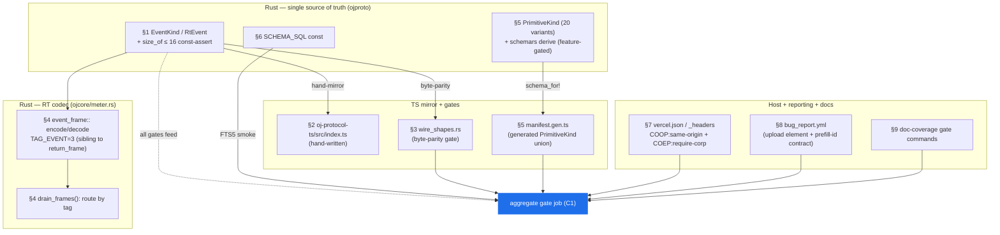

# 09 — Reference Schemas & Code Sketches

> This is the **reference appendix** for the OpenJammer foundations program: the ready-to-use schema and code sketches the section files prescribe, gathered in one place so an implementer can lift them verbatim. It is *derivative*, not decisional — every verdict here is resolved in the linked sections, and the canonical map is [`00-overview.md`](00-overview.md). When a sketch and a section disagree, the **section wins**; file an issue and fix the appendix.

Each sketch is preceded by its **target path** and **purpose**, fenced with a language tag, and grounded in the current tree. Where a claim touches a real file, it is cited as `path:line`. Re-verify before pasting — the tree moves.

> **Verified:** Every "absent today" / "exists today" claim below was checked against the worktree at `intelligent-easley-16d0db`. Specifically: `schemas/oj-plugin-v1.json` **exists** (and its `kind` enum is the 18-variant set the codegen will widen to 20); `vercel.json`, `public/_headers`, `justfile`, `lefthook.yml`, `rust-toolchain.toml`, `oj.yaml`, `.config/nextest.toml`, and `.github/ISSUE_TEMPLATE/` are all **absent today**.

---

## What is in this appendix

| § | Artifact | Target path | Owner decision | Section |
|---|---|---|---|---|
| [1](#1-the-ojproto-eventkind-schema-rust) | `EventKind` / `RtEvent` enum + `size_of` const-assert | `crates/ojproto/src/lib.rs` | L2 | [02](02-logging-and-observability.md#l2--cross-boundary-structured-event-schema-the-spine) |
| [2](#2-the-oj-protocol-ts-mirror-hand-written) | Hand-written TS mirror of the event schema | `packages/oj-protocol-ts/src/index.ts` | L2 / F3 | [02](02-logging-and-observability.md) |
| [3](#3-the-wire_shapesrs-byte-parity-test-pattern) | Byte-exact serde parity test for the new types | `crates/ojproto/tests/wire_shapes.rs` | L2 | [02](02-logging-and-observability.md) |
| [4](#4-the-event_frame-codec--tag_event--extended-drain_frames) | `event_frame` codec, the new `TAG_*` bytes, `drain_frames` routing | `crates/ojcore/src/meter.rs` | L2 | [02](02-logging-and-observability.md) |
| [5](#5-schemars-codegen--the-single-generated-primitivekind-ts-union) | `schemars` `gen-schema` bin + the one generated TS union | `crates/ojproto`, `crates/ojcore`, `src/engine/manifest.gen.ts` | D1 | [04](04-developer-tooling.md#d1--rust-canonical-schema-codegen--a-deliberately-thin-manifest) |
| [6](#6-the-l3-sqlite-schema_sql--the-fts5-availability-smoke) | `SCHEMA_SQL` const + the gated FTS5-availability smoke | `crates/ojproto/src/lib.rs`, native + wasm test cells | L3 | [02](02-logging-and-observability.md#l3--on-device-log-storage--needle-in-a-haystack-search) |
| [7](#7-coopcoep-headers-verceljson--public_headers) | `vercel.json` / `public/_headers` COOP/COEP config | repo root / `public/` | R3 / C1 | [00](00-overview.md#f6--one-required-ci-check--one-toolchain-pin--one-hook-control-plane) |
| [8](#8-the-github-issue-form-yaml--the-prefill-id-contract) | `bug_report.yml` issue form + the prefill-id contract gate | `.github/ISSUE_TEMPLATE/` | L5 | [02](02-logging-and-observability.md#l5--one-click-issue-reporter-github-issue-form--redacted-on-device-diagnostics) |
| [9](#9-the-x2-doc-coverage-gate-commands) | Rust + TS doc-coverage gate commands & self-test | `ci.yml`, `scripts/doc-check.ts` | X2 | [06](06-documentation-starlight.md#x2--ci-enforced-doc-coverage-gates--deterministic-doc-check--docgen-authoring-assist) |

> **Note:** These sketches assume the **cross-cutting foundations** are in place — the `oj` Bun CLI, the `just` command surface, `.config/nextest.toml`, the aggregate `gate` job, the `{stable, canary}` channel model, the `ByteRing` wait-free SPSC transport, `release-please` (the single version brain), and `assert_no_alloc`. None of them invents a competing version source, schema, runner, or required check. See [`00-overview.md` §Cross-cutting foundations](00-overview.md#cross-cutting-foundations--the-things-that-must-be-one).



---

## 1 — The `ojproto` `EventKind` schema (Rust)

> **Target:** `crates/ojproto/src/lib.rs` — added next to `EngineFrame` (enum body begins at `crates/ojproto/src/lib.rs:232`).
> **Purpose:** the single, versioned, `Copy`-where-RT, `#[repr]`-stable event taxonomy that crosses both targets (foundation **F3**). It is mirrored by hand in [§2](#2-the-oj-protocol-ts-mirror-hand-written) and byte-parity-gated in [§3](#3-the-wire_shapesrs-byte-parity-test-pattern).

> **Verified:** No `EventKind`, `RtEvent`, `Severity`, `Source`, or `FaultKind` type exists in `ojproto` today. The existing RT-command size cap this mirrors is real: `const _: () = assert!(core::mem::size_of::<RtCommand>() <= 16);` at `crates/ojproto/src/lib.rs:200`. The crate is `#![no_std]` (`:9`) with `extern crate alloc;` (`:11`), so `String`/`Vec` come from `alloc` — exactly as the existing `EngineFrame::Error { code: u16, message: String }` (`:253`) already does.

The design splits into a **full control-rate `EventKind`** (allocation legal off-RT, may carry a `String`) and a **`Copy` RT subset `RtEvent`** (rides the `ByteRing`, heap-free, guarded by a `size_of` const-assert mirroring `RtCommand`).

```rust
// crates/ojproto/src/lib.rs — add beside `EngineFrame` (enum body at :232).
// `#![no_std]` crate: `String` is `alloc::string::String` (already imported at :13).

/// Log severity, lowest to highest. Bare-variant-string serde (no `rename_all`),
/// mirrored on the TS side exactly like `PrimitiveKind` / `ConnectionType`.
#[derive(Debug, Clone, Copy, PartialEq, Eq, Serialize, Deserialize)]
pub enum Severity {
    Trace,
    Debug,
    Info,
    Warn,
    Error,
}

/// Which side of the dual-target seam emitted the event.
#[derive(Debug, Clone, Copy, PartialEq, Eq, Serialize, Deserialize)]
pub enum Source {
    Engine,
    Wasm,
    Ui,
    Native,
}

/// The RT-emittable fault taxonomy. Each maps 1:1 onto a resilience flag the
/// engine already sets but currently drops silently (see [`exec.rs`]):
///   * `NonFinite`    — set per-node in `sanitize_node` (`exec.rs:574`) and for
///                      the master node at `exec.rs:451`.
///   * `OverBudget`   — `budget.over_budget[node] = true` at `exec.rs:387`.
///   * `AutoBypassed` — the watchdog `auto_bypass` branch at `exec.rs:388`,
///                      whose effect `bypassed[node] = true` is at `exec.rs:391`.
#[derive(Debug, Clone, Copy, PartialEq, Eq, Serialize, Deserialize)]
pub enum FaultKind {
    NonFinite,
    OverBudget,
    AutoBypassed,
}

/// The CLOSED, versioned event taxonomy. EXTERNALLY tagged by serde (matching
/// `RtCommand` / `EngineFrame`): unit variants serialize as a bare string,
/// data variants as `{ "<Variant>": { ..fields.. } }`. `Message` is the ONLY
/// `String`-carrying variant — the orphaned `EngineFrame::Error { code, message }`
/// (`:253`, produced by no engine code — verified: constructed only in
/// `wire_shapes.rs` test fixtures) folds in here in the same schema bump.
#[derive(Debug, Clone, PartialEq, Serialize, Deserialize)]
pub enum EventKind {
    /// Process/stream lifecycle (start, stop, device change).
    Lifecycle,
    /// A hot-swap of the running program landed.
    GraphSwap,
    /// Buffer underrun(s) since the last event; `dropped` is a coalesced count.
    Xrun { dropped: u32 },
    /// A per-node DSP fault (NaN/over-budget/auto-bypass).
    NodeFault { node: NodeIdx, fault: FaultKind },
    /// The event ring overflowed and dropped frames (drop-and-count).
    RingFull,
    /// Asset (sample/IR/SF2) load or decode event.
    Asset,
    /// CLAP/host-plugin lifecycle event.
    Plugin,
    /// MIDI in/out event.
    Midi,
    /// Collaboration/LAN-peer event.
    Collab,
    /// Free-form coded message — the single `String`-carrying variant.
    Message { code: u16, text: String },
}

/// A fully-decoded control-rate event. `v` reuses the existing
/// [`SCHEMA_VERSION`] (`:18`, currently `1`) — there is NO second version axis.
#[derive(Debug, Clone, PartialEq, Serialize, Deserialize)]
pub struct Event {
    pub v: u16,
    pub seq: u32,
    pub severity: Severity,
    pub kind: EventKind,
    pub source: Source,
    pub ts_us: u64,
    pub corr_id: u64,
}

/// The RT-safe `Copy` subset that rides the `ByteRing`. NO heap field is
/// permitted: a `String`/`Vec` would push this past 16 bytes and FAIL the build
/// below — the same mechanical guard that protects `RtCommand` (`:200`).
#[derive(Debug, Clone, Copy, PartialEq, Eq, Serialize, Deserialize)]
pub enum RtEvent {
    Xrun { dropped: u32 },
    NodeFault { node: NodeIdx, fault: FaultKind },
    RingFull,
}

// Mirrors the proven `RtCommand` cap at `crates/ojproto/src/lib.rs:200`. A heap
// field smuggled into `RtEvent` becomes a COMPILE error, not a runtime surprise.
const _: () = assert!(core::mem::size_of::<RtEvent>() <= 16);
```

> **Must-fix (critical) — folded in here, not only in 00-overview:** the `size_of::<RtEvent>() <= 16` const-assert MUST land in the same commit as the enum so a heap field can never be added unguarded. The RT no-alloc proof (the `cargo nextest run -p ojcore --features devlog` cell that trips `over_budget` + `non_finite` + `auto_bypass` *inside* `assert_no_alloc`, with a sub-variant that does **not** drain inside the scope) is specified in [`02-logging-and-observability.md`](02-logging-and-observability.md#adversarial-must-fixes-folded-in-1) and wired as a `needs` of the aggregate `gate` job. `RtEvent` carries no `String`; only the off-RT `EventKind::Message` does.

> **Why `RtEvent` ⊂ `EventKind`:** the audio thread emits only the three fault variants (`Xrun`, `NodeFault`, `RingFull`); the richer `EventKind` (with `Message`, `Lifecycle`, etc.) is constructed off-RT by the drain side. One taxonomy, two altitudes — no second enum, no competing crate.

---

## 2 — The `oj-protocol-ts` mirror (hand-written)

> **Target:** `packages/oj-protocol-ts/src/index.ts` (package `@openjammer/oj-protocol`, `packages/oj-protocol-ts/package.json:2`).
> **Purpose:** the hand-maintained TS mirror of the new event types, kept honest by the `wire_shapes.rs` parity gate ([§3](#3-the-wire_shapesrs-byte-parity-test-pattern)). It is **deliberately not codegen** — the file header states so verbatim (`packages/oj-protocol-ts/src/index.ts:1-9`), and `CODEOWNERS` pairs `crates/ojproto` with `packages/oj-protocol-ts` so the two cannot drift unreviewed (foundation **F6**).

> **Verified:** the existing mirror already encodes serde's externally-tagged form for `RtCommand`/`EngineFrame` (`index.ts:150-158`, `:238-250`) and the bare-variant-string form for `PrimitiveKind`/`ConnectionType` (`index.ts:59-87`). The new unions below follow the same two conventions — no new mapping rule is introduced.

```ts
// packages/oj-protocol-ts/src/index.ts — append after the EngineFrame union (:250).

/**
 * Log severity, lowest→highest. Rust: `enum Severity` — bare variant string,
 * exactly like `PrimitiveKind`. Verified shapes: "Trace" | "Debug" | ...
 */
export type Severity = "Trace" | "Debug" | "Info" | "Warn" | "Error";

/** Which side of the dual-target seam emitted the event. Rust: `enum Source` — bare string. */
export type Source = "Engine" | "Wasm" | "Ui" | "Native";

/** RT fault taxonomy. Rust: `enum FaultKind` — bare string. */
export type FaultKind = "NonFinite" | "OverBudget" | "AutoBypassed";

/**
 * The closed, versioned event taxonomy. Rust: `enum EventKind`, EXTERNALLY
 * tagged — unit variants are bare strings, data variants single-key objects.
 *
 * Wire examples (assert these in wire_shapes.rs):
 *   "Lifecycle"
 *   "GraphSwap"
 *   { "Xrun": { "dropped": 3 } }
 *   { "NodeFault": { "node": 3, "fault": "NonFinite" } }
 *   "RingFull"
 *   { "Message": { "code": 42, "text": "boom" } }
 */
export type EventKind =
  | "Lifecycle"
  | "GraphSwap"
  | { Xrun: { dropped: number } }
  | { NodeFault: { node: NodeIdx; fault: FaultKind } }
  | "RingFull"
  | "Asset"
  | "Plugin"
  | "Midi"
  | "Collab"
  | { Message: { code: number; text: string } };

/**
 * A fully-decoded control-rate event. Rust: `struct Event`. Fields serialize in
 * declaration order (pinned by the Rust test). `v` mirrors `SCHEMA_VERSION`.
 */
export interface Event {
  v: number;
  seq: number;
  severity: Severity;
  kind: EventKind;
  source: Source;
  ts_us: number;
  corr_id: number;
}

/**
 * RT-safe `Copy` subset that rides the ByteRing. Rust: `enum RtEvent`,
 * EXTERNALLY tagged. Heap-free; mirrors only the three RT-emittable variants.
 */
export type RtEvent =
  | { Xrun: { dropped: number } }
  | { NodeFault: { node: NodeIdx; fault: FaultKind } }
  | "RingFull";
```

> **Note:** `NodeIdx` is already declared as a bare `number` (`index.ts:49`) because `NodeIdx(pub u32)` is a newtype that serde serializes transparently (`crates/ojproto/tests/wire_shapes.rs:72-75`). Reuse it; do not redeclare.

---

## 3 — The `wire_shapes.rs` byte-parity test pattern

> **Target:** `crates/ojproto/tests/wire_shapes.rs` — extend the existing test module.
> **Purpose:** pin the EXACT `serde_json` bytes for every new type so a Rust-side change that alters the wire shape (rename, reorder, retagging) fails CI and signals the TS mirror must move in lockstep. This is the **`wire_shapes.rs` parity gate** — the one serde-snapshot pattern the repo already trusts.

> **Verified:** the existing file already provides the exact harness to reuse — `fn assert_json<T: serde::Serialize>(v: &T, expected: &str)` (`crates/ojproto/tests/wire_shapes.rs:29-32`), `primitive_kind_is_bare_variant_string` enumerating every variant (`:34-63`), `rt_command_external_tagging` (`:142-192`), and `engine_frame_external_tagging` (`:194-235`). The new tests below are siblings, modeled verbatim on those.

```rust
// crates/ojproto/tests/wire_shapes.rs — add these tests using the existing
// `assert_json` helper (:29) and `use ojproto::*;` (:26).

#[test]
fn severity_is_bare_variant_string() {
    // Parallels `primitive_kind_is_bare_variant_string` (:35) — enumerate ALL.
    let all = [
        (Severity::Trace, "\"Trace\""),
        (Severity::Debug, "\"Debug\""),
        (Severity::Info, "\"Info\""),
        (Severity::Warn, "\"Warn\""),
        (Severity::Error, "\"Error\""),
    ];
    for (s, expected) in all {
        assert_json(&s, expected);
    }
}

#[test]
fn source_and_fault_kind_are_bare_variant_strings() {
    for (s, e) in [
        (Source::Engine, "\"Engine\""),
        (Source::Wasm, "\"Wasm\""),
        (Source::Ui, "\"Ui\""),
        (Source::Native, "\"Native\""),
    ] {
        assert_json(&s, e);
    }
    for (f, e) in [
        (FaultKind::NonFinite, "\"NonFinite\""),
        (FaultKind::OverBudget, "\"OverBudget\""),
        (FaultKind::AutoBypassed, "\"AutoBypassed\""),
    ] {
        assert_json(&f, e);
    }
}

#[test]
fn event_kind_external_tagging() {
    // Parallels `engine_frame_external_tagging` (:195). Assert EVERY variant.
    assert_json(&EventKind::Lifecycle, "\"Lifecycle\"");
    assert_json(&EventKind::GraphSwap, "\"GraphSwap\"");
    assert_json(&EventKind::Xrun { dropped: 3 }, r#"{"Xrun":{"dropped":3}}"#);
    assert_json(
        &EventKind::NodeFault {
            node: NodeIdx(3),
            fault: FaultKind::NonFinite,
        },
        r#"{"NodeFault":{"node":3,"fault":"NonFinite"}}"#,
    );
    assert_json(&EventKind::RingFull, "\"RingFull\"");
    assert_json(&EventKind::Asset, "\"Asset\"");
    assert_json(&EventKind::Plugin, "\"Plugin\"");
    assert_json(&EventKind::Midi, "\"Midi\"");
    assert_json(&EventKind::Collab, "\"Collab\"");
    assert_json(
        &EventKind::Message {
            code: 42,
            text: "boom".into(),
        },
        r#"{"Message":{"code":42,"text":"boom"}}"#,
    );
}

#[test]
fn event_struct_shape() {
    // Fields serialize in declaration order — this is the order the TS `Event`
    // interface must list them (structural typing ignores order, but the test
    // pins it so the mirror stays readable and the JSON stays stable).
    assert_json(
        &Event {
            v: 1,
            seq: 7,
            severity: Severity::Warn,
            kind: EventKind::Xrun { dropped: 2 },
            source: Source::Engine,
            ts_us: 123_456,
            corr_id: 9,
        },
        concat!(
            r#"{"v":1,"seq":7,"severity":"Warn","#,
            r#""kind":{"Xrun":{"dropped":2}},"source":"Engine","#,
            r#""ts_us":123456,"corr_id":9}"#,
        ),
    );
}

#[test]
fn rt_event_external_tagging() {
    assert_json(&RtEvent::Xrun { dropped: 5 }, r#"{"Xrun":{"dropped":5}}"#);
    assert_json(
        &RtEvent::NodeFault {
            node: NodeIdx(3),
            fault: FaultKind::OverBudget,
        },
        r#"{"NodeFault":{"node":3,"fault":"OverBudget"}}"#,
    );
    assert_json(&RtEvent::RingFull, "\"RingFull\"");
}
```

> **Must-fix (high) — migrate, do not drop, the `Error` coverage:** when `EngineFrame::Error` (`crates/ojproto/src/lib.rs:253`) folds into `EventKind::Message`, the existing `engine_frame_external_tagging` `Error` assertion (`wire_shapes.rs:228-234`) and the `round_trips_back_to_rust` `Error` round-trip (`:253-259`) must be **migrated**, not merely deleted — re-point them at `EventKind::Message` so the deprecation is covered, not dropped.

These tests run inside the existing `cargo test --workspace` on the Linux + Windows jobs and feed the aggregate `gate` via the C1 control plane — **zero new CI**.

---

## 4 — The `event_frame` codec + `TAG_EVENT` + extended `drain_frames`

> **Target:** `crates/ojcore/src/meter.rs` — a new `pub mod event_frame`, sibling to the existing `pub mod return_frame` (`crates/ojcore/src/meter.rs:138`).
> **Purpose:** the fixed-size RT byte codec the audio thread encodes to a stack buffer and pushes wait-free onto the `ByteRing`, plus the **one** `drain_frames` router that decodes by tag — never three parallel `drain_logs` / `drain_events` / `drain_frames`.

> **Verified:** `return_frame` defines exactly two tags today — `pub const TAG_METER: u8 = 1;` (`meter.rs:142`) and `pub const TAG_BEAT: u8 = 2;` (`:144`) — with `METER_LEN = BEAT_LEN = 13` (`:147-149`) and `MAX_LEN` as their max (`:151-155`). The reused ring alias is `pub type MeterRing = ojcore_midiring::ByteRing<8192>;` (`:202-203`, `#[cfg(feature = "std")]`). The `ByteRing::push`/`pop` API (length-prefixed SPSC, `push` returns `false` and drops the whole frame on full) is at `crates/ojcore-midiring/src/lib.rs:159` / `:188`.

The single most important number to keep stable: **`TAG_EVENT = 3`** continues the existing tag sequence (`TAG_METER = 1`, `TAG_BEAT = 2`). A single event tag carries the externally-discriminated `RtEvent` payload; the off-RT decoder reconstructs the full `RtEvent`/`EventKind`.

```rust
// crates/ojcore/src/meter.rs — add as a sibling to `pub mod return_frame` (:138).

/// Fixed-size wire codec for RT-emittable events, carried on a dedicated event
/// ring (NOT the meter ring — a fault storm must never evict meters). One tag
/// continues the `return_frame` numbering past TAG_METER=1 / TAG_BEAT=2.
pub mod event_frame {
    use ojproto::{FaultKind, NodeIdx, RtEvent};

    /// Tag byte for an event frame. Continues `return_frame`'s sequence.
    pub const TAG_EVENT: u8 = 3;

    /// Sub-kinds inside an event frame (byte 1 selects the RtEvent variant).
    const SUB_XRUN: u8 = 0;
    const SUB_NODE_FAULT: u8 = 1;
    const SUB_RING_FULL: u8 = 2;

    /// FaultKind ↔ byte map (kept private; encode/decode are the only callers).
    const FAULT_NON_FINITE: u8 = 0;
    const FAULT_OVER_BUDGET: u8 = 1;
    const FAULT_AUTO_BYPASSED: u8 = 2;

    /// Largest event frame: tag + sub + node(u32) + fault(u8) = 7 bytes.
    /// Comfortably under `return_frame::MAX_LEN` (13), so the shared ring and
    /// any fixed out-buffer already sized for meter frames is sufficient.
    pub const MAX_LEN: usize = 1 + 1 + 4 + 1;

    /// Encode one `RtEvent` into `buf`, returning the written length. No alloc,
    /// no panic on valid input — safe to call inside `assert_no_alloc`.
    #[inline]
    pub fn encode(ev: RtEvent, buf: &mut [u8; MAX_LEN]) -> usize {
        buf[0] = TAG_EVENT;
        match ev {
            RtEvent::Xrun { dropped } => {
                buf[1] = SUB_XRUN;
                buf[2..6].copy_from_slice(&dropped.to_le_bytes());
                6
            }
            RtEvent::NodeFault { node, fault } => {
                buf[1] = SUB_NODE_FAULT;
                buf[2..6].copy_from_slice(&node.0.to_le_bytes());
                buf[6] = match fault {
                    FaultKind::NonFinite => FAULT_NON_FINITE,
                    FaultKind::OverBudget => FAULT_OVER_BUDGET,
                    FaultKind::AutoBypassed => FAULT_AUTO_BYPASSED,
                };
                7
            }
            RtEvent::RingFull => {
                buf[1] = SUB_RING_FULL;
                2
            }
        }
    }

    /// Decode one event frame. `bytes` is the FULL frame exactly as `drain_frames`
    /// passes it — starting with the `TAG_EVENT` tag byte at `bytes[0]`, then the
    /// sub-kind byte, then the payload. Returns `None` on an unknown sub-kind or truncation.
    pub fn decode(bytes: &[u8]) -> Option<RtEvent> {
        match (*bytes.first()?, bytes.get(1).copied()) {
            (TAG_EVENT, Some(SUB_XRUN)) if bytes.len() >= 6 => {
                let dropped = u32::from_le_bytes(bytes[2..6].try_into().ok()?);
                Some(RtEvent::Xrun { dropped })
            }
            (TAG_EVENT, Some(SUB_NODE_FAULT)) if bytes.len() >= 7 => {
                let node = NodeIdx(u32::from_le_bytes(bytes[2..6].try_into().ok()?));
                let fault = match bytes[6] {
                    FAULT_NON_FINITE => FaultKind::NonFinite,
                    FAULT_OVER_BUDGET => FaultKind::OverBudget,
                    FAULT_AUTO_BYPASSED => FaultKind::AutoBypassed,
                    _ => return None,
                };
                Some(RtEvent::NodeFault { node, fault })
            }
            (TAG_EVENT, Some(SUB_RING_FULL)) => Some(RtEvent::RingFull),
            _ => None,
        }
    }
}
```

The dedicated event ring is declared **alongside** `MeterRing` (`meter.rs:203`) — a separate, larger ring so a fault storm cannot evict meters:

```rust
// crates/ojcore/src/meter.rs — parallel to `pub type MeterRing = ojcore_midiring::ByteRing<8192>;` (:203)

/// The RT → control EVENT return ring, distinct from `MeterRing`. Capacity is
/// MEASURED, not assumed — tune from the `dropped` counter once real fault
/// volumes flow (see Open questions in 02-logging-and-observability.md).
#[cfg(feature = "std")]
pub type EventRing = ojcore_midiring::ByteRing<8192>;
```

The off-RT decoder is **one** `drain_frames` that routes by the first byte — extending, not paralleling, the existing meter drain:

```rust
// Off-RT (allocation legal). Routes by tag byte: reuse `return_frame::decode`
// for TAG_METER (1) / TAG_BEAT (2); add the TAG_EVENT (3) arm. ONE router.
//
// `EngineEvent` is the off-RT union of "a decoded meter/beat EngineFrame" and
// "a decoded RtEvent"; the drain forwards it to L1 (tracing) / L3 (SQLite) / L4.
pub enum EngineEvent {
    Frame(ojproto::EngineFrame), // TAG_METER / TAG_BEAT
    Event(ojproto::RtEvent),     // TAG_EVENT
}

/// Decode one length-prefixed frame already `pop`ped from a ring, by its tag.
pub fn drain_frames(bytes: &[u8]) -> Option<EngineEvent> {
    use crate::meter::{event_frame, return_frame};
    match *bytes.first()? {
        return_frame::TAG_METER | return_frame::TAG_BEAT => {
            return_frame::decode(bytes).map(EngineEvent::Frame)
        }
        event_frame::TAG_EVENT => event_frame::decode(bytes).map(EngineEvent::Event),
        _ => None,
    }
}
```

> **Must-fix (critical) — RT-side per-`(code, node)` coalescing:** a NaN storm must collapse to a count, not fill the ring. Add a fixed-size `event_coalesce: [(u16, u32, u32); N]` (`(event code, node id, count)`, `N = 256` initially) to the `Engine` struct in `crates/ojcore/src/exec.rs`; at emit time do an O(N) search-and-update keyed on `(code, node)`, dropping the oldest entry on a full table. This is alloc-free and bounds memory regardless of fault volume. A `dropped: AtomicU64` is bumped on a failed `push` (mirroring the meter publish's drop-on-full). See [`02-logging-and-observability.md` §L2 must-fixes](02-logging-and-observability.md#adversarial-must-fixes-folded-in-1).

> **Must-fix (high) — round-trip test:** add a `drain_frames` round-trip in `wire_shapes.rs`-style under `crates/ojcore` that interleaves `TAG_METER` / `TAG_BEAT` / `TAG_EVENT` frames of **differing lengths** and asserts each decodes back to the right variant. `loom` proves the SPSC `ByteRing`, **not** the new tag-routing — the routing needs its own deterministic test.

> **Must-fix (critical) — wasm has no `MeterRing` to mirror:** the browser event channel is **net-new**, not a clone of a non-existent ring. `ojcore-wasm`'s `drain_meters() -> Vec<f32>` (`crates/ojcore-wasm/src/lib.rs:567`, allocating `Vec::with_capacity` at `:578`) is a pull between `process()` calls, not a ring. The browser path adds a worklet-local `EventRing`, exposed via `log_ring_ptr()` / `log_ring_len()` getters modeled on `cmd_ring_ptr()` (`crates/ojcore-wasm/src/lib.rs:470`) / `cmd_ring_len()` (`:478`) — the frozen `ring_*_offset()` getters (`:502-520`) already serve any `ByteRing<N>` header, so no new offset getters are needed. The worklet self-drains between `process()` calls and posts batched `{ tag, offset, len }` messages. `assert_no_alloc` is **native-only**; the wasm RT-emit path is verified by code review + a native-rlib `assert_no_alloc` run of the shared codec, never claimed as gate-verified on wasm. See [`02-logging-and-observability.md` §L2 per-platform matrix](02-logging-and-observability.md#per-platform-matrix-1).

---

## 5 — `schemars` codegen → the single generated `PrimitiveKind` TS union

> **Target:** `crates/ojproto/src/lib.rs` (derive), `crates/ojcore/src/bin/gen-schema.rs` (emitter), `schemas/oj-plugin-v1.json` + `schemas/primitive-kinds.json` (outputs), `src/engine/manifest.gen.ts` (generated TS).
> **Purpose:** kill the triple-declared `PrimitiveKind` union by generating it once from the Rust enum, parity-gated like `wire_shapes.rs` (decision **D1**).

> **Verified:** `PrimitiveKind` is a closed **20-variant** enum at `crates/ojproto/src/lib.rs:37-63` (`Osc` … `Recorder`). The committed `schemas/oj-plugin-v1.json` `kind` enum lists only **18** (`schemas/oj-plugin-v1.json:22-41`, ending at `"Passthrough"` — **missing `Looper` and `Recorder`**). The TS mirror at `src/engine/manifest.ts` is likewise short, and `KIND_BY_TYPE.looper` maps to `'Delay'` (`src/engine/manifest.ts:127`) while Rust lowers `LOOPER_ID → PrimitiveKind::Looper` (asserted at `crates/ojcore/src/register.rs:156`). This **18-vs-20 skew + the looper mismatch** is the concrete, live drift D1 closes — and regenerating the schema from the enum fixes the JSON file's missing two variants for free.

> **Verified:** `schemars`, `json-schema-to-typescript`, `oj.yaml`, and `scripts/` are all **absent today**; `schemas/oj-plugin-v1.json` exists, so `gen-schema` writes into a **pre-existing** schema dir.

**Step 1 — feature-gate the derive so it never compiles into the shipping engine.**

```rust
// crates/ojproto/src/lib.rs — gate the derive on `schema-gen` (off by default).
#[cfg_attr(feature = "schema-gen", derive(schemars::JsonSchema))]
#[derive(Debug, Clone, Copy, PartialEq, Eq, Serialize, Deserialize)]
pub enum PrimitiveKind { /* Osc..Recorder — the 20 variants at :37-63 */ }
```

```toml
# crates/ojproto/Cargo.toml — optional dep + feature (no [features] section exists today).
[dependencies]
schemars = { version = "1.1.0", optional = true }

[features]
schema-gen = ["dep:schemars"]
```

> **Note:** `crates/ojcore/Cargo.toml` gains the same optional `schemars` dep + `schema-gen` feature so `PluginManifest`/`ParamDecl`/`PortDecl`/`DspKind`/`UiKind` in `crates/ojcore/src/manifest.rs` also derive `JsonSchema`. The derives are **feature-gated out** of the shipping native/wasm engine — nothing touches `process()` or the `ByteRing`, and `assert_no_alloc` is unaffected.

**Step 2 — the `gen-schema` bin emits both the full schema and a flat kind list.**

```rust
// crates/ojcore/src/bin/gen-schema.rs — run via `cargo run -p ojcore --features schema-gen --bin gen-schema`.
use std::fs;

fn main() -> std::io::Result<()> {
    // The full manifest schema (accept schemars' $defs/$ref output as canonical).
    let manifest = schemars::schema_for!(ojcore::manifest::PluginManifest);
    fs::write(
        "schemas/oj-plugin-v1.json",
        serde_json::to_string_pretty(&manifest).expect("serialize manifest schema"),
    )?;

    // A FLAT string list of every PrimitiveKind variant, for the set-equality gate.
    // schema_for! returns a full JSON Schema DOCUMENT, not a bare list — so extract
    // the variant names. PrimitiveKind is a unit enum (serde bare strings); schemars
    // emits either {"enum":[...]} or {"oneOf":[{"const":"Osc"},...]} depending on
    // version, so handle both and write only the flat name array the gate compares.
    let schema = serde_json::to_value(schemars::schema_for!(ojproto::PrimitiveKind))
        .expect("schema to value");
    let kinds: Vec<String> = schema
        .get("enum")
        .and_then(|e| e.as_array())
        .map(|a| a.iter().filter_map(|v| v.as_str().map(String::from)).collect())
        .or_else(|| {
            schema.get("oneOf").and_then(|o| o.as_array()).map(|a| {
                a.iter()
                    .filter_map(|v| v.get("const").and_then(|c| c.as_str()).map(String::from))
                    .collect()
            })
        })
        .expect("PrimitiveKind schema should expose enum or oneOf/const variant names");
    fs::write(
        "schemas/primitive-kinds.json",
        serde_json::to_string_pretty(&kinds).expect("serialize kind list"),
    )?;
    Ok(())
}
```

**Step 3 — generate the single TS union; `manifest.ts` and `oj-protocol-ts` re-export it.**

```jsonc
// package.json scripts (Bun devDep: json-schema-to-typescript@15.0.4)
"scripts": {
  "gen:manifest-types": "bun run scripts/oj/index.ts gen:manifest-types"
}
// → emits src/engine/manifest.gen.ts (PluginManifest/ParamDecl/PortDecl/DspKind/UiKind
//   + the generated `PrimitiveKind` union). `src/engine/manifest.ts` and
//   `packages/oj-protocol-ts/src/index.ts` RE-EXPORT the union — collapsing the
//   verified triple-declaration to one generated source.
```

**Step 4 — the gen-then-diff + set-equality gates (feed the aggregate `gate`, never independently required).**

```yaml
# .github/workflows/ci.yml — engine job
- run: cargo run -p ojcore --features schema-gen --bin gen-schema
- run: git diff --exit-code schemas/        # generated schemas drift ⇒ build fails

# web job
- run: bun run gen:manifest-types
- run: bun run oj doctor --check ssot        # 3-way set-equality + bidirectional topology
- run: git diff --exit-code
```

The set-equality gate (`scripts/oj/lib/ssot.ts`) asserts the kind enum in `schemas/oj-plugin-v1.json` == the generated union in `manifest.gen.ts` == the flat list in `schemas/primitive-kinds.json` — the un-driftable contract across all three languages.

> **Must-fix (high) — Step 0, before the gate lands:** align TS to the engine. Extend the hand-written union at `src/engine/manifest.ts` with `| 'Looper' | 'Recorder'` and change `KIND_BY_TYPE.looper` from `'Delay'` to `'Looper'` (`src/engine/manifest.ts:127`). Confirm Rust is unchanged with `cargo test -p ojcore` (`crates/ojcore/src/register.rs:156` already asserts the lowering). Once codegen lands, the hand union is **replaced** by the re-exported `manifest.gen.ts` union and stops being hand-edited. See [`04-developer-tooling.md` §D1 Step 0](04-developer-tooling.md#fix-the-latent-bug-the-gate-surfaces-step-0-before-the-gate-lands).

> **Why not `inventory`/`linkme` auto-collection?** Rejected outright (D1): life-before-main constructors **do not fire on `wasm32-unknown-unknown`** (`wasm-bindgen` #1216), so the browser worklet would register **zero** nodes and produce silence with **no compile error** — the worst dual-target failure mode for this project. `register_all` / `register_builtins` stay the explicit ONE path.

---

## 6 — The L3 SQLite `SCHEMA_SQL` + the FTS5-availability smoke

> **Target:** `crates/ojproto/src/lib.rs` (`pub const SCHEMA_SQL: &str`); gated smoke tests on the native bundled build and the wasm/`sqlite-wasm` build.
> **Purpose:** one byte-identical schema string both runtimes reference (`rusqlite` native, `@sqlite.org/sqlite-wasm` browser), with an FTS5 virtual table, and a **gated** smoke that turns FTS5-off (a silent runtime-only failure) into a hard CI red wall.

> **Verified:** the L3 design publishes `SCHEMA_SQL` in `ojproto` so Rust and TS reference one string ([`02-logging-and-observability.md` §L3](02-logging-and-observability.md#l3--on-device-log-storage--needle-in-a-haystack-search)). `ojproto` is `#![no_std]` (`crates/ojproto/src/lib.rs:9`) — a `&'static str` const is fine; the SQLite *deps* (`rusqlite`, `sqlite-wasm`) live in the std/browser consumer crates, never in `ojproto`.

```rust
// crates/ojproto/src/lib.rs — one schema string both targets reference verbatim.

/// The ONE logical log-store schema. v1, IMMUTABLE — breaking changes are
/// reserved for a v2 major bump. `level`/`target`/`fields`/`msg` MIRROR the L2
/// `EventKind` taxonomy; L3 ingests the already-decoded `Event`, it does not
/// define a second model. `PRAGMA user_version = 1` is asserted at init; a
/// mismatch triggers a one-shot rebuild from NDJSON, not an in-place migration.
pub const SCHEMA_SQL: &str = "\
CREATE TABLE IF NOT EXISTS logs(
  id          INTEGER PRIMARY KEY,
  ts_unix_us  INTEGER NOT NULL,
  level       INTEGER NOT NULL,
  target      TEXT,
  thread      TEXT,
  fields      TEXT,   -- JSON
  msg         TEXT
);
CREATE INDEX IF NOT EXISTS idx_logs_ts    ON logs(ts_unix_us);
CREATE INDEX IF NOT EXISTS idx_logs_level ON logs(level);
CREATE VIRTUAL TABLE IF NOT EXISTS logs_fts
  USING fts5(msg, target, fields, content='logs', content_rowid='id');
-- External-content triggers keep logs_fts in sync.
CREATE TRIGGER IF NOT EXISTS logs_ai AFTER INSERT ON logs BEGIN
  INSERT INTO logs_fts(rowid, msg, target, fields)
  VALUES (new.id, new.msg, new.target, new.fields);
END;
CREATE TRIGGER IF NOT EXISTS logs_ad AFTER DELETE ON logs BEGIN
  INSERT INTO logs_fts(logs_fts, rowid, msg, target, fields)
  VALUES ('delete', old.id, old.msg, old.target, old.fields);
END;
PRAGMA user_version = 1;
";
```

**Native dependency + the gated FTS5-availability smoke (must block on both builds):**

```toml
# crates/ojcore-native/Cargo.toml (or the L3 store crate) — statically compiled SQLite 3.53.x.
rusqlite = { version = "0.40.1", features = ["bundled", "fts5"] }
```

```rust
// A GATED smoke (feeds the aggregate `gate`): proves FTS5 is actually compiled
// in, on the native bundled build. "no such module: fts5" is otherwise a silent
// runtime-only failure. The mirror smoke runs on the wasm/sqlite-wasm build.
#[test]
fn fts5_is_available_and_matches() {
    let conn = rusqlite::Connection::open_in_memory().expect("open");
    conn.execute_batch(ojproto::SCHEMA_SQL)
        .expect("SCHEMA_SQL must apply (fails loudly if fts5 is missing)");
    conn.execute(
        "INSERT INTO logs(ts_unix_us, level, target, thread, fields, msg) \
         VALUES (1, 3, 'engine', 'rt', '{}', 'over budget on node 4')",
        [],
    )
    .expect("insert");
    let hits: i64 = conn
        .query_row(
            "SELECT count(*) FROM logs_fts WHERE logs_fts MATCH 'budget'",
            [],
            |r| r.get(0),
        )
        .expect("FTS5 MATCH must work");
    assert_eq!(hits, 1, "fts5 MATCH found the row");
}
```

> **Must-fix (critical):** the FTS5-availability smoke is a **gated** check on BOTH the native bundled build AND the wasm/`sqlite-wasm` build, feeding the `gate` job. A schema-parity assertion (both engines accept the byte-identical `SCHEMA_SQL`) catches a missing `fts5` feature pin and divergent tokenizer config. **Ship L3 native-first**; the browser OPFS leg (single-connection multi-tab limitation, Safari `<17` fragility) is deferred until a real large-history-search need is validated. See [`02-logging-and-observability.md` §L3 must-fixes](02-logging-and-observability.md#adversarial-must-fixes-folded-in-2).

---

## 7 — COOP/COEP headers: `vercel.json` / `public/_headers`

> **Target:** `vercel.json` at repo root (if Vercel is chosen) **or** `public/_headers` (Netlify/Cloudflare Pages style; copied verbatim into `dist/`).
> **Purpose:** make a production host re-emit the cross-origin-isolation headers so `crossOriginIsolated === true` and `SharedArrayBuffer` is available — without them, `OjcoreWasmExecutor` silently degrades to the slower postMessage path.

> **Verified:** the COOP/COEP headers exist **only** in `vite.config.ts` dev + preview servers — `Cross-Origin-Opener-Policy: same-origin` + `Cross-Origin-Embedder-Policy: require-corp` at `vite.config.ts:130-131` (`server`) and `:136-137` (`preview`). The file's own comment block states "**PRODUCTION HOSTING MUST SERVE THESE TOO … or the wasm executor silently falls back to the (functional, higher-latency) postMessage control path**" (`vite.config.ts:121-127`). **No `vercel.json` and no `public/_headers` exist today.** The host choice (Vercel vs Cloudflare vs Netlify) is [Open Question 4 in 00-overview](00-overview.md#open-questions--decisions-deferred) and is **pulled forward to Phase 0/1** because it gates all meaningful browser-wasm verification and R3.

**Option A — Vercel (`vercel.json` at repo root):**

```json
{
  "headers": [
    {
      "source": "/(.*)",
      "headers": [
        { "key": "Cross-Origin-Opener-Policy", "value": "same-origin" },
        { "key": "Cross-Origin-Embedder-Policy", "value": "require-corp" }
      ]
    }
  ]
}
```

**Option B — Netlify / Cloudflare Pages (`public/_headers`, copied into `dist/` by Vite):**

```text
/*
  Cross-Origin-Opener-Policy: same-origin
  Cross-Origin-Embedder-Policy: require-corp
```

> **Must-fix (high) — verify on the REAL host, not localhost:** the dev/preview headers prove nothing about production. Add a **post-deploy synthetic header check** against the deployed URL asserting both headers are present and `crossOriginIsolated === true` (T3's Playwright lane against the deployed URL). C1's `canary.yml` gains the deploy step once the host is chosen. See [`00-overview.md` Phase 4/5 must-fixes](00-overview.md#phase-4--testing-depth--docs-enforcement). The `oj doctor` `coi-headers` check (`scripts/oj/checks/`) inspects the **static** inputs (`vite.config.ts:130-131,136-137`, `dist/`, and any committed `vercel.json`/`_headers`) and **WARNs** loudly — it cannot assert a live SAB ring ([`04-developer-tooling.md` §D2 check 5](04-developer-tooling.md#oj-doctor---fix---from-files-staged-checks)).

---

## 8 — The GitHub issue-form YAML + the prefill-id contract

> **Target:** `.github/ISSUE_TEMPLATE/bug_report.yml` + `.github/ISSUE_TEMPLATE/config.yml`.
> **Purpose:** the one-click issue reporter's backend — a YAML issue *form* with the `upload` file-attach element and a structured diagnostics block, plus a CI gate asserting every prefilled field id matches between the YAML and the TS generator.

> **Verified:** **no `.github/ISSUE_TEMPLATE/` directory exists today.** The L5 design specifies this exact form, the `upload` element (GA'd 2025-08-13 — the only free, no-auth, dual-target attachment mechanism), a required consent `checkboxes`, and a `diagnostics` block delivered via a prefill URL param with a TS↔YAML id-contract gate ([`02-logging-and-observability.md` §L5](02-logging-and-observability.md#l5--one-click-issue-reporter-github-issue-form--redacted-on-device-diagnostics)).

```yaml
# .github/ISSUE_TEMPLATE/bug_report.yml
name: Bug report
description: Report a bug with a redacted on-device diagnostics snapshot.
labels: [bug, needs-triage]
body:
  - type: input
    id: summary
    attributes:
      label: Summary
      description: One sentence describing what went wrong.
    validations:
      required: true
  - type: textarea
    id: repro
    attributes:
      label: Steps to reproduce
      description: What did you do, what did you expect, what happened?
    validations:
      required: true
  - type: textarea
    id: diagnostics
    attributes:
      label: Diagnostics (auto-filled; review before submitting)
      description: >
        The app prefills this from a redacted on-device snapshot. Edit out
        anything private before you submit.
      render: json
  - type: input
    id: bundle
    attributes:
      label: Diagnostics bundle (optional, larger reports)
      description: >
        If the app told you to attach a file, drag `openjammer-diagnostics.json`
        into this field.
  - type: checkboxes
    id: consent
    attributes:
      label: Privacy
      options:
        - label: I reviewed the diagnostics above and removed anything private.
          required: true
```

> **Note — the `upload` element:** GitHub's issue-form `input`/`textarea` fields cannot themselves carry a binary attachment; the `upload` capability is the drag-a-file-into-the-field affordance on the rendered issue. v1 delivers the redacted **snapshot** inline via the `diagnostics` field; the optional `bundle` field above is the documented drag target for over-cap reports (clipboard + on-disk `openjammer-diagnostics.json` fallback). Re-verify the exact element keyword against GitHub's current issue-forms syntax at implementation time — the form below uses an `input` placeholder for the bundle prompt so it renders even on older syntax.

```yaml
# .github/ISSUE_TEMPLATE/config.yml
blank_issues_enabled: false
contact_links:
  - name: Questions & ideas
    url: https://github.com/PonderingBGI/openjammer/discussions
    about: For non-bug questions, ask in Discussions (no GitHub account hurdle for musicians).
```

**The prefill-id contract gate (Vitest + ajv) — every prefilled field id must exist in the YAML:**

```ts
// src/utils/diagnostics/__tests__/issue-form-contract.test.ts
import { describe, it, expect } from "vitest";
import { parse } from "yaml";
import { readFileSync } from "node:fs";
import { PREFILL_FIELD_IDS } from "../bundle"; // e.g. ["summary", "repro", "diagnostics"]

describe("issue-form prefill-id contract", () => {
  it("every prefilled field id exists in bug_report.yml", () => {
    const form = parse(readFileSync(".github/ISSUE_TEMPLATE/bug_report.yml", "utf8"));
    const ids = new Set<string>(form.body.map((b: { id?: string }) => b.id).filter(Boolean));
    for (const id of PREFILL_FIELD_IDS) {
      expect(ids, `prefilled id "${id}" missing from bug_report.yml`).toContain(id);
    }
  });
});
```

```yaml
# .github/workflows/ci.yml — web job: validate the form against the github-issue-forms JSON schema.
- run: bunx ajv validate -s github-issue-forms.schema.json -d .github/ISSUE_TEMPLATE/bug_report.yml
```

The delivery URL is built after consent: `…/issues/new?template=bug_report.yml&title=…&diagnostics=<urlencoded>`, with the inline block hard-capped at ~4 KB (well under GitHub's ~8 KB/414 wall); over cap → clipboard + on-disk `openjammer-diagnostics.json` and open the URL **without** the diagnostics param.

> **Must-fix (high) — fail-closed allowlist:** the `diagnostics` block serializes **only explicitly-allowed fields**, and the OjGraph IR is path-scrubbed before it enters the bundle (absolute sample-file paths embed usernames). The redaction patterns live ONCE in `src/utils/diagnostics/redact.ts`, consumed by **both** L5's bundle and L4's `logStore`, and are pinned to the verified secret-env names — `OPENJAMMER_PROVIDER_KEY` (default) / `OPENJAMMER_AI_KEY_VAR` (override) from `src-tauri/src/ai.rs:269-272` (the `ai.rs` path is **confirmed to exist**, not stale: `stripped_env()` at `src-tauri/src/ai.rs:253`). A maintained secret-corpus redaction test gates L5 v1. See [`02-logging-and-observability.md` §L5 must-fixes](02-logging-and-observability.md#adversarial-must-fixes-folded-in-4).

---

## 9 — The X2 doc-coverage gate commands

> **Target:** `.github/workflows/ci.yml` (engine + web jobs), `crates/ojproto/Cargo.toml` (negative fixture feature), `scripts/doc-check.ts`.
> **Purpose:** make documentation a CI-enforced requirement — Rust `missing_docs` + `cargo doc -D warnings`, a standing negative-fixture self-test, and the TS `doc-check` baseline-ratchet — all feeding the aggregate `gate` (decision **X2**).

> **Verified:** the engine job runs `cargo clippy --workspace --all-targets -- -D warnings` (the step the doc gate lands immediately after); the host-feature flags it documents are `clap-host` (on `ojhost`) and `demo` (on `ojcore-native`); `Swatinem/rust-cache@v2` is already wired. The repo has **no hooks today** (no `lefthook.yml`, no `.husky/`) and `crates/ojproto/Cargo.toml` has **no `[features]` section** — so the negative-fixture feature is a clean addition (the same `[features]` block §5 adds for `schema-gen`). The root `Cargo.toml` has **no `[workspace.lints]`** (`Cargo.toml:1-22` is `[workspace]` + `[workspace.package]` + `[workspace.dependencies]` + `[profile.release]` only), so the lint below is a clean addition.

**Rust leg — workspace lint + the doc gate (engine job, after the clippy step):**

```toml
# Cargo.toml [workspace] — start at warn; ratchet ojproto/ojcore-midiring/ojcore-dsp to deny first.
[workspace.lints.rust]
missing_docs = "warn"
```

```yaml
# .github/workflows/ci.yml — engine job, immediately after `Clippy (-D warnings)`.
- name: Doc gate (missing_docs + broken intra-doc links)
  run: RUSTDOCFLAGS="-D warnings" cargo doc --workspace --no-deps --features "clap-host,demo"
- name: Doctests compile
  run: cargo test --workspace --doc
```

> **Note:** the `--features "clap-host,demo"` here is the SAME flag set sourced from the shared `scripts/docs-rustdoc.sh` ([`06-documentation-starlight.md` §Layer 2](06-documentation-starlight.md#layer-2--rust-api--co-hosted-rustdoc-linked-out-honest)) so the X2 gate and X1's `pages.yml` never drift on which backends are documented. **Stay on stable for the gate** — do not depend on nightly rustdoc-JSON.

**Standing negative-fixture self-test (replaces a throwaway commit — survives toolchain bumps):**

```toml
# crates/ojproto/Cargo.toml — add to the [features] section (the same one schema-gen uses).
[features]
doc-gate-negative = []
```

```rust
// crates/ojproto/src/doc_gate_fixture.rs — a DELIBERATELY broken intra-doc link,
// compiled only under the negative feature. Module is `#[cfg]`-gated in lib.rs:
//   #[cfg(feature = "doc-gate-negative")] mod doc_gate_fixture;
/// This link is intentionally broken: [`Nonexistent`].
pub fn _doc_gate_canary() {}
```

```yaml
# .github/workflows/ci.yml — engine job: assert the gate ACTUALLY red-walls.
- name: Doc gate self-test (MUST fail — proves -D warnings red-walls)
  run: |
    if RUSTDOCFLAGS="-D warnings" cargo doc -p ojproto --no-deps \
         --features doc-gate-negative 2>/dev/null; then
      echo "::error::doc gate did NOT fail on a broken intra-doc link"; exit 1
    fi
```

**TS leg — baseline + ratchet (web job, after the lint step):**

```jsonc
// .doc-check.json — strict for protocol/engine/logic, relaxed for React .tsx.
{
  "severity": { "missingJsdoc": "error", "missingParam": "error", "missingReturns": "error" },
  "symbolPatterns": { "exempt": ["^_", "Props$", "Schema$"] },
  "ignoreComment": "@doc-ignore",
  "exclude": ["**/*.test.ts", "**/*.spec.ts"],
  "strict":  ["packages/oj-protocol-ts/src/index.ts", "src/**/!(*.tsx)"],
  "relaxed": ["src/**/*.tsx"]
}
```

```yaml
# .github/workflows/ci.yml — web job, after `bun run lint`.
- name: Doc coverage (TS)
  run: bun run scripts/doc-check.ts --all
- name: Baseline only shrinks
  run: bun run scripts/doc-check.ts --assert-baseline-shrinks   # entry count ≤ base branch
```

```jsonc
// package.json scripts
"scripts": {
  "docs:check":     "bun run scripts/doc-check.ts --all",
  "docs:check:fix": "bun run scripts/doc-check.ts --fix"
}
```

> **Must-fix (high) — `CONTRIBUTING.md` rewritten in Phase 1, not Phase 6.** The verified-stale front-door doc (`localhost:3000` vs the real `5173` at `src-tauri/tauri.conf.json:8`; Bun-only prereqs that omit the Rust toolchain; npm flows that hit the `bun`-only `preinstall` guard at `package.json:23`) misdirects every contributor. Rewrite it alongside the `just` surface + the `oj` Bun CLI; only its Starlight *rendering* waits for X1 in Phase 6. See [`06-documentation-starlight.md` §X2 CONTRIBUTING must-fix](06-documentation-starlight.md#adversarial-must-fixes-folded-in-x2).

> **Note — all gates feed ONE required check:** `cargo doc -D warnings`, the doctests, the doc-gate self-test, `doc-check --all`, and the baseline-shrinks guard are all `needs` dependencies of C1's single aggregate `gate` job (`needs: [all]; if: always()`) — never independently-required status checks. The needs-docs bot is **advisory** and feeds nothing. *Do not rename the gate job.*

---

## Verification ledger

Every load-bearing claim in this appendix, with its source of truth.

| Claim | Verified at |
|---|---|
| `RtCommand` size cap exists (the pattern `RtEvent` mirrors) | `crates/ojproto/src/lib.rs:200` |
| `EngineFrame::Error { code, message }` exists, no engine producer | `crates/ojproto/src/lib.rs:253`; constructed only in `crates/ojproto/tests/wire_shapes.rs:229,253` |
| `ojproto` is `#![no_std]` + `extern crate alloc` | `crates/ojproto/src/lib.rs:9,11` |
| `SCHEMA_VERSION = 1` (reused for `Event.v`) | `crates/ojproto/src/lib.rs:18` |
| `PrimitiveKind` is a 20-variant closed enum | `crates/ojproto/src/lib.rs:37-63` |
| Committed schema `kind` enum is 18 variants (missing `Looper`/`Recorder`) | `schemas/oj-plugin-v1.json:22-41` |
| Looper lowering mismatch (Rust `Looper` vs TS `'Delay'`) | `crates/ojcore/src/register.rs:156`; `src/engine/manifest.ts:127` |
| `wire_shapes.rs` harness + patterns to mirror | `crates/ojproto/tests/wire_shapes.rs:29,35,142,194` |
| `return_frame` tags `TAG_METER=1` / `TAG_BEAT=2`; `MAX_LEN` | `crates/ojcore/src/meter.rs:142,144,151-155` |
| `MeterRing = ByteRing<8192>` (`#[cfg(feature="std")]`) | `crates/ojcore/src/meter.rs:202-203` |
| `ByteRing::push`/`pop` API (drop-whole-frame on full) | `crates/ojcore-midiring/src/lib.rs:159,188` |
| RT fault sites: `over_budget` / `auto_bypass` / `non_finite` | `crates/ojcore/src/exec.rs:387,388,391,451,574` |
| `sample_pos` advance (RT timestamp source) | `crates/ojcore/src/exec.rs:459` |
| wasm metering is an allocating `Vec` pull, no `MeterRing` | `crates/ojcore-wasm/src/lib.rs:567,578` |
| wasm ring getters to model `log_ring_*` on; frozen offset getters | `crates/ojcore-wasm/src/lib.rs:470,478,502-520` |
| COOP/COEP only in `vite.config.ts` dev+preview; prod note | `vite.config.ts:121-127,130-131,136-137` |
| `register_all` / `RegisterOpts::full()` / `PluginLoader::manifest` / `ids()` / `BTreeMap` | `crates/ojinstrument/src/lib.rs:147,118`; `crates/ojcore/src/loader.rs:15`; `crates/ojcore/src/registry.rs:58,19` |
| Four-way version drift | `Cargo.toml:9` (`0.0.0`); `package.json:3` (`0.1.0-alpha`); `src-tauri/tauri.conf.json:4` (`0.1.0`); `packages/oj-protocol-ts/package.json:3` (`0.0.0`) |
| `bun`-only `preinstall` guard | `package.json:23` |
| `clap-host` / `demo` doc-feature flags; clippy step the doc gate follows | `.github/workflows/ci.yml` engine job (`clap-host` on `ojhost`, `demo` on `ojcore-native`) |
| Secret-env handler (L5 redaction anchor) | `src-tauri/src/ai.rs:253,269-272` |
| Absent today: `vercel.json`, `public/_headers`, `justfile`, `lefthook.yml`, `rust-toolchain.toml`, `oj.yaml`, `.config/nextest.toml`, `.github/ISSUE_TEMPLATE/`, `[features]` in `ojproto/Cargo.toml`, `[workspace.lints]` | checked against the worktree (this session) |

---

> **See also:** [`00-overview.md`](00-overview.md) (canonical foundations + section index) · [`02-logging-and-observability.md`](02-logging-and-observability.md) (L2 `EventKind`/`event_frame`/`drain_frames`, L3 `SCHEMA_SQL`, L5 issue reporter) · [`04-developer-tooling.md`](04-developer-tooling.md) (D1 `schemars` codegen, the `oj doctor` checks) · [`05-github-actions-ci.md`](05-github-actions-ci.md) (the aggregate `gate` job, Lane A / Lane B) · [`06-documentation-starlight.md`](06-documentation-starlight.md) (X2 doc-coverage gates, the shared `scripts/docs-rustdoc.sh`) · [`07-reference-configs.md`](07-reference-configs.md) (the `.config/nextest.toml`, `justfile`, `release-please-config.json`, `tauri.conf.json` configs these schemas plug into) · [`08-reference-ci-workflows.md`](08-reference-ci-workflows.md) (the `ci.yml` / `canary.yml` workflows that run these gates) · [`GLOSSARY.md`](GLOSSARY.md) (canonical-term definitions). On any divergence, [`00-overview.md`](00-overview.md) is authoritative.
