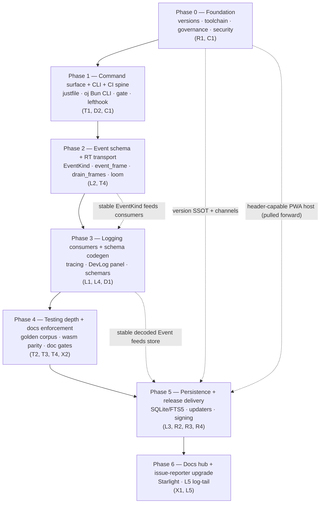

# Implementation Checklist — the executable foundations tracker

> **Scope.** This is the checkbox-driven build tracker for the entire OpenJammer foundations program. It linearizes [`00-overview.md`](00-overview.md)'s seven phases (Phase 0 → Phase 6) into concrete, verifiable `- [ ]` actions — each one naming the exact file, command, crate, or config it touches. Tick an item only when the named artifact exists and the named check is green. This document **consumes**, never re-derives, the decisions: where a "why" or a tradeoff is in question, the section files are authoritative ([`01`](01-testing-and-reliability.md), [`02`](02-logging-and-observability.md), [`03`](03-release-channels-and-auto-update.md), [`04`](04-developer-tooling.md), [`05`](05-github-actions-ci.md), [`06`](06-documentation-starlight.md)). The reference appendices ([`07-reference-configs.md`](07-reference-configs.md), [`08-reference-ci-workflows.md`](08-reference-ci-workflows.md), [`09-reference-schemas-and-code.md`](09-reference-schemas-and-code.md)) hold the literal configs, workflows, and schemas; the signing-key runbook is [`KEY-MANAGEMENT.md`](KEY-MANAGEMENT.md); term definitions live in the [`GLOSSARY.md`](GLOSSARY.md). On any divergence, [`00-overview.md`](00-overview.md) is authoritative.

> **Verified:** Every "current state" claim below was checked against the live repo on the `intelligent-easley-16d0db` worktree (a full checkout). Path:line citations are exact at time of writing. Re-verify before ticking — the repo moves.

---

## How to use this tracker

- **Phases are strictly ordered.** Do not start a phase until the previous phase's **Milestone** is met. The dotted cross-phase edges in the roadmap (e.g. version SSOT → Phase 5) are hard data dependencies, not suggestions.
- **Every item is an action.** "Do X" states the concrete crate/command/file. If an item cannot be ticked because a fact changed, fix the item — never fabricate a tick.
- **Must-fix items are load-bearing.** Each phase folds its adversarial must-fixes in at the section level, tagged `> **Must-fix (critical/high):**`. None may be deferred out of its phase without an explicit Open-Question entry in [`00-overview.md`](00-overview.md).
- **The canonical terms are used verbatim:** the `oj` Bun CLI · the `just` command surface · `.config/nextest.toml` · the aggregate `gate` job · the `{stable, canary}` channel model · the `ByteRing` wait-free SPSC transport · the `ojproto` `EventKind` schema · the `event_frame` codec / `drain_frames` · the golden corpus · the device-free `render` gate · `assert_no_alloc` · `release-please` (the single version brain) · affected-selection · COOP/COEP cross-origin isolation · minisign signing (split stable/canary keypairs) · the `wire_shapes.rs` parity gate · Lane A (per-PR) / Lane B (nightly+canary) · the `oj-protocol-ts` TS mirror.

---

> [!IMPORTANT]
> **Phase 0 is the hard prerequisite.** It contains the must-fixes named by R2, R4, L5, T1, T2, T4, and C1, plus the governance and security baseline. Until Phase 0's Milestone is met, **nothing downstream is "trusted"**: the merge `gate` enforces nothing (governance is off), versions disagree across four files, the wasm toolchain floats, and the release path is a key-exfiltration surface. Do not begin Phase 1 work against an un-protected `main`.

---

## Verified starting state (the ground truth this plan is written against)

> **Verified:** Read these before ticking anything — they are the "before" state every Phase 0 item flips.

| Fact | Current state | Where verified |
|---|---|---|
| Workspace shape | 10 crates: 9 under `crates/*` + `oj-tauri` under `src-tauri/` | `Cargo.toml:5` (`members = ["crates/*", "src-tauri"]`) |
| Version — Cargo | `0.0.0` (canonical seed) | `Cargo.toml:9` |
| Version — npm root | `0.1.0-alpha` | `package.json:3` |
| Version — Tauri | `0.1.0` | `src-tauri/tauri.conf.json:4` |
| Version — TS mirror | `0.0.0` | `packages/oj-protocol-ts/package.json:3` |
| `RtCommand` size cap | `assert!(size_of::<RtCommand>() <= 16)` exists | `crates/ojproto/src/lib.rs:200` |
| `EventKind` type | **Does not exist yet** (only `RtCommand` / `EngineFrame` / `ParamPatch`) | `crates/ojproto/src/lib.rs` |
| `EngineFrame::Error` | Defined, constructed **only** in `wire_shapes.rs` fixtures | `crates/ojproto/src/lib.rs:253` |
| return-frame tags | Only `TAG_METER = 1`, `TAG_BEAT = 2` | `crates/ojcore/src/meter.rs:142,144` |
| `ByteRing` unsafe | `copy_nonoverlapping` SPSC; `push` at `:159` | `crates/ojcore-midiring/src/lib.rs:124,159` |
| `unsafe impl Sync` | `unsafe impl Sync for RtProgram {}` | `crates/ojcore/src/swap.rs:41` |
| `assert_no_alloc` shim | `static A: AllocDisabler` installed; native-only | `crates/ojcore/tests/engine.rs:27` |
| Fault paths | `over_budget` (`:387`), `auto_bypass` (`:388`), `non_finite` (`:451,574`) | `crates/ojcore/src/exec.rs` |
| wasm meter pull | `drain_meters() -> Vec<f32>` (allocating pull) at `:567`; `process` at `:389` | `crates/ojcore-wasm/src/lib.rs` |
| `KIND_BY_TYPE` mismatch | `looper: 'Delay'` (should map to `'Looper'`) | `src/engine/manifest.ts:127` |
| CI jobs | Three: `engine`, `web`, `windows-native`; **no `gate` job** | `.github/workflows/ci.yml:21,77,94` |
| Release action pins | All floating: `checkout@v4`, `setup-bun@v2`, `rust-toolchain@stable`, `rust-cache@v2`, `tauri-action@v0` | `.github/workflows/release.yml:43,59,62,70,78` |
| Release draft | `releaseDraft: true` (dark feed until manual publish) | `.github/workflows/release.yml:86` |
| Auto-review bot | `contents: write`, auto-commits `[skip ci]`, runs `npm run build/lint/test:run` | `.github/workflows/claude-auto-review.yml:8,57-61,65` |
| Mention bot | `contents: write`, fires on **any** `@claude` comment (no `author_association` gate), runs `npm run …` | `.github/workflows/claude-mention-bot.yml:10,17,71` |
| `bun`-only guard | `preinstall` hard-`exit(1)`s on non-bun installs — so the bots' `npm run` checks silently fail | `package.json:23` |
| COOP/COEP | Present in **dev + preview servers only** | `vite.config.ts:130-131,136-137` |
| Absent today | `justfile`, `.config/nextest.toml`, `rust-toolchain.toml`, `lefthook.yml`, `release-please` config, `.github/CODEOWNERS`, key patterns in `.gitignore`, `apps/docs/`, `scripts/oj/` | confirmed by file search |
| CONTRIBUTING.md | Stale: `http://localhost:3000` (`:23`), Tailwind (`:109`) | `CONTRIBUTING.md:23,109` |
| Governance | No branch protection on `main`; `main` ruleset `enforcement: disabled`; `dev` ruleset targets malformed `refs/heads/"dev"` for a non-existent branch | per [`00-overview.md`](00-overview.md) §"Phase 0" #3 and [`05-github-actions-ci.md`](05-github-actions-ci.md) §0 |

---

## Phase map (exit criteria at a glance)



| Phase | Decisions | Milestone (exit criterion) |
|---|---|---|
| **0** Foundation | R1, C1 | One version string everywhere; `main` actually protected; release path SHA-pinned and key-safe; bots fenced; nightly pinned. |
| **1** Command surface + CLI + CI spine | T1, D2, C1 | `just rust` / `just web` run identically in CI and local; `oj preflight --affected` works in a linked worktree; the `gate` is proven to red-wall. |
| **2** Event schema + RT transport | L2, T4 | The audio thread can emit coded fault events with a CI-proven zero-alloc guarantee; the wire schema is parity-gated. |
| **3** Logging consumers + schema codegen | L1, L4, D1 | Decoded events flow to console, rolling file, and the DevLog panel; the kind enum is single-sourced. |
| **4** Testing depth + docs enforcement | T2, T3, T4, X2 | DSP correctness verified on all three native arches + wasm (banded); docs coverage ratcheted; all of it feeds the single `gate`. |
| **5** Persistence + release delivery | L3, R2, R3, R4 | Stable + canary installers built, signed, delivered correctly per-platform; PWA auto-updates without surprise; production COOP/COEP verified by a post-deploy synthetic check. |
| **6** Docs hub + issue-reporter upgrade | X1, L5 | Searchable docs site live; one-click redacted issue reports with a real log tail; the program is complete and self-documenting. |

---

## Phase 0 — Foundation: versions, toolchain, governance, security baseline

> **Decisions:** R1, C1 (`rust-toolchain.toml` + governance + SHA-pinning only).
> **Prerequisites:** none — this is the root.
> **At a glance:** the cheapest, most load-bearing work. Flip governance on, collapse the four-way version drift to one `release-please`-owned SSOT, pin the floating wasm nightly, SHA-pin and key-fence the release path, and demote the write-capable Claude bots.

### 0.1 Toolchain pin (first commit of the phase — owned by C1)

- [ ] Create `rust-toolchain.toml` at repo root pinning **one** known-good nightly **and** stable; include `components = ["rustfmt", "clippy", "rust-src"]` and `targets = ["wasm32-unknown-unknown"]` (the wasm `-Z build-std`, miri, and sanitizer legs all need the nightly + `rust-src`).
- [ ] Confirm the pinned nightly compiles the wasm leg: `cargo +nightly build -p ojcore-wasm --target wasm32-unknown-unknown -Z build-std=std,panic_abort` (the **only** browser-wasm compile path is nightly and floats today via `dtolnay/rust-toolchain@nightly` at `ci.yml:40`).
- [ ] Record the pinned toolchain as an `ALWAYS_INPUT` to the (future) cache-hash and golden-reproducibility inputs (consumed by T1's cache in Phase 1 and T2's golden corpus in Phase 4).

### 0.2 Version SSOT via `release-please` (R1, the single version brain)

> **Must-fix (critical):** A `0.0.0` binary must never ship — it would trigger an infinite update-prompt loop against R2's updater (which compares `tauri.conf.json` version). Prove the bump writes the nested workspace key and gate on three-way equality.

- [ ] Add `release-please-config.json` + `.release-please-manifest.json` configuring `release-please` to write all four files in lockstep:
  - `Cargo.toml` `[workspace.package].version` (jsonpath `$.workspace.package.version`, the canonical seed `0.0.0`, `Cargo.toml:9`)
  - `package.json` (`0.1.0-alpha`, `package.json:3`)
  - `src-tauri/tauri.conf.json` (`0.1.0`, `src-tauri/tauri.conf.json:4`)
  - `packages/oj-protocol-ts/package.json` (`0.0.0`, `packages/oj-protocol-ts/package.json:3`)
- [ ] **Prove the nested-TOML write with a dry run** — confirm `release-please` actually rewrites `$.workspace.package.version` in `Cargo.toml` (not a top-level `version`), since the workspace key is nested.
- [ ] Add a **three-way equality release gate**: built-binary `CARGO_PKG_VERSION` == pushed `v*` tag == `tauri.conf.json` version. Fail the release if any differ (this is the guard against a `0.0.0` binary shipping).
- [ ] Add a `release-please` workflow under `.github/workflows/` that opens the release PR on merges to `main`.

| File | Current | Owner after Phase 0 |
|---|---|---|
| `Cargo.toml` `[workspace.package].version` | `0.0.0` | `release-please` (canonical seed) |
| `package.json` | `0.1.0-alpha` | `release-please` |
| `src-tauri/tauri.conf.json` | `0.1.0` | `release-please` |
| `packages/oj-protocol-ts/package.json` | `0.0.0` | `release-please` |

### 0.3 Channel identifiers (`{stable, canary}` — defined once here, consumed by R1–R4, C1)

- [ ] Document the two channel identifiers verbatim: `stable` = a `v*` tag **without** `-`; `canary` = a single force-moved `canary` prerelease tag.
- [ ] Establish the `contains(github.ref_name, '-')` predicate as the canonical "is this a prerelease" test (R1 release, R2 updater endpoints, R3 `__OJ_CHANNEL__` Vite define, R4 per-channel manifests, C1 `canary.yml` all read these two strings).

### 0.4 Governance ON (C1)

> **Must-fix (critical):** Governance enforces **nothing** today — no branch protection on `main`, the `main` ruleset is `enforcement: disabled`, and the `dev` ruleset targets a malformed `refs/heads/"dev"` (literal quotes) for a branch that does not exist.

- [ ] Decide and execute: **create-or-drop `dev`** (if kept, create the real branch; if dropped, remove the ruleset).
- [ ] Fix the broken `dev` ruleset ref (`refs/heads/"dev"` → a valid ref, or delete it).
- [ ] Flip the `main` ruleset to `enforcement: active` with `require_pull_request` + `required_status_checks`.
- [ ] Bind `required_status_checks` to the aggregate `gate` job by its stable name (the job itself lands in Phase 1; bind the name now so the contract is fixed). Document the invariant: **do not rename the gate job.**
- [ ] Add a CI assertion that `main` enforcement stays `active` (so a future ruleset edit cannot silently turn the gate off).

### 0.5 SHA-pin the release path *before* any signing key is provisioned (C1)

> **Must-fix (critical):** Adding `TAURI_SIGNING_*` secrets to a workflow that uses floating third-party action tags is a direct key-exfiltration path. Pin first, provision keys later (Phase 5).

- [ ] Pin every third-party action in `release.yml` by full commit SHA — currently floating: `actions/checkout@v4` (`:43`), `oven-sh/setup-bun@v2` (`:59`), `dtolnay/rust-toolchain@stable` (`:62`), `Swatinem/rust-cache@v2` (`:70`), `tauri-apps/tauri-action@v0` (`:78`).
- [ ] Add `zizmor` as a **required** check that enforces SHA-pinning across all workflows.
- [ ] Add credential patterns to `.gitignore` (absent today): `*.key`, `openjammer.key`, `*.pem`, `*.p12`, `.tauri/`.
- [ ] Add a **required** credential-scan CI step (the founder is Windows-only, so the local hook cannot be the only guard — this must run in Actions).

### 0.6 Fence the write-capable Claude bots (C1)

> **Must-fix (critical):** `claude-auto-review.yml` and `claude-mention-bot.yml` are a live RCE / prompt-injection surface on a public repo: both hold `contents: write` + `ANTHROPIC_API_KEY`, check out PR head, and push back; the mention bot fires on **any** `@claude` comment from **any** commenter.

- [ ] Demote `claude-auto-review.yml` permissions from `contents: write` (`:8`) to `contents: read`; make it **suggest-only** (no `git commit`/`git push`).
- [ ] Demote `claude-mention-bot.yml` permissions from `contents: write` (`:10`) to read; gate it on `author_association ∈ {OWNER, MEMBER, COLLABORATOR}` (today it has **no** `author_association` gate, `:17`).
- [ ] Remove the `[skip ci]` gate-bypass from both bot commit instructions (`claude-auto-review.yml:65`, `claude-mention-bot.yml:72`) — a `[skip ci]` push leaves a stale-green gate against an untested head SHA.
- [ ] **Fix the `npm`→`bun` bug:** both bots instruct `npm run build` / `npm run lint` / `npm run test:run` (`claude-auto-review.yml:57-61`, `claude-mention-bot.yml:71`), but `package.json:23`'s `preinstall` guard hard-`exit(1)`s on any non-bun install — so those checks silently never run. Replace with `bun run build && bun run lint && bun run test:run`.
- [ ] Ensure no untrusted-PR lifecycle script ever runs in a secret-holding job (separate the secret-scoped steps from any checkout of attacker-controlled head).

> **Milestone (Phase 0 exit):** one version string everywhere (four files agree, written by `release-please`); `main` actually protected by an `active` ruleset bound to the `gate` name; release path SHA-pinned with `zizmor` enforcing it; credential scan required; bots demoted to read/suggest-only and gated; the wasm nightly pinned in `rust-toolchain.toml`.

---

## Phase 1 — Command surface + CLI + CI spine

> **Decisions:** T1, D2, C1.
> **Prerequisites:** Phase 0 Milestone met (governance on, toolchain pinned, `gate` name reserved).
> **At a glance:** build the one `justfile` + `.config/nextest.toml` and the merged single `oj` Bun CLI together (resolving the naming collision and the dual `--fix` owner at birth); stand up C1's reusable-workflow control plane with the aggregate `gate`; land the one `lefthook.yml`; rewrite the stale `CONTRIBUTING.md`; add CODEOWNERS pairing `ojproto` with `oj-protocol-ts`.

### 1.1 The `just` command surface + `.config/nextest.toml` (T1, F1)

- [ ] Create the root `justfile` (absent today) with recipes: `fmt`, `clippy`, `test` (`cargo nextest run --workspace`), `doctest` (`cargo test --workspace --doc` — **mandatory companion**, since nextest skips doctests), `nostd`, `wasm`, `render`, `clap-host`, `web`, `rust`, `preflight`, `ci`.
- [ ] Add the Windows shell directive at the top: `set windows-shell := ['powershell.exe', '-NoLogo', '-Command']` (the maintainer's primary box is Windows).
- [ ] Create `.config/nextest.toml` (absent today) defining the `audio-serial` test-group (`max-threads = 1`) bound to the `ojcore` ring / hot-swap / `assert_no_alloc` tests so RT-sensitive assertions never contend:
  ```toml
  # .config/nextest.toml
  [test-groups]
  audio-serial = { max-threads = 1 }

  [[profile.default.overrides]]
  filter = 'package(ojcore) and test(/program_swap|meter_ring|hot_swap|alloc_free/)'
  test-group = 'audio-serial'

  [profile.ci]
  fail-fast = false
  [profile.ci.junit]
  path = 'junit.xml'
  ```
- [ ] Verify the recipes reproduce today's three CI jobs' behavior (the `engine` Rust legs, the `web` control-plane legs, the `windows-native` build + `render` gate) so nothing regresses when CI starts calling `just`.

### 1.2 The single `oj` Bun CLI (T1 ⊕ D2, F2)

> **Note:** The merge of T1's preflight/plan and D2's doctor/scaffold/dev into one Bun/TS binary is specified in [`04-developer-tooling.md`](04-developer-tooling.md).

- [ ] Create the merged `oj` Bun CLI at `scripts/oj/` (absent today) — T1's preflight harness and D2's doctor/scaffold tool in **one** binary over a shared `lib/`, resolving the two-CLIs-both-named-`oj` collision.
- [ ] Subcommands: `preflight` / `plan` (T1) + `doctor` / `scaffold` / `dev` (D2) over a shared `lib/` (`git`, `cache`, `ssot`, `report`).
- [ ] Implement affected-selection: `cargo metadata` (crate graph) + `gh pr diff --name-only` (changed files) to decide **which** `just` recipes run; the CLI **never re-encodes commands**.
- [ ] Implement the version-sync **consistency check** (all four version files equal) — this is a *check*, never an independent source; `release-please` owns the bump.
- [ ] Confirm `oj preflight --affected` runs correctly inside a linked worktree (the dev environment lives under `.claude/worktrees/`).

### 1.3 C1's CI control plane + the aggregate `gate` (C1, F6)

- [ ] Build composite actions `setup-rust` and `setup-web` (collapse the three drifting checkout/Bun/toolchain/cache/apt blocks into one; the apt list must be the **superset including `pkg-config`**).
- [ ] Define the aggregate `gate` job inline in `ci.yml` (`needs: [<all>]`, `if: always()`) — its name must match the ruleset binding from Phase 0 §0.4. **No `gate` job exists today** (`ci.yml` has only `engine`/`web`/`windows-native`).
- [ ] Make every other check (T2 render, T3 Playwright, T4 correctness, X2 docs, D1 set-equality, the `ojproto`↔`oj-protocol-ts` coupling) a `needs` dependency feeding `gate` — never independently required.
- [ ] Specify the gate predicate explicitly: **fail unless every `need` ∈ {success, skipped} AND `needs.changes.result == 'success'`**.
- [ ] Wire the `merge_group:` trigger now (wired-but-disabled — the queue is org-only and unavailable on the user-owned `PonderingBGI/openjammer`; this makes a post-migration enable a one-line ruleset flip).
- [ ] Split lanes: lean **Lane A (per-PR)** affected-aware required gate + heavy **Lane B (nightly+canary)** backstop.

> **Must-fix (high):** Keep the maintainer's primary box (Windows) and the most-fragile-toolchain OS (macOS) on the per-PR gate, not nightly-only.

- [ ] Keep the **Windows per-PR leg** feeding `gate` (`cargo build -p oj-tauri` + device-free `render` + `assert_no_alloc` — already present as `windows-native`, `ci.yml:94`).
- [ ] Add the **missing macOS per-PR leg** feeding `gate`: `cargo build -p oj-tauri` + `render` golden on `macos-latest` (aarch64).
- [ ] Commit an **adversarial self-test** for the gate: force malformed selector JSON and a failing shard, and prove the gate red-walls (does not pass on skipped-due-to-error).

### 1.4 The one hook control plane (T1, F6)

- [ ] Create `lefthook.yml` (absent today), invoked via `bunx` **not** `-g` (the evilmartians/lefthook#1165 Windows PATH bug).
- [ ] `pre-commit` = `oj doctor --fix --from-files` + version-sync consistency + credential scan + fmt/lint.
- [ ] `pre-push` = `oj preflight --affected`.
- [ ] Document that GitHub Actions stays authoritative; hooks are local fast-feedback only.

### 1.5 Contributor-facing fixes

- [ ] **Rewrite `CONTRIBUTING.md` here, not Phase 6** — it is verified-stale and will misdirect every contributor through the entire build-out otherwise: fix `http://localhost:3000` (`CONTRIBUTING.md:23` → `localhost:5173`, the real `devUrl` per `src-tauri/tauri.conf.json:8`), remove the Tailwind reference (`:109`), correct Bun-only prereqs and `npm`→`bun`, and fix the node-routing file reference.
- [ ] Add `.github/CODEOWNERS` (absent today) pairing `crates/ojproto` with `packages/oj-protocol-ts` so wire-schema changes always co-review both sides of the seam.

> **Milestone (Phase 1 exit):** `just rust` / `just web` run **identically** in CI and local; `oj preflight --affected` works in a linked worktree under `.claude/worktrees/`; the `gate` is proven to red-wall via the committed adversarial self-test; Windows **and** macOS legs feed the per-PR gate.

---

## Phase 2 — Event schema + RT transport (the logging spine)

> **Decisions:** L2, T4 (loom on the `ByteRing` only).
> **Prerequisites:** Phase 1 (the `just test` surface + `.config/nextest.toml` `audio-serial` group + the `gate`).
> **At a glance:** pin the one `ojproto` `EventKind` + the `event_frame` codec + `drain_frames` routing **before any consumer**, so nothing invents a competing schema; run T4's loom verification of the `ByteRing` handoff and `swap.rs`.

### 2.1 The `EventKind` schema (L2, F3 — owned by `ojproto`)

- [ ] Add a versioned, `Copy`, `#[repr]`-stable `EventKind` enum to `crates/ojproto/src/lib.rs` (today **no** `EventKind`/`RtEvent` exists — only `RtCommand`/`EngineFrame`/`ParamPatch`).

> **Must-fix (critical):** Land the size guard mirroring the existing `RtCommand` cap.

- [ ] Add `const _: () = assert!(core::mem::size_of::<EventKind>() <= 16);` — mirroring `crates/ojproto/src/lib.rs:200` (`assert!(size_of::<RtCommand>() <= 16)`).
- [ ] Fold the orphaned `EngineFrame::Error { code: u16, message: String }` (`crates/ojproto/src/lib.rs:253`, constructed only in `wire_shapes.rs` fixtures, emitted by no engine code) into `EventKind::Message` in the same bump (the cheapest moment).
- [ ] Mirror `EventKind` by hand in `packages/oj-protocol-ts/src/index.ts` (package `@openjammer/oj-protocol`).
- [ ] Extend the `wire_shapes.rs` parity gate (`crates/ojproto/tests/wire_shapes.rs`) to assert the byte-exact JSON shape of `EventKind` (it currently pins `RtCommand`/`EngineFrame`/`PrimitiveKind` et al.).

### 2.2 The `event_frame` codec + `TAG_EVENT` (L2, F3)

- [ ] Add a new `event_frame` module **sibling to `return_frame`** in `crates/ojcore/src/meter.rs`, encoding a fixed-size `EventKind` record to a stack buffer.
- [ ] Add `TAG_EVENT = 3` (the existing `return_frame` defines only `TAG_METER = 1` and `TAG_BEAT = 2`, `crates/ojcore/src/meter.rs:142,144`).
- [ ] Emit via one wait-free `ByteRing::push` (`crates/ojcore-midiring/src/lib.rs:159`; length-prefixed SPSC, drop-and-count on full) from the fault paths.

### 2.3 `drain_frames` routing (L2, F3)

- [ ] Extend the existing off-RT `drain_meters` into **one `drain_frames`** that routes by tag — **not** three parallel `drain_logs` / `drain_events` / `drain_frames`.

### 2.4 The required zero-alloc fault-path gate (L2 ⊕ Pillar 1)

> **Must-fix (critical):** A passing gate that never runs the new RT code is worse than no gate. Trip the fault paths *inside* `assert_no_alloc`, with at least one variant that does **not** drain inside the scope.

- [ ] Add a dedicated recipe / test exercised as `cargo nextest run -p ojcore --features devlog` (driven by `just test` / `just rust`), wired as a `needs` dependency of the aggregate `gate` job — a **required per-PR check**.
- [ ] The test must trip `over_budget` (`crates/ojcore/src/exec.rs:387`), `non_finite` (`:451`/`:574`), and `auto_bypass` (`:388`) *inside* the `assert_no_alloc` scope (the global `AllocDisabler` at `crates/ojcore/tests/engine.rs:27`), with **both** meter and event rings attached.
- [ ] Include at least one **sub-variant that does NOT drain inside the scope**, so a full ring is proven alloc-free and drops are counted (a draining-only gate proves the wrong thing).
- [ ] Add a `drain_frames` round-trip test interleaving `TAG_METER` / `TAG_BEAT` / `TAG_EVENT` frames of **different lengths** (loom proves the SPSC ring; this proves the new tag-routing).

### 2.5 T4 loom + the single-consumer tripwire (T4)

- [ ] Run loom verification of the `ByteRing` SPSC handoff (`crates/ojcore-midiring/src/lib.rs`) and `swap.rs` (`unsafe impl Sync for RtProgram` at `crates/ojcore/src/swap.rs:41`) — routed via the Linux nightly Lane B.
- [ ] Add a debug-only single-consumer tripwire to `ByteRing` (assert no second consumer ever attaches).

> **Must-fix (high):** wasm has no `MeterRing` to mirror — `ojcore-wasm`'s `drain_meters` (`crates/ojcore-wasm/src/lib.rs:567`) is an allocating `Vec` *pull* between `process()` calls (`:389`), not a `ByteRing`.

- [ ] Treat the browser event channel as **net-new**: add a dedicated `log_ring: ByteRing<N>` in the wasm `Host`, exposed via a new `*_ptr` / `*_len` / `*_offset` getter tuple, **self-drained by the worklet between `process()` calls** and posted as `{ tag, offset, len }` batches via `postMessage`.
- [ ] Do **not** claim any cross-thread SAB drain — it is impossible on today's non-shared-memory wasm build (no `+atomics`/`+bulk-memory`); strike every "frozen `ring_*_offset` SAB getter" claim (tracked as Open Question §1 in [`00-overview.md`](00-overview.md)).
- [ ] Verify the browser RT-emit path by **code review + shared-source proof + a native-rlib `assert_no_alloc` run of the codec** — never claim it as gate-verified on wasm (`assert_no_alloc` is native-only).

> **Milestone (Phase 2 exit):** the audio thread can emit coded fault events with a CI-proven zero-alloc guarantee (the `devlog` nextest gate is a `gate` dependency); the wire schema is parity-gated by `wire_shapes.rs`.

---

## Phase 3 — Logging consumers + schema codegen

> **Decisions:** L1, L4, D1.
> **Prerequisites:** Phase 2 (stable `EventKind` + `drain_frames`).
> **At a glance:** attach the off-RT consumers (L1 tracing sink, L4 DevLog panel) and single-source the kind enum via D1's schemars codegen.

### 3.1 L1 — the off-RT `tracing` sink

- [ ] Add `tracing-subscriber` JSON + `EnvFilter` + `tracing-appender` rolling NDJSON + the `tracing-log` bridge — **all std-only**, never in a `no_std` crate and never on the audio thread.
- [ ] Confirm the F-shared invariant: `tracing` is forbidden on the audio thread, enforced by a clippy/grep guard over the native render path and the wasm `process()` fn (`crates/ojcore-wasm/src/lib.rs:389`).

### 3.2 L4 — the in-app DevLog panel + console facade

- [ ] Build the in-app DevLog React panel under `src/` consuming decoded events.
- [ ] Add the `src/utils/log.ts` console facade.

> **Must-fix (high):** The native event drain is **decided**, not an open either/or. Today native draining is a 50 ms JS `setInterval` → `poll_meters` IPC, **not** a thread; the events spine adds a dedicated drain thread (the resolved contradiction in [`02-logging-and-observability.md`](02-logging-and-observability.md#l2--cross-boundary-structured-event-schema-the-spine)).

- [ ] Add a dedicated **default-priority control-thread event drain** (never RT-promoted) at ~1 ms cadence, **decoupled** from the 50 ms meter `setInterval` (meters stay on the 50 ms lossy UI poll). Update every "drain thread" platform note to this decision.
- [ ] Keep the browser path as **worklet-self-drain + batched `postMessage`** (Phase 2 §2.5) — no second thread until the shared-memory wasm build lands.
- [ ] Treat the ~1 ms cadence and the `EventRing` capacity (borrowed at `ByteRing<8192>` from `MeterRing`) as **measured, not assumed** — tune both from the dropped-frame counter once real fault volumes flow.

> **Must-fix (high):** Land the `console.*` sweep **incrementally** to keep in-flight PRs unblocked.

- [ ] Add the `no-console` eslint rule as **`warn` first**, route through the `src/utils/log.ts` facade, sweep per-module, then **ratchet to `error`** (the codebase has **147 `console.*` calls across 37 files** — `grep -rhoE 'console\.[a-zA-Z]+' src --include='*.ts' --include='*.tsx'`).

### 3.3 D1 — Rust-canonical schema codegen

- [ ] Implement schemars codegen: Rust-canonical → one generated TS union, parity-gated like `wire_shapes.rs`.
- [ ] Kill the triple-declared `PrimitiveKind` union via the single generated source.
- [ ] **Fix the verified mismatch:** `src/engine/manifest.ts:127` maps `looper: 'Delay'` — align TS to `'Looper'` (the Rust variant is `PrimitiveKind::Looper`, verified in the `wire_shapes.rs` enumeration at `crates/ojproto/tests/wire_shapes.rs:57`).

> **Milestone (Phase 3 exit):** decoded events flow to console, rolling NDJSON file, and the DevLog panel; the kind enum is single-sourced and the `looper`→`'Looper'` mismatch is fixed.

---

## Phase 4 — Testing depth + docs enforcement

> **Decisions:** T2, T3, T4 (remaining), X2.
> **Prerequisites:** Phase 1 (the `gate` + lanes), Phase 3 (the `EventKind` channel for the xrun counter).
> **At a glance:** build the heavy correctness legs into Lane B with a per-PR slice feeding `gate`.

### 4.1 T2 — the golden corpus (banded, per-arch)

> **Must-fix (critical/high):** Byte-equality is non-robust across toolchain bumps (thin-LTO + nightly `-Z build-std`). Demote to a tight ULP band and assert per-arch.

- [ ] Demote T2's native↔wasm **bit-exact hash to a tight ULP band everywhere**.
- [ ] Generate/assert the native golden **per-arch**: linux-x64, macos-aarch64, macos-x64.
- [ ] Add an FMA-contraction guard for aarch64.
- [ ] Add the clippy `disallowed-methods` (libm-only) guard plus a `RUSTFLAGS` `target-cpu` / fast-math guard.
- [ ] Run a **small `wasm-pack test --node` parity subset per-PR** (the device-free `render` golden replayed through `wasm32`), with the full proptest-invariant suite reserved for nightly Lane B; assert ULP tolerance per-arch — so the first-class browser float path is not verified at 1/24th the cadence of native.

### 4.2 T3 — Playwright PWA + render-smoke (blocking) + native leg (non-blocking)

- [ ] Build the Playwright PWA suite + render-smoke (blocking, feeds `gate`) with a mocked `__TAURI__` covering the byte-identical React tree.
- [ ] Add the non-blocking `tauri-driver` native leg (advisory).
- [ ] Assert `crossOriginIsolated === true` in the suite.

> **Must-fix (high):** `crossOriginIsolated === true` is blind to production — the COOP/COEP headers exist in `vite.config.ts` dev/preview only (`vite.config.ts:130-131,136-137`); a production host must re-emit them.

- [ ] Add a **post-deploy synthetic header check** against the real host (verifies production COOP/COEP, complementing the in-suite assertion).

### 4.3 T4 (remaining) — miri + fuzz

- [ ] Add miri over the existing tests and unbounded fuzz (untrusted SF2/WAV/graph-JSON) on nightly Lane B + a per-PR fuzz smoke; escalate the run when the parse surface changes (`symphonia` WAV, `rustysynth` SF2).

### 4.4 X2 — docs-as-requirement

- [ ] Add Rust `missing_docs` + `cargo doc -D warnings` coverage gates.
- [ ] Add the TS `doc-check` baseline-ratchet.

> **Must-fix (high):** A throwaway commit is not a guarantee.

- [ ] Keep a **committed permanently-failing-doc fixture** as a standing negative test proving `cargo doc -D warnings` actually fails on missing docs.

> **Milestone (Phase 4 exit):** DSP correctness verified on all three native arches + wasm (banded ULP, per-arch); docs coverage ratcheted with a standing negative fixture; production COOP/COEP verified post-deploy; all of it feeds the single `gate`.

---

## Phase 5 — Persistence + release delivery

> **Decisions:** L3, R2, R3, R4.
> **Prerequisites:** Phase 0 (version SSOT + `{stable, canary}` + split keypairs), Phase 3 (stable decoded `Event`), the header-capable PWA host (pulled forward, see §5.7).
> **At a glance:** L3's SQLite/FTS5 store ingests the stable decoded `Event`; R2/R3/R4 consume the Phase-0 version SSOT, the channel model, and minisign signing (split stable/canary keypairs).

### 5.1 L3 — SQLite/FTS5 store

> **Must-fix (critical):** FTS5-off is a silent runtime-only failure.

- [ ] Build the L3 SQLite/FTS5 store; columns mirror the L2 `EventKind` taxonomy.
- [ ] Make the **FTS5-availability smoke a gated check** on both native and the sqlite-wasm build: `CREATE VIRTUAL TABLE … USING fts5` + a `MATCH` query must succeed.
- [ ] Ship L3 **native-first**; validate a real large-history-search need before building the multi-tab/Safari-fragile browser OPFS leg (Open Question §5 in [`00-overview.md`](00-overview.md)).

### 5.2 R2 — Tauri v2 native updater (minisign + GitHub Releases)

> **Must-fix (critical/high):** macOS auto-update does not function without notarization; the install gate must be a locked-out state, not a one-shot check.

- [ ] Wire the Tauri v2 first-party updater (the version it compares is `src-tauri/tauri.conf.json` — now unified by Phase 0).
- [ ] **`cfg`-gate the updater OFF on macOS** and point Mac users at manual `.dmg` until the Apple Developer ID + notarization is acquired (owned prerequisite, Open Question §3).
- [ ] **Gate the Linux updater on the `APPIMAGE` env var** so `.deb`/`.rpm` users are never prompted for a swap that fights the package manager.
- [ ] Make R2's install gate a locked-out `UpdatePending` **state** (refuses transport re-arm, treats any LAN peer as blocking, awaits full WASAPI/ASIO device release before the NSIS force-exit) — **not** a one-shot `engine_running()` check with a TOCTOU window.

### 5.3 R3 — PWA auto-update (prompt-style Workbox SW)

- [ ] Build the prompt-style, channel-aware Workbox service worker (reads `__OJ_CHANNEL__` Vite define), audio-session-safe apply-on-idle (never yanks the `AudioContext` mid-set).

### 5.4 R4 — artifact hosting + minisign signing (split keypairs)

> **Must-fix (critical/high):** The canary updater feed must never point at the moving `canary` tag's `/latest/`; the macOS dual-arch manifest must be serialized; the "all keys present" assertion must be a hard post-publish gate.

- [ ] Use `gh-releases-minisign` now (deferred `gh-pages-manifest`; reject the Cloudflare Worker direction).
- [ ] Provision the **split minisign keypairs**: a stable keypair touched only by the `v*`-tag release workflow, and a separate canary keypair for the push-on-`main` canary workflow; the app trusts both pubkeys.
- [ ] Scope `TAURI_SIGNING_PRIVATE_KEY` (stable) with `if: startsWith(github.ref, 'refs/tags/v')`; **never** expose it to PR- or push-triggered jobs (the SHA-pinning from Phase 0 §0.5 is the precondition for adding this secret).
- [ ] Point the **canary updater feed at an immutable per-build tag** (`canary-<shortsha>`) with an atomically-swapped `canary.json`; keep the moving `canary` tag a human-download convenience only.
- [ ] Resolve the macOS dual-arch `latest.json` via a **single serialized manifest-assembly job** (two parallel legs would overwrite each other).
- [ ] Make the **"all four platform keys present" assertion a hard post-publish gate**; resolve the draft-vs-publish race by auto-publishing **after** the keys assertion passes (today `release.yml:86` sets `releaseDraft: true`, leaving the feed dark).
- [ ] Add `attest-build-provenance` (SLSA) to complement minisign for auditors — explicitly **not** a runtime update-acceptance control.

### 5.5 The `<5ms` latency observability gap

> **Note:** The defining `<5ms` constraint is verified by **nothing automated** today — the loopback test is `#[ignore]`'d and `build_input` is a no-op stub.

- [ ] Wire `RecorderSink` into `build_input`.
- [ ] Add a per-backend manual loopback runbook as a release-gate checklist (lands in X1, Phase 6).
- [ ] Surface an xrun counter through the L2 `EventKind` channel so glitches are at least observable in logs.

### 5.6 `KEY-MANAGEMENT.md` (must-write-before-ship for R2/R4)

- [ ] Write `KEY-MANAGEMENT.md`: generation ceremony, dual offline backup, pubkey-overlap rotation window, break-glass via Security Advisory + manual-reinstall notice (minisign has no key-rotation mechanism; key loss forces a manual reinstall for all users — Open Question §6).

### 5.7 Header-capable PWA host (pulled forward to Phase 0/1, executed/confirmed here)

> **Must-fix (critical):** A header-capable host (Vercel/Cloudflare/Netlify, **not** GitHub Pages) gates all meaningful browser-wasm verification and R3 entirely.

- [ ] Confirm the host selection (Open Question §4) and commit its COOP/COEP config (`vercel.json` or `_headers`) re-emitting `Cross-Origin-Opener-Policy: same-origin` + `Cross-Origin-Embedder-Policy: require-corp` in production (they live only in `vite.config.ts` dev/preview today).
- [ ] Add the deploy step to C1's `canary.yml`.

> **Milestone (Phase 5 exit):** stable + canary installers built, signed (split keypairs), and delivered correctly per-platform (macOS manual `.dmg`, Linux AppImage-gated, Windows updater + SmartScreen caveat); the PWA auto-updates without surprise; production COOP/COEP verified by a post-deploy synthetic check.

---

## Phase 6 — Docs hub + issue-reporter upgrade

> **Decisions:** X1, L5 (log-tail upgrade).
> **Prerequisites:** Phase 4 (X2's enforced rustdoc/TSDoc), Phase 5 (the full L1/L2/L3 substrate + the shared privacy allowlist).
> **At a glance:** stand up the Starlight site consuming the enforced docs; upgrade L5 to a real redacted log-tail.

### 6.1 X1 — the Starlight docs hub

- [ ] Create `apps/docs/` as a **workspace-isolated** package — **not** a Bun workspace member, with its own separate `bun.lock`, to firewall the Zod-3/4 collision.
- [ ] Build the Starlight prose hub + linked-out rustdoc island + in-site `starlight-typedoc` for `oj-protocol-ts`.
- [ ] Document the finalized Real-Time Safety invariant, the FP-reproducibility policy, the channel/version model, the per-platform update-status matrix, and the per-backend manual loopback runbook (from Phase 5 §5.5).

### 6.2 L5 — the diagnostic-bundle log-tail upgrade

> **Note:** L5 v1 (the control-rate snapshot — version, COOP/COEP isolation, `StreamInfo`, OjGraph IR) ships unblocked once Phase-0 versions unify; the log-tail upgrade lands here.

> **Must-fix (high):** The redaction must be fail-closed and pinned to the **verified** secret-handling anchor.
>
> **Verified:** The earlier assumption that `ai.rs` was stale is itself disproven — `src-tauri/src/ai.rs` is the real secret handler: `stripped_env` (`src-tauri/src/ai.rs:253`) forwards an allowlist plus the single provider key under `OPENJAMMER_AI_KEY_VAR`, defaulting to `OPENJAMMER_PROVIDER_KEY` (`src-tauri/src/ai.rs:269-272`).

- [ ] Pin `redact.ts` to the verified key var names — `OPENJAMMER_PROVIDER_KEY` / `OPENJAMMER_AI_KEY_VAR` (`src-tauri/src/ai.rs:269-272`) — rather than re-hunting for the location.
- [ ] Convert the diagnostics block to a **fail-closed allowlist** (no raw device labels, no LAN peer ids/IPs, no Pi AI prompts, home-dir prefixes — the shared F-shared privacy allowlist consumed by both L4's `logStore` and L5).
- [ ] Scrub absolute paths inside the attached OjGraph IR.
- [ ] Gate L5 on a **maintained secret-corpus redaction test**.
- [ ] Build L5 on the GitHub Issue Form + `upload` element (the only free, no-auth, dual-target attachment path; re-verify the exact issue-form element keyword at implementation time), showing the user the full payload before anything is sent.

> **Milestone (Phase 6 exit):** searchable docs site live; one-click redacted issue reports with a real log tail; the program is complete and self-documenting.

---

## Cross-cutting invariants (check on every phase)

These are the "must be exactly one" foundations from [`00-overview.md`](00-overview.md) §"Cross-cutting foundations". Re-confirm at each phase boundary that no decision quietly forked a second copy.

- [ ] **F1 — One command surface.** `just` + `.config/nextest.toml`; both CI and `lefthook` invoke recipes, no command encoded twice.
- [ ] **F2 — One `oj` CLI.** Single binary at `scripts/oj/`; decides *which* recipes run, never re-encodes them; version-sync is a *check*, not a source.
- [ ] **F3 — One event schema + one RT transport.** `ojproto` `EventKind` (size-capped, parity-gated) over the `ByteRing`; one `drain_frames` by tag.
- [ ] **F4 — One version SSOT + one channel model.** `release-please` writes all four files; exactly `{stable, canary}`.
- [ ] **F5 — One signing story.** Split stable/canary minisign keypairs; stable key never exposed to PR/push jobs.
- [ ] **F6 — One required check + one toolchain pin + one hook plane.** The aggregate `gate` (never renamed); one `rust-toolchain.toml`; one `lefthook.yml`.
- [ ] **F-shared — RT-safety invariant + privacy allowlist.** Never alloc/lock/block on the audio thread; `tracing` forbidden there (clippy/grep guard); one fail-closed privacy allowlist shared by L4 and L5.

---

## Deferred workstreams (tracked, not in any phase)

> **Note:** These are deliberately out of scope of the resolved decisions; they have their own future tracking. Listed here so a contributor does not mistake them for missing checklist items. See [`00-overview.md`](00-overview.md) §"Open questions / decisions deferred" for the full rationale.

| # | Deferred workstream | Why deferred |
|---|---|---|
| 1 | Shared-memory wasm build (`+atomics` / `+bulk-memory`) | Required before any true cross-thread SAB log drain; non-trivial engine workstream; invalidates the worklet's single-thread `static mut HOST` assumption. |
| 2 | GitHub merge queue + org migration | Queue is org-only; the `merge_group:` trigger is wired-but-disabled (Phase 1 §1.3) so enabling is a one-line flip post-migration. |
| 3 | Release-credentials funding | Apple Developer ID ($99/yr) + SignPath Foundation OV; an owner-level funding call. Until resolved: macOS = manual `.dmg`, Windows = documented SmartScreen caveat. |
| 4 | Header-capable PWA host selection | Pulled forward to Phase 0/1 (Phase 5 §5.7); the concrete host + committed `vercel.json` / `_headers` must be chosen. |
| 5 | L3 browser persistence scope | Native-first is the committed first increment; the sqlite-wasm/OPFS browser leg ships only if a real large-history-search need emerges. |
| 6 | Second maintainer / signing bus-factor | minisign has no key rotation; `KEY-MANAGEMENT.md` (Phase 5 §5.6) is the temporary accommodation with a "remove on second-maintainer onboarding" TODO. |
