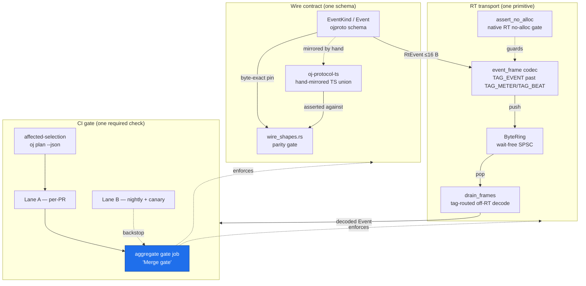

# Glossary

> This is the canonical vocabulary for the OpenJammer foundations program. Every load-bearing term used across the section files resolves here, with a crisp definition and a link to the section that *owns* it (the one that fully specifies it). Definitions are ground-truthed against the live tree — where a term names a concrete file, type, or line, the citation is given as `path:line`.

> **Note:** "Owned by" means the section where the term is decision-final and fully specified. Other sections may *consume* the term; they defer to the owner. Terms are listed alphabetically. The `oj` Bun CLI, the `just` command surface, and the other [canonical foundations](00-overview.md#cross-cutting-foundations--the-things-that-must-be-one) (F1–F6) are referenced verbatim throughout.

## How the core terms relate

---

## Terms

### `.config/nextest.toml`

The declarative configuration for `cargo-nextest`, the workspace test runner. It defines the `audio-serial` test-group (`max-threads = 1`) that binds `ojcore`'s ring / hot-swap / `assert_no_alloc` tests so RT-sensitive assertions never contend, plus the `ci` profile (`fail-fast = false`, JUnit output to `junit.xml`). Both CI and local runs read this one file, so *what* runs cannot diverge. **Absent today** — adopted in Phase 1 alongside the root `justfile`.

> **Owned by:** [`00-overview.md` §F1](00-overview.md#f1--one-task-runner--command-surface) and [`01-testing-and-reliability.md` §T1](01-testing-and-reliability.md#t1--test-orchestration).

### `assert_no_alloc`

The `assert_no_alloc` crate (a dev-dependency, `assert_no_alloc = "1.1.2"` at `crates/ojcore/Cargo.toml:29`) provides a global `AllocDisabler` allocator shim, installed as `static A: AllocDisabler` in `crates/ojcore/tests/engine.rs:27`. Wrapping the render path in an `assert_no_alloc(|| { … })` scope turns any heap allocation on the audio thread into a hard test failure — the mechanical enforcement of the RT-safety invariant. It is **native-only**; the browser RT-emit path is verified by code review plus a native-rlib proxy run of the same codec, never claimed as gate-verified on wasm.

> **Owned by:** [`00-overview.md` §F-shared](00-overview.md#f-shared--rt-safety-invariant--privacy-allowlist); enforced per-PR in [`05-github-actions-ci.md` §7](05-github-actions-ci.md#7-rt-no-alloc-proof--a-required-per-pr-check-the-most-important-must-fix).

### affected-selection

The Bun-side logic in the `oj` CLI's `plan` subcommand that computes the minimal set of crates/packages a PR actually touches, using `cargo metadata --format-version 1 --no-deps` (cached on the `Cargo.lock` blob hash) for the true reverse-dependency set plus `gh pr diff --name-only`. It is graph-accurate — **not** a hand-authored YAML graph, since Cargo already owns the dependency graph. A **broad invalidator** (`Cargo.lock`, `crates/ojcore/**`, `crates/ojproto/**`, `justfile`, `rust-toolchain.toml`, corpus/asset dirs) forces `full: true` to run everything; the canary full-matrix-on-merge bounds any under-selection to a single merge.

> **Owned by:** [`01-testing-and-reliability.md` §T1](01-testing-and-reliability.md#t1--test-orchestration); consumed via the `oj plan --json` contract in [`05-github-actions-ci.md` §5](05-github-actions-ci.md#the-oj-plan---json-contract).

### aggregate `gate` job

The single required CI status check named **"Merge gate"**, defined inline in `ci.yml` (so its name is stable) with `needs: [all Lane A jobs]` and `if: always()`. Every other check — T2 render, T3 Playwright, T4 correctness, X2 docs, D1 set-equality, the `wire_shapes.rs` coupling — is a `needs` dependency feeding `gate`, never independently required. It fails unless every `need` is in `{success, skipped}` **and** `needs.changes.result == 'success'`. The one documented invariant: *do not rename the gate job.* **No such job exists today** — `ci.yml` currently has three independently-required jobs.

> **Owned by:** [`05-github-actions-ci.md` §5](05-github-actions-ci.md#5-lane-a--the-required-merge-gate-ciyml-per-pr); foundation [`00-overview.md` §F6](00-overview.md#f6--one-required-ci-check--one-toolchain-pin--one-hook-control-plane).

### `ByteRing`

The wait-free, single-producer/single-consumer (SPSC) byte ring in `crates/ojcore-midiring/src/lib.rs` — the repo's canonical RT transport primitive. It has a **frozen `#[repr(C)]` layout** (three `u32` header fields `write`/`read`/`capacity` at offsets 0/4/8, data region at 12) so JS and the Rust/wasm worklet agree on offsets without negotiation. Each `push` writes a 4-byte little-endian length prefix plus payload; `pop` reads exactly one frame; the producer publishes the new write index with a single `Release` store so a consumer never sees a partial frame — no lock, no CAS. The existing `MeterRing = ojcore_midiring::ByteRing<8192>` (`crates/ojcore/src/meter.rs:203`) is the proven instance the event channel reuses. T4's `loom` verifies *this* ring; downstream code reuses it rather than re-verifying.

> **Owned by:** [`02-logging-and-observability.md` §L2](02-logging-and-observability.md#l2--cross-boundary-structured-event-schema-the-spine); foundation [`00-overview.md` §F3](00-overview.md#f3--one-event-schema--one-rt-transport-primitive).

### canary (channel)

One of the two channels in the `{stable, canary}` model. `canary` is a single force-moved `canary` prerelease tag built on every push to `main`. The `contains(github.ref_name, '-')` predicate sets `prerelease`. **Critical:** the Tauri updater never points at the moving `canary` `/latest/` (its assets are deleted-then-reuploaded on every merge, racing partial manifests); the canary *updater feed* uses an immutable per-build tag (`canary-<shortsha>`) with an atomically-swapped `canary.json`, and the moving tag stays a human-download convenience only. The canary keypair is **separate** from the stable keypair (see [minisign](#minisign)).

> **Owned by:** [`03-release-channels-and-auto-update.md` §R1](03-release-channels-and-auto-update.md#r1--release-please-as-the-single-version-brain--decoupled-moving-tag-canary); foundation [`00-overview.md` §F4](00-overview.md#f4--one-version-ssot--one-channel-model).

### COOP/COEP / cross-origin isolation

`Cross-Origin-Opener-Policy: same-origin` + `Cross-Origin-Embedder-Policy: require-corp`, the two response headers that make `crossOriginIsolated === true` and thereby unlock [`SharedArrayBuffer`](#sharedarraybuffer). Without them the wasm executor silently falls back to the higher-latency `postMessage` control path. A production host (Vercel/Netlify/nginx, **not** GitHub Pages, which cannot emit them) must re-emit them, asserted by a post-deploy synthetic check — not just T3's preview-server `crossOriginIsolated === true` assertion.

> **Verified:** these headers exist today only in `vite.config.ts` dev `server.headers` (`vite.config.ts:130-131`) and `preview.headers` (`vite.config.ts:136-137`); no production host config emits them yet.

> **Owned by:** [`05-github-actions-ci.md` Open question #1](05-github-actions-ci.md#open-questions--decisions-deferred) (header-capable PWA host); verified per-PR in [`01-testing-and-reliability.md` §T3](01-testing-and-reliability.md#t3--cross-platform-uie2e-testing).

### device-free `render` gate

The `just render` recipe — `cargo run -p ojcore-native --bin render --features demo -- {{wav}} 2` — which renders the engine to a WAV file with no audio hardware. It is the cheap, deterministic golden-render check that runs in `quick`, the Windows/macOS floors, and the `engine` workflow, feeding the aggregate `gate` job. It mirrors the verified `render` bin invocation in the current CI.

> **Owned by:** [`00-overview.md` §F1](00-overview.md#f1--one-task-runner--command-surface) and [`01-testing-and-reliability.md` §T2](01-testing-and-reliability.md#t2--real-time-audio-correctness-without-hardware); wired in [`05-github-actions-ci.md` §5](05-github-actions-ci.md#5-lane-a--the-required-merge-gate-ciyml-per-pr).

### `drain_frames` / `event_frame`

The off-RT and RT halves of the one logging codec.
- **`event_frame`** is a **new** `pub mod` to be added to `crates/ojcore/src/meter.rs`, sibling to the existing `return_frame` module (`meter.rs:138`). It defines the RT encode/decode for fault events, reusing the tag convention past the existing `TAG_METER = 1` (`meter.rs:142`) and `TAG_BEAT = 2` (`meter.rs:144`) — adding a single `TAG_EVENT = 3`. The `RtEvent` variant (`Xrun`/`NodeFault`/`RingFull`) is discriminated by an internal payload byte, not by additional frame tags, so the transport tag space stays stable as the taxonomy grows.
- **`drain_frames`** is the **single** off-RT decoder that extends the existing meter drain and routes by tag — explicitly *not* three parallel `drain_logs` / `drain_events` / `drain_frames`. It decodes back into an `ojproto` `Event` and forwards to the four consumers.

> **Owned by:** [`02-logging-and-observability.md` §L2](02-logging-and-observability.md#l2--cross-boundary-structured-event-schema-the-spine); foundation [`00-overview.md` §F3](00-overview.md#f3--one-event-schema--one-rt-transport-primitive).

### `EventKind`

The versioned, externally-tagged event taxonomy to be added to `crates/ojproto/src/lib.rs` in Phase 2 — the single schema for all diagnostics, alongside the existing `RtCommand` / `EngineFrame`. Variants include `Lifecycle`, `GraphSwap`, `Xrun { dropped }`, `NodeFault { node, fault }`, `RingFull`, and `Message { code, text }` (the only `String`-carrying variant, into which the orphaned `EngineFrame::Error` — defined at `lib.rs:253`, produced by no engine code — folds in the same bump). Its `Copy`, RT-safe subset (`RtEvent`) carries a `const _: () = assert!(core::mem::size_of::<RtEvent>() <= 16);` guard **mirroring** the verified `RtCommand` cap (`const _: () = assert!(core::mem::size_of::<RtCommand>() <= 16);`, `crates/ojproto/src/lib.rs:200`). **No `EventKind` (or `RtEvent`) type exists today.**

> **Owned by:** [`02-logging-and-observability.md` §L2](02-logging-and-observability.md#l2--cross-boundary-structured-event-schema-the-spine).

### FTS5

SQLite's built-in full-text-search virtual-table module (a true inverted index, `bm25`-ranked), the search engine for the on-device log store. Used identically on both targets: `rusqlite` with `features = ["bundled", "fts5"]` (`= "0.40.1"`, SQLite 3.53.x) on native, `@sqlite.org/sqlite-wasm` over the OPFS SAH-pool VFS in the browser. Because FTS5-off is a silent runtime-only failure (`no such module: fts5`), a `CREATE VIRTUAL TABLE … USING fts5` + `MATCH` smoke test is a **gated** check on both builds.

> **Owned by:** [`02-logging-and-observability.md` §L3](02-logging-and-observability.md#l3--on-device-log-storage--needle-in-a-haystack-search).

### golden corpus

The single shared source of truth for DSP correctness: `OjGraph` IR (serde-JSON, pinned by `wire_shapes.rs`) plus an `RtCommand` timeline, stored under `crates/ojcore-native/tests/corpus/*.json`. It is verified through three device-free tiers — native snapshot (Tier 1), real `wasm32` codegen parity (Tier 2, the keystone), and proptest invariants (Tier 3). The native golden is generated/asserted **per-arch** (linux-x64, macos-aarch64, macos-x64) with a tight ULP band (not bit-exact), because thin-LTO + nightly `-Z build-std` make byte-equality non-robust across toolchain bumps.

> **Owned by:** [`01-testing-and-reliability.md` §T2](01-testing-and-reliability.md#t2--real-time-audio-correctness-without-hardware).

### `just` command surface

The root `justfile` — the **single source of truth for *what* runs**. Recipes (`fmt`, `clippy`, `test`, `doctest`, `nostd`, `wasm`, `render`, `clap-host`, `web`, `rust`, `preflight`, `ci`, …) are invoked verbatim by **both** CI workflows and the local `lefthook` hooks, so no command is encoded twice. `test` is `cargo nextest run --workspace`; `doctest` (`cargo test --workspace --doc`) is the mandatory companion because nextest skips doctests. The `justfile` sets `set windows-shell := ['powershell.exe', …]` for the Windows-primary dev box. **Absent today** — created in Phase 1 by T1; C1 consumes it, never re-encodes commands.

> **Owned by:** [`00-overview.md` §F1](00-overview.md#f1--one-task-runner--command-surface) and [`01-testing-and-reliability.md` §T1](01-testing-and-reliability.md#t1--test-orchestration).

### Lane A / Lane B

The two-lane CI split.
- **Lane A** is the per-PR required path (`ci.yml`, on `pull_request` + the wired-but-inert `merge_group`): the affected-aware `changes` selector, `quick`, the RT no-alloc proof, sharded tests, the thin Windows/macOS/wasm floors, and `web` — all feeding the aggregate `gate` job. Target: sub-10-min.
- **Lane B** is the heavy backstop on `schedule` (nightly) + push-to-`main` (canary): full 3-OS engine matrix, full `wasm-pack test --node` golden parity, fuzz, miri/loom/sanitizers, Playwright, mutation testing — each its own staggered workflow opening a rolling tracking issue, never a contributor blocker.

> **Owned by:** [`05-github-actions-ci.md` §5–§6](05-github-actions-ci.md#5-lane-a--the-required-merge-gate-ciyml-per-pr).

### lefthook

The one git-hook control plane: a single `lefthook.yml` (T1-owned, co-designed with D1/D2/X2), invoked via `bunx` not `-g` (the evilmartians/lefthook#1165 Windows PATH bug). `pre-commit` = `oj doctor --fix --from-files` + version-sync consistency + credential scan + fmt/lint; `pre-push` = `oj preflight --affected`. Hooks invoke the same `just` recipes CI uses and are **local fast-feedback only** — GitHub Actions stays authoritative. **Absent today.**

> **Owned by:** [`00-overview.md` §F6](00-overview.md#f6--one-required-ci-check--one-toolchain-pin--one-hook-control-plane); specified in [`04-developer-tooling.md` §D2](04-developer-tooling.md#d2--the-oj-developer-cli) and [`01-testing-and-reliability.md` §T1](01-testing-and-reliability.md#t1--test-orchestration).

### minisign (+ split keypairs)

The ed25519 payload-signing scheme the Tauri v2 updater verifies at install time. OpenJammer uses **one minisign concept split by channel**: a **stable keypair** touched only by the `v*`-tag-triggered `release.yml`, and a **separate canary keypair** for the push-on-`main` `canary.yml`. The app trusts both public keys, so a leaked canary key cannot forge a stable update. `TAURI_SIGNING_PRIVATE_KEY` (stable) is scoped `if: startsWith(github.ref, 'refs/tags/v')` and never exposed to PR- or push-triggered jobs. minisign secures the *payload*, not first-install OS trust (SmartScreen/Gatekeeper — see SignPath / Apple Developer ID).

> **Owned by:** [`00-overview.md` §F5](00-overview.md#f5--one-signing-story); specified in [`03-release-channels-and-auto-update.md` §R4](03-release-channels-and-auto-update.md#r4--desktop-artifact-hosting--signing-key-management) and the release-path detail in [`05-github-actions-ci.md` §10](05-github-actions-ci.md#10-release-path-signing-channels-and-the-draft-vs-publish-model). Secret storage, the split `TAURI_SIGNING_PRIVATE_KEY` (stable) / `TAURI_SIGNING_PRIVATE_KEY_CANARY` (canary) names, and the custodian runbook live in [`KEY-MANAGEMENT.md`](KEY-MANAGEMENT.md).

### `oj` Bun CLI

The single Bun/TS binary at `scripts/oj/` (entry `scripts/oj/index.ts`), merging T1's preflight harness and D2's doctor/scaffold tool over a shared `lib/` (`git`, `cache`, `ssot`, `report`). Subcommands: `preflight`/`plan` (cache + affected-selection) and `doctor`/`scaffold`/`dev`. It *decides which* `just` recipes to run but **never re-encodes commands**; its version-sync is a *consistency check* (all four version files equal), never an independent source — `release-please` owns the bump. Its `plan --json` emits the stable shape C1's `changes` job consumes. **Absent today.**

> **Owned by:** [`00-overview.md` §F2](00-overview.md#f2--one-oj-buntts-cli) and [`04-developer-tooling.md` §D2](04-developer-tooling.md#d2--the-oj-developer-cli).

### `oj-protocol-ts`

The hand-maintained TypeScript mirror of every `ojproto` wire type, at `packages/oj-protocol-ts/src/index.ts` (npm package `@openjammer/oj-protocol`, `AGPL-3.0-only`, version `0.0.0`). Nothing mechanically derives it, so the `wire_shapes.rs` parity gate pins its serde JSON byte-for-byte. `CODEOWNERS` pairs `crates/ojproto` with it so the mirror cannot drift unreviewed. In-site TS API docs render from it via `starlight-typedoc`.

> **Owned by:** verified-against `packages/oj-protocol-ts/` and [`02-logging-and-observability.md` §L2](02-logging-and-observability.md#l2--cross-boundary-structured-event-schema-the-spine); paired in [`05-github-actions-ci.md` §5](05-github-actions-ci.md#5-lane-a--the-required-merge-gate-ciyml-per-pr).

### `ojproto`

The `no_std` Rust crate (`crates/ojproto/src/lib.rs`, `#![no_std]` at line 9) that is the **single source of truth for the UI↔engine wire contract** and the `OjGraph` IR. It is strictly control-rate — no audio sample buffers ever appear here — and houses `RtCommand`, `EngineFrame`, `PrimitiveKind`, `SCHEMA_VERSION` (`= 1`, `lib.rs:18`), and (in Phase 2) the new `EventKind` / `RtEvent`. The compile-time `size_of::<RtCommand>() <= 16` guard (`lib.rs:200`) mechanically rejects any heap/audio field crossing the RT seam.

> **Owned by:** verified-against `crates/ojproto/src/lib.rs`; schema extensions in [`02-logging-and-observability.md` §L2](02-logging-and-observability.md#l2--cross-boundary-structured-event-schema-the-spine).

### `release-please`

The single version brain (R1). One bot writes all four drifting version files in lockstep — `Cargo.toml [workspace.package].version` (the canonical `0.0.0` seed, `Cargo.toml:9`), `package.json` (`0.1.0-alpha`), `src-tauri/tauri.conf.json` (`0.1.0`), and `packages/oj-protocol-ts/package.json` (`0.0.0`) — resolving the verified four-way drift. A Phase-0 hard prerequisite: R2's updater compares the `tauri.conf.json` version and L5 stamps it, so versions must be unified first, with a release-please dry-run proof that the nested `$.workspace.package.version` updater works and a three-way equality release gate (binary `CARGO_PKG_VERSION` == tag == `tauri.conf.json`).

> **Owned by:** [`03-release-channels-and-auto-update.md` §R1](03-release-channels-and-auto-update.md#r1--release-please-as-the-single-version-brain--decoupled-moving-tag-canary); foundation [`00-overview.md` §F4](00-overview.md#f4--one-version-ssot--one-channel-model).

### RT-safety invariant

The non-negotiable hard real-time contract: **the audio thread never allocates, locks, or blocks.** All RT telemetry rides the wait-free `ByteRing` pattern; `tracing` is forbidden on the audio thread (enforced by a clippy `disallowed-methods` / grep guard over the native render path and the wasm `process()` fn). It is documented once on X1's Real-Time Safety page and mechanically enforced by `assert_no_alloc` on native. When pillars conflict, this invariant (under pillar 1, absolute reliability) wins.

> **Owned by:** [`00-overview.md` §F-shared](00-overview.md#f-shared--rt-safety-invariant--privacy-allowlist) and pillar 1; the page lives in [`06-documentation-starlight.md` §X1](06-documentation-starlight.md#x1--starlight-prose-hub--linked-out-rustdoc--in-site-typedoc-one-pages-deploy).

### `SharedArrayBuffer`

The browser primitive (often abbreviated SAB) that backs a true cross-thread `ByteRing` between the worklet and the UI thread, available only when [COOP/COEP](#coopcoep--cross-origin-isolation) make `crossOriginIsolated === true`. **A true cross-thread SAB drain is impossible on today's wasm build** (non-shared linear memory, no `+atomics` / `+bulk-memory`); until a shared-memory wasm build lands as its own prerequisite workstream, all browser ring drains use the worklet-self-drain + `postMessage` path. Its presence (`typeof SharedArrayBuffer`) is a useful PWA diagnostic captured in the L5 bundle.

> **Owned by:** transport context in [`02-logging-and-observability.md` §L2](02-logging-and-observability.md#l2--cross-boundary-structured-event-schema-the-spine); deferred in [`00-overview.md` Open question #1](00-overview.md#open-questions--decisions-deferred) and [`05-github-actions-ci.md` Open question #2](05-github-actions-ci.md#open-questions--decisions-deferred).

### stable (channel)

The other channel in the `{stable, canary}` model: `v*` tags **without** a `-` in the version. The `v*`-tag-triggered `release.yml` builds it and signs with the **stable** minisign keypair only. The native Tauri updater and PWA Workbox SW route stable users to the stable feed. R1, R2, R3 (the `__OJ_CHANNEL__` Vite define), R4, and C1 all read the literal identifier `stable`.

> **Owned by:** [`03-release-channels-and-auto-update.md` §R1](03-release-channels-and-auto-update.md#r1--release-please-as-the-single-version-brain--decoupled-moving-tag-canary); foundation [`00-overview.md` §F4](00-overview.md#f4--one-version-ssot--one-channel-model).

### `starlight-typedoc`

The Astro Starlight integration (`"starlight-typedoc": "^0.21"` + `typedoc-plugin-markdown`) that renders the `oj-protocol-ts` API as themed, searchable, Pagefind-indexed pages **inside** the docs site under `/api/ts`. It is the one unification upgrade over pure linked-out docs — paid only where it is cheap and high-value (the small, exhaustively-documented wire contract); the cfg-saturated nine engine crates under `crates/*` stay on canonical rustdoc.

> **Owned by:** [`06-documentation-starlight.md` §X1](06-documentation-starlight.md#x1--starlight-prose-hub--linked-out-rustdoc--in-site-typedoc-one-pages-deploy).

### `tauri-driver`

The WebDriver harness for the native Tauri app, used (with WebdriverIO against a real `openjammer` debug binary) as a **thin, non-blocking, advisory** native E2E leg — never the merge gate. It exercises the real Tauri IPC / cpal / WebKit seam the Chromium-based Playwright proxy cannot, but carries the worst flake/cost surface (Edge version pinning, xvfb no-GPU, leaked driver processes) and has **no official macOS path**, so it stays advisory.

> **Owned by:** [`01-testing-and-reliability.md` §T3](01-testing-and-reliability.md#t3--cross-platform-uie2e-testing).

### `wire_shapes.rs` parity gate

The test at `crates/ojproto/tests/wire_shapes.rs` that pins the exact serde JSON of every `ojproto` wire type so the hand-maintained `oj-protocol-ts` mirror cannot silently drift. It serializes representative values and asserts the bytes byte-for-byte — field names, declaration order, and serde's default **external** enum tagging (unit variant → bare string; struct/tuple variant → `{ "<Variant>": { … } }`; C-like enums like `PrimitiveKind` → bare identifier string). Existing tests include `primitive_kind_is_bare_variant_string` (`:35`), `rt_command_external_tagging` (`:143`), and `engine_frame_external_tagging` (`:195`); Phase 2 adds parallel `Event`/`EventKind` assertions. It runs inside the existing `cargo test --workspace` and feeds the aggregate `gate` job — zero new CI.

> **Owned by:** verified-against `crates/ojproto/tests/wire_shapes.rs`; extended in [`02-logging-and-observability.md` §L2](02-logging-and-observability.md#l2--cross-boundary-structured-event-schema-the-spine).

### `wasm-pack test --node` parity

The keystone of the device-free DSP correctness story (T2 Tier 2): the **actual `wasm32`-compiled engine** is run headlessly under Node via `wasm-pack test --node` and its output compared to the native golden snapshot within a tight ULP band. It is the only leg that verifies the *browser-compiled* float path (catching libm / LLVM-wasm codegen divergence), not just a host rlib. A **small kernel subset** runs per-PR (`just wasm-parity-smoke`, the device-free `render` golden replayed through `wasm32`); the full proptest-invariant suite runs nightly in Lane B.

> **Owned by:** [`01-testing-and-reliability.md` §T2](01-testing-and-reliability.md#t2--real-time-audio-correctness-without-hardware); scheduled in [`05-github-actions-ci.md` §6](05-github-actions-ci.md#6-lane-b--heavy-backstop-split-per-concern-to-survive-the-concurrency-ceiling).

---

## See also

- [`00-overview.md`](00-overview.md) — the executive map; the canonical [decisions table](00-overview.md#decisions-at-a-glance) and the six [cross-cutting foundations](00-overview.md#cross-cutting-foundations--the-things-that-must-be-one) every term answers to. **On any divergence, `00-overview.md` is authoritative.**
- [`README.md`](README.md) — the foundations-program front door and document index.
