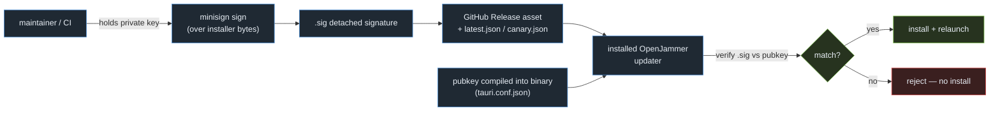
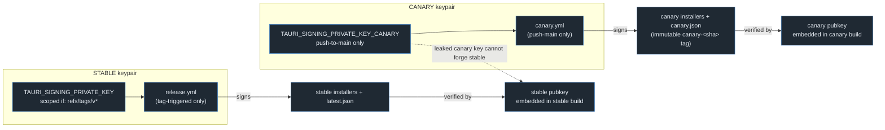
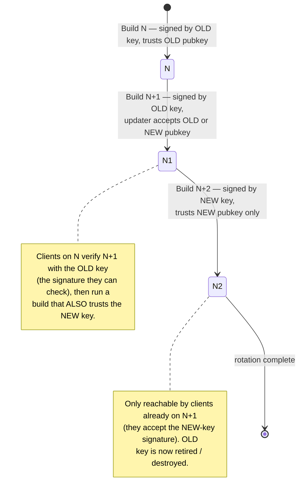
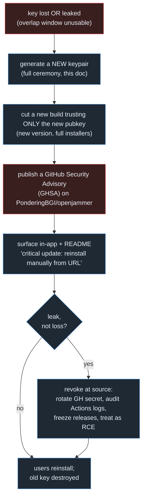

# Signing Root-of-Trust Runbook (`KEY-MANAGEMENT.md`)

This is the **must-write-before-ship** runbook for OpenJammer's update-payload signing keys. It is the operational companion to the [`03-release-channels-and-auto-update.md`](03-release-channels-and-auto-update.md) R2/R4 designs and is the deliverable named explicitly in three places:

- [`00-overview.md` §F5 "One signing story"](00-overview.md#f5--one-signing-story) and [Open question #6](00-overview.md#open-questions--decisions-deferred) — *"A `KEY-MANAGEMENT.md` runbook (generation ceremony, dual offline backup, pubkey-overlap rotation window, break-glass via Security Advisory + manual-reinstall notice) is a must-write-before-ship deliverable for R2/R4."*
- [`03-release-channels-and-auto-update.md` R4 Risks](03-release-channels-and-auto-update.md#risks--mitigations-3) — the catastrophic-key-loss row points here.
- [`05-github-actions-ci.md` §10](05-github-actions-ci.md#10-release-path-signing-channels-and-the-draft-vs-publish-model) — the "key-rotation runbook before first signed release" must-fix points here.

> **Scope:** This document governs **minisign update-payload signing only** — the ed25519 keys the Tauri v2 updater (R2) uses to authenticate downloaded installers. It does **not** cover OS-level code-signing (Windows Authenticode / SignPath Foundation, macOS Developer ID + notarization); those are a separate owned release-credentials decision tracked in [`00-overview.md` Open question #3](00-overview.md#open-questions--decisions-deferred) and [`03-...md` Open questions §1](03-release-channels-and-auto-update.md#open-questions--decisions-deferred).

---

## At a glance

| Property | Value (canonical, verified) |
|---|---|
| Signature scheme | minisign ed25519 (Tauri v2 updater payload signing) |
| Key model | The `{stable, canary}` channel model → **split stable/canary keypairs**; both pubkeys embedded |
| Stable key trigger scope | `release.yml`, **only** `if: startsWith(github.ref, 'refs/tags/v')` (tag-triggered) |
| Canary key trigger scope | `canary.yml`, push-on-`main` only (distinct secret name) |
| Generator command | `bunx tauri signer generate -w <path>` (Tauri CLI `2.11.2`, verified `package.json:52`) |
| CI secrets | `TAURI_SIGNING_PRIVATE_KEY`, `TAURI_SIGNING_PRIVATE_KEY_PASSWORD` (stable); distinct canary secret names |
| Public-key home | `src-tauri/tauri.conf.json` → `plugins.updater.pubkey` (no `plugins` block today — added in R2 Phase 0/5) |
| Rotation | Pubkey-overlap window (build N: old; N+1: old+new accepted; N+2: drop old) |
| No native rotation | minisign has **no** built-in key-rotation; break-glass = Security Advisory + manual-reinstall notice |
| Re-verification gate | Post-sign CI re-verifies every `.sig` against the committed pubkey; **fail the release on mismatch** |
| Bus factor | One custodian today; second-maintainer custody handoff is an explicit org-migration deliverable |

> **Verified:** `src-tauri/tauri.conf.json` at `9279984` has **no** `plugins` block and `app.security.csp: null` (`tauri.conf.json:24-26`); `src-tauri/src/lib.rs:271` registers **only** `tauri_plugin_opener::init()`. The updater plugin, its dependency, and the `pubkey`/`endpoints` config are R2 additions — this runbook governs the keys those additions consume, and **all of it must land before the first signed release.**

> **Verified (repo-slug discrepancy — read before copy-pasting URLs):** Every committed source in the repo canonically uses the slug **`PonderingBGI/openjammer`** (`package.json:9` `repository.url`, `README.md:350`, `src/store/projectStore.ts:376`, and all `docs/plans/*.md`). The local worktree's `git remote -v` resolves to `PonderingAI/openjammer`. This runbook uses `PonderingBGI/openjammer` to stay consistent with the committed plan and the R2 endpoint (`03-...md:282`). **Confirm the live slug before provisioning keys** — the updater `endpoints` URL and the `gh attestation verify --repo` invocation must point at the real published repo, or signature verification succeeds while downloads 404.

---

## Why minisign (and why it is *not* OS code-signing)

The Tauri v2 first-party updater (R2) authenticates the **update payload**: when an installed OpenJammer build downloads `latest.json` (or the per-build `canary.json`) and the referenced installer asset, it verifies a detached **minisign ed25519** signature over the downloaded bytes against a public key **compiled into the running binary**. This is the single control that stops a tampered GitHub Release asset (or a hijacked download URL) from executing arbitrary code on a user's machine via the auto-updater. The update path is effectively remote-code-execution-grade; minisign is the gate on it.

Minisign is **orthogonal to OS code-signing**:

| Control | What it proves | Where it lives | Owned by |
|---|---|---|---|
| **minisign** (this doc) | The *update payload* came from a holder of the channel's private key | `pubkey` in `tauri.conf.json`, verified at install time by the updater | R2 / R4 |
| Windows Authenticode (SignPath Foundation) | First-install OS trust (no SmartScreen "unknown publisher") | OS-level, complements minisign | Separate release-credentials decision |
| macOS Developer ID + notarization | Gatekeeper allows the *swapped* `.app` to launch | OS-level, **hard blocker** for macOS auto-update | Separate release-credentials decision |

> **Why this distinction matters operationally:** minisign verifying a macOS `.app.tar.gz` payload does **nothing** to stop Gatekeeper from quarantining the swapped app. Per [R2's per-platform matrix](03-release-channels-and-auto-update.md#per-platform-matrix-1), the macOS updater is `cfg`-gated **off** until an Apple Developer ID is acquired. A green minisign verification is necessary but not sufficient for a working update on every platform.

`attest-build-provenance` (SLSA) **complements** minisign for auditors and AGPL redistributors but is explicitly **not** a runtime update-acceptance control — the updater verifies the minisign signature only and has zero knowledge of attestations (see [`05-...md` §8e](05-github-actions-ci.md#8e-build-provenance-attestation--honest-framing)).



---

## The split-keypair model

OpenJammer uses **two independent minisign ed25519 keypairs**, one per channel of the `{stable, canary}` channel model. This is the [R4 split-keys must-fix](03-release-channels-and-auto-update.md#adversarial-must-fixes-folded-in-3) and the [`00-overview.md` §F5](00-overview.md#f5--one-signing-story) invariant — restated here at the operational level because **this is the document that the generation ceremony and CI scoping must obey.**

| | Stable keypair | Canary keypair |
|---|---|---|
| Signs | Tagged releases (`vX.Y.Z`) | Every push to `main` |
| Workflow | `release.yml` | `canary.yml` (new, Phase 1) |
| **Trigger scope** | `if: startsWith(github.ref, 'refs/tags/v')` | push-on-`main` only |
| GitHub secret (private) | `TAURI_SIGNING_PRIVATE_KEY` + `_PASSWORD` | `TAURI_SIGNING_PRIVATE_KEY_CANARY` + `_PASSWORD_CANARY` |
| Embedded pubkey | stable pubkey in the stable build's `tauri.conf.json` | canary pubkey in the canary build's `tauri.conf.json` |
| Exposure profile | Touched only by infrequent, high-scrutiny tag pushes | Touched by every merge — high-frequency, lower-scrutiny |

**Why split:** the canary key is exposed on the high-frequency, lower-scrutiny push-on-`main` trigger. A single-key plan would expose the production-trust (stable) key to that same trigger, directly contradicting the tag-only scoping. With split keys, **a leaked or compromised canary key cannot forge a stable update** — a stable client embeds and trusts only the stable pubkey.

Both pubkeys are embedded **into their respective channel builds** (the stable build trusts the stable pubkey; the canary build trusts the canary pubkey). A canary build that should additionally trust the stable key for a downgrade-to-stable path is an explicit per-channel `updater_builder().endpoints()` routing concern (R2's `check_update(channel)` command), not a multi-key embed.

> **Must-fix (critical):** `TAURI_SIGNING_PRIVATE_KEY` (stable) is scoped `if: startsWith(github.ref, 'refs/tags/v')` and is **never** exposed to `pull_request`, `pull_request_target`, or `push`-to-`main` jobs. This is enforced mechanically by **`zizmor`** as a required PR gate (`05-...md` §8c) — it asserts `TAURI_SIGNING_*` is never referenced under PR triggers (`secrets-on-pr` / `template-injection` audits). A leaked signing key is the single worst outcome in the entire program; this check runs on **every** workflow change, not nightly.



---

## Prerequisites — do these BEFORE generating any key

> **Must-fix (critical) — order is load-bearing.** `bunx tauri signer generate -w openjammer.key` writes the **private key into the working tree**. The repo runs write-capable Claude bots — `claude-auto-review.yml` literally executes `git add .` (`05-...md` §9) — so an un-gitignored private key would be **auto-committed and publicly published** on the next bot run. The ignore patterns and the credential-scan gate must exist *first*.

### 1. `.gitignore` key patterns

The current `.gitignore` (verified at `9279984`) ignores logs, lockfiles, `node_modules`, `dist`, `/target`, and `.claude/worktrees/` — but has **no key patterns**. Add this block in the same commit that lands the credential-scan gate, before any `signer generate`:

```gitignore
# Signing keys — NEVER commit (R4 / KEY-MANAGEMENT.md)
*.key
openjammer.key
openjammer-canary.key
*.pem
*.p12
*.pfx
*.minisign
.tauri/
```

> **Verified:** These patterns are the exact set named in [`03-...md` R4](03-release-channels-and-auto-update.md#adversarial-must-fixes-folded-in-3) and [`05-...md` §8d](05-github-actions-ci.md#8d-secret-hygiene-gitignore--required-credential-scan). `.tauri/` is included because the recommended key path below writes under `~/.tauri/`, and a developer who relocates the key into the repo's `.tauri/` would otherwise expose it.

### 2. Required credential-scan CI step

A **required** CI step (a `needs` dependency of the aggregate `gate` job — **not** a local-only hook; the maintainer is Windows-only and the local hook plane is deferred) hard-fails on any staged private-key material:

- Fails on staged content matching `-----BEGIN .* PRIVATE KEY-----` (PEM/PKCS) **and** minisign secret-key headers (`untrusted comment: minisign encrypted secret key`).
- Fails on any staged file matching the `.gitignore` key globs above (defense-in-depth against a forced add).

### 3. SHA-pin the release/signing path

> **Must-fix (critical):** [`00-overview.md` Phase 0 #4](00-overview.md#phase-0--foundation-versions-toolchain-governance-security-baseline) and [`05-...md` §8c](05-github-actions-ci.md#8c-action-pinning-zizmor-dependabotyml). `release.yml` today uses **floating tags** (verified): `actions/checkout@v4` (`release.yml:43`), `oven-sh/setup-bun@v2` (`:59`), `dtolnay/rust-toolchain@stable` (`:62`), `Swatinem/rust-cache@v2` (`:70`), `tauri-apps/tauri-action@v0` (`:78`). A floating-tag action in a key-holding workflow is a **direct private-key exfiltration path** — a compromised upstream tag can read the secret. SHA-pin every third-party action **before** `TAURI_SIGNING_*` is ever stored, add `zizmor` as the required pinning gate, and add `dependabot.yml` (the `github-actions` ecosystem) to keep the pins reviewed.

### 4. Governance ON

[`00-overview.md` Phase 0 #3](00-overview.md#phase-0--foundation-versions-toolchain-governance-security-baseline): `main` has **no branch protection** today and the `gate` job is not yet required. The credential-scan and post-sign verification gates are meaningless until `main` is `enforcement: active` with `required_status_checks` bound to `gate`. Flip governance on before the first signed release.

**Prerequisite checklist (all must be green before key generation):**

- [ ] `.gitignore` key patterns committed.
- [ ] Required credential-scan step wired into `gate`.
- [ ] Every action in `release.yml` / `canary.yml` SHA-pinned; `zizmor` required; `dependabot.yml` present.
- [ ] `main` branch protection `active`, `gate` required.
- [ ] Repo slug confirmed against the live remote (see the verified note above).

---

## The generation ceremony

Generate **two** keypairs — stable and canary — on a trusted, offline-capable machine. The Tauri CLI signer (`@tauri-apps/cli` `2.11.2`, verified) wraps minisign key generation; under Bun the canonical invocation is `bunx tauri signer generate`.

> **Note:** Run the ceremony on the maintainer's own trusted box, not in CI. CI **consumes** the private keys as secrets; it never **generates** them. Generating in CI would write the private key to a runner's disk and logs.

### Stable keypair

```powershell
# Windows PowerShell (the maintainer's primary box — verified RT-primary OS)
# -w writes the encrypted secret key; you will be prompted for a passphrase.
bunx tauri signer generate -w "$env:USERPROFILE\.tauri\openjammer.key"
```

```sh
# macOS / Linux equivalent
bunx tauri signer generate -w ~/.tauri/openjammer.key
```

The command prints the **public key** to stdout and writes the **encrypted private key** to the `-w` path. It also writes the public key to `<path>.pub` (`openjammer.key.pub`).

> **Must-fix (high):** **Always set a passphrase** at the prompt. A passphrase-less private key in a GitHub secret is a single-factor compromise. The passphrase is stored separately as `TAURI_SIGNING_PRIVATE_KEY_PASSWORD`. If you must script non-interactively, the password env var the CLI reads is `TAURI_SIGNING_PRIVATE_KEY_PASSWORD` — never echo it into shell history; pipe it or set it in the current session only.

### Canary keypair

```powershell
bunx tauri signer generate -w "$env:USERPROFILE\.tauri\openjammer-canary.key"
```

Use a **different passphrase** from the stable key. The two keypairs must be fully independent — that independence is the entire point of the split model.

### Where the public keys go

Each channel build embeds **its own** pubkey in `src-tauri/tauri.conf.json` under `plugins.updater.pubkey`. There is no `plugins` block today (verified `tauri.conf.json:1-42`); R2 adds it. The pubkey value is the **content** of the `.pub` file (a single base64 line), inlined:

```jsonc
// src-tauri/tauri.conf.json — plugins block added by R2 (Phase 0/5)
"plugins": {
  "updater": {
    "pubkey": "dW50cnVzdGVkIGNvbW1lbnQ6IG1pbmlzaWduIHB1YmxpYyBrZXk6...",  // STABLE pubkey content
    "endpoints": ["https://github.com/PonderingBGI/openjammer/releases/latest/download/latest.json"],
    "windows": { "installMode": "passive" }
  }
}
```

> **Note:** Tauri's `plugins.updater.pubkey` config field accepts **one** string. It does **not** natively accept an array of public keys. This is the mechanical reason the rotation strategy below uses a transitional **build** that accepts both keys via `updater_builder().pubkey(...)` selection logic, rather than simply listing two keys in config — see [Rotation](#rotation-the-pubkey-overlap-window). The canary build's config carries the **canary** pubkey and routes to the per-build `canary.json` endpoint via R2's `check_update(channel)` command, never the moving `/latest/`.

The **public** keys are safe to commit (that is their purpose) and live in version control via `tauri.conf.json`. The **private** keys never enter the repo.

---

## Secret storage

### GitHub Actions secrets (the live signing path)

| Secret | Channel | Value | Scope |
|---|---|---|---|
| `TAURI_SIGNING_PRIVATE_KEY` | stable | content of `openjammer.key` (the encrypted secret key) | `release.yml`, `if: startsWith(github.ref, 'refs/tags/v')` |
| `TAURI_SIGNING_PRIVATE_KEY_PASSWORD` | stable | the stable passphrase | same |
| `TAURI_SIGNING_PRIVATE_KEY_CANARY` | canary | content of `openjammer-canary.key` | `canary.yml`, push-on-`main` only |
| `TAURI_SIGNING_PRIVATE_KEY_PASSWORD_CANARY` | canary | the canary passphrase | same |

Set them with `gh` (run interactively so the value never lands in shell history; `gh secret set` reads from a prompt or file):

```sh
# Set the STABLE secrets (paste the encrypted-key contents at the prompt)
gh secret set TAURI_SIGNING_PRIVATE_KEY --repo PonderingBGI/openjammer < "$HOME/.tauri/openjammer.key"
gh secret set TAURI_SIGNING_PRIVATE_KEY_PASSWORD --repo PonderingBGI/openjammer   # prompts

# Set the CANARY secrets
gh secret set TAURI_SIGNING_PRIVATE_KEY_CANARY --repo PonderingBGI/openjammer < "$HOME/.tauri/openjammer-canary.key"
gh secret set TAURI_SIGNING_PRIVATE_KEY_PASSWORD_CANARY --repo PonderingBGI/openjammer   # prompts
```

Wire them into the existing `tauri-action` step's `env:` (today `release.yml:79-80` carries only `GITHUB_TOKEN`):

```yaml
# release.yml — add to the tauri-action step env (stable, tag-scoped)
      - name: Build + release (tauri-action)
        if: startsWith(github.ref, 'refs/tags/v')   # stable key NEVER outside tag context
        uses: tauri-apps/tauri-action@<pinned-sha>   # SHA-pinned, not @v0
        env:
          GITHUB_TOKEN: ${{ secrets.GITHUB_TOKEN }}
          TAURI_SIGNING_PRIVATE_KEY: ${{ secrets.TAURI_SIGNING_PRIVATE_KEY }}
          TAURI_SIGNING_PRIVATE_KEY_PASSWORD: ${{ secrets.TAURI_SIGNING_PRIVATE_KEY_PASSWORD }}
```

`tauri-action` then auto-signs each installer and emits the `.sig` files + `latest.json` (with `createUpdaterArtifacts: true`, added by R2). `canary.yml` uses the `_CANARY` secrets identically but is gated on the push-to-`main` trigger.

### Dual offline backup (same day as generation)

> **Must-fix (high):** Generate the keys and **make two independent encrypted offline backups the same day** — before the first signed release. minisign has **no rotation**; losing the private key with no backup means every installed client is permanently stranded (the only recovery is the catastrophic break-glass below).

| Backup | Medium | Encryption | Location |
|---|---|---|---|
| Primary offline | Encrypted USB / hardware key | Hardware/full-disk encryption + the key's own passphrase | Maintainer's physical custody |
| Secondary offline | Second physical medium **or** a password manager / secrets vault entry | Independent encryption from the primary | Geographically/physically separate from the primary |

Back up **all four artifacts per key**: the encrypted private key file, the passphrase, the public key, and a note recording the generation date and the embedding commit. Verify each backup is restorable (decrypt + `bunx tauri signer sign` a throwaway file) **before** wiping the generation machine's working copy.

> **Note:** GitHub Actions secrets are **not** a backup — they are write-only from the UI and unrecoverable if the repo or org is lost. Treat them as a *deployment copy* of the offline master, never the master itself.

---

## Failure modes

| Mode | Trigger | Blast radius | Response |
|---|---|---|---|
| **Catastrophic loss** | Private key + all backups destroyed | Cannot sign any future update on that channel; installed clients can never auto-update again | [Break-glass](#break-glass--last-resort): new key + Security Advisory + manual-reinstall notice |
| **Exfiltration** | Private key leaked (committed, logged, stolen runner, malicious action) | Attacker can forge updates that **every** client trusting that pubkey will install and execute | Treat as active RCE: revoke at the source, [rotate](#rotation-the-pubkey-overlap-window), break-glass for the affected channel |
| **Stale committed pubkey** | Key regenerated but `tauri.conf.json` not updated | Real updates fail verification → no-update (silent) | Caught by the [post-sign verification gate](#the-post-sign-re-verification-gate-blocking) before publish |
| **Pub/priv mismatch** | Wrong private key in CI secret | Every `.sig` fails against the committed pubkey | Same gate — **fails the release**, never ships |
| **Canary key leak** | Canary secret exposed via push-trigger surface | **Bounded** — canary clients only; stable is unaffected (the entire reason for the split) | Rotate the canary key; stable untouched |

> **Why the split contains the worst case:** A leaked **canary** key is a contained incident — it forges canary updates for adventurous-user clients only, and `zizmor` ensures it was never reachable from PR triggers. A leaked **stable** key is a program-level emergency. Keeping the high-frequency exposure on the canary key is the single most important blast-radius control in this document.

---

## Rotation — the pubkey-overlap window

minisign has **no built-in key rotation**: a verifier trusts exactly the public key it was built with. Because Tauri's `plugins.updater.pubkey` config accepts a **single** key, rotation is a **multi-build migration**, not a config edit. The strategy is a **pubkey-overlap window** — ship a transitional build that accepts both the old and new key, let the fleet update onto it, then retire the old key.



**Step-by-step:**

1. **Build N (current):** signed with the **old** private key; binary trusts the **old** pubkey. This is the starting fleet.
2. **Build N+1 (transitional — accepts both):** still **signed with the old key** (so build-N clients can verify it), but its updater is configured to accept **either** the old or the new pubkey. Because the config field is single-valued, this is done in code, e.g. via R2's runtime updater builder:

   ```rust
   // src-tauri/src/lib.rs — transitional check_update during the overlap window.
   // Build N+1 is reachable by build-N clients (old-key signature verifies),
   // and itself trusts BOTH keys so it can later accept the new-key-signed N+2.
   let builder = app.updater_builder().endpoints(vec![url])?;
   let builder = match channel.as_str() {
       // overlap window only: accept either key
       _ => builder.pubkey(NEW_PUBKEY).pubkey(OLD_PUBKEY), // append-trust both
   };
   builder.build()?.check().await
   ```

   > **Must-verify (tracked Phase-5 prerequisite — not a buried note):** Confirm the pinned `tauri-plugin-updater ~2.10` actually exposes the multi-`pubkey` append-trust API used above. **If it does not,** switch to the old-key-signed transitional strategy: **continue signing N+1 with the old key** while the *next* build (N+2) embeds the new pubkey — clients still cross the gap because N+1 (old-signed) installs the N+2-trusting binary. Pick whichever the pinned plugin version supports and encode the choice here as the canonical mechanism. This is an explicit checklist item in the Phase-5 release-delivery prerequisites, surfaced here because a wrong assumption silently breaks the rotation path.

3. **Wait for fleet convergence:** leave N+1 live long enough that telemetry-free reasoning (download counts, release age) gives high confidence the fleet has moved off N. Desktop updates are not real-time; budget a generous window.
4. **Build N+2 (new key only):** signed with the **new** private key; binary trusts the **new** pubkey only. Only clients on N+1 (which accept the new key) can take it. **Retire/destroy the old private key** after N+2 is published and verified.

**When to rotate proactively:** suspected exposure, a custodian handoff (org migration), or a periodic hygiene cadence once a second maintainer exists. Rotate the **stable** and **canary** keys independently — a canary rotation never touches stable.

---

## Break-glass — last resort

If the private key is **lost with no recoverable backup**, or **leaked** such that the overlap-window rotation is too slow to contain an active threat, the overlap path is unavailable: there is no signed bridge build the existing fleet will accept. The only recovery is a **manual-reinstall event**.



**Break-glass procedure:**

1. **Generate a fresh keypair** for the affected channel (full ceremony above).
2. **Cut a new build** that trusts **only** the new pubkey, published as a normal new version with full standalone installers.
3. **Publish a GitHub Security Advisory** (GHSA) on `PonderingBGI/openjammer` describing the incident and the required action. For an exfiltration, mark it critical and treat the leaked key as an active RCE vector.
4. **Surface a manual-reinstall notice** to existing users — the auto-updater cannot reach them (it would verify against a key the maintainer no longer controls or trusts). Use every out-of-band channel: README banner, Discussions, and the in-app prominent banner.
5. **For a leak:** rotate the GitHub secret immediately, audit Actions run logs for the exposure window, freeze releases until the path is clean, and destroy the compromised key everywhere it exists.

> **Rotation-notice mechanism (mitigation, [R4 risk row](03-release-channels-and-auto-update.md#risks--mitigations-3)):** To make break-glass *reach* stranded clients, ship — while keys are still healthy — a small **signed-by-the-current-key** notice JSON the app periodically fetches; if present, it surfaces a prominent in-app *"critical update: download manually from `<URL>`"* banner. This converts a silent dead-end into a visible call to action. It only works if shipped **before** the incident, so it is part of the R2/R5 updater work, not the incident response.

---

## The post-sign re-verification gate (blocking)

> **Must-fix (high):** [`03-...md` R4](03-release-channels-and-auto-update.md#adversarial-must-fixes-folded-in-3) and [`05-...md` §10](05-github-actions-ci.md#10-release-path-signing-channels-and-the-draft-vs-publish-model). After signing, CI **re-verifies every installer's `.sig` against the public key committed in `tauri.conf.json`** and **fails the release on mismatch** — catching a pub/priv mismatch (e.g. after key regeneration where the embedded pubkey was not updated) **before publish**, never in the field. A field mismatch ships installers no client can verify; this gate is the seam that catches it.

The gate is a `needs` dependency feeding the aggregate `gate` job — never an independently-required check (the [`00-overview.md` §F6](00-overview.md#f6--one-required-ci-check--one-toolchain-pin--one-hook-control-plane) "one required gate" invariant). It runs after `tauri-action` signs and **before** the draft is auto-published (R1's draft-auto-publish only fires after this and the `latest.json`-completeness gate pass):

```sh
# Post-sign verification — one needs of `gate`, runs per installer before publish.
# Extract the pubkey content committed in tauri.conf.json and verify each .sig.
PUBKEY=$(jq -r '.plugins.updater.pubkey' src-tauri/tauri.conf.json)
fail=0
for installer in "$BUNDLE_DIR"/*; do
  case "$installer" in *.sig) continue;; esac
  [ -f "$installer.sig" ] || { echo "::error::missing .sig for $installer"; fail=1; continue; }
  if ! bunx tauri signer verify -k "$PUBKEY" -f "$installer" -s "$installer.sig"; then
    echo "::error::signature MISMATCH for $installer — failing the release"
    fail=1
  fi
done
exit $fail
```

> **Note:** Confirm the exact `tauri signer verify` flag surface against the pinned `@tauri-apps/cli 2.11.2` at implementation time; the conceptual contract is fixed and non-negotiable — *verify every produced installer against the committed pubkey, and fail the release on any missing or mismatched `.sig`*. This is the same trust seam from both the canary and stable arms of the [R4 build-to-deliver flow](03-release-channels-and-auto-update.md#release--canary-build-to-deliver-flow).

This composes with the other R4 publish gates feeding `gate`:

- **Post-sign signature re-verify** (this gate).
- **`latest.json` completeness:** the published manifest contains exactly `{windows-x86_64, darwin-aarch64, darwin-x86_64, linux-x86_64}`, each HEAD-200, darwin URLs arch-distinct.
- **`zizmor`:** `TAURI_SIGNING_*` never on PR triggers; all actions SHA-pinned.
- **Credential scan:** no staged private-key material.

---

## Bus factor & second-maintainer custody

> **Must-fix (high):** [`00-overview.md` Open question #6](00-overview.md#open-questions--decisions-deferred) and [`03-...md` Open questions §4](03-release-channels-and-auto-update.md#open-questions--decisions-deferred). The signing root-of-trust is a **bus-factor-of-one** today: a single custodian holds the only copies of both private keys. minisign has no rotation, so the loss of that one person is a catastrophic, fleet-stranding event.

**Standing accommodations (with explicit removal triggers):**

- The dual-offline-backup requirement is the *interim* bus-factor mitigation: even if the custodian is unavailable, a second party with access to a backup + passphrase can sign. Document **who** can reach each backup and how.
- `.github/CODEOWNERS` and any bypass-actor accommodation carry explicit *"remove on second-maintainer onboarding"* TODOs (the program already tracks this pattern in [`00-overview.md` Open question #6](00-overview.md#open-questions--decisions-deferred)).

**Org-migration custody handoff** ([`00-overview.md` Open question #2](00-overview.md#open-questions--decisions-deferred), [`03-...md` Open questions §4](03-release-channels-and-auto-update.md#open-questions--decisions-deferred), [`05-...md` Open question #3](05-github-actions-ci.md#open-questions--decisions-deferred)): when `PonderingBGI/openjammer` moves to an org, treat key custody as a **first-class migration deliverable**, not an afterthought:

1. Re-create both signing secrets at the **org** level (or repo level under the org), with the same tag/push scoping.
2. Confirm the embedded **stable pubkey** in `tauri.conf.json` is unchanged (the trust root must survive the move; the org migration is **not** an excuse to rotate unless rotation is independently warranted).
3. Add a second custodian to the offline-backup access list and **rotate both keys** as the onboarding act — converting bus-factor-of-one into a deliberate, audited handoff.
4. Remove the temporary single-custody and bypass-actor TODOs.

---

## Cross-references

| Topic | Authoritative source |
|---|---|
| Updater design, channel routing, audio-safe install gate | [`03-...md` R2](03-release-channels-and-auto-update.md#r2--native-desktop-auto-update-tauri-v2-first-party-updater) |
| Artifact hosting, split keys, manifest completeness, canary immutable tag | [`03-...md` R4](03-release-channels-and-auto-update.md#r4--desktop-artifact-hosting--signing-key-management) |
| `release-please` single version brain, draft-auto-publish | [`03-...md` R1](03-release-channels-and-auto-update.md#r1--release-please-as-the-single-version-brain--decoupled-moving-tag-canary) |
| One signing story / split keypairs invariant | [`00-overview.md` §F5](00-overview.md#f5--one-signing-story) |
| `zizmor`, action pinning, credential scan, provenance | [`05-...md` §8](05-github-actions-ci.md#8-security--supply-chain-suite-free-for-this-public-repo) |
| Release-path signing & draft-vs-publish model | [`05-...md` §10](05-github-actions-ci.md#10-release-path-signing-channels-and-the-draft-vs-publish-model) |
| Ready-to-use signed `release.yml` / `canary.yml` reference YAML (where these secrets are wired) | [`08-reference-ci-workflows.md` §5](08-reference-ci-workflows.md#5-releaseyml--signed-stable-release) |
| Canonical vocabulary — minisign, the `{stable, canary}` channel model, signing terms | [`GLOSSARY.md`](GLOSSARY.md) |
| OS-level signing (Authenticode / Developer ID) — out of scope here | [`03-...md` Open questions §1](03-release-channels-and-auto-update.md#open-questions--decisions-deferred) |
