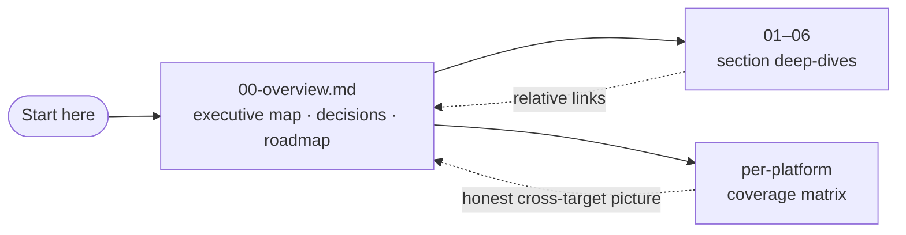
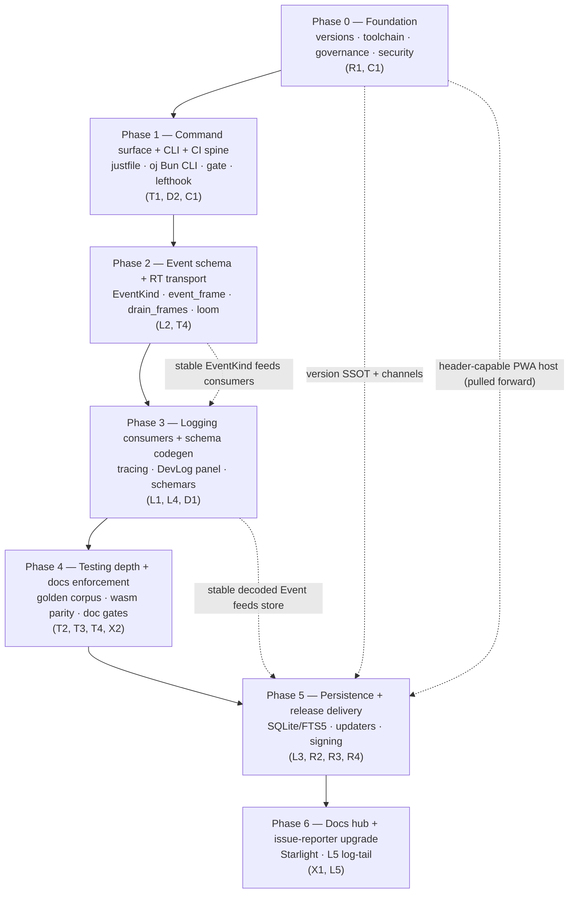

# OpenJammer Foundations Program

> This is the index for the entire OpenJammer foundations program — the decision-final plan that turns an already-working dual-target audio engine into a *trustworthy* one. Every verdict referenced here is resolved in full in the section files below. **Read [`00-overview.md`](00-overview.md) first**; it is the executive map. This page is the front door.

OpenJammer is a browser-based **and** native music/audio application (AGPL-3.0-only) whose defining constraint is **hard real-time audio**: the audio thread never allocates, locks, or blocks. The engine is a **10-crate Rust workspace** — nine crates under `crates/*` (`ojproto`, `ojcore-dsp`, `ojcore`, `ojinstrument`, `ojcore-native`, `ojcore-wasm`, `ojcore-midiring`, `ojhost`, `ojfaust`) plus `oj-tauri` under `src-tauri/`, wired by the root `Cargo.toml` (`members = ["crates/*", "src-tauri"]`, `Cargo.toml:5`). The control plane is **187 React 19 + TypeScript files** under `src/`, Vite-built, Bun-managed (a `preinstall` hook hard-fails any non-Bun install, `package.json:23`), shipped natively via **Tauri v2.11.2** and in-browser as a `wasm32` AudioWorklet PWA. This program does not *create* that structure — it already compiles today — it makes it dependable.

> **Verified:** The 10-crate engine and the React/TS control plane exist and build now. The four-way version drift, the absent `just`/`nextest`/toolchain files, the unconfigured updater, the missing docs site and `lefthook`, and the disabled branch protection are all real gaps this plan closes — not greenfield invention.

## The four pillars

Every section answers to these four, in priority order. When two conflict, the earlier one wins.

| # | Pillar | What it means in practice |
|---|---|---|
| 1 | **Absolute reliability** | `main` is always shippable; the audio thread never glitches. The merge gate is *trustworthy*, not merely present. The hard-RT rule is mechanically enforced by `assert_no_alloc`, exercised at every new audio-thread emit site as a required per-PR check. |
| 2 | **Heavy community contribution** | A stranger's PR can land green and be sound. The gate catches UB, data races, and panics on untrusted presets that example tests cannot, while staying fast enough that good PRs land green. |
| 3 | **On-device-only logging** | No telemetry, ever. All observability is local — a wait-free `ByteRing` drained off-RT into `tracing` + SQLite/FTS5, surfaced in an in-app DevLog panel. The only path off-device is the consent-gated, redacted issue reporter. |
| 4 | **Delightful developer UX** | One command, fast feedback, honest signals. The `just` command surface is canonical; the `oj` Bun CLI gives cached, affected-only feedback; one `lefthook.yml` wires the hooks; the green light tells you what it skipped. |

## How to read this

> **Note:** Start with **[`00-overview.md`](00-overview.md)** — it states *what we are building, why it hangs together, and in what order*, and it owns the canonical "Decisions at a glance" table, the four pillars, the cross-cutting foundations (F1–F6), the phased roadmap, and the program-wide coverage matrix. Each numbered section (01–06) is **self-complete**: every cross-cutting foundation it relies on is restated locally, and every section-relevant adversarial must-fix is folded in *at the section level*, so you can implement a section without keeping the overview open. The numbered sections agree verbatim with the overview's "Decisions at a glance" by design.

## Document index

The plan is one overview plus six decision sections, three companion documents, and three reference appendices. Each section is decision-final and ground-truthed against the current tree.

| Doc | Covers | Decisions |
|---|---|---|
| [`00-overview.md`](00-overview.md) | Executive map: the four pillars, cross-cutting foundations (F1–F6, F-shared), the canonical decisions table, the seven-phase roadmap, the program-wide per-platform coverage matrix, and the deferred open questions. **Read first.** | All (T·L·R·D·C·X) + C1 |
| [`01-testing-and-reliability.md`](01-testing-and-reliability.md) | The two-layer merge gate, the one shared golden corpus + three device-free tiers, Playwright PWA + render-smoke E2E with a non-blocking `tauri-driver` native leg, and the Rust correctness arsenal (loom / miri / fuzz). | T1, T2, T3, T4 |
| [`02-logging-and-observability.md`](02-logging-and-observability.md) | The one `ByteRing` event channel, the `ojproto` `EventKind` schema, the `event_frame` codec / `drain_frames` routing, the off-RT `tracing` sink, the SQLite/FTS5 store, the in-app DevLog panel, and the consent-gated issue reporter. | L1, L2, L3, L4, L5 |
| [`03-release-channels-and-auto-update.md`](03-release-channels-and-auto-update.md) | `release-please` as the single version brain, the decoupled `{stable, canary}` channel line, the Tauri v2 + Workbox auto-updaters, and GitHub-Releases artifact hosting with minisign signing (split keypairs). | R1, R2, R3, R4 |
| [`04-developer-tooling.md`](04-developer-tooling.md) | The `oj` Bun CLI (doctor / scaffold / dev + preflight), Rust-canonical schemars schema codegen feeding the `oj-protocol-ts` TS mirror, and version-sync as a consistency check (never an independent source). | D1, D2 |
| [`05-github-actions-ci.md`](05-github-actions-ci.md) | The DRY reusable-workflow control plane, the aggregate `gate` job, Lane A (per-PR) / Lane B (nightly+canary), and the full free-for-OSS security/provenance suite. | C1 |
| [`06-documentation-starlight.md`](06-documentation-starlight.md) | The Astro 5 + Starlight prose hub, the linked-out rustdoc island + in-site `starlight-typedoc` for `oj-protocol-ts`, and CI-enforced doc-coverage gates (Rust `missing_docs` + `cargo doc -D warnings`; TS `doc-check` baseline-ratchet) with `/docgen`. | X1, X2 |

### Companion documents

Three companion documents complete the program. They are decision-final and cross-link back to the sections above.

| Doc | Covers |
|---|---|
| [`GLOSSARY.md`](GLOSSARY.md) | The canonical-terms reference — every program term (the `oj` Bun CLI, the `just` command surface, the `ByteRing` wait-free SPSC transport, the `{stable, canary}` channel model, …) defined once, with its `path:line` anchor in the tree. |
| [`KEY-MANAGEMENT.md`](KEY-MANAGEMENT.md) | The minisign generation ceremony, dual offline backup, the pubkey-overlap rotation window (build N: `pub_old`; N+1: `pub_old + pub_new`; N+2: drop `pub_old`), and the break-glass path. A *must-read-before-ship* deliverable for R2/R4 (see [`03-release-channels-and-auto-update.md`](03-release-channels-and-auto-update.md) and [`05-github-actions-ci.md`](05-github-actions-ci.md), and [`00-overview.md`](00-overview.md) Open Question #6). |
| [`CHECKLIST.md`](CHECKLIST.md) | The phase-by-phase execution checklist — every phase's must-do items folded in at the task level, traceable back to the sections that own them. |

### Reference appendices

The reference files carry the verbatim configs, workflows, schemas, and code that the decision sections cite. They are the literal artifacts, not prose.

| Doc | Covers |
|---|---|
| [`07-reference-configs.md`](07-reference-configs.md) | The verbatim `justfile`, `.config/nextest.toml`, `rust-toolchain.toml`, `cargo-deny`, `lefthook.yml`, `release-please` manifest config, `tauri.conf.json`, and PWA-host header configs. |
| [`08-reference-ci-workflows.md`](08-reference-ci-workflows.md) | The full Lane A `ci.yml` (with the aggregate `gate` job) and the Lane B nightly/canary workflows, plus the security/provenance suite. |
| [`09-reference-schemas-and-code.md`](09-reference-schemas-and-code.md) | The `ojproto` `EventKind` schema, the `event_frame` codec / `drain_frames` routing, the `wire_shapes.rs` parity gate, the `oj-protocol-ts` TS mirror, and the L5 issue-form schema. |

## Decisions at a glance

This mirrors the canonical table in [`00-overview.md`](00-overview.md); that file is authoritative if the two ever diverge.

| ID | Decision | Winner (one line) |
|---|---|---|
| **T1** | Testing orchestrator | The `just` command surface + `cargo-nextest` + a thin `oj` Bun CLI for cache / affected-selection. |
| **T2** | RT audio correctness (no hardware) | One shared golden corpus, three device-free tiers; keystone is real `wasm32` codegen parity via `wasm-pack test --node`. |
| **T3** | UI / E2E | Playwright PWA + render-smoke (blocking) + a non-blocking `tauri-driver` native leg over a byte-identical React tree. |
| **T4** | Reliability hardening | Rust correctness arsenal (loom / miri / fuzz) + scoped TS fast-check / Stryker + thin governance. |
| **L1–L4** | Logging | One `ByteRing` event channel → `tracing` sink (L1) + SQLite/FTS5 store (L3) + in-app DevLog panel (L4); schema owned by `ojproto` (L2). |
| **L5** | Issue reporter | GitHub Issue Form + on-device redacted diagnostics, native bundle-file upgrade. |
| **R1** | Versioning + canary | `release-please` single version brain + decoupled moving-tag canary line. |
| **R2** | Native auto-update | Tauri v2 first-party updater (minisign + GitHub Releases) + audio-safe install gate. |
| **R3** | PWA auto-update | Prompt-style Workbox SW, channel-aware, audio-session-safe apply-on-idle. |
| **R4** | Artifact hosting + signing | `gh-releases-minisign` now + deferred `gh-pages-manifest`; reject the Cloudflare Worker. |
| **D1** | Schema SSOT | Rust-canonical schemars codegen → one generated TS union, parity-gated like `wire_shapes.rs`. |
| **D2** | Dev tooling | The `oj` Bun doctor + scaffold CLI (merged with T1) + a thin Rust audio-probe shim. |
| **C1** | CI/CD | DRY reusable-workflow control plane: lean affected-aware required `gate` + heavy nightly/canary backstop + full free security suite. |
| **X1** | Docs site | Starlight prose hub + linked-out rustdoc island + in-site `starlight-typedoc` for `oj-protocol-ts`. |
| **X2** | Docs-as-requirement | CI-enforced coverage gates (Rust `missing_docs` + `cargo doc -D warnings`; TS `doc-check` baseline-ratchet) + AI `/docgen`. |

## Status & sequencing

Phases gate on real prerequisites, not calendar. Earlier phases unblock the most downstream work. **Phase 0 holds the hard prerequisites named by R2, R4, L5, T1, T2, T4, and C1 — plus the governance/security must-fixes — and must complete before anything is "trusted."**

| Phase | Theme | One-line outcome |
|---|---|---|
| **0** | Foundation: versions · toolchain · governance · security | One version string everywhere (via `release-please`, the single version brain); `main` actually protected with the `gate` job required; release path SHA-pinned and key-safe; write-capable Claude bots fenced; one nightly pinned in `rust-toolchain.toml`. |
| **1** | Command surface + CLI + CI spine | `just rust` / `just web` run identically in CI and local; `oj preflight --affected` works in a linked worktree; the aggregate `gate` job is proven to red-wall; `lefthook.yml`, `CONTRIBUTING.md`, and `CODEOWNERS` land. |
| **2** | Event schema + RT transport | The audio thread emits coded fault events with a CI-proven zero-alloc guarantee (`assert_no_alloc` over the new emit sites); the `EventKind` wire schema is parity-gated by `wire_shapes.rs`; loom verifies the `ByteRing` handoff. |
| **3** | Logging consumers + schema codegen | Decoded events flow to console, rolling NDJSON, and the DevLog panel; the kind enum is single-sourced by schemars, killing the triple-declared `PrimitiveKind` drift. |
| **4** | Testing depth + docs enforcement | DSP correctness verified on all three native arches + `wasm32` (banded to a ULP tolerance, not bit-exact); docs coverage ratcheted; every leg feeds the single `gate`. |
| **5** | Persistence + release delivery | Stable + canary installers built, signed (split minisign keypairs), and delivered correctly per-platform; the PWA auto-updates without yanking the `AudioContext`; production COOP/COEP verified by a post-deploy synthetic check. |
| **6** | Docs hub + issue-reporter upgrade | The searchable Starlight site is live; one-click redacted issue reports carry a real log tail; the program is complete and self-documenting. |

> **Why this order:** Phase 0 is the cheapest, most load-bearing work — until versions unify and `main` is protected, every later guarantee rests on nothing. Phase 2 pins the one `EventKind` schema and the `event_frame` / `drain_frames` transport *before any consumer*, so nothing downstream invents a competing channel. Release delivery (Phase 5) is deliberately last among the heavy work because it consumes the Phase-0 version SSOT, the `{stable, canary}` model, and the split keypairs.

### Per-platform coverage — the honest cross-target picture

The program keeps a program-wide **per-platform coverage matrix** visible at all times: **Gate** = required per-PR, **Canary/Nightly** = backstop, **Manual** = founder rig / release checklist. Linux is the primary CI host (full gate); Windows and macOS get thin per-PR legs plus nightly depth; the browser `wasm32` target is gated via a small `wasm-pack test --node` parity subset with full parity reserved for nightly.

> **Note:** The defining `<5 ms` latency constraint is verified by **nothing automated on any platform** today (the loopback test is `#[ignore]`'d and `build_input` is a no-op stub). Phase 5 wires the recorder into `build_input`, adds a per-backend manual loopback runbook as a release-gate checklist, and surfaces an xrun counter through the L2 `EventKind` channel so glitches are at least observable in logs.

See the full matrix and its Lane-A / Lane-B enforcement coloring in **[`00-overview.md` § Per-platform coverage matrix](00-overview.md#per-platform-coverage-matrix-program-wide)**.

---

> **Verified:** Every factual claim on this page — the 10-crate workspace and crate names (`Cargo.toml:5`, `crates/*`), the 187 React 19 + TS file count under `src/`, the Bun-enforcing `preinstall` hook (`package.json:23`), the `0.0.0` / `0.1.0-alpha` version drift, and the section/decision mapping — was checked against the tree under `intelligent-easley-16d0db` and against [`00-overview.md`](00-overview.md). Where this index and a section file ever disagree, **`00-overview.md` is authoritative.**
